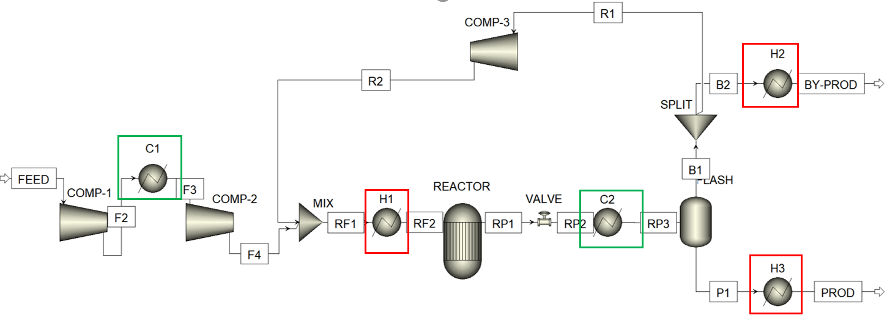
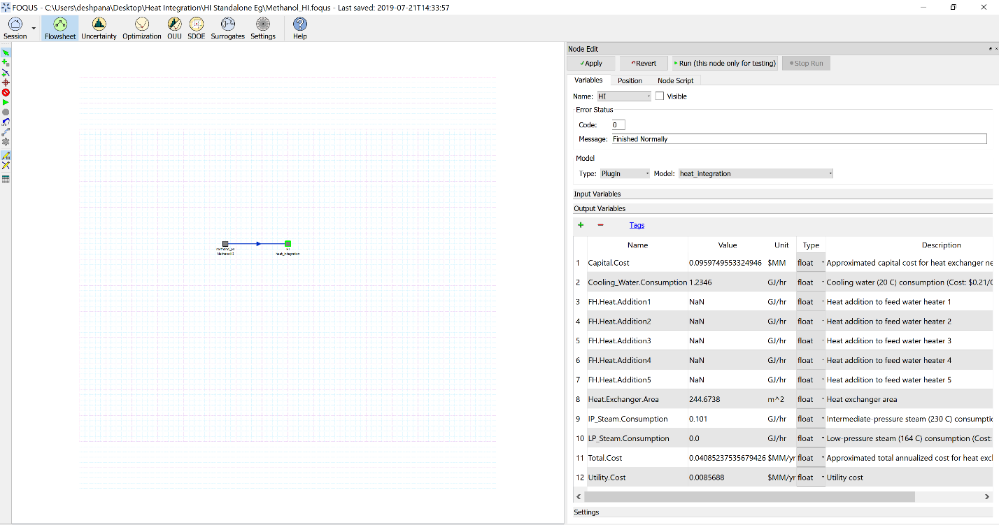

.. _tutorial.heat.integration:

Tutorial: Heat Integration with FOQUS
=====================================

The files for this tutorial are located in:
**examples/tutorial_files/Heat_Integration**

.. note:: |examples_reminder_text|

Motivation:
~~~~~~~~~~~

Methanol Production involves heating and cooling of process streams at different stages of the process,
mainly fresh feed intercooling between compressors, mixed feed preheating before the reactor, intermediate cooling
before flash, and heating of products and byproducts from the flash.

As shown in the figure above, there are 2 hot streams being cooled in C1, C2, and 3 cold streams being heated in H1,H2,H3.
Clearly, there is a potential to perform heat integration among these process streams in order to minimize total utility
and energy consumption while achieving the target temperatures.

Aim:
~~~~

The aim of this tutorial is to implement heat integration for an Aspen Plus methanol production flowsheet,
by using the heat integration plugin within FOQUS, in order to obtain the minimum utility consumption of the process.

Procedure:
~~~~~~~~~~

#. Firstly, a SimSinter Configuration file must be created corresponding to the Aspen Plus backup file, which is located in
   **examples/tutorial_files/Heat_Integration**. The simulation model is available in it.
   Note: Ensure that Aspen v10 is used for this example.
   Select the fresh feed flowrate and temperature as “input variables”, and inlet, outlet temperatures of the process streams
   passing through all heaters and coolers (F2,F3,RF1,RF2,RP2,RP3,B2,BY-PROD,P1,PROD), along with heat duty of each heater, cooler as
   “output variables”.

   .. figure:: ../figs/simsinter_file_HI.png
      :alt: SimSinter Configuration File
      :name: fig.tut.HI.simsinter_file_HI

#. Once the SimSinter file is saved in .json format, upload it to turbine and keep the simulation name as “MethanolHI”.

#. In the Flowsheet Window, add a node named “methanol_HI” which would contain the simulation.

#. Open the node editor for the given node, select model type as “Turbine” and model as “MethanolHI”. All the selected input and output variables of the simulation should be visible in the GUI.

#. Add heat integration tags beside each output variable. In this case, the order of tags for heat duty and temperature variables is as follows:
   Heat Duty of Heaters/Coolers: [“Block name”, “Blk_Var”, “heater”, “Q”]
   Where name is the block name of each heater/cooler in the Aspen model.

   Inlet/Outlet temperatures: [“Block name”, “Port_Material_In/Out”, “heater”, “T”]
   Where name is the block name of the heater/cooler in the Aspen model, associated with the concerned inlet/outet stream.

   NOTE: Ensure that all the variables are of the type “float” in the GUI
   
#. Run the flowsheet simulation node for testing once. 
   The heat integration tags for output variables are seen in the rightmost column of the node editor, as shown below:

   .. figure:: ../figs/HI_tags.png
      :alt: Heat Integration Tags
      :name: fig.tut.HI.HI_tags

#. Add another node to the flowsheet window named “HI”

#. Open the node editor for it, and enter the heat integration plugin. In its input variables, enter number of streams as 5. Keep all other input values default.

#. Connect both the nodes through an edge connector.

#. Run the flowsheet simulation.

Result:
~~~~~~~

Minimum Utility Requirements:
Q (cooling water) = 1.2346 GJ/hr
Q (IP Steam) = 0.101 GJ/hr

