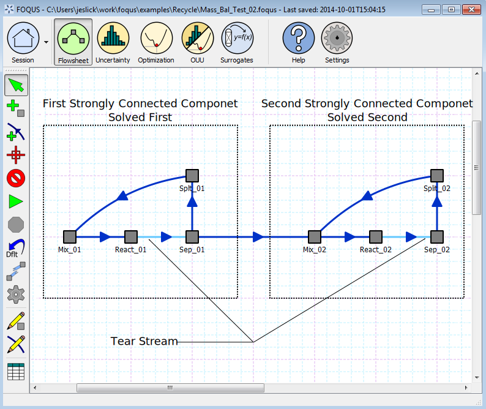
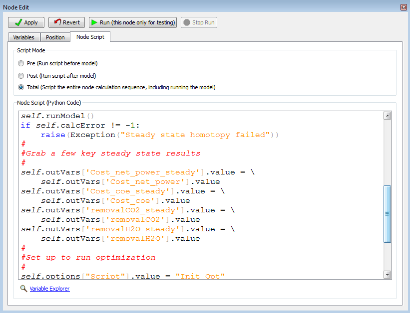

.. _section.flowsheet:

Flowsheet
=========

The meta-flowsheet defines connections between simulations. The
flowsheet defines the order that simulations are performed and what data
is transferred between them. Simulations are represented as nodes in the
flowsheet. These simulations may be links to external simulation
software through the SimSinter/Turbine, or custom simulations or
simulation wrappers written in Python. Directed edges in the flowsheet
connect nodes. The edges also specify which variables in the simulations
are equivalent.

If the flowsheet contains cycles, they are solved iteratively. Tear
streams are selected by FOQUS based on two criteria: (1) minimize the
maximum number of times any cycle is torn and (2) minimize the total
number of tear edges (which only is considered when two tear sets have
the same value for the first criteria).

FOQUS currently has two methods available for solving flowsheets with
recycle: (1) direct substitution and (2) Wegstien
:ref:`Wegstein 1958<Wegstein_1958>`. FOQUS will solve strongly connected
components in the order they are encountered in the flowsheet. FOQUS
flowsheets are generally not very complicated, so if a strongly
connected component contains more than one tear stream, they are solved
simultaneously. More advanced solution options will be added if a need
arises. Figure :ref:`fig.flowsheet.recycle`
shows how a simple flowsheet with recycle would be solved.

   Flowsheet Recycle

Flowsheet Editor
----------------

Figure :ref:`fig.flowsheet.editor` illustrates
the main **Flowsheet Editor** screen and a description of the pieces.
The toolbar on the left contains various flowsheet tools.

   Flowsheet Editor

The first three buttons are mouse mode buttons. The current mouse mode
is shown by the depressed button. The remaining buttons on the toolbar
perform an action. The flowsheet editing toolbar and flowsheet are
described in detail below.

#. **Selection mode** enables the user to select nodes and edges.
   Multiple items may be selected by holding down the Shift key. To
   deselect everything, click an empty area of the flowsheet while not
   holding the Shift key. Selected items can be moved by dragging them.
   To move multiple items, hold down the Shift key while dragging. The
   last item selected becomes the current object to be edited in the
   **Node** or **Edge Editor**.

#. **Add node mode** enables the user to add a node by clicking anywhere
   on the flowsheet. Once a location is clicked, a dialog box opens
   where the new node name can be entered. If **Cancel** is selected, no
   node is added. The new node name cannot be “graph” and cannot match
   any existing node name.

#. **Add edge mode** enables edges to be added by selecting the node
   that the edge originates from, followed by the node the edge
   terminates at.

#. **Center flowsheet in display** centers the display on the flowsheet.

#. **Delete selected** deletes all selected nodes and edges. If a node
   is deleted, all edges connecting to that node are also deleted.

#. **Run a simulation** starts a single simulation run. This is
   primarily used to test a simulation before running optimization or
   UQ.

#. **Stop a simulation** is enabled when a simulation is running and
   stops any running simulation. The simulation may take several seconds
   to stop.

#. **Set inputs to defaults** returns all of the inputs to their default
   values.

#. **Determine tear edges** makes it easier to see where initial guesses
   are needed and makes it possible to edit the tear set before running
   the flowsheet. If tear streams are needed but not specified before
   running a flowsheet, they will be automatically specified, however
   inputs that will be used for the initial guess will not be known
   before running.

#. **Flowsheet solver settings** contains options related to tear
   solvers.

#. **Toggle node editor display** displays or hides the **Node Editor**.
   The user can change the node being edited by selecting from **Name**
   in the **Node Editor** or selecting it on the flowsheet in selection
   mode.

#. **Toggle edge editor display** displays or hides the edge editor. The
   user can change the edge being edited in the **Edge Editor**, or by
   selecting it in selection mode.

#. **Show results from all flowsheet runs** displays the results of all
   flowsheet runs in a table view. This can be exported to a
   spreadsheet.

#. **Node** represents a simulation or calculations.

#. **Edge** connects simulation data, represents data transfer between
   two nodes.

Node Editor
-----------

The **Node Editor** enables the assignment of simulations to a node, and
editing variables. Figure :ref:`fig.node.editor.input` shows the Node
Editor window with the input variables section of the toolbox displayed.

.. figure:: ../figs/nodeEditInput.svg
   :alt: Node Editor Window
   :name: fig.node.editor.input

   Node Editor Window

#. **Apply** immediately applies any changes made in the **Node
   Editor**. This is not usually needed. Changes are applied when the
   current node is changed, the **Node Editor** is closed, or some other
   action is taken that requires the flowsheet, such as running the
   flowsheet.

#. **Revert** sets the node back to the version where the changes were
   last applied. This is usually the original state of the node when the
   editor was opened.

#. **Run** can be used to run the simulation represented by this node
   only. This can be used for testing to make sure the node is properly
   configured without running the whole flowsheet.

#. **Stop Run** is active when a simulation is currently running. It
   stops a single node run or a flowsheet run.

#. There are three tabs in the **Node Editor**: (1) **Variables** tab,
   shown in Figure :ref:`fig.node.editor.input`,
   (2) **Position** tab displays the coordinates of the node, and (3)
   **Node Script** tab enabling the entry of Python code to be executed
   after the simulation is run.

#. **Name** displays the name of the node currently being edited. The
   current node can be changed by selecting from existing nodes in the
   drop-down menu.

#. **Code** displays the error status code for the node.

#. **Message** displays a more detailed description of the error status
   of the node.

#. **Type** enables the user to select the type of model to run. The
   model types are none, Turbine, DMF Lite, DMF Server, or Python
   Plugin. None allows no model to be assigned to the node; this is
   useful when the node only executes a script entered directly into
   FOQUS. Turbine is used to execute Aspen, gPROMS, or Excel
   simulations. Python plugins are custom
   simulations or wrappers written by the user. Surrogate model methods
   may also produce Python plugin models.

#. **Model** enables selection of the models available on Turbine or
   loaded Python plugins.

#. **Input Variables** enables viewing and editing the node’s input
   variables. Most of these variables are added automatically when a
   simulation is selected.

   a. **Add variable** enables the addition of an input variable. There
      are two reasons to add an input: (1) to use a variable to pass
      information to another simulation (even if the variable is not
      used in any node calculation, it can receive data from the
      previous simulation and be passed on to the next simulation) and
      (2) to use in a node script. For example, a variable could be
      added that provides output in different units of measure.

   b. **Remove variable** removes variables. If an input variable is
      removed that originally came from a Turbine simulation, the
      simulation will run with the default value.

   c. **Tags** displays a tag browser that lists commonly used variable
      tags.

   d. **Input Variables** table displays information about variables.
      Most attributes can be edited, except for the **Name** column
      within the **Input Variables** table. The rows for input variables
      are color coded depending on whether they are set by an edge from
      results in another node. White rows are not connected. Yellow rows
      are set by a tear edge. These variables serve as initial guesses
      but their value may change once the simulation has run. Red rows
      are set by an edge that is not a tear edge. The value set for
      these inputs does not matter and it may change once the simulation
      has run.

#. **Output Variables** is a variable table similar to the **Input
   Variables** table for node output variables. This area is displayed
   by clicking **Output Variables**.

#. **Settings** displays simulation settings. A description is provided
   for each setting. The available settings vary depending on
   simulation.

Node Variables
--------------

Variables in the node editor are grouped into two sections, inputs and
outputs. The input and output variable tables are accessible as
described in the previous section. The contents of the variable tables
are described here.

The columns in the input variable list are:

-  **Name** is the name of the variable,

-  **Value** is the current value,

-  **Unit** is the unit of measure,

-  **Type** is the data type (float, int, or str),

-  **Default** is the default value,

-  **Min** is the minimum value,

-  **Max** is the maximum value,

-  **Description** is a description string,

-  **Tag** is a list of strings that can be used to attach additional
   information to a variable

-  **Distribution** is a distribution type,

-  **Param1** is the first parameter of a parametric distribution the
   exact meaning depends on the selected distribution, and

-  **Param2** is the second parameter of a parametric distribution the
   exact meaning depends on the selected distribution.

The minimum and maximum values for are not enforced when running
simulations are not enforced. A value can be given outside the range.
Optimization and UQ features make use of these values to set upper and
lower bounds on decision variables or sampling. The distribution
information is used when setting up sampling for UQ. In the future, this
may also be used for things like optimization under uncertainty. Integer
and string type variables cannot currently be used as optimization
decision variables, or sampled with the UQ tool.

The rows of the input variable table are color coded. Some of the input
variables may be set by connections to other nodes. White rows are
variables who’s values are not set by a connection. The variables that
are red have values set by a connection, and the value given will be
overwritten and does not matter. The values that are colored yellow are
inputs set by a connection that is a tear stream. The values of these
variables serves as an initial guess for solving recycles.

The output variable table is similar to the input table, however it only
contains the columns: Name, Value, Unit, Type, Description, and Tags.
The value of the outputs may not correspond to the inputs until the
simulation has been run.

Node Script
-----------

There are three type of **Node Script** that can be used: (1) **Pre**
runs before a node simulation, (2) **Post** runs after a node
simulation, and (3) **Total** scripts how a node runs the simulation.

Figure :ref:`fig.post.calc` illustrates the **Node
Script** tab of the **Node Editor** with calculations for an
optimization test problem.

   Node Script Tab

Node scripts can be any valid Python code. The input and output
variables for node scripts are stored in dictionaries x and f. The
dictionary keys are the variable names. The f dictionary is used to
update the node variables after the calculations are executed.

Edge Editor
-----------

The **Edge Editor** is illustrated in Figure :ref:`fig.edge.editor`. The **Edge Editor** can be
used to set connections between node variables.

.. figure:: ../figs/edgeEdit.svg
   :alt: Edge Editor
   :name: fig.edge.editor

   Edge Editor

#. **Index** is the index of the current edge. The current edge can be
   changed by selecting an index from the drop-down menu, but since the
   index is not a very meaningful identifier it is usually more
   convenient to select the edge to edit with the graphical selection
   tool.

#. **Origin Node** is the node where an edge starts. This may be edited
   by selecting a different node from the drop-down menu.

#. **Destination Node** is the node to which the edge goes.

#. **Curve** can be a positive or negative number. The greater the
   magnitude of number, the more curved an edge will appear in the
   flowsheet. This setting is used to keep edges from overlapping in the
   flowsheet display.

#. **Tear** marks this edge as a tear. Before a simulation is run, if a
   valid tear set is not specified, FOQUS locates one.

#. **Active** specifies whether the edge is active or not. This allows
   connections to be temporarily disabled.

#. **Variable Connections** table displays which variables are
   connected. Inputs or outputs in the origin node can be connected to
   inputs in the destination node.

#. **Add connection** adds a new connection.

#. **Remove connection** deletes the selected connections.

#. **Auto** automatically connects variables having the same name. For
   example, in connecting a simulation to a spreadsheet to calculate
   costs there are a large number of variables for which it makes sense
   that the variables have the same name in the simulation and
   spreadsheet. **Auto** should be used with great care. Connecting
   variables with the same name is often not what is wanted. For example
   two simulations may have a variable named FlowAIn; however, it is
   very unlikely that they should be connected. It is more likely
   FlowAOut should be connected to FlowAIn.
