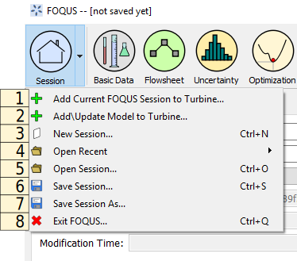
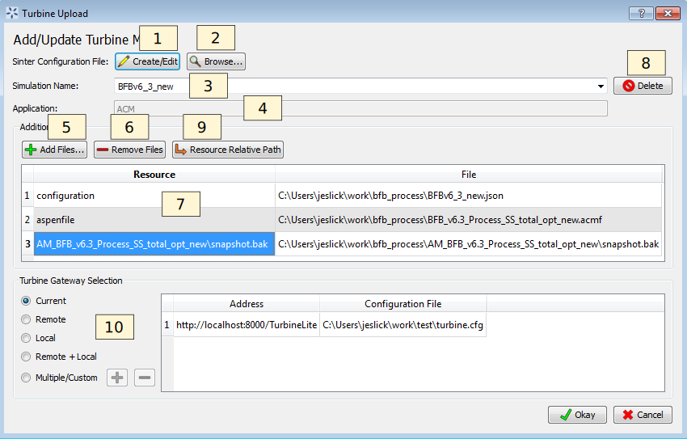

Home Menu
=========

Session Information Display
---------------------------

FOQUS flowsheet information and settings are stored in a session. The session screen displays information about the current session. A menu is available by clicking the **Session** drop-down menu. The figure below shows the Home window.

.. figure:: ../figs/homescreen.svg
    :width: 600px
    :align: center
    :figclass: align-center

    Home Screen

1. The buttons displayed at the top of the Home window, excluding **Help**, are tab-like buttons that change the window when selected. The depressed button indicates the currently displayed window.

  A. **Session** displays the Session window, which contains a description of the session that is currently open. **Session** has a drop-down menu that displays the Session menu.
  B. **Flowsheet** displays the meta-flowsheet editing window.
  C. **Uncertainty** displays the interface for PSAUDE and UQ visualization.
  D. **Optimization** displays the simulation-based optimization interface.
  E. **OUU** displays the optimization under uncertainty interface.
  F. **Surrogates** displays the surrogate model generation window.
  G. **DRM-Builder** displays the dynamic reduced model builder, which can be used to develop reduced models for dynamic simulations.
  H. **Settings** displays the main FOQUS settings window.

2. **Help** toggles the Help browser. The Help browser contains HTML help, licensing and copyright information, log messages, and debugging console.

3. The main Session window displays information about the current session and is divided into three tabs:

  * **Metadata** displays information about the current FOQUS session. The **Session Name** provides a descriptive name for the session. This name is used by the data management framework and when running flowsheets remotely, so a name is required. Entering a name should be the first step in creating a FOQUS flowsheet. **Version** number can be used to keep track of changes to a FOQUS session. **Confidence** describes whether the FOQUS session is expected to produce reliable results or not. **ID** is a unique identifier to identify a particular saved version of the session. **Creation Time** is the date and time that the flowsheet was first saved. **Modification Time** is the time and date that the flowsheet was last saved.
  * **Description** displays a detailed explanation of the purpose of the current session file, the problem being solved, and other useful information provided by the creator of the session file.
  * **Change Log** displays a record of changes made to the file. If the **Automatically create backup session file, when saving changes** checkbox is selected in FOQUS **Settings**, a backup file should exist for entries in the **Change Log**. The backup can be matched to the **Change Log** by the unique identifier appended to the file name.

Session Menu
------------

The figure below illustrates the **Session** menu.

    Home Window, Session Drop-Down Menu

1. **Add Current FOQUS Session to Turbine...*** upload the current FOQUS session to Turbine.  This can be used run a flowsheet in parallel with turbine.
2. **Add\\Update Model to Turbine** enables additional models to be uploaded to Turbine. Turbine provides simulation job queuing functionality so models cannot be run in FOQUS until they have been added to the Turbine server.
3. **New Session** clears all session information so that a new session can be started.
4. **Open Recent** shows a list of recently open FOQUS sessions that can be quickly reloaded for convenience.
5. **Open Session** opens a session that was previously saved to a file.
6. **Save Session** saves the current session with the current session file name. If the session has not been previously saved, the user will be prompted to enter a file name. **Save Session** commands the user to save two session files: (1) a file with the selected name and (2) if backup option is enabled, a backup file with a name constructed from the **Session Name** and **ID**.  The Session **ID** is shown on the **Session, Metadata** tab.  The backup file is saved to the working directory. This system prevents accidental saving over an important file. It also enables the user to open any previously saved session.
7. **Save Session As** is similar to **Save Session**; however, the user is prompted for a new file name.
8. **Exit FOQUS** exits FOQUS. The user is asked whether to save the current session before exiting.

.. _overview.turbine.upload:

Adding or Changing Turbine Simulations
--------------------------------------

Before running any flowsheet where a node is linked to a simulation, the simulation must be uploaded to Turbine. To use a simulation at least two things are required: (1) the simulation file (e.g., Aspen Plus file, Excel file) and (2) the SimSinter configuration. The SimSinter configuration file is a JavaScript Object Notation (JSON) formatted file that specifies the simulation, input, and output. Any additional files required to run the simulation must also be uploaded.

    Turbine Upload Dialog Box

1. **Create/Edit** enables use of the SimSinter configuration Graphical User Interface (GUI) to create a SimSinter configuration file. See the :ref:`SimSinter documentation <sinter_main>` for more information.
2. **Browse** displays a file browser, which can be used to select an existing SimSinter configuration file. Once a SimSinter configuration file is selected, the **Application** type is filled in. The SimSinter **Configuration File** and simulation file are automatically added to the file upload table.
3. **Simulation Name** enables entry of a new name if uploading a new simulation. An existing simulation can be selected from the drop-down list if an existing simulation is being modified. After selecting a SimSinter configuration file, the simulation name is guessed from the SimSinter configuration file name, but it can be edited.
4. **Application** displays the application that will be used to run the simulation. This is filled in automatically based on information in the SimSinter configuration file, and cannot be edited.
5. **Add Files** enables uploading of any auxiliary files that may be required by the simulation. Multiple files may be selected at once.
6. **Remove Files** enables added files to be removed from the list of files to upload.
7. **File Table** displays a list of files to be uploaded to Turbine.
8. **Delete** allows the simulation with the name currently displayed in the **Simulation Name** drop-down list to be deleted from Turbine. Only simulations that have not been run can be deleted.
9. **Resource Relative Path** enables the user to set the path of resource files relative to the simulation working directory. To set the directory, select files in the **File Table**. Multiple files can be selected. Click **Resource Relative Path**, and type the relative path to assign to the selected resource files.
10. **Turbine Gateway Selection** enables the user to select where to upload the simulation (local TurbineLite or AWS FOQUS Cloud). **Current** is the select configuration to run simulations. **Remote** is configured AWS FOQUS Cloud. **Local** is the TurbineLite instance installed on the local computer. **Remote + Local** allows simulations to be uploaded to both the local (TurbineLite) and the AWS FOQUS Cloud. **Multiple/Custom**  allows simulations to be uploaded to other Turbine instances by selecting Turbine configuration files.
