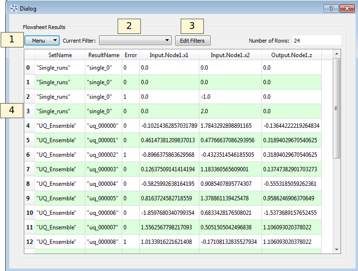

.. _sec.flowsheet.results.table:

Sample Results
==============

Flowsheet evaluations that have been run in a FOQUS session can be
viewed by clicking the table button in the flowsheet toolbar (#13 in
Figure :ref:`fig.flowsheet.editor`. The results
are displayed in a table, and the contents can be copied and pasted into
a spreadsheet or exported to a CSV file. Figure :ref:`fig.results.table` 
show the Flowsheet Results Table window.

   Flowsheet Results Table Window

#. **Menu** contains a menu with four sub menus.

   #. **Import** data from files or the clipboard.

   #. **Export** data to files or the clipboard.

   #. **Edit** or delete data.

   #. **View** options for the table.

#. The **Current Filter** drop-down list enables the user to select a
   data filter, which can be used to filter and sort data.

#. **Edit Filters** enables the user to create or edit data filters.

Error Codes
-----------

Error codes are listed in the **Flowsheet Results** table for the whole
flowsheet and for individual nodes. Table :ref:`table.fs.error` shows the flowsheet error codes
and Table :ref:`table.node.error` shows the node
error codes. The most common flowsheet error is 1, a node calculation
failed. The most common node error is 7, Turbine simulation error. These
errors are typically caused by a simulation that fails to converge or
has some other calculation error (e.g., ACM does not converge or an
Excel spreadsheet simulation with a division by 0 error).

.. _table.fs.error:
.. table:: Flowsheet Error Codes

   +------+-----------------------------------------------------------+
   | Code | Meaning                                                   |
   +======+===========================================================+
   | -1   | Did not run or finish                                     |
   +------+-----------------------------------------------------------+
   | 0    | Success                                                   |
   +------+-----------------------------------------------------------+
   | 1    | A simulation/node failed to solve                         |
   +------+-----------------------------------------------------------+
   | 2    | A simulation/node failed to solve while solving tears     |
   +------+-----------------------------------------------------------+
   | 3    | Failed to create a worker node                            |
   +------+-----------------------------------------------------------+
   | 5    | Unknown tear solver                                       |
   +------+-----------------------------------------------------------+
   | 11   | Wegstein failed, reached iteration limit                  |
   +------+-----------------------------------------------------------+
   | 12   | Direct failed, reached iteration limit                    |
   +------+-----------------------------------------------------------+
   | 16   | Presolve node error                                       |
   +------+-----------------------------------------------------------+
   | 17   | Postsolve node error                                      |
   +------+-----------------------------------------------------------+
   | 19   | Unhandled exception during evaluation (see log)           |
   +------+-----------------------------------------------------------+
   | 20   | Flowsheet thread terminated                               |
   +------+-----------------------------------------------------------+
   | 21   | Missing session name                                      |
   +------+-----------------------------------------------------------+
   | 40   | Error connecting to Turbine                               |
   +------+-----------------------------------------------------------+
   | 50   | Error loading session or inputs                           |
   +------+-----------------------------------------------------------+
   | 100  | Single node calculation success                           |
   +------+-----------------------------------------------------------+
   | 201  | Cycle in determining calculation order (invalid tear set) |
   +------+-----------------------------------------------------------+

.. _table.node.error:
.. table:: Node Error Codes

   +------+---------------------------------------+
   | Code | Meaning                               |
   +======+=======================================+
   | -1   | Did not run or finish                 |
   +------+---------------------------------------+
   | 0    | Success                               |
   +------+---------------------------------------+
   | 1    | Simulation error (see log)            |
   +------+---------------------------------------+
   | 3    | Exceeded maximum wait time            |
   +------+---------------------------------------+
   | 4    | Failed to create Turbine session ID   |
   +------+---------------------------------------+
   | 5    | Failed to add Turbine job             |
   +------+---------------------------------------+
   | 6    | Exceeded maximum run time             |
   +------+---------------------------------------+
   | 7    | Turbine simulation error              |
   +------+---------------------------------------+
   | 8    | Failed to start Turbine job           |
   +------+---------------------------------------+
   | 10   | Failed to get Turbine jobs status     |
   +------+---------------------------------------+
   | 11   | Flowsheet thread terminated           |
   +------+---------------------------------------+
   | 20   | Error in node script                  |
   +------+---------------------------------------+
   | 23   | Could not convert Numpy value to list |
   +------+---------------------------------------+
   | 27   | Cannot read variable result (see log) |
   +------+---------------------------------------+
