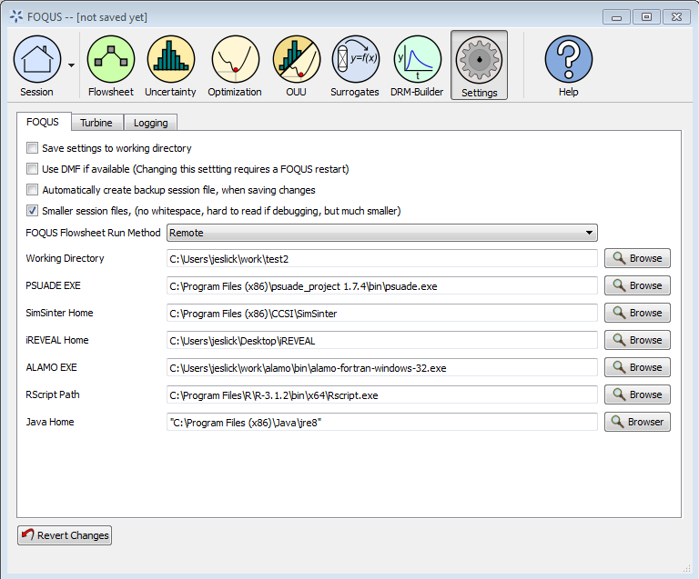
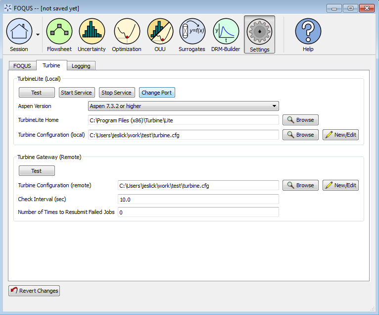
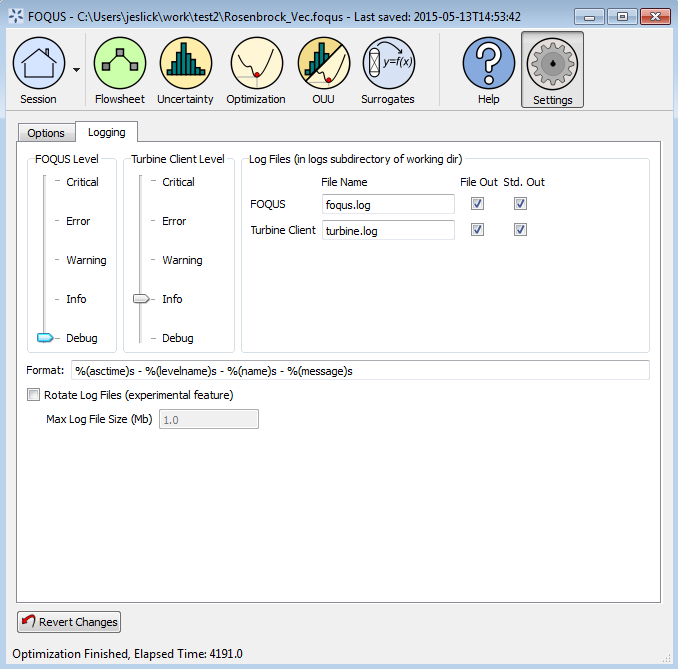

.. _section.settings:

Settings
========

The settings screen shows FOQUS settings that are related to the general
FOQUS setup, and are unlikely to change between sessions. The settings
screen is accessible by clicking the **Settings** button at the top of
the Home window. The FOQUS settings can be stored in two locations: (1)
“%APPDATA%\.foqus.cfg” on Windows or “$HOME/.foqus.cfg” on Linux or OSX,
(2) “foqus.cfg” in the working directory.

The Settings screen displays settings grouped into tabs. Figure
:ref:`fig.settings.options` shows **Settings,
FOQUS** tab.

   Settings, FOQUS Tab

Options in the **Settings, FOQUS** tab are described below.

#. **Save settings to working directoy**, when checkbox is selected the
   settings file will be read from the specified working directory. This
   setting is useful for running multiple copies of FOQUS to ensure the
   settings do not conflict. When starting additional copies of FOQUS,
   it is best to start them from the Working Directory command line
   giving each copy of FOQUS its own independent working directory. If
   FOQUS is started more than once from the Windows start menu, each
   copy will use the same working directory. Starting FOQUS multiple
   times with the same working directory may cause unusual behavior in
   FOQUS.

#. **Use DMF if available**, when checkbox is selected the Data
   Management Framework (DMF) module will be loaded and the DMF options
   will be shown in the **Session** menu.

#. **Automatically create backup session file**, when checkbox is
   selected each time a FOQUS session is saved it will be saved twice. A
   backup copy with a universally unique identifier appended to the file
   name will be saved. This will allow the user to load any previous
   save point of the session.

#. **Smaller session files**, when checkbox is selected significant
   storage space is saved by excluding formatting from the session file;
   this makes the session files less human readable. A more readable
   session file can be useful for debugging.

#. **FOQUS Flowsheet Run Method** enables the user to select between
   running simulations on the same computer as FOQUS, or on the AWS 
   FOQUS Cloud. Running simulations remotely on the cloud allows parallel
   execution. The default setting is "Local". If the user switches from
   "Local" to "Remote", a warning message will appear. The user will be
   informed that the models that have been uploaded to the Local Turbine
   may not be available in the AWS FOQUS Cloud. Therefore, the
   user may need to upload these models into the Cloud in order to
   run the models remotely.

#. **Working Directory** is the path to the FOQUS working directory. The
   **Working Directory** is where FOQUS reads and writes files needed to
   function. When running multiple copies of FOQUS, the **Working
   Directory** can also be specified from the command line using the
   “-w” or “-workingDir” options. After changing the **Working
   Directory**, FOQUS should be restarted.

#. **PSUADE EXE** is the path to the PSUADE executable. PSUADE provides
   FOQUS’s UQ features.

#. **SimSinter Home** is the path to the SimSinter interface for
   creating Sinter configuration files for simulations to be run with
   FOQUS. This setting is not required but it allows easy access to the
   SimSinter configuration GUI when uploading simulation to Turbine.

#. **iREVEAL Home** is the path the iREVEAL installation. This is
   required to use the iREVEAL surrogate model module.

#. **ALAMO EXE** is the path to the ALAMO executable. This is required
   to use the ALAMO surrogate model module.

#. **RScript Path** is the path to the RScript executable. This is
   required for surrogate model modules that use R as a platform.

#. **Java Home** is the path to the Java installation. The DMF and the
   iREVEAL surrogate modules require Java.

#. **Revert Changes** The settings changes are applied when the user
   navigates away from the settings screen. To undo changes made to
   settings the revert button can be clicked before changing to another
   screen.

The **Turbine** tab contains settings for configuring the local and
remote instance of Turbine. Figure :ref:`fig.settings.turbine` shows the FOQUS
Turbine settings.

   Settings, Turbine Tab

The first section in the **Turbine** tab is **TurbineLite (Local)**.
This section contains settings related to the local installation of
Turbine, and is only applicable when running FOQUS on the windows
platform.

#. **Test** tests the connection to the local Turbine server to make
   sure it is configured and running properly.

#. **Start Service** starts the Turbine server service on Windows. The
   user must have permission to start services to use this button.

#. **Stop Service** stops the Turbine server service on Windows. The
   user must have permission to stop services to use this button.

#. **Change Port** can reconfigure the local Turbine server service on
   Windows to use a different port. This may be necessary if Turbine
   conflicts with another service.

#. **Aspen Version**, Aspen 7.3 is still in common use but the API
   differs slightly form newer versions. This option allows FOQUS to be
   used with Aspen 7.3.

#. **TurbineLite Home** is the location of the TurbineLite installation.
   For local simulation runs FOQUS needs to know where TurbineLite is
   installed so it can launch Turbine consumers to run simulations. This
   setting is not needed if simulations are only run remotely.

#. **Turbine Configuration (local)** is the path to the TurbineLite
   gateway configuration file for running simulations locally. If
   simulations are only run remotely, this setting is not needed.
   **New/Edit** displays a form to create or edit a Turbine
   configuration file. Having a setting for both local and remote
   Turbine allows easy switching between run methods.

The second section in the **Turbine** tab is **Turbine Gateway
(Remote)**. This section contains settings related to a remote instance
of Turbine.

#. **Test** tests the connection to the remote Turbine server to make
   sure it is configured and running properly.

#. **Turbine Configuration (remote)**, is the path to the Turbine
   gateway configuration file for running simulations remotely. If
   simulations are only run locally, this setting is not needed.
   **New/Edit** displays a form to create or edit a Turbine
   configuration file. Having a setting for both local and remote
   Turbine allows easy switching between run methods.

#. **Check Interval (sec)** is the number of seconds between checking
   the remote Turbine server for job results. This number should not be
   set too low to avoid overwhelming the Turbine server with requests.

#. **Number of Times to Resubmit Failed Jobs** is the number of times to
   resubmit jobs that fail. Jobs occasionally fail due to software bugs.
   This allows a job to be retried.

The **Logging** tab contains settings related to the FOQUS log files,
which provide debugging information. The FOQUS log files are stored in
the logs directory in the working directory. Figure :ref:`fig.settings.logging` show the FOQUS log
settings. There are two log files (1) FOQUS and (2) Turbine Client.

   Settings, Logging Tab

#. The level sliders indicate how much information to send to the logs.

#. The **Log Files** section enables the user to specify where the log
   information is sent. The **File Out** checkboxes turn on or off the
   file output of logs. The **Std. Out** checkboxes enable or disable
   the output to the screen.

#. **Format** allows the format of the log messages to be changed. See
   the documentation for the Python 2.7 logging module for more
   information.

#. **Rotate Log Files** turns on or off log file rotation. When a log
   file reaches a certain size, a new log file is started and the
   contents of the old log are moved to a new file. There currently
   seems to be a bug in the log file rotation which occasionally makes
   the log file output stop; therefore, the **Rotate Log Files** option
   is labeled as an experimental feature.
