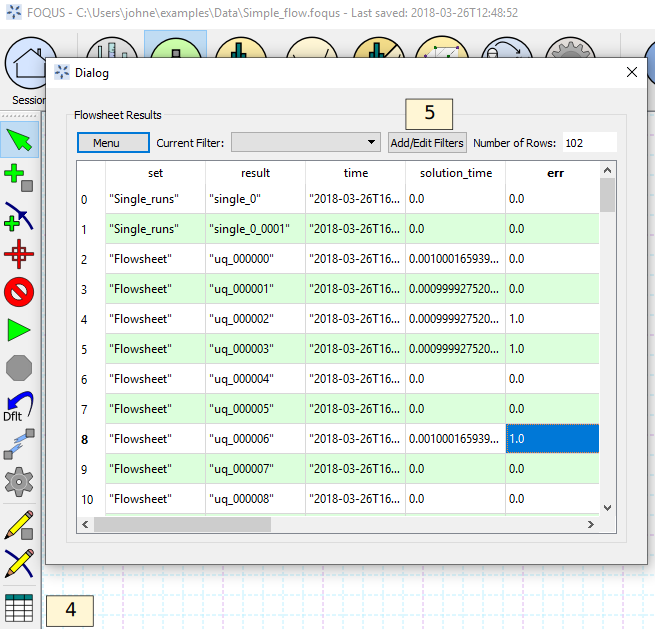
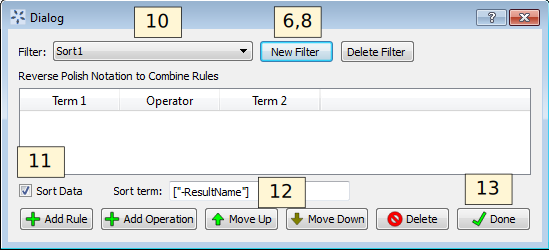
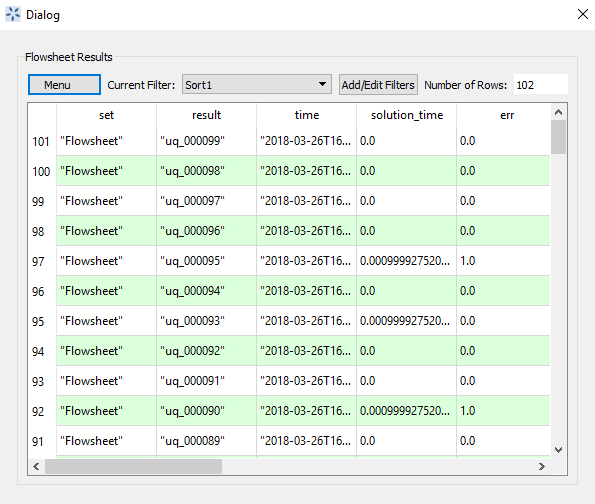
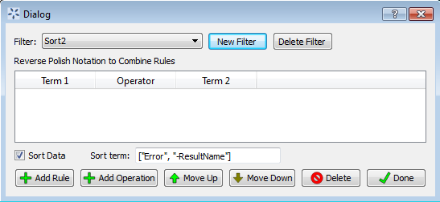
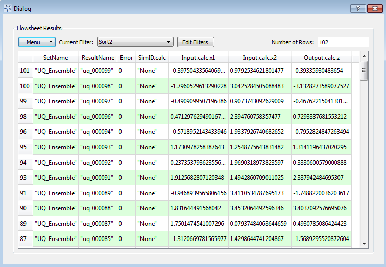
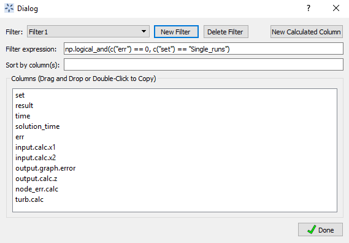
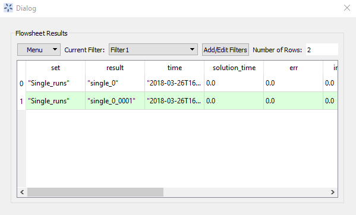

.. _tutorials.fs.data:

Tutorial 4: Flowsheet Result Data
=================================

Flowsheet evaluation results are stored in a table in the FOQUS session.
This data can be used for many purposes. The flowsheet evaluations may
be single runs, part of an optimization problem, or part of a UQ
ensemble. This tutorial provide information about sorting, filtering,
and exporting data.

The FOQUS file for this tutorial is **Simple_flow.foqus**, and
this file is located in: **examples/tutorial_files/Flowsheets/Tutorial_4**

.. note:: |examples_reminder_text|

The **Simple_flow.foqus** file is
similar to the one created in the tutorial Section
:ref:`tutorial.sim.flowsheet`, but it has been run
an additional 100 times using a UQ ensemble (see :ref:`subsec:uqt_sim`).

#. Open FOQUS.

#. Open the Simple_flow.foqus session from the example files.

#. Click the **Flowsheet** button from the Home window.

#. Click **Flowsheet Data** in the toolbar on the left side of the Home
   window.

   Flowsheet Results Data Table, All Data

A data table should be displayed like the one shown in the figure below.
There are 102 flowsheet
evaluations. The first two evaluations are single runs, as can be seen
in the **SetName** column, and the remaining 100 evaluation are from a
UQ ensemble. The **Error** column shows several of the evaluations
resulted in an error from a negative number being passed to the square
root function.

This tutorial is broken up into mini-tutorials in the remaining
subsections, which can be done independently. They each use the example
data file described above.

Sorting Data
------------

#. Open FOQUS.

#. Open the Simple_flow.foqus session from the example files.

#. Click **Flowsheet** in the main toolbar at the top of the FOQUS Home
   window.

#. Click **Flowsheet Data** in the toolbar on the left side of the Home
   Window.

#. Click **Edit Filters**.

#. Click **New Filter**.

#. Enter “Sort1” as the new filter name.

#. Click **New Filter**.

#. Enter “Sort2” as the new filter name.

#. Select “Sort1” from the **Filter** drop-down list.

#. Enter ``["-result"]`` as the **Sort by Column**. Include the square
   brackets. The square brackets indicate that there is a list of sort
   terms, although in this case there is only one. If multiple search
   terms are given, the additional terms will be used to sort results
   having the same value for the previous terms. The “-” in front of
   **result** indicates the results should be sorted in reverse. The
   names of the sort terms come from the column headings, and are case
   sensitive.

#. Click **Done** to save the filters and return to the results table.

   Sort1 Data Filter

14. Select “Sort1” from the **Current Filter** drop-down list.

15. The results are shown in below. The data should be
    sorted in reverse alphabetical order by **result**. Some of the
    columns are hidden to make the relevant results easier to see.

   Sort1 Data Filter Results

16. Click **Edit Filters**.

17. Select “Sort2” from **Filter** drop-down list.

19. Enter ``["err", "-result"]`` in the **Sort Term** field. This will
    sort the data first by **Error** code then by **result** in reverse
    alphabetical order.

20. Click **Done**.

   Sort2 Data Filter

21. Select “Sort2” in the **Current Filter** drop-down list.

22. The results are shown in below. The data should be
    sorted so all **Error** code zero results are first then sorted in
    reverse alphabetical order by **result**.

   Sort2 Data Filter Result

Filtering Data
--------------

1. Open FOQUS.

2. Open the Simple_flow.foqus session from the example files.

3. Click the **Flowsheet** button in the Home window.

4. Click the Results Data button (Table icon in left toolbar).

5. In the data table dialog, click **Edit Filters**.

6. Click **New Filter** and enter “Filter1” in the **Filter** field as
   the new filter name.

The filter expression is a Python expression.  The ``c("Comlumn Name")`` function
returns a numpy array containing the column data. The expression should evaluate to
a column of bools where rows containing ``True`` will be included in the filtered
results and rows containing ``False`` will be excluded. If combining multiple logical
expressions the numpy logical functions  https://docs.scipy.org/doc/numpy-1.15.1/reference/routines.logic.html
should be used.  Numpy is imported as ``np``

8.  In this example, results without errors in the "Single_runs" should be selected.  In the filer expression
field enter ``np.logical_and(c("err") == 0, c("set") == "Single_runs")``

10. Click **Done**.

   Filter1 Data Filter

11. In the data table dialog, select “Filter1” from the **Current
    Filter** drop-down list.

12. The result is displayed in the Figure below.

   Filter1 Data Filter Result

Exporting Data
--------------

This tutorial uses a spreadsheet program such as Excel or Open Office.
The exported data is subject to the selected filter. See the previous
tutorials in this section for more information about sorting and
filtering data to be exported.

Clipboard
~~~~~~~~~

FOQUS can export data directly to the Clipboard. The data can be pasted
into a spreadsheet or as text. Copying data to the Clipboard eliminates
the need for an intermediate file when creating spreadsheets.

#. Open FOQUS.

#. Open a spreadsheet program.

#. Open the Simple_flow.foqus session from the example files.

#. Click the **Flowsheet** button in the Home window.

#. Click the Results Data button (Table icon in left toolbar).

#. Click on the **Menu** drop-down list in the data table dialog.

#. Select “Export” from the **Menu** drop-down list.

#. Click **Copy Data to Clipboard**.

#. Select Paste in the spreadsheet program. The data table in FOQUS
   should paste into the spreadsheet. Filters can be used to sort or
   reduce the exported data.

CSV File
~~~~~~~~

CSV (comma separated value) files can be read by almost any spreadsheet
program, and are common formats readable by many types of software.
FOQUS exports CSV files using the column headings from the data table as
a header.

#. Open FOQUS.

#. Open a spreadsheet program.

#. Open the Simple_flow.foqus session from the example files.

#. Click the **Flowsheet** button in the Home window.

#. Click the Results Data button (Table icon in left toolbar).

#. Click the **Menu** drop-down list.

#. Select “Export” from the **Menu** drop-down list.

#. Click **Export to CSV File**.

#. Enter a file name in the file dialog.

#. In the spreadsheet program, open the CSV file exported in the
   previous step.
