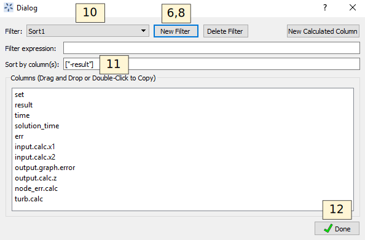
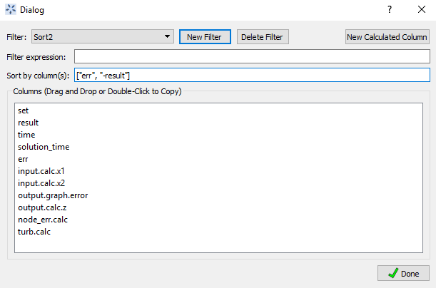
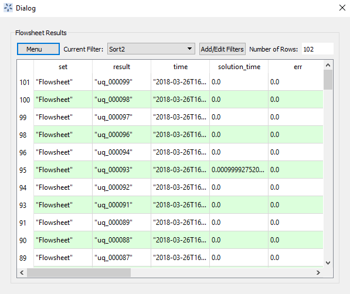

.. _tutorials.fs.data:

Flowsheet Result Data
=====================

Flowsheet evaluation results are stored in a table in the FOQUS session.
This data can be used for many purposes. The flowsheet evaluations may
be single runs, part of an optimization problem, or part of a UQ
ensemble. This tutorial provide information about sorting, filtering,
and exporting data.

Copy the Data\Simple_flow.foqus file from the example files to a
convenient location (see section
`[tutorial.example.files] <#tutorial.example.files>`__). This file is
similar to the one created in the tutorial Section
`[tutorial.simple.flow] <#tutorial.simple.flow>`__, but it has been run
an additional 100 times using a UQ ensemble (see Chapter
`[chpt.uq] <#chpt.uq>`__).

#. Open FOQUS.

#. Open the Simple_flow.foqus session from the example files.

#. Click the **Flowsheet** button from the Home window.

#. Click **Flowsheet Data** in the toolbar on the left side of the Home
   window (Figure `[fig.data.table1] <#fig.data.table1>`__).

.. figure:: ../figs/data_table_1.svg
   :alt: Flowsheet Results Data Table, All Data
   :name: fig.data.table1

   Flowsheet Results Data Table, All Data

A data table should be displayed like the one shown in Figure
`[fig.data.table1] <#fig.data.table1>`__. There are 102 flowsheet
evaluations. The first two evaluations are single runs, as can be seen
in the **SetName** column, and the remaining 100 evaluation are from a
UQ ensemble. The **Error** column shows several of the evaluations
resulted in an error from a negative number being passed to the square
root function.

This tutorial is broken up into mini-tutorials in the remaining
subsections, which can be done independently. They each use the example
data file described above.

Sorting Data
------------

#. Open FOQUS.

#. Open the Simple_flow.foqus session from the example files.

#. Click **Flowsheet** in the main toolbar at the top of the FOQUS Home
   window.

#. Click **Flowsheet Data** in the toolbar on the left side of the Home
   window (Figure `[fig.data.table1] <#fig.data.table1>`__).

#. Click **Edit Filters** (Figure
   `[fig.data.table1] <#fig.data.table1>`__).

#. Click **New Filter**.

#. Enter “Sort1” as the new filter name.

#. Click **New Filter**.

#. Enter “Sort2” as the new filter name.

#. Select “Sort1” from the **Filter** drop-down list.

#. Select the **Sort Data** checkbox.

#. Enter ``["-result"]`` as the **Sort Term**. Include the square
   brackets. The square brackets indicate that there is a list of sort
   terms, although in this case there is only one. If multiple search
   terms are given, the additional terms will be used to sort results
   having the same value for the previous terms. The “-” in front of
   **result** indicates the results should be sorted in reverse. The
   names of the sort terms come from the column headings, and are case
   sensitive.

#. Click **Done** to save the filters and return to the results table.

   Sort1 Data Filter

14. Select “Sort1” from the **Current Filter** drop-down list (Figure
    `[fig.filter.1.result] <#fig.filter.1.result>`__).

15. The results are shown in Figure
    `[fig.filter.1.result] <#fig.filter.1.result>`__. The data should be
    sorted in reverse alphabetical order by **result**. Some of the
    columns are hidden to make the relevant results easier to see.

.. figure:: ../figs/filter_1_result.svg
   :alt: Sort1 Data Filter Results
   :name: fig.filter.1.result

   Sort1 Data Filter Results

16. Click **Edit Filters** (Figure
    `[fig.filter.1.result] <#fig.filter.1.result>`__). The dialog box in
    Figure `[fig.filter.2] <#fig.filter.2>`__ should display.

17. Select “Sort2” from **Filter** drop-down list.

18. Select the “Sort Data” checkbox.

19. Enter ``["Error", "-result"]`` in the **Sort Term** field. This will
    sort the data first by **Error** code then by **result** in reverse
    alphabetical order.

20. Click **Done**.

   Sort2 Data Filter

21. Select “Sort2” in the **Current Filter** drop-down list (Figure
    `[fig.filter.2.result] <#fig.filter.2.result>`__).

22. The results are shown in Figure
    `[fig.filter.2.result] <#fig.filter.2.result>`__. The data should be
    sorted so all **Error** code zero results are first then sorted in
    reverse alphabetical order by **result**.

   Sort2 Data Filter Result

Filtering Data
--------------

#. Open FOQUS.

#. Open the Simple_flow.foqus session from the example files.

#. Click the **Flowsheet** button in the Home window.

#. Click the Results Data button (Table icon in left toolbar).

#. In the data table dialog, click **Edit Filters**.

#. Click **New Filter** and enter “Filter1” in the **Filter** field as
   the new filter name.

The completed filter settings are shown in Figure
`[fig.filter.3] <#fig.filter.3>`__. The buttons along the bottom of the
filter editor dialog are used to add, delete, and change the order of
rules and operations. Rules are conditions that are placed on data to be
displayed. Operations are used to modify or combine rules. FOQUS uses
reverse polish notation for the order of operations. The example filter
in `[fig.filter.3] <#fig.filter.3>`__ is equivalent to (Error = 0 AND
SetName :math:`\in` {UQ_Ensemble, Single_runs}) OR Index :math:`<` 3.

The filter terms can be numbers, strings, lists of numbers, lists of
strings or column headings. When entering column headings as search
terms, do not enclose the column heading in quotes. This distinguishes
column heading names from strings. The other types of terms are in JSON
format. Strings are enclosed in double quotes, numbers have no quotes,
and lists are enclosed in square brackets with elements separated by
commas.

7.  Click **Add Rule** three times.

8.  Click **Add Operation** two times.

9.  Fill out the rule and operation rows as shown in Figure
    `[fig.filter.3] <#fig.filter.3>`__.

10. Click **Done**.

   Filter1 Data Filter

11. In the data table dialog, select “Filter1” from the **Current
    Filter** drop-down list.

12. The result is displayed in Figure
    `[fig.filter.3.result] <#fig.filter.3.result>`__.

   Filter1 Data Filter Result

Exporting Data
--------------

This tutorial uses a spreadsheet program such as Excel or Open Office.
The exported data is subject to the selected filter. See the previous
tutorials in this section for more information about sorting and
filtering data to be exported.

Clipboard
~~~~~~~~~

FOQUS can export data directly to the Clipboard. The data can be pasted
into a spreadsheet or as text. Copying data to the Clipboard eliminates
the need for an intermediate file when creating spreadsheets.

#. Open FOQUS.

#. Open a spreadsheet program.

#. Open the Simple_flow.foqus session from the example files.

#. Click the **Flowsheet** button in the Home window.

#. Click the Results Data button (Table icon in left toolbar).

#. Click on the **Menu** drop-down list in the data table dialog.

#. Select “Export” from the **Menu** drop-down list.

#. Click **Copy Data to Clipboard**.

#. Select Paste in the spreadsheet program. The data table in FOQUS
   should paste into the spreadsheet. Filters can be used to sort or
   reduce the exported data.

CSV File
~~~~~~~~

CSV (comma separated value) files can be read by almost any spreadsheet
program, and are common formats readable by many types of software.
FOQUS exports CSV files using the column headings from the data table as
a header.

#. Open FOQUS.

#. Open a spreadsheet program.

#. Open the Simple_flow.foqus session from the example files.

#. Click the **Flowsheet** button in the Home window.

#. Click the Results Data button (Table icon in left toolbar).

#. Click the **Menu** drop-down list.

#. Select “Export” from the **Menu** drop-down list.

#. Click **Export to CSV File**.

#. Enter a file name in the file dialog.

#. In the spreadsheet program, open the CSV file exported in the
   previous step.
