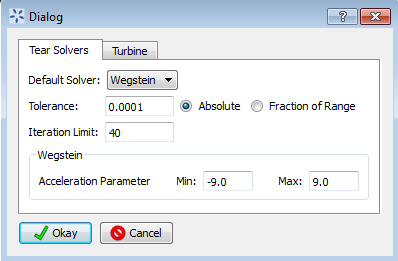

Tutorial 3: Flowsheets with Recycle
===================================

This section provides a tutorial on working with flowsheets containing
recycle. Sections :ref:`tutorial.simple.flow` and
:ref:`tutorial.sim.flowsheet` provide tutorials
for creating flowsheets, in this section a pre-constructed flowsheet is
used.

The file for this tutorial is **Mass_Bal_Test_02.foqus**, and
this file is located in **examples/tutorial_files/Flowsheets/Tutorial_3**

.. note:: |examples_reminder_text|

#. Open FOQUS.

3. Open the Mass_Bal_Test_02.foqus file.

   #. Open the **Session** drop-down menu on the right side of the
      **Session** button (Figure :ref:`fig.recycle.tut1`).

   #. Select **Open Session** from the drop-down menu.

   #. Locate Mass_Bal_Test_02.foqus in the file browser, and open it.

   .. raw:: latex

      \setcounter{enumi}{3}

4. Click **Flowsheet** button from the toolbar at the top of the Home
   window.

The flowsheet is shown in Figure :ref:`fig.recycle.tut1`. The flowsheet consists of
two reactors in recycle loops. The flowsheet contains mixers, reactors,
separators, and splitters. Each node uses a set of simple calculations
in the node script section. The tear edges are shown in light blue.

.. figure:: ../figs/recycle_tut1.svg
   :alt: Flowsheet with Recycle
   :name: fig.recycle.tut1

   Flowsheet with Recycle

5. Inspect a node.

   #. Make sure the Selection tool is selected (Figure
      :ref:`fig.recycle.tut2`.

   #. Open the Node Editor by clicking the **Node Edit** button in the
      left toolbar in the Flowsheet view.

   #. Click the “React_01” node.

   #. Click **Input Variables** table. Note: Some input rows are colored
      red. This denotes that their values are set by output of the
      previous flowsheet node by the edge connecting “Mix_01” to
      “React_01.”

   #. Click the **Node Script** tab.

   #. Note the equations. **Input Variables** are stored in the x
      dictionary and **Output Variables** are stored in the f
      dictionary.

6. Click the gear icon in the left toolbar (see Figure
   :ref:`fig.recycle.tut2`. The tear solver settings
   are shown in Figure :ref:`fig.tear.settings`.

.. figure:: ../figs/recycle_tut2.svg
   :alt: React_01 Node
   :name: fig.recycle.tut2

   React_01 Node

   Tear Solver Settings

7. Remove the tear edges.

   #. Close the Node Editor.

   #. Open the Edge Editor. Click the **Edge Editor** icon in the left
      toolbar (see Figure :ref:`fig.recycle.tut3`.

   #. Click the edge between “React_01” and “Sep_01.”

   #. In the Edge Editor, clear the **Tear** checkbox.

   #. Repeat for the other tear edge.

8. Close the Edge Editor.

.. figure:: ../figs/recycle_tut3.svg
   :alt: Edge Edit
   :name: fig.recycle.tut3

   Edge Edit

There should now be no tear edges in the flowsheet. The user can select
tear edges or FOQUS can automatically select a set. If there is not a
valid set of tear edges marked when a flowsheet is run, tear edges will
automatically be selected.

9.  Automatically select a tear edge set by clicking the **Tear** icon
    in the left toolbar (see Figure
    :ref:`fig.recycle.tut3`).

10. Open the Node Editor and look at node “Sep_01.” In the Input
    Variables table, notice that some of the input lines are colored
    yellow. The yellow inputs serve as initial guesses for the tear
    solver. The final value will be different from the initial value.

11. Click the **Run** button on the left toolbar. The flowsheet should
    solve quickly.

12. The results of the completed run are in the flowsheet. An entry will
    also be created in the Flowsheet Results data table (see Section
    :ref:`tutorials.fs.data`.
