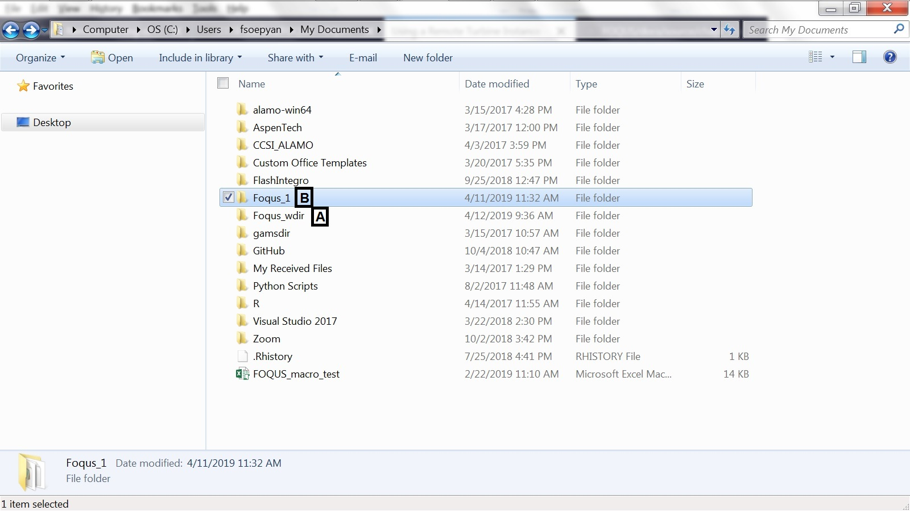
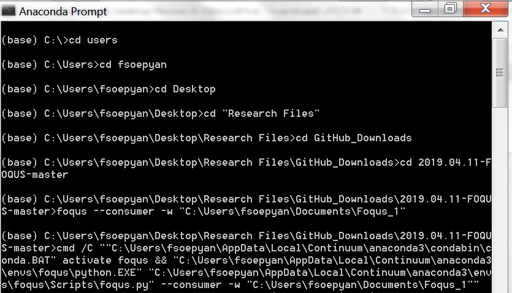
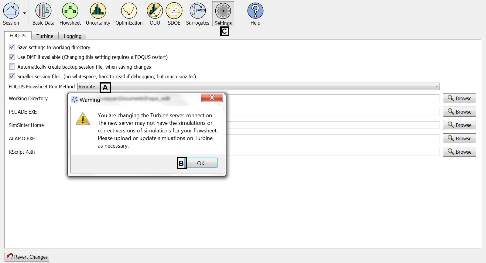
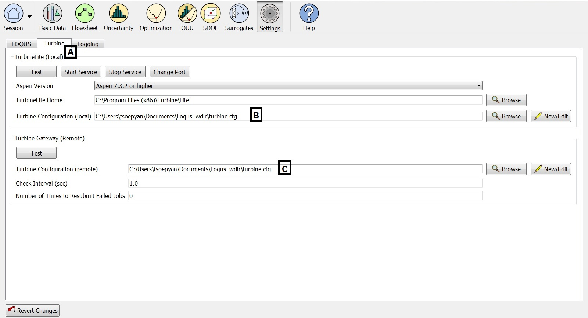
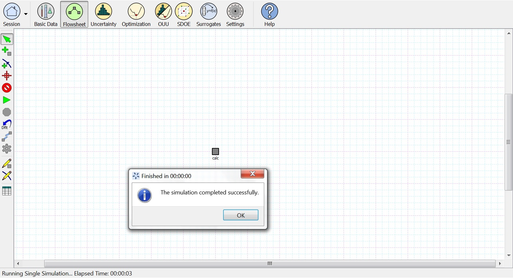

.. _tutorial.fs.remote.turbine:

Tutorial 5: Using a Remote Turbine Instance
===========================================

A remote Turbine instance may be used instead of TurbineLite.
TurbineLite, used by default, runs simulations (e.g., Aspen Plus) on the
user’s local machine. The remote Turbine gateway has several potential
advantages over TurbineLite, while the main disadvantage is the effort
required for installation and configuration. Some reasons to run a
remote Turbine instance are:

-  Simulations can be run in parallel. The Turbine gateway can
   distribute simulations to multiple machines configured to run FOQUS
   flowsheet consumers. FOQUS consumers are basically additional
   instances of FOQUS running on remote systems which can run a FOQUS
   flowsheet.

-  Simulations can be run on machines other than the user’s, so as not
   to tie-up the user’s machine running simulations.

Running Remote Turbine on Your Own Computer
-------------------------------------------

For this tutorial, the FOQUS file is **Simple_flow.foqus**, and 
this file is located in: **examples/tutorial_files/Flowsheets/Tutorial_5**

.. note:: |examples_reminder_text|

To run remote turbine on you own computer (e.g., if your
computer has multiple processors):

1. Navigate to the folder where your FOQUS working directory is located
   ("A" in Figure :ref:`fig.FOQUS_Folder`).

   FOQUS Working Directory and Folder

2. Create a blank folder ("B" in Figure :ref:`fig.FOQUS_Folder`).
   Here, this folder is called "Foqus_1".

3. Open the Anaconda prompt, and navigate to the folder where you
   downloaded FOQUS from GitHub (Please see Figure
   :ref:`fig.Anaconda_Prompt`).

   The Anaconda Prompt for Remote Turbine

4. Once you navigate to the above-mentioned folder, type:
   "foqus --consumer -w" (without the quotes) and the location
   of the folder created in Step 2 (in quotes) (Please see Figure
   :ref:`fig.Anaconda_Prompt`).

5. If successful, a message will appear (shown at the bottom of
   Figure :ref:`fig.Anaconda_Prompt`).

6. If you have not done so already, open another Anaconda prompt,
   use it to open FOQUS.

7. Click "Settings" at the top menu ("C" in Figure
   :ref:`fig.remote.setting.new`).

   Remote Turbine Setting

8. Under "FOQUS Flowsheet Run Method", select "Remote"
   ("A" in Figure :ref:`fig.remote.setting.new`).

9. A message box will appear to warn the user that the simulations
   may need to be re-uploaded to Turbine. Click "OK" to continue
   ("B" in Figure :ref:`fig.remote.setting.new`).

10. Click the "Turbine" tab
    ("A" in Figure :ref:`fig.RemoteSetting_TurbineLite`).

   Turbine Lite Setup for Running Turbine Remotely

11. If necessary, copy the item in "Turbine Configuration
    (remote)" ("C" in Figure :ref:`fig.RemoteSetting_TurbineLite`) to a
    convenient location (e.g., Notepad), just in case.

12. Make sure that the item under "Turbine Configuration (remote)"
    ("C" in Figure :ref:`fig.RemoteSetting_TurbineLite`)
    is the same as the item under "Turbine Configuration (local)"
    ("B" in Figure :ref:`fig.RemoteSetting_TurbineLite`). The reason you
    will be using Turbine Lite (instead of Turbine Gateway) is because
    you will be running the simulation remotely, but still in your own
    computer (instead of in other computers or in AWS - Amazon Web Service).

13. Run the flowsheet. The run should be successful
    (Figure :ref:`fig.Remote_Flowsheet`).
    

   Example of Running the Flowsheet with Remote Turbine

Running Remote Turbine on AWS (Amazon Web Service)
--------------------------------------------------

The steps below demonstrate how to set up FOQUS to run flowsheets
remotely if the user would like to run FOQUS in parallel in AWS
(see Figure :ref:`fig.remote.settings`).

1. Obtain a user name, password, and URL from the site’s Turbine
   administrator.

2. Open FOQUS.

3. Click **Settings** at the top right of the Home window (Figure
   :ref:`fig.remote.settings1`).

4. Select “Remote” from the **FOQUS Flowsheet Run Method** drop-down
   list. A message box will appear. The user will be warned that the
   models that have been uploaded to Turbine Local may not be available
   in Turbine Remote Gateway, which means that the user may need to
   upload the models into Turbine again (please see Step 7).

5. Click the **Turbine** tab; this displays the Turbine settings shown
   in Figure :ref:`fig.remote.settings`.

.. figure:: ../figs/settings_turbine_01.svg
   :alt: Run Method Settings
   :name: fig.remote.settings1

   Run Method Settings

6. Create a Turbine configuration file; this contains your password in
   plain text, so it is very important that if you are allowed to choose
   your own password, you choose one that is not used for any other
   purpose.

   a. Click **New/Edit** next to the **Turbine Configuration (remote)**
      field. The Turbine Configuration window displays (see Figure
      :ref:`fig.remote.settings`).

   b. Select “Cluster/Cloud” from the **Turbine Gateway Version**
      drop-down list in the Turbine Configuration window.

   c. Enter the Turbine URL in the **Address** field.

   d. Enter the **User** name and **Password**.

   e. Click **Save as** and enter a new file name.

   f. Set the remote Turbine configuration file. Click **Browse** next
      to the **Turbine Configuration (remote)** field. Select the file
      created in Step 6e.

.. figure:: ../figs/remoteSetting.svg
   :alt: Remote Turbine Settings
   :name: fig.remote.settings

   Remote Turbine Settings

At this point the remote gateway is ready to use. The last step is to
ensure that all simulations referenced by flowsheets to be run are
uploaded to the remote Turbine gateway.

7. Upload any necessary simulations to Turbine (see Section
   :ref:`overview.turbine.upload` and the
   tutorial in Section :ref:`tutorial.sim.flowsheet`)

Once all settings are specified there is no apparent difference between
running flowsheets locally or on a remote Turbine gateway, and FOQUS can
readily be switched between the two.
