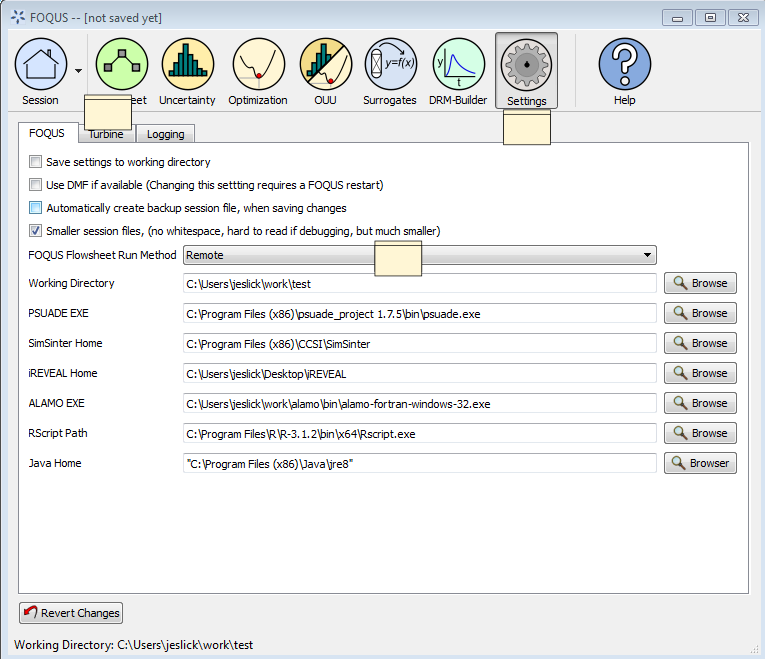
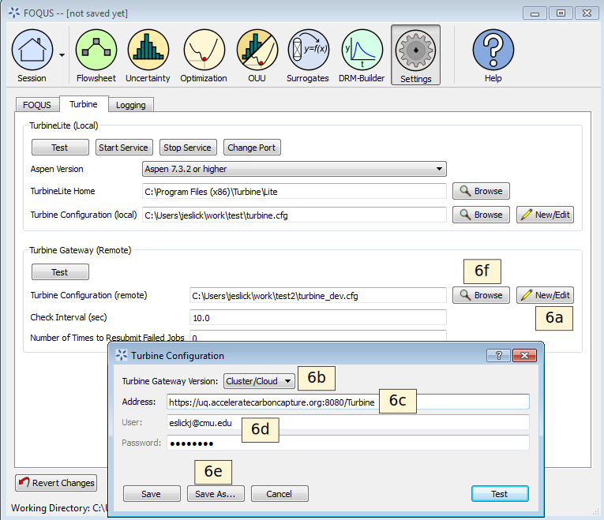

.. _tutorial.fs.remote.turbine:

Tutorial 5: Using the AWS FOQUS Cloud
===========================================

The AWS FOQUS Cloud may be used instead of TurbineLite.
TurbineLite, used by default, runs simulations (e.g., Aspen Plus) on the
user’s local machine. The AWS FOQUS Cloud has several potential
advantages over TurbineLite, while the main disadvantage is the effort
required for installation and configuration. Some reasons to run a
on the AWS FOQUS Cloud are:

-  Users don't have to install Aspen on their local machine.
   
-  Users with Apple Macintosh or Linux-based systems can run flowsheets with
   Aspen simulations on the AWS FOQUS Cloud.

-  Simulations can be run in parallel. The AWS FOQUS Cloud can scale
   up to hundreds of virtual machines configured to run FOQUS
   flowsheet consumers. FOQUS consumers are basically additional
   instances of FOQUS running on remote systems which can run a FOQUS
   flowsheet.

-  Simulations can be run on machines other than the user’s, so as not
   to tie-up the user’s machine running simulations.

Running on AWS FOQUS Cloud
--------------------------------------------------

The steps below demonstrate how to set up FOQUS to run flowsheets
remotely if the user would like to run FOQUS in parallel in AWS
(see Figure :ref:`fig.remote.settings`).

1. Obtain a user name, password, and URL.  Ask on the ccsi-support list

2. Open FOQUS.

3. Click **Settings** at the top right of the Home window (Figure
   :ref:`fig.remote.settings1`).

4. Select “Remote” from the **FOQUS Flowsheet Run Method** drop-down
   list. A message box will appear. The user will be warned that the
   models that have been uploaded to Turbine Local may not be available
   in Turbine Remote Gateway, which means that the user may need to
   upload the models into Turbine again (please see Step 7).

5. Click the **Turbine** tab; this displays the Turbine settings shown
   in Figure :ref:`fig.remote.settings`.

   Run Method Settings

6. Create a Turbine configuration file; this contains your password in
   plain text, so it is very important that if you are allowed to choose
   your own password, you choose one that is not used for any other
   purpose.

   a. Click **New/Edit** next to the **Turbine Configuration (remote)**
      field. The Turbine Configuration window displays (see Figure
      :ref:`fig.remote.settings`).

   b. Select “Cluster/Cloud” from the **Turbine Gateway Version**
      drop-down list in the Turbine Configuration window.

   c. Enter the AWS FOQUS Cloud URL in the **Address** field.

   d. Enter the **User** name and **Password**.

   e. Click **Save as** and enter a new file name.

   f. Set the remote Turbine configuration file. Click **Browse** next
      to the **Turbine Configuration (remote)** field. Select the file
      created in Step 6e.

   Remote Turbine Settings

At this point FOQUS is ready to use the AWS FOQUS Cloud. The last step is to
ensure that all simulations referenced by flowsheets to be run are
uploaded to the AWS FOQUS Cloud.

7. Upload any necessary simulations (see Section
   :ref:`overview.turbine.upload` and the
   tutorial in Section :ref:`tutorial.sim.flowsheet`)

Once all settings are specified there is no apparent difference between
running flowsheets locally or on the AWS FOQUS Cloud, and FOQUS can
readily be switched between the two.
