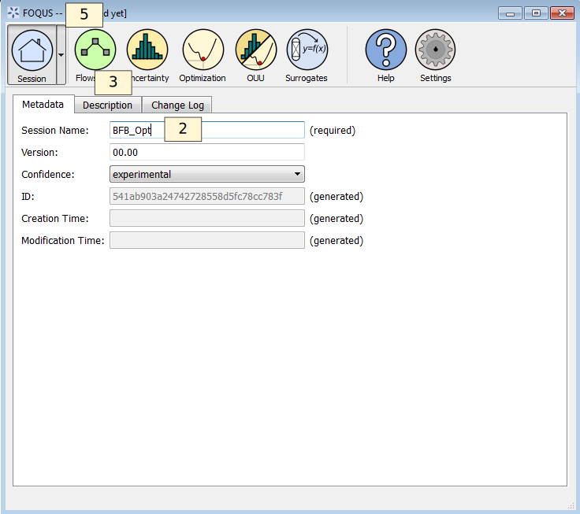
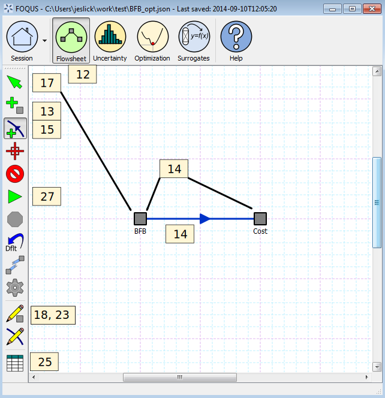

.. _tutorial.sim.flowsheet:

Tutorial 2: Creating a Flowsheet with Linked Simulations
========================================================
.. note::
    This tutorial utilizes SimSinter and Turbine, two optional software packages that integrate with FOQUS to run Aspen and Excel models. The installation instructions are located at :ref:`Install Turbine and SimSinter (Windows Only)<chapt_install/install_optional:Install Turbine and SimSinter (Windows Only)>`.

This tutorial is referenced by other tutorials. **Save the flowsheet in
a convenient location for future use.**

This tutorial demonstrates how to link simulations to nodes, and how to
connect nodes in a flowsheet. Two models are used: (1) a bubbling
fluidized bed model in ACM and (2) a cost of electricity (COE) model in
Excel. The COE model estimates the cost of electricity for a 650 MW (net
before adding capture) supercritical pulverized coal power plant with
solid sorbent post combustion CO\ :math:`_2` capture process added.

The files for this tutorial is located in:
**examples/test_files/Optimization/Model_Files/**.

.. note:: |examples_reminder_text|

#. Start FOQUS. The Session window displays (Figure :ref:`fig.tut.opt.session`).

#. Enter “BFB_opt” in **Session Name** (without quotes).

#. Click the **Description** tab. The problem description box displays
   and is shown in (Figure :ref:`fig.tut.opt.description`).

#. In the problem description box enter information about the problem
   being solved in the FOQUS session; this information can be more
   extensive than what is shown in the example.

#. Save the session file. Click **Save Session** from the **Session**
   drop-down menu. Enter change log information and a file name when
   prompted. The **Creation Time** in metadata page will be the time the
   session is first saved. The **Modification Time** will be the last
   time the session was saved. The **ID** is a unique identifier that
   changes each time the user saves the simulation. The **Change Log**
   tab provides a record of the changes made each time the session is
   saved.

   Session Setup

.. figure:: ../figs/description.svg
   :alt: Session Description
   :name: fig.tut.opt.description

   Session Description

There are two models needed for this optimization problem: (1) the ACM model for
the BFB capture system and (2) the Excel cost estimating spreadsheet. These
models are provided in the ``example/Optimization/Model_Files/`` directory. There are two SimSinter configuration
files: (1) ``BFB_sinter_config_v6.2.json`` for the process model and (2)
``BFB_cost_v6.2.3.json`` for the cost model. The next step is to upload the models
to Turbine.

6.  Open the **Add/Update Model to Turbine** dialog box (Figure
    :ref:`fig.tut.opt.menu.upload`).

7.  In this case, the SimSinter configuration files have already been
    created. If a SimSinter configuration file needs to be created for
    the simulation, **Create/Edit** displays the SimSinter configuration
    GUI (see Figure :ref:`fig.tut.opt.upload`). See
    the SimSinter documentation or Chapter
    :ref:`sinter_main` for more information.

8.  Click **Browse** to select a SimSinter configuration file (Figure
    :ref:`fig.tut.opt.upload`). Once the SimSinter
    configuration file is selected, the simulation file and sinterconfig
    file is automatically added to the files to upload. The application
    type is entered automatically. If there are additional files
    required for the simulation, those files can be added by clicking
    **Add File**.

9.  Enter the simulation name in **Simulation Name**. This name is
    determined by the user, but will default to the SimSinter
    configuration file name. For this tutorial use BFB_v6_2.

10. Click OK to upload the simulation.

11. | Repeat the upload process for the cost model. Name the model
    | BFB_v6_2_Cost.

.. figure:: ../figs/menu_upload.svg
   :alt: Open Upload to Turbine Dialog
   :name: fig.tut.opt.menu.upload

   Open Upload to Turbine Dialog

.. figure:: ../figs/upload.svg
   :alt: Upload to Turbine Dialog
   :name: fig.tut.opt.upload

   Upload to Turbine Dialog

The next step is to create the flowsheet. Figure
:ref:`fig.tut.opt.drawFlowsheet` illustrates
the steps to draw the flowsheet.

12. Click **Flowsheet** at the top of the Home window.

13. Click **Add Node mode**.

14. Add two nodes to the flowsheet. Name the first node “BFB” and the
    second node “cost”.

15. Click **Add Edge mode**.

16. Click the BFB node followed by the cost node.

17. Click **Selection mode** and select the BFB node.

18. Click **Toggle Node Editor**. The Node Editor displays as
    illustrated in Figure
    :ref:`fig.tut.opt.nodeEditor_upd`.

   Flowsheet Editor

Each node must be assigned the appropriate simulation. Use the Node
Editor to set the simulation type and the simulation name from
simulation uploaded to Turbine. The Node Editor is illustrated in Figure
:ref:`fig.tut.opt.nodeEditor_upd`

19. Under **Model** and **Type**, set the simulation **Type** to
    Turbine. This indicates that the simulation is to be run with
    Turbine.

20. Under **Model**, set the simulation of the BFB node to BFB_v6_2.

21. The **Variables** and **Settings** are automatically populated from
    the SimSinter configuration file. Variable values, **Min/Max**, and
    descriptions can be changed; however, for this problem, the values
    taken from the SimSinter configuration should not be changed.

22. Repeat the process for the cost node, assigning it the BFB_v6_2_cost
    simulation.

   Node Editor

The connections between variables in the BFB simulation and the cost
estimation spreadsheet must be set, so that required information can be
transferred from the BFB simulation to the cost simulation.

23. Click **Toggle Node Editor** to hide the Node Editor (Figure
    :ref:`fig.tut.opt.drawFlowsheet`).

24. Select the edge on the flowsheet with the **Selection** tool.

25. Click **Toggle Edge Editor** to show the Edge Editor. The Edge
    Editor is shown in Figure
    :ref:`fig.tut.opt.edgeEditor`.

26. For convenience, all of the variables that should be connected from
    the ACM model to the Excel spreadsheet have been given the same
    names in their SimSinter configuration files. To connect the
    variables click **Auto** in the Edge Editor. **Auto** connects
    variables of the same name. Since this is often not desired, the
    **Auto** button should be used carefully. There should be 46
    connected variables.

.. figure:: ../figs/edgeEditor.svg
   :alt: Edge Editor
   :name: fig.tut.opt.edgeEditor

   Edge Editor

The flowsheet should now be ready to run. Test the flowsheet by
executing a single evaluation before setting up the optimization
problem.

27. Click **Run** in the Flowsheet Editor (Figure
    :ref:`fig.tut.opt.drawFlowsheet`).

28. The flowsheet may take a few minutes to run. The BFB simulation
    takes a significant amount of time to open in ACM. While running
    optimization, the evaluations take less time because the simulation
    remains opened. The simulation should complete successfully. A
    message box displays when the simulation is done. The status bar
    also indicates the simulation is running.

29. While the simulation is running, **Stop** is enabled.

30. Once the simulation runs successfully, **Save** the FOQUS session
    again, and **keep it for use in later tutorials**.
