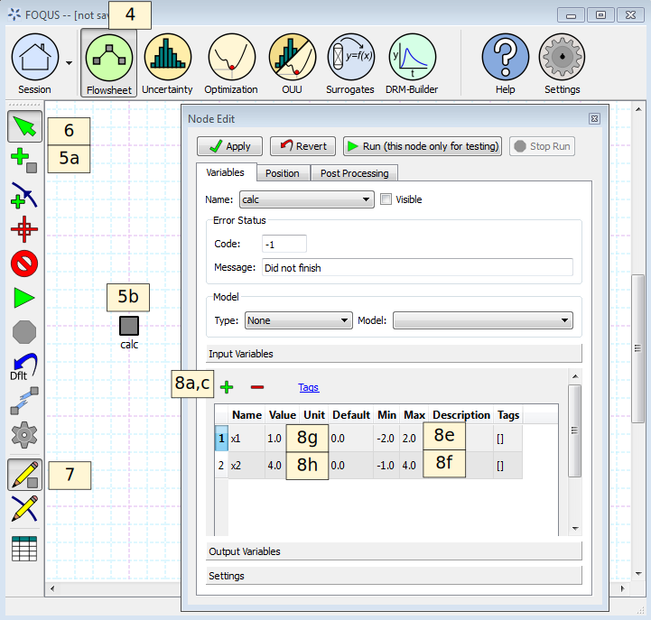

.. _tutorial.simple.flow:

Tutorial 1: Creating a Flowsheet
================================

The Basics
~~~~~~~~~~

This tutorial provides information about the basic use of FOQUS and
setting up a very simple flowsheet. A single node flowsheet will be
created that performs a simple calculation using a square root so that
simulation errors can be observed when a negative input value is
provided.

This tutorial will show the user the procedure for creating a flowsheet in FOQUS.
However, if the user is interested, the finished flowsheet is available in: **examples/tutorial_files/Flowsheets/Tutorial_1**

.. note:: |examples_reminder_text|

#. Start FOQUS (see Section :ref:`sec.flowsheet.starting.foqus`).

#. In the session form enter the **Session Name** as “Simple_Flow”
   (Figure :ref:`fig.session.name1`).

   Setting the Session Name

3. Set the session description.

   a. Select the **Description** tab (Figure
      :ref:`fig.session.description1`).

   b. Type the description shown in Figure
      :ref:`fig.session.description1`. The
      buttons above the **Description** tab box can be used to format
      the text.

   Setting the Session Description

4. Click the **Flowsheet** button at the top of the Home window (Figure
   :ref:`fig.simple.flow1`).

5. Add a node named “calc.”

   a. Click the **Add Node** button in the toolbar on the left side of
      the Home window.

   b. Click a location on the gridded flowsheet area.

   c. Enter the node name “calc” in the dialog box.

6. Click the **Select Mode** button in the toolbar.

7. Open the Node Editor by clicking the **Node Editor** button in the
   toolbar.

8. Add input variables to the node. (When linking a node to an external
   simulation the input and output variables are populated
   automatically, and this step is not necessary.)

   a. Click **+** above the **Input Variables** table.

   b. Enter x1 in the variable **Name** dialog box.

   c. Click **+** above the **Input Variables** table.

   d. Enter x2 in the variable **Name** dialog box.

   e. Enter -2 and 2 for the **Min** and **Max** of x1 in the **Input
      Variables** table.

   f. Enter -1 and 4 for the **Min** and **Max** of x2 in the **Input
      Variables** table.

   g. Enter 1 for the value of x1.

   h. Enter 4 for the value of x2.

   Flowsheet, Input Variables

9. Add an output variable to the node. (When linking a node to an
   external simulation the input and output variables are populated
   automatically.)

   a. Click **Output Variables** to show the **Output Variables** table
      (Figure :ref:`fig.simple.flow2`).

   b. Click **+** above the **Output Variables** table to add a
      variable.

   c. Enter z in the output **Name** dialog box.

.. figure:: ../figs/simple_flow_2.svg
   :alt: Flowsheet, Output Variables
   :name: fig.simple.flow2

   Flowsheet, Output Variables

In this example, the node is not linked to any external simulation. The
FOQUS nodes contain a section called node script, which can be used to
do calculations before, after or instead of a simulation linked to the
node. The node script can be used for things such as unit conversion,
simple calculations, or simulation convergence procedures. The node
scripts are written as Python. The **Input Variables** are contained in
a dictionary named x and the **Output Variables** are contained in a
dictionary named f. The dictionary keys are the variables names shown in
the input and output tables. Only **Output Variables** can be modified
by a node script.

10. Add a calculation to the node.

    a. Click the **Node Script** tab (Figure
       :ref:`fig.simple.flow3`).

    b. | Enter the following code into the Python code box:
       | ``f['z'] = x['x1']*math.sqrt(x['x2'])``

11. Click the **Variables** tab.

12. Click the **Run** button (Figure :ref:`fig.simple.flow3`).

The flowsheet should run successfully and the output value should be 2.
Rerun the flowsheet with a negative value for x2, and observe the
result. The simulation should report an error.

   Node Calculation

13. Save the FOQUS session.

    a. Click the **Session** drop-down menu at the top of the Home
       window (Figure :ref:`fig.simple.flow.save`).

    #. Click **Save**. The exact location of save in the menu depends on
       whether or not the data management framework is enabled.

    #. The **Change Log** entry can be left blank.

    #. The default file name is the session name. Change the file name
       and location if desired.

.. figure:: ../figs/simple_flow_save.svg
   :alt: Save Session
   :name: fig.simple.flow.save

   Save Session

Automatically running FOQUS for a set of user-defined input conditions
~~~~~~~~~~~~~~~~~~~~~~~~~~~~~~~~~~~~~~~~~~~~~~~~~~~~~~~~~~~~~~~~~~~~~~

This procedure requires the Uncertainty Tab.

Therefore, the instructions for this procedure can be found in the
documentation under:

Uncertainty Quantification / Tutorial / 
Simulation Ensemble Creation and Execution / 
Automatically running FOQUS for a set of user-defined input conditions

The link for these instructions is shown below:

https://foqus.readthedocs.io/en/latest/chapt_uq/tutorial/sim.html
