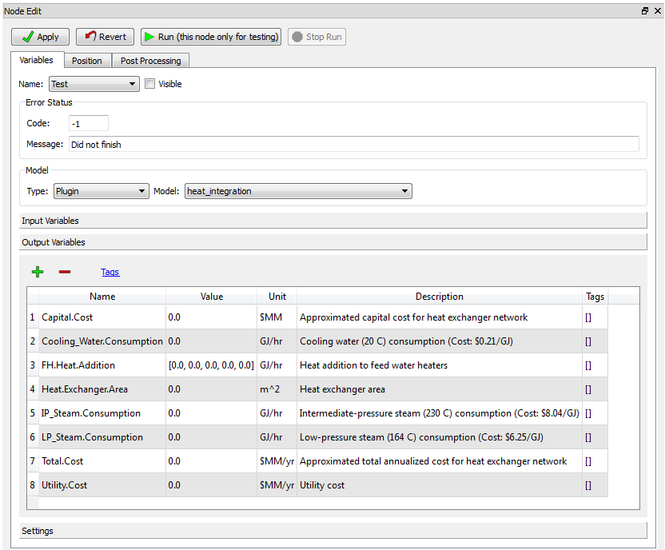
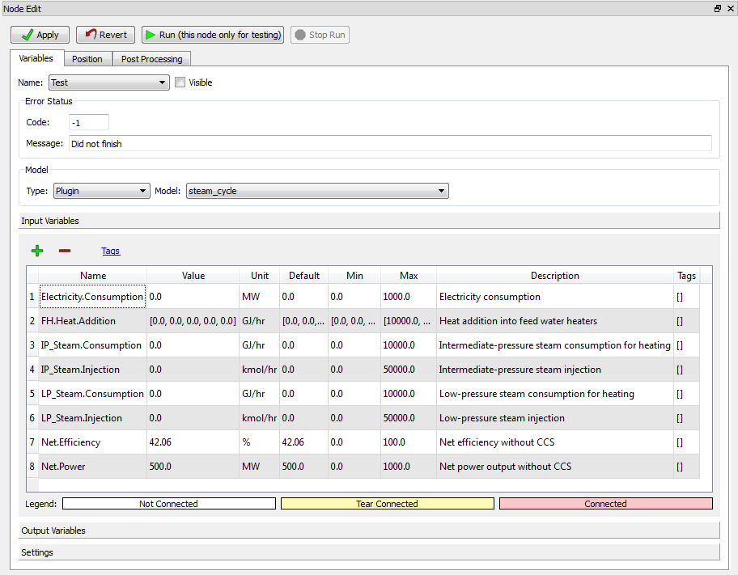
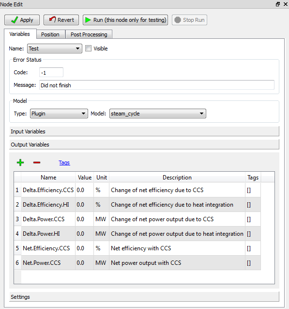

.. _section.plugin:

Reference
=========

Heat Integration
----------------

The Heat Integration Node performs heat integration calculations for the
entire process in the meta-flowsheet. This node transfers simulation
results to a GAMS-based heat integration program, solves the program,
and transfers part of important heat integration results from GAMS to
the graphical interface. The detailed heat integration results can be
found in \\gams\HeatIntegration.lst. All input and output variables in
the nodes connected to the Heat Integration Node (with the edge pointing
to the heat integration node) are automatically transferred to heat
integration. However, only the variables with heat integration tags are
considered and processed in heat integration. Heat integration tags are
described in the Heat Integration Tutorial in Section
`[sec.hi.tut] <#sec.hi.tut>`__.

The Heat Integration Node Editor widget is illustrated in Figure
`[heat.int.inputs] <#heat.int.inputs>`__ and Figure
`[heat.int.outputs] <#heat.int.outputs>`__. To specify a node as a Heat
Integration Node, expand the **Model** section, expand the **Model**
drop-down list, and then select “heat_integration.” Some input variables
control the performance of heat integration. Output variables display
heat integration results, which are used as final results or inputs for
steam cycle calculations.

.. figure:: figs/heat_int_inputs.png
   :alt: Heat Integration Node Editor (Input Variables)
   :name: heat.int.inputs

   Heat Integration Node Editor (Input Variables)

.. raw:: latex

   \clearpage

The Heat Integration Node **Input Variables** are listed below:

-  Exchanger minimum approach temperature (**EMAT**) is the minimum
   temperature difference between hot streams and cold streams for heat
   exchanger area calculations. The value of EMAT is usually not larger
   than that of HRAT (see below). The default value of EMAT is set to
   5K. When a small value of HRAT is chosen (e.g., 3-5K), the value of
   EMAT should also be small (e.g., 1-3K).

-  Heat recovery approach temperature (**HRAT**) is the minimum
   temperature difference between hot streams and cold streams for
   utility consumption calculations. Smaller HRAT usually leads to lower
   utility consumptions but higher capital cost of the heat exchanger
   network. An appropriate value should be selected for HRAT in order to
   achieve the best economic performance. The typical value of HRAT in
   industrial applications is 10K, which is also the default value of
   HRAT. The user may choose other HRAT values depending on their
   applications (e.g., in power plants, HRAT can be as low as 3-5K for
   higher heat recovery).

-  **Life.Plant** is the operating life of the plant. The default value
   is 20 years. The user can change the value depending on detailed
   applications.

-  **Net.Power** is the net power output of a power plant without carbon
   capture and storage (CCS). This is an optional input variable;
   therefore, it has no default value. The user only needs to assign a
   value to it when the steam cycle node is also present in the
   flowsheet. The net power output is used to calculate the amount of
   heat recovered for steam cycle via the heat exchanger network.

-  **No.Stream** is the number of process streams (for heat integration)
   in the plant. This is an optional input variable without default
   value. When the value of “No.Stream” is not assigned, the number of
   process streams is calculated by the Python program via heat
   integration tags (see the Heat Integration Tutorial in Section
   `[sec.hi.tut] <#sec.hi.tut>`__).

-  **Operation.Hours** is the annual operational hours of the plant. For
   power, refinery, and chemical industries, the typical value is
   7500-8500 hours. The default value here is 8000 hours.

-  **ROR** is the rate of return for the project. The default value is
   10 percent. The user should select appropriate values for ROR based
   on their own projects. The variables **Life.Plant**, **No.Stream**,
   **Operation.Hours**, and **ROR** are used for the cost calculation.

   Heat Integration Node Editor (Output Variables)

The **Output Variables** of the Heat Integration Node are listed below:

-  **Capital.Cost** is the minimum approximated capital cost for the
   heat exchanger network (in million U.S. dollars). The capital cost is
   calculated from the heat exchanger area (see below).

-  **Cooling.Water.Consumption** is the minimum cooling water
   consumption rate (represented by energy rate GJ/hr) predicted by heat
   integration. Cooling water is an outside utility with the temperature
   of 20°C.

-  **FH.Heat.Addition** is the amount of heat recovered to feed water
   heaters in the steam cycle. This variable is only valid when steam
   cycle calculations are also presented. If more heat is added to the
   steam cycle, higher net power output is expected. The value of
   “FH.Heat.Addition” is a vector with five elements. The first to fifth
   element of the vector represents the amount of heat added to the
   first-stage to the fifth-stage of the feed water heater in the steam
   cycle. The temperature of the feed water increases from the
   first-stage to the fifth-stage; therefore, heat added to the feed
   water heaters achieves a higher efficiency power generation from the
   first-stage to the fifth-stage heater. The temperature range for the
   five feed water heaters are 34-65°C, 65-96°C, 96-128°C, 128-160°C,
   and 160-195°C. These values are obtained from a supercritical power
   plant simulation model in Thermoflex.

-  **Heat.Exchanger.Area** is the minimum heat exchanger area (in square
   meters), which is used for the capital cost calculation.

-  **IP_Steam.Consumption** is the minimum intermediate-pressure steam
   consumption rate (in GJ/hr). Note: Both intermediate- and
   low-pressure steam are treated as a utility in heat integration
   calculations here; however, they are actually extracted from the
   steam cycle in the power plant. Therefore, minimizing steam
   consumption is equivalent to maximizing the net power output.
   Intermediate-pressure steam is extracted from the crossover of the
   pressurized intermediate-pressure turbine (PIPT) and the
   intermediate-pressure turbine (IPT) with the temperature of 230°C.

-  **LP_Steam.Consumption** is the minimum low-pressure steam
   consumption rate (in GJ/hr). Low-pressure steam is extracted from the
   crossover of IPT and low-pressure steam turbine (LPT) with the
   temperature of 164°C.

-  **Total.Cost** is the minimum approximated total annualized cost for
   the heat exchanger network (in million U.S. dollars per year), which
   equals the sum of utility cost and annualized capital cost.

-  **Utility.Cost** is the minimum utility cost (in million U.S. dollars
   per year), which equals the sum of the cost of cooling water,
   intermediate-pressure steam, and low-pressure steam. It can also be
   treated as scaled total utility consumption where the consumption
   rate of each utility is weighted by its cost.

Steam Cycle
-----------

The Steam Cycle Node performs steam cycle and power output calculations
for a power plant with CCS (and possibly heat integration). Correlations
for net power output with steam extraction and heat addition to feed
water heaters, which are obtained from a supercritical power plant model
in Thermoflex, are utilized to calculate net power output and net
efficiency with CCS in the Steam Cycle Node. These correlations are
currently hard coded in Python for this node. The users will have a
choice to provide their own correlations in future versions of FOQUS.

The Steam Cycle Node Editor widget is illustrated in Figure
`[steam.cycle.inputs] <#steam.cycle.inputs>`__ and Figure
`[steam.cycle.outputs] <#steam.cycle.outputs>`__.

To specify a node as a Steam Cycle Node, expand the **Model** section,
click on the **Model** drop-down list, and then select “steam_cycle.”
All input variables (potentially) can be contributed to power output
calculations; however, not all input variables are required to have a
value assigned, except net power output and net efficiency without CCS.
Output variables describe effects of CCS and heat integration to net
power output and net efficiency.

   Steam Cycle Node Editor (Input Variables)

The **Input Variables** of the Steam Cycle Node are described below:

-  **Electricity.Consumption** is the total electricity consumption in
   all processes other than steam cycle. The input value of this
   variable can be provided by the user or transferred from simulation
   outputs.

-  **FH.Heat.Addition** is the amount of heat recovered to feed water
   heaters in steam cycle. The input value of this variable can be
   transferred from heat integration output.

-  **IP_Steam.Consumption** is the intermediate-pressure steam
   consumption rate in heat exchangers. It is usually provided by heat
   integration, and sometimes it can be directly provided by simulation.

-  **IP_Steam.Injection** is the intermediate-pressure steam injection
   rate to process streams. In some equipment, such as regenerators in
   the capture process, steam needs to be injected directly into the
   input stream to provide a large amount of heat and realize fast heat
   transfer. The steam injection rate is different from the steam
   consumption rate as it does not need heat exchangers and is not
   considered in heat integration. This variable is typically provided
   by simulation output.

-  **LP_Steam.Consumption** is the low-pressure steam consumption rate
   in heat exchangers provided by heat integration or simulation output.

-  | **LP_Steam.Injection** is the low-pressure steam injection rate to
     process
   | streams provided by simulation output.

-  **Net.Efficiency** is the net efficiency of the power plant without
   CCS. Its default value is 42.06 percent, which is the efficiency of a
   typical supercritical pulverized coal-fired power plant without CCS.
   The user should change the value when another type of power plant is
   applied.

-  **Net.Power** is the net power output of a power plant without CCS.
   The user must give an input to this variable to perform steam cycle
   calculations. Both **Net.Efficiency** and **Net.Power** provide base
   case values for a power plant without CCS and heat integration.

   Steam Cycle Node Editor (Output Variables)

The **Output Variables** of the Steam Cycle Node are listed below:

-  **Delta.Efficiency.CCS** is the change of the net efficiency of a
   power plant with CCS compared to the base case value. This variable
   is expected to be negative since CCS decreases the net power output
   to a certain degree.

-  **Delta.Efficiency.HI** is the change of the net efficiency of a
   power plant with heat integration compared to the base case value.
   This variable is expected to be positive since heat integration
   potentially increases the net power output.

-  **Delta.Power.CCS** is the change of the net power output of a power
   plant with CCS compared to the base case value.

-  **Delta.Power.HI** is the change of the net power output of a power
   plant with CCS compared to the base case value.

-  **Net.Efficiency.CCS** is the net efficiency of the power plant with
   CCS given the base case value.

-  **Net.Power.CCS** is the net power output of the power plant with CCS
   assigned as the base case value.
