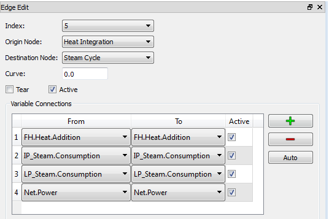
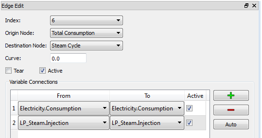
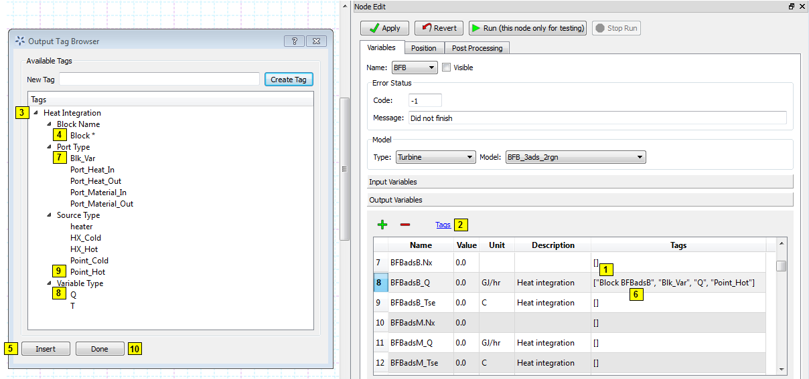
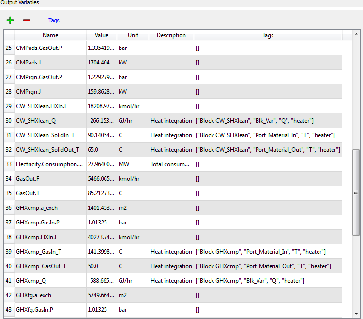
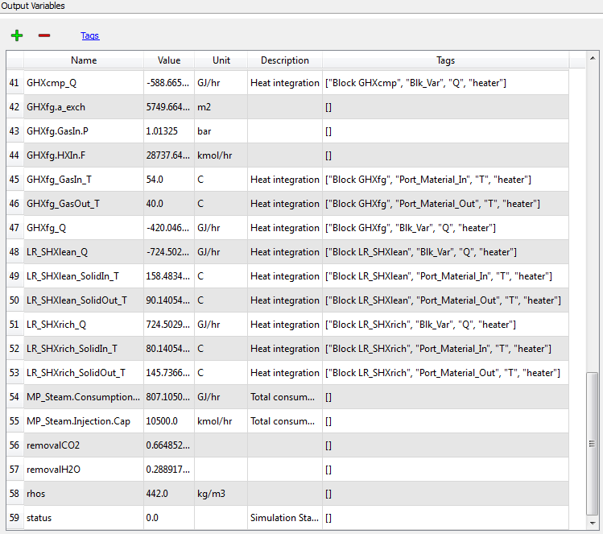
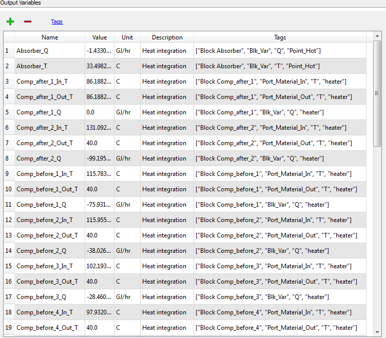
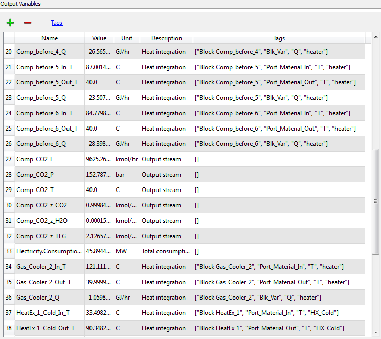
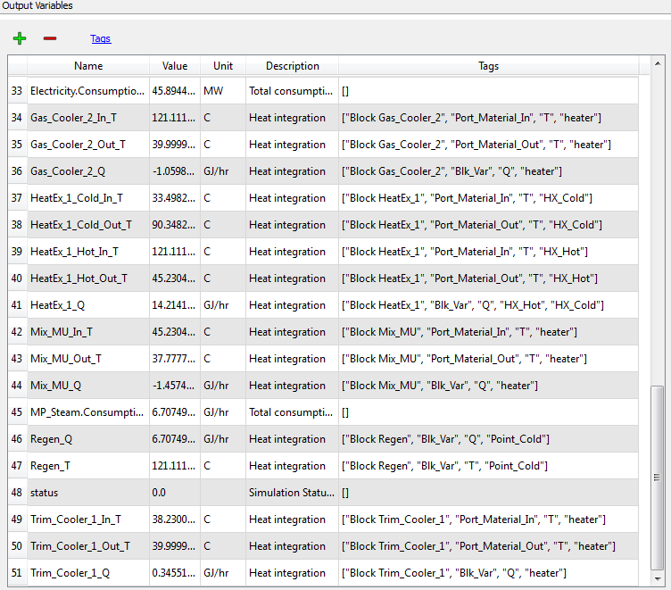
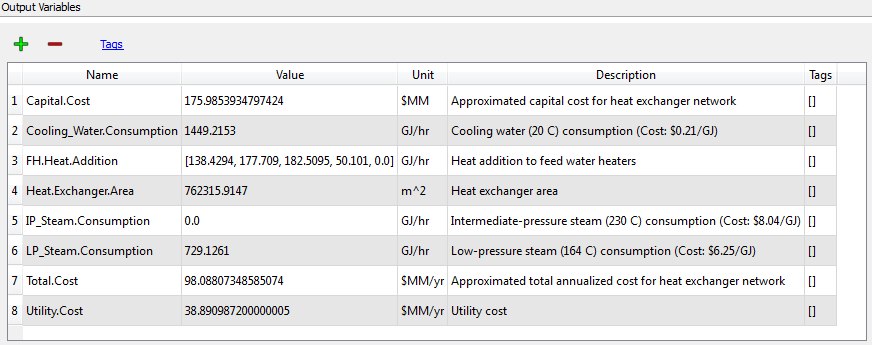

.. _sec.hi.tut:

Tutorial
========

This tutorial demonstrates the use of FOQUS to perform heat integration
with process simulations. This tutorial uses four models: (1) bubbling
fluidized bed (BFB) model in ACM, (2) multi-stage compressor model in
ACM, (3) heat integration model in GAMS, and (4) simplified steam cycle
model in Python. Heat integration and steam cycle models are included in
FOQUS as plug-in models (as described in Section
`[section.plugin] <#section.plugin>`__). Because most detailed steps for
adding/editing models, building flowsheets, and running simulations have
already been covered in the previous section, they are skipped here.

Example ACM and JSON files are provided with the FOQUS installer and are
typically installed at: C:\Program Files
(x86)\foqus\foqus_2014.10.0\examples \\Heat_Integration\Model_Files.
Copy the example files to a convenient location.

This tutorial is divided into 10 major steps.

GAMS Pre-Settings (Windows System Only)
---------------------------------------

If the user is working on a Windows system, the GAMS installation
directory needs to be added into the system path. Navigate to the
Windows **Control Panel**, select **System and Security**, select
**System**. Select **Advanced system settings** in the left side bar. In
the **System Properties** window, click **Environment Variables**. In
the **Environment Variables** window, navigate to the **System
variables** box, double-click the variable **Path**. Add the GAMS
installation directory to the **Variable value** box. An example of the
GAMS directory is: C:\GAMS\win64\24.2\. The user needs to modify the
above path to the exact location where GAMS is installed.

If the user is using GAMS in the first time (after installation or
re-installation), double-click the GAMS icon on the desktop. A prompt
dialog displays, asking the user to select default solvers. Click **OK**
to accept all default solver selections. Close GAMS.

Open a GAMS Project (Windows System Only)
-----------------------------------------

Suppose the current directory is the user’s working directory (e.g.,
C:\FOQUS). If the user is working on a Windows system, navigate to the
directory “gams”, and double-click the file “HeatInteg.gpr.” This will
open the file in GAMS and make its path the current GAMS working
directory. Close GAMS. All GAMS input and output files will be stored in
this directory. This step is not necessary with a Linux system. All GAMS
files should be closed when running heat integration.

Start a New Session
-------------------

Start FOQUS. Start a new session. In the “Session Information” screen,
under the **Metadata** tab, enter “BFB_CP_HI_SC” in the **Session Name**
field (Figure `[start.session] <#start.session>`__). Save the session.

.. figure:: ./figs/start_session.png
   :alt: Start a New Session
   :name: start.session

   Start a New Session

Upload Simulation Models
------------------------

The ACM BFB and compressor model files need to be uploaded to the
turbine.

Choose **Add/Update Model to Turbine**. In the **Turbine Upload**
dialog, upload the BFB ACM model file (Figure
`[upload model] <#upload model>`__). The SimSinter configuration file
for the BFB model is BFB_3ads_2rgn.json. Enter “BFB_3ads_2rgn” in the
**Simulation Name** drop-down list.

.. figure:: figs/upload_model.png
   :alt: Upload Simulation Models
   :name: upload model

   Upload Simulation Models

Upload the compressor ACM model as above. The SimSinter configuration
file for the compressor model is CompIG.json. The simulation name for
the compressor model is “Comp.”

Flowsheet Setup
---------------

Navigate to the **Flowsheet** window and build the flowsheet for this
heat integration example. The flowsheet for this tutorial is shown in
Figure `[flowsheet.heat.int] <#flowsheet.heat.int>`__. Build the
flowsheet in the same way as the figure. The nodes **BFB**,
**Compressor**, **Heat Integration**, and **Steam Cycle** correspond to
the BFB simulation in ACM, compressor simulation in ACM, heat
integration in GAMS and steam cycle calculations in Python. Models
“BFB_3ads_2rgn,” “Comp,” “heat_integration,” and “steam_cycle” are
assigned to nodes **BFB**, **Compressor**, **Heat Integration**, and
**Steam Cycle**, respectively. Model **BFB** and **Compressor** are
Turbine gateway models (see below); Model **Heat Integration** and
**Steam Cycle** are plugin models. The node **Total Consumption** is
used to calculate the total electricity and steam consumptions for BFB
and compressor process. It is a user-specified Python calculation node
and is described later. All edges should be the same directions as those
in the figure.

.. figure:: figs/flowsheet_heat_int.png
   :alt: Flowsheet of Heat Integration Example
   :name: flowsheet.heat.int

   Flowsheet of Heat Integration Example

Edit Nodes
----------

-  | **BFB** and **Compressor Nodes**: Figure
     `[bfb.node.edit] <#bfb.node.edit>`__ illustrates the edit of the
     **BFB** Node. From the “Node Edit” dialog box, select “Turbine”
     from the **Type** drop-down list, and
   | “BFB_3ads_2rgn” from the **Model** drop-down list. Next, select the
     **Compressor Node**. Select “Turbine” from the **Type** drop-down
     list, and “Comp” from the **Model** drop-down list. For both the
     **BFB** and **Compressor Nodes**, **Heat Integration Tags** should
     be added to their corresponding output variables. The detailed
     description for heat integration tags is covered later. No other
     changes are required for the two nodes.

.. figure:: figs/bfb_node_edit.png
   :alt: BFB Node Editor
   :name: bfb.node.edit

   BFB Node Editor

-  **Total Consumption Node**: The user is required to define the
   **Total Consumption Node**. The Node Editor for the **Total
   Consumption Node** is illustrated in Figures
   `[total.cons.inputs] <#total.cons.inputs>`__,
   `[total.cons.outputs] <#total.cons.outputs>`__, and
   `[total.cons.python] <#total.cons.python>`__. Within the Node Edit
   dialog box, choose “None” in the **Type** drop-down list and leave
   the **Model** drop-down list blank.

   .. figure:: figs/total_cons_inputs.png
      :alt: Total Consumption Node Editor (Input Variables)
      :name: total.cons.inputs

      Total Consumption Node Editor (Input Variables)

   .. figure:: figs/total_cons_outputs.png
      :alt: Total Consumption Node Editor (Output Variables)
      :name: total.cons.outputs

      Total Consumption Node Editor (Output Variables)

   .. figure:: figs/total_cons_python.png
      :alt: Total Consumption Node Editor (Python Codes)
      :name: total.cons.python

      Total Consumption Node Editor (Python Codes)

   #. | In the **Input Variables** section (Figure
        `[total.cons.inputs] <#total.cons.inputs>`__): add the following
        three variables: (1) “Electricity.Consumption.Cap,” (2)
        “Electricity.Consumption.Comp,” and (3)
      | “MP_Steam.Injection.Cap.” The value and default value should
        remain 0.0 for these variables. The category should be “fixed.”
        The user can optionally enter the unit, minimum/maximum, and
        description. These variables are linked to corresponding output
        variables of node **BFB** and **Compressor**.

   #. In the **Output Variables** area of the **Node Edit** dialog box
      (Figure `[total.cons.outputs] <#total.cons.outputs>`__), add two
      variables: (1) “Electricity.Consumption” and (2)
      “LP_Steam.Injection.” The value should remain 0.0. The user can
      optionally enter the unit and description. These variables are
      linked to corresponding input variables of the **Steam Cycle
      Node**.

   #. From the **Node Edit** dialog box (Figure
      `[total.cons.python] <#total.cons.python>`__), click the **Node
      Script** tab. Enter the following Python code in the dialog to
      perform node calculations:

      ::

                 f["Electricity.Consumption"] = \
                     x["Electricity.Consumption.Cap"] \
                     + x["Electricity.Consumption.Comp"]
                 f["LP_Steam.Injection"] = \
                     x["MP_Steam.Injection.Cap"]

-  **Heat Integration Node**: Select “heat_integration” from the
   **Type** drop-down list in the **Model** section on the Node Edit
   dialog box. Only input variables need to be edited. Change the value
   of “HRAT” to 5.0 for higher heat recovery. Change the value of “EMAT”
   to 2.0. Enter the value of “Net.Power” as 650.33, which is the base
   case net power output. Leave all other fields unchanged. The Node
   Editor for the **Heat Integration Node** is shown in Figure
   `[heat.int.node.edit] <#heat.int.node.edit>`__.

.. figure:: figs/heat_int_node_edit.png
   :alt: Heat Integration Node Editor
   :name: heat.int.node.edit

   Heat Integration Node Editor

-  **Steam Cycle Node**: Select “steam_cycle” from the **Type**
   drop-down list in the **Model** section on the Node Edit dialog box
   and leave all other fields unchanged.

Edit Edges
----------

The user needs to specify variable connections in edges. In this
example, all input and output variables that need to be connected have
the same names; therefore, simply choose **Auto** to connect all linking
variables. The editor for Edge *0* (BFB :math:`\rightarrow` Compressor),
*3* (BFB :math:`\rightarrow` Total Consumption), *4* (Compressor
:math:`\rightarrow` Total Consumption), *5* (Heat Integration
:math:`\rightarrow` Steam Cycle), and *6* (Total Consumption
:math:`\rightarrow` Steam Cycle) are illustrated in Figure
`[edge.0.edit] <#edge.0.edit>`__, Figure
`[edge.3.edit] <#edge.3.edit>`__, Figure
`[edge.4.edit] <#edge.4.edit>`__, Figure
`[edge.5.edit] <#edge.5.edit>`__ and Figure
`[edge.6.edit] <#edge.6.edit>`__, respectively. Edge *1* (BFB
:math:`\rightarrow` Heat Integration) and *2* (Compressor
:math:`\rightarrow` Heat Integration) have no variable connections.

.. figure:: figs/edge_0_edit.png
   :alt: Editor for Edge 0
   :name: edge.0.edit

   Editor for Edge 0

.. figure:: figs/edge_3_edit.png
   :alt: Editor for Edge 3
   :name: edge.3.edit

   Editor for Edge 3

.. figure:: figs/edge_4_edit.png
   :alt: Editor for Edge 4
   :name: edge.4.edit

   Editor for Edge 4

   Editor for Edge 5

   Editor for Edge 6

Add Heat Integration Tags
-------------------------

Heat integration tags are required if one variable needs to be
considered in heat integration.

Four types of tags are needed for heat integration, and they identify
(1) which block the variable is associated with, (2) which type of port
the variable is in, (3) what type of variable it is, and (4) which kind
of heat source the variable is involved in. The detailed lists of tags
are provided in Tables `[tag.1] <#tag.1>`__, `[tag.2] <#tag.2>`__,
`[tag.3] <#tag.3>`__, and `[tag.4] <#tag.4>`__.

.. table:: Tag 1: Block Name

   +-----------------------+-----------------------+-----------------------+
   | **Tag**               | **Description**       | **Note**              |
   +=======================+=======================+=======================+
   | “Block \*”            | \* is the name of the |                       |
   |                       | block that the        |                       |
   |                       | variable is           |                       |
   |                       | associated with       |                       |
   +-----------------------+-----------------------+-----------------------+

.. table:: Tag 2: Type of Port

   +---------------------+----------------------------------+----------+
   | **Tag**             | **Description**                  | **Note** |
   +=====================+==================================+==========+
   | “Port_Material_In”  | Inlet material port              |          |
   +---------------------+----------------------------------+----------+
   | “Port_Material_Out” | Outlet material port             |          |
   +---------------------+----------------------------------+----------+
   | “Port_Heat_In”      | Inlet heat port                  |          |
   +---------------------+----------------------------------+----------+
   | “Port_Heat_Out”     | Outlet heat port                 |          |
   +---------------------+----------------------------------+----------+
   | “Blk_Var”           | Block variable (not in any port) |          |
   +---------------------+----------------------------------+----------+

.. table:: Tag 3: Type of Variable

   +---------+-----------------------------+----------+
   | **Tag** | **Description**             | **Note** |
   +=========+=============================+==========+
   | “T”     | Temperature                 |          |
   +---------+-----------------------------+----------+
   | “Q”     | Heat duty or heat flow rate |          |
   +---------+-----------------------------+----------+

.. table:: Tag 4: Type of Heat Source

   +-----------------------+-----------------------+-----------------------+
   | **Tag**               | **Description**       | **Note**              |
   +=======================+=======================+=======================+
   | “heater”              | Simple heater or      |                       |
   |                       | cooler with only one  |                       |
   |                       | inlet and outlet      |                       |
   |                       | stream                |                       |
   +-----------------------+-----------------------+-----------------------+
   | “HX_Hot”              | Hot side of heat      |                       |
   |                       | exchanger with two    |                       |
   |                       | inlet and outlet      |                       |
   |                       | streams               |                       |
   +-----------------------+-----------------------+-----------------------+
   | “HX_Cold”             | Cold side of heat     |                       |
   |                       | exchanger with two    |                       |
   |                       | inlet and outlet      |                       |
   |                       | streams               |                       |
   +-----------------------+-----------------------+-----------------------+
   | “Point_Hot”           | Isothermal heat       | Equipment removing    |
   |                       | source                | heat to outside       |
   |                       |                       | (e.g., adsorber)      |
   +-----------------------+-----------------------+-----------------------+
   | “Point_Cold”          | Isothermal heat sink  | Equipment requiring   |
   |                       |                       | heat from outside     |
   |                       |                       | (e.g., regenerator)   |
   +-----------------------+-----------------------+-----------------------+

Pick one tag from each type of tags for the variable as only one
variable is considered in heat integration if all four types of tags are
present.

| For example, assume a variable has the following tags: “Block H1,”
| “Port_Material_In,” “T,” and “heater.” This means the variable is
  within Block H1, is the temperature of an inlet stream, and it is
  involved in the “heater” type heat source. The Python code determines
  whether this variable is related to heat integration, and if yes, it
  then calculates the relevant heat integration inputs from this
  variable. If any one of the above tags is missing (e.g., only two or
  three tags are present), the variable is not included in heat
  integration; make sure that all four tags are properly added for heat
  integration variables.

In most cases, each variable should only have one tag within each
different type of tags. This is true for block name, type of port, and
type of variable; however, some variables may have two heat source tags.
For example, the heat duty of a heat exchanger with two inlet and outlet
streams is actually tagged as both “HX_Hot” and “HX_Cold.”

The minimum set of variables needed for heat integration is described
below. For non-isothermal heat sources, including “heater,” “HX_Hot,”
and “HX_Cold,” the user must provide the temperature of the inlet
material port, temperature of outlet material port, and either equipment
heat duty (block variable) or heat flow rate of inlet and outlet heat
port. For isothermal heat sources, including “Point_Hot” and
“Point_Cold,” the user needs to provide equipment temperature and heat
duty (both of them are block variables).

In this example, some of the output variables in BFB and Compressor
models are required to add heat integration tags. These variables have a
description such as “Heat Integration,” so the user can easily find
them.

The steps for adding heat integration tags for some related variable are
illustrated below.

Take the variable “BFBadsB_Q” in the BFB model as an example (Figure
`[add.heat.int.tags] <#add.heat.int.tags>`__):

   Procedures for Adding Heat Integration Tags

.. raw:: latex

   \clearpage

#. In the “Output Variables” dialog box, select variable “BFBadsB_Q.”
   Navigate to the **Tags** column and insert the cursor between the
   blank brackets.

#. Click **Tags** above **Name**. The Output Tag Browser displays.

#. Click :math:`\triangleright` on the left of **Heat Integration**. The
   list for four types of tags displays.

#. Click :math:`\triangleright` on the left of **Block Name**. The block
   name tag displays. Choose “Block \*.”

#. Click **Insert**. The tag “Block \*” is added to the tag list of
   variable BFBadsB_Q.

#. Navigate back to the **Tags** column in the Output Variables dialog
   box. Replace “\*” with “BFBadsB.” Place the cursor after the entire
   tag (after the close quote).

#. Click :math:`\triangleright` on the left of **Port Type** and five
   port type tags are displayed. Select “Blk_Var” and click **Insert**.

#. Click :math:`\triangleright` on the left of **Variable Type** and two
   variable type tags are displayed. Select “Q” and click **Insert**.

#. Click :math:`\triangleright` on the left of **Source Type** and five
   source type tags are displayed. Select “Point_Hot” and click
   **Insert**.

#. Click **Done** to close the Output Tag Browser.

All four tags for variable BFBadsB_Q are now added. The user can also
add four tags in a simultaneous way expand all tag types, press Ctrl and
then select “Block \*”, “Blk_Var”, “Q” and “Point_Hot” at the same time,
and then click **Insert**. Heat integration tags for all other variables
can be added in the same way.

The heat integration tags for BFB output variables are shown in Figures
`[heat.int.tags.bfb.1] <#heat.int.tags.bfb.1>`__,
`[heat.int.tags.bfb.2] <#heat.int.tags.bfb.2>`__ and,
`[heat.int.tags.bfb.3] <#heat.int.tags.bfb.3>`__; the tags for
Compressor output variables are shown in Figures
`[heat.int.tags.comp.1] <#heat.int.tags.comp.1>`__,
`[heat.int.tags.comp.2] <#heat.int.tags.comp.2>`__, and
`[heat.int.tags.comp.3] <#heat.int.tags.comp.3>`__.

.. figure:: figs/heat_int_tags_bfb_1.png
   :alt: Heat Integration Tags for BFB Output Variables (1)
   :name: heat.int.tags.bfb.1

   Heat Integration Tags for BFB Output Variables (1)

   Heat Integration Tags for BFB Output Variables (2)

   Heat Integration Tags for BFB Output Variables (3)

   Heat Integration Tags for Compressor Output Variables (1)

   Heat Integration Tags for Compressor Output Variables (2)

   Heat Integration Tags for Compressor Output Variables (3)

Run Simulation
--------------

Click :math:`\triangleright` on the left side of the panel. Run a single
simulation.

Heat Integration Inputs
-----------------------

After the simulation for BFB and Compressor models are complete, a GAMS
input file is generated for heat integration. This file is:
\\gams\GamsInput.inc. The user can verify the correctness of the heat
integration inputs in this file. If there is an error, the user can
navigate back to the Node Editor to correct the tags.

Simulation Results
------------------

The user views simulation results via the Node Editor. In this example,
the most important results can be found in the **Output Variables**
section in the **Heat Integration Node** and **Steam Cycle Node**. The
heat integration results (Figure
`[heat.int.results] <#heat.int.results>`__) include consumptions of
steam and cooling water, the amount of heat recovered in the steam
cycle, the heat exchanger area, the utility cost, the capital cost for
the heat exchanger network, and the total annualized cost. The steam
cycle calculation results (Figure
`[steam.cycle.results] <#steam.cycle.results>`__) include net power
output and net efficiency with CCS and heat integration, as well as
their changes compared to the base case.

   Heat Integration Results (Heat Integration Node)

.. figure:: figs/steam_cycle_results.png
   :alt: Steam Cycle Calculation Results (Steam Cycle Node)
   :name: steam.cycle.results

   Steam Cycle Calculation Results (Steam Cycle Node)

.. raw:: latex

   \clearpage
