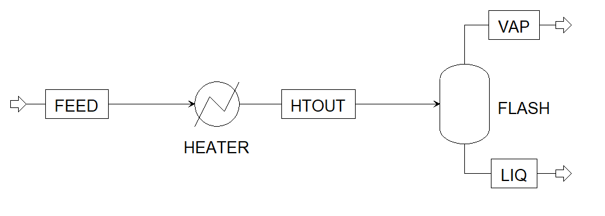

.. _tutorial.idaes.test:

Tutorial: Running IDAES model in FOQUS
===================================================

The NETL’s Institute for the Design of Advanced Energy Systems is developing an equation-oriented framework for simulation and optimization of energy systems.
A library of unit models is available to create and solve process flowsheets, therefore, a tutorial has been developed in FOQUS to import IDAES unit models, build a flowsheet, and simulate it.

The case study consists of the separation of Toluene-Benzene mixture (Figure 1).
First the mixture is heated to 370K, and then separated in the Flash Tank.
Consider the following process flowsheet that has been developed in FOQUS, using IDAES :

   Figure 1: Heater Flash Flowsheet

**Feed Conditions:**

Flowrate = 0.277778 mol/s

Temperature = 353 K

Pressure = 101325 K

Benzene Mole Fraction = 0.4

Toluene Mole Fraction = 0.6

**Heater Specification:**

Outlet Temperature (HTOUT stream) = 370 K

**Flash Specification:**

Heat Duty = 0 W

Pressure Drop = 0 Pa

The following steps show how to import Python, Pyomo, and IDAES libraries and models, build the flowsheet, select input variables, and solve the simulation in FOQUS:

Instructions
~~~~~~~~~~~~

1. Open FOQUS, and under the Flowsheet Tab, create a Node named "Flowsheet".

2. Open the Node Editor and let the Model Type be “None”.

3. Add the following input variables with their corresponding values in the Node Editor:
   ``heater_inlet_molflow``: 0.277778 mol/s

   ``heater_inlet_pressure``: 101325 Pa

   ``heater_inlet_temperature``: 353 K

   ``heater_inlet_benzene_molfrac``: 0.4

   ``heater_inlet_toluene_molfrac``: 0.6

   ``heater_outlet_temperature``: 370 K

   ``flash_heat_duty``: 0 W

   ``flash_pressure_drop``: 0 Pa

4. Add the following output variables in the Node Editor:
   ``heater_heat_duty`` W

   ``flash_liq_molflow`` mol/s

   ``flash_liq_pressure`` Pa

   ``flash_liq_temperature`` K

   ``flash_liq_benzene_molfrac``

   ``flash_liq_toluene_molfrac``

   ``flash_vap_molflow`` mol/s

   ``flash_vap_pressure`` Pa

   ``flash_vap_temperature`` K

   ``flash_vap_benzene_molfrac``

   ``flash_vap_toluene_molfrac``

5. As stated in previous tutorials, the FOQUS simulation node allows the user to type a python script under the Node Script option.
   In this node script section, this tutorial shows how to import python libraries, Pyomo libraries, IDAES libraries and models, build and solve the flowsheet.
   Note that in this example, process conditions are fixed in order to have 0 degrees of freedom. Hence, the optimization actually gets solved as a simulation problem.
   A critical step is to link the FOQUS variables (input and output) to the IDAES mathematical model, thus, setting the inlet conditions of the process before solving the simulation problem.
   Finally, under Node Script, set Script Mode to “Post”. This will ensure that the node script runs after the node simulation. Enter the following code:

   .. code-block:: python
      :linenos:

      # Import objects from pyomo package
      from pyomo.environ import ConcreteModel, SolverFactory,TransformationFactory, value

      import pyutilib.subprocess.GlobalData
      pyutilib.subprocess.GlobalData.DEFINE_SIGNAL_HANDLERS_DEFAULT = False

      # Import the main FlowsheetBlock from IDAES. The flowsheet block will contain the unit model

      import idaes
      from idaes.core.flowsheet_model import FlowsheetBlock

      # Import the BTX_ideal property package to create a properties block for the flowsheet
      from idaes.generic_models.properties.activity_coeff_models import BTX_activity_coeff_VLE

      # Import heater unit model from the model library
      from idaes.generic_models.unit_models.heater import Heater

      # Import flash unit model from the model library
      from idaes.generic_models.unit_models.flash import Flash

      # Import methods for unit model connection and flowsheet initialization
      from pyomo.network import Arc, SequentialDecomposition

      # Import idaes logger to set output levels
      import idaes.logger as idaeslog

      # Create the ConcreteModel and the FlowsheetBlock, and attach the flowsheet block to it.
      m = ConcreteModel()

      m.fs = FlowsheetBlock(default={"dynamic": False}) # dynamic or ss flowsheet needs to be specified here

      # Add properties parameter block to the flowsheet with specifications
      m.fs.properties = BTX_activity_coeff_VLE.BTXParameterBlock(default={"valid_phase":
                                                           ('Liq', 'Vap'),
                                                           "activity_coeff_model":
                                                           "Ideal"})

      # Create an instance of the heater unit, attaching it to the flowsheet
      # Specify that the property package to be used with the heater is the one we created earlier.
      m.fs.heater = Heater(default={"property_package": m.fs.properties})

      m.fs.flash = Flash(default={"property_package": m.fs.properties})

      # Connect heater and flash models using an arc
      m.fs.heater_flash_arc = Arc(source=m.fs.heater.outlet, destination=m.fs.flash.inlet)

      TransformationFactory("network.expand_arcs").apply_to(m)

      #Feed Specifications to heater
      m.fs.heater.inlet.flow_mol.fix(x["heater_inlet_molflow"]) # mol/s
      m.fs.heater.inlet.mole_frac_comp[0, "benzene"].fix(x["heater_inlet_benzene_molfrac"])
      m.fs.heater.inlet.mole_frac_comp[0, "toluene"].fix(x["heater_inlet_toluene_molfrac"])
      m.fs.heater.inlet.pressure.fix(x["heater_inlet_pressure"]) # Pa
      m.fs.heater.inlet.temperature.fix(x["heater_inlet_temperature"]) # K

      # Unit model specifications
      m.fs.heater.outlet.temperature.fix(x["heater_outlet_temperature"]) # K
      m.fs.flash.heat_duty.fix(x["flash_heat_duty"]) # W
      m.fs.flash.deltaP.fix(x["flash_pressure_drop"]) # Pa

      #Flowsheet Initialization
      def function(unit):
              unit.initialize(outlvl=1)

      opt = SolverFactory('ipopt')
      seq = SequentialDecomposition()
      seq.options.select_tear_method = "heuristic"
      seq.run(m, function)

      # Solve the flowsheet using ipopt
      opt = SolverFactory('ipopt')
      solve_status = opt.solve(m)

      #Assign the simulation result from IDAES model to FOQUS output values
      f["flash_liq_molflow"] = value(m.fs.flash.liq_outlet.flow_mol[0])
      f["flash_liq_benzene_molfrac"] = value(m.fs.flash.liq_outlet.mole_frac_comp[0,"benzene"])
      f["flash_liq_toluene_molfrac"] = value(m.fs.flash.liq_outlet.mole_frac_comp[0,"toluene"])
      f["flash_liq_temperature"] = value(m.fs.flash.liq_outlet.temperature[0])
      f["flash_liq_pressure"] = value(m.fs.flash.liq_outlet.pressure[0])
      f["flash_vap_molflow"] = value(m.fs.flash.vap_outlet.flow_mol[0])
      f["flash_vap_benzene_molfrac"] = value(m.fs.flash.vap_outlet.mole_frac_comp[0,"benzene"])
      f["flash_vap_toluene_molfrac"] = value(m.fs.flash.vap_outlet.mole_frac_comp[0,"toluene"])
      f["flash_vap_temperature"] = value(m.fs.flash.vap_outlet.temperature[0])
      f["flash_vap_pressure"] = value(m.fs.flash.vap_outlet.pressure[0])
      f["heater_heat_duty"] = value(m.fs.heater.heat_duty[0])

   .. note::
      ipopt will need to be available in your environment.
      This should be available through the following command during the generic install of IDAES in the environment:
      ``idaes get-extensions``

   Once the model is solved, the values of flowsheet output variables are assigned to the node output variables.

6. Click the Run button to run the python script and check the node output variables section, note that their values should have changed.

It should be noted that the values within Node Input Variables can be changed as per user’s requirement, to run different cases.

.. note::
   For more information on installing IDAES, along with building and solving IDAES models, refer to the IDAES documentation:
   https://idaes-pse.readthedocs.io/en/stable/index.html

   This tutorial demonstrates the capability of simulating IDAES based process models in FOQUS. However, optimization problems can also be solved using IDAES in FOQUS,
   by providing the required degrees of freedom.

   It is recommended that FOQUS and IDAES must be installed in the same conda environment for this example to run successfully.

   The complete FOQUS file (**FOQUS_IDAES_Example.foqus**), that includes the IDAES model,
   is located in: **examples/tutorial_files/IDAES**.
   |examples_reminder_text|
