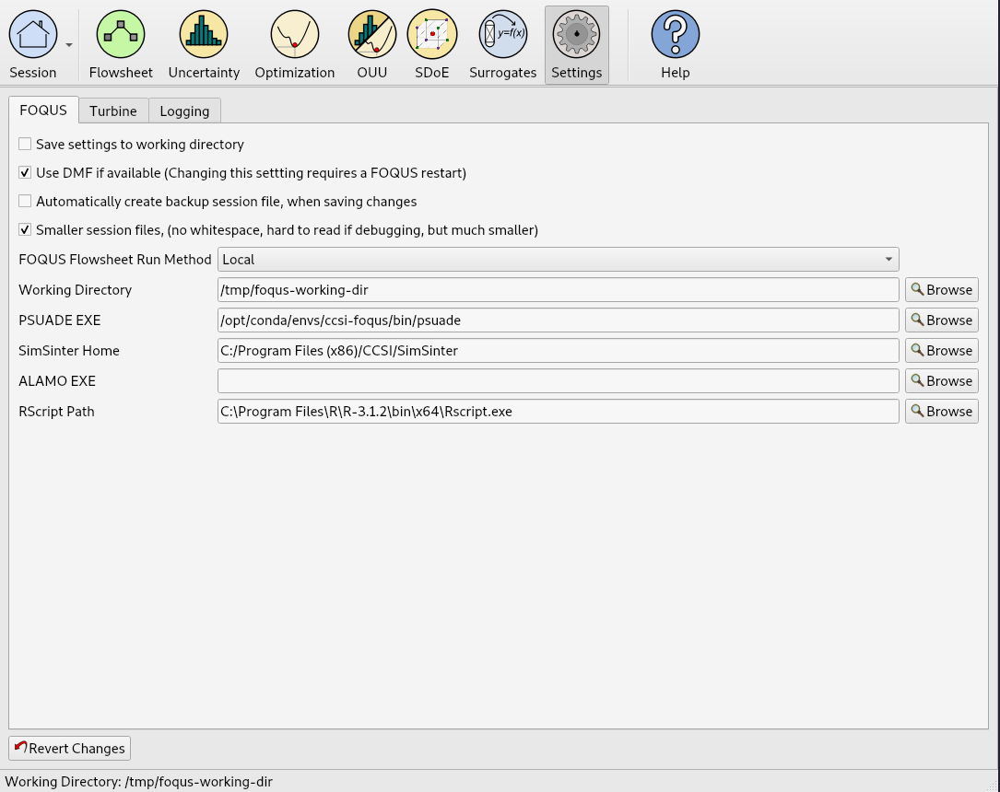

.. _install_optional:

Install Optional Software
-------------------------

There are several optional pieces of software which are not written in Python and not easily
installed automatically. There are a couple packages which most users would want to install.  The
first is PSUADE, which provides FOQUS UQ functionality. The second is TurbineLite which requires
Windows and is used to interface with Excel, Aspen, and gPROMS software.

Other software listed below will enable additional features of FOQUS if available.

Install PSUADE-Lite (current version: 1.9.0)
^^^^^^^^^^^^^^^^^^^^^^^^^^^^^^^^^^^^^^^^^^^^

PSUADE (Problem Solving environment for Uncertainty Analysis and Design Exploration) is a software
toolkit containing a rich set of tools for performing uncertainty analysis, global sensitivity
analysis, design optimization, model calibration, and more.

`PSUADE-Lite <https://github.com/LLNL/psuade-lite>`_ is now available as a Conda package. To install just follow the steps below::

  conda activate ccsi-foqus
  conda install --yes -c conda-forge -c CCSI-Toolset psuade-lite=1.9
  psuade --help  # quickly test that the psuade executable has been installed correctly

The ``psuade`` executable should now be available within the Conda environment's folders, i.e. at the path ``$CONDA_PREFIX/bin/psuade`` (Linux, macOS) or ``%CONDA_PREFIX%\bin\psuade.exe`` (Windows).
Once you set the full path in the corresponding field in the FOQUS GUI "Settings" tab, you should be able to use it normally within FOQUS.

Install Turbine and SimSinter (Windows Only)
^^^^^^^^^^^^^^^^^^^^^^^^^^^^^^^^^^^^^^^^^^^^
.. note::
  You will need to install Turbine and SimSinter in order to run FOQUS locally with Aspen and Excel. The Turbine installation will install the Turbine Web API Windows Service and applications that manage Aspen and Excel processes. The SimSinter installation will install the SinterConfigGUI application and libraries for interacting with Aspen and Excel through COM Server interfaces. The programs "SimSinter" and "TurbineLite" should appear on the local installed programs list.

* Install `Microsoft SQL Server Compact 4.0 <https://www.microsoft.com/en-us/download/details.aspx?id=17876>`_.

* Download and install the latest releases of `SimSinter
  <https://github.com/CCSI-Toolset/SimSinter/releases/>`_ and `TurbineLite
  <https://github.com/CCSI-Toolset/turb_sci_gate/releases/>`_.

* Install SimSinter first, then TurbineLite.

* After the install the Turbine Web API Service Will start automatically when Windows starts, but it
  will not start directly after the install. Do one of these two things (only after install):

  * Restart computer, or
  * Start the "Turbine Web API service":

    1. open Task Manager
    2. go to the "Services" tab
    3. click the "Services" button (in the lower right corner)
    4. right-click "Turbine Web API Service" from the list, and
    5. click "Start"

Install ALAMO
^^^^^^^^^^^^^

ALAMO (Automated Learning of Algebraic Models for Optimization) is a software toolkit that generates
algebraic models of simulations, experiments, or other black-box systems. For more information, go
to the `ALAMO Home Page <https://sahinidis.coe.gatech.edu/alamo>`_.

Download ALAMO and request a license from the `ALAMO download page
<https://minlp.com/alamo-downloads>`_.

Install NLopt
^^^^^^^^^^^^^

NLopt is an optional optimization library, which can be used by FOQUS. NLopt is included in the conda psuade-lite 1.9.0 package.

For more information, see the `NLopt Installation Instructions <https://nlopt.readthedocs.io/en/latest/>`_.

Install SnobFit
^^^^^^^^^^^^^^^

SnobFit is an optional optimization library, which can be used by FOQUS for unconstrained
optimization. The python package can be installed with pip with::

    conda activate ccsi-foqus
    pip install SQSnobFit

The plugin has been developed for FOQUS versions 2.1 and greater. For further details on the
available versions and installation, see the `SQSnobFit PyPI package page
<https://pypi.org/project/SQSnobFit/>`_.

Once the python package is downloaded, navigate the path to "SQSnobFit" folder (likely
``$CONDA_PREFIX/lib/python3.7/site-packages/SQSnobFit/``) and modify the ``_snobfit.py`` file making
the following changes:

Comment out or remove the following code lines just below ``def minimize(...)`` function definition::

    if budget <= 0:
      budget = 100000

Then replace::

    return Result(fbest, xbest), objfunc.get_history()

with::

    return (request,xbest,fbest)

in the ``def minimize()`` function.

Install R
^^^^^^^^^

R is a software toolbox for statistical computing and graphics. R version 3.1+ is required for the
ACOSSO and BSS-ANOVA surrogate models and the Basic Data's SolventFit model.

* Follow instructions from the `R website <http://cran.r-project.org/>`_ to download and install R.

* Open R and type the following to install and load the prerequisite packages::

    install.packages('quadprog')
    library(quadprog)
    install.packages('abind')
    library(abind)
    install.packages('MCMCpack')
    library(MCMCpack)
    install.packages('MASS')
    library(MASS)
    q()

* The last command exits R. When asked to save workspace image, type "y".

* Open FOQUS, go to the “Settings” tab, and set the “RScript Path” to the proper location of the R
  executable.

The FOQUS "Settings" Tab
------------------------

Use the FOQUS "Settings" tab to set the optional software configuration described in this section:

   Figure 1: The FOQUS "Settings" tab
