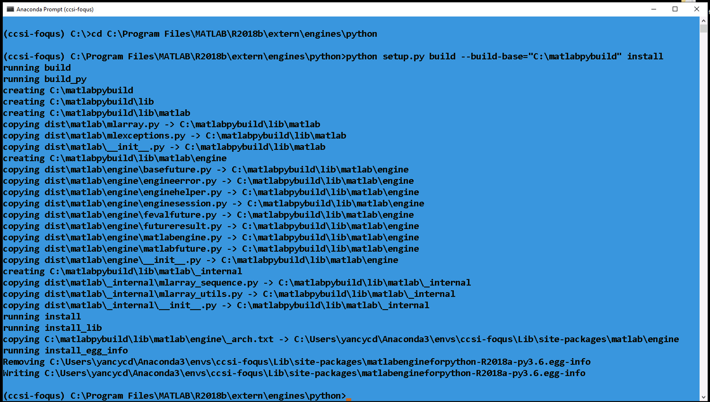

MATLAB-FOQUS interface
======================

Introduction
------------

MATLAB® is a proprietary interpreted programming language developed by MathWorks, and is highly used in many science and engineering areas for numeric computing. 
Some important advantages of MATLAB include its ease of use and the large number of the available high-level functions for many applications. In this way, the 
motivation to develop an interface between MATLAB and FOQUS is intended to facilitate to FOQUS users the use of MATLAB models and its integration with other 
FOQUS supported modeling environments such as Aspen Plus and gPROMS, enabling the possibility to build highly complex cross-platform models which can then directly 
leverage FOQUS capabilities for advanced analysis.

Two different but equivalent approaches were implemented for interfacing MATLAB and FOQUS, which can be used depending on the user needs. These two approaches are 
described below:

   .. warning:: The setup steps for the two approaches shown below were tested using MATLAB R2019b and Python 3.6, however they must work for other MATLAB and 
                Python versions.

Option 1: MATLAB - FOQUS direct
-------------------------------

This approach is best suited for MATLAB simulations that are not computationally intensive, although it can be used in those situations as well. This approach is fully 
integrated with FOQUS, and it is implemented in a simple way to enable running MATLAB simulations within FOQUS. 

To be able to call MATLAB models from FOQUS through the FOQUS plugin implementation, it is required to setup properly the MATLAB engine API for Python, which is 
available for MATLAB-version R2014b or greater. MATLAB supports Python versions 2.7, 3.3, 3.4, 3.5, 3.6, 3.7, and 3.8. Further details regarding specific MATLAB 
and Python versions compatibilities are given `here <https://www.mathworks.com/content/dam/mathworks/mathworks-dot-com/support/sysreq/files/python-compatibility.pdf>`_.

To install the MATLAB engine package follows the steps below, which require compatible versions of Python and MATLAB already installed, and also a valid MATLAB license. 
The steps below assume that the Python distribution installed is Anaconda, but they also work for any other Python distribution.

1. Find out the MATLAB installation directory. To do this, just launch a new MATLAB session and type the instruction below::

      matlabroot

2.	Open an Anaconda command prompt. (Optional: activate the conda python environment if you are using a specific python environment for the installation).

3. Based on your operating system, move to the MATLAB installation folder, and then to the location that contains the python engine setup file. To do this, just type the 
   instruction below::

      cd %matlabroot%\extern\engines\python

   .. note:: ``%matlabroot%`` is the MATLAB installation folder from step 1.

   Now, if you list all files in this directory, you must see a ``setup.py`` file there.

4. Install the MATLAB engine package by typing the code below::

      python setup.py build --build-base="C:\matlabpybuild" install

   .. note:: ``C:\matlabpybuild`` is a folder to build the Python package. Users can use any folder that they have access to.

If the MATLAB engine package was installed correctly, a similar message to the Figure 1 must be seen on the terminal window.

   Figure 1 - Terminal window message after installating the MATLAB engine package

Now, to run MATLAB models within FOQUS follow the steps below:

1. Create a node simulation in the FOQUS flowsheet editor and define all input and output variables of the model.
2. Create a MATLAB function calling the model.
3. Call FOQUS plugin named "matlab_fs" to start a new MATLAB session. This can be done in the Model section at node editor. 
   In "Type" option choose "plugin", and in "Model" option choose "matlab_fs".
4. Connect to the current MATLAB session from the node script.
5. Create a MATLAB array object in the FOQUS node script containing the input parameters for the MATLAB model.
6. Call the MATLAB function/model.
7. Retrieve the outputs from the MATLAB function to FOQUS output variables.
8. Terminate MATLAB session.

Further details on how to use this option to interface MATLAB-FOQUS are given in the example presented in the 
:ref:`tutorial 1<chapt_matlab/tutorial/matlab_foqus_tutorial:MATLAB-FOQUS interface - tutorials>`.

Option 2: MATLAB script implementation
--------------------------------------

This approach is best suited for MATLAB simulations that are computationally intensive, and FOQUS is used for data analysis and surrogate modeling.

In this option, the MATLAB-FOQUS interface runs MATLAB models directly in the MATLAB environment, but making the results/outputs fully compatible 
with FOQUS modules. This is automatically achieved through a MATLAB script ``foqus_matlab_script.m`` provided with the FOQUS distribution, which can 
be executed directly in MATLAB. To use the script, it is necessary to define the inputs for MATLAB models in the same order as were defined in 
the FOQUS flowsheet.

The MATLAB script takes three inputs: 1) the MATLAB function containing the model, 2) the name of the PSUADE file containing the samples space for 
the model, which needs to be created previously in the uncertainty module in FOQUS, 3) the path where the MATLAB function and PSUADE file are located.

The MATLAB script uses some functions available in FOQUS base code to handle :ref:`PSUADE full file format<file-formats>` and sample data objects, 
and these functions are written in Python. For this reason, before using the script, it is necessary to configure MATLAB to execute Python modules. The steps for this 
configuration are given below:

1. Find out where Python executable is located. To do this, open an Anaconda command prompt or a Terminal and type the code below::

      python -c "import sys; print(sys.executable)"

2. Open a new MATLAB session and type the code below::

      pyenv('Version', '%pythonroot%python.exe')

   .. note:: ``%pythonroot%`` is the Python executable folder found in step 1. You can also verify if the Python config was stored in MATLAB by typing again ``pyenv``, 
             and then you must see the previous message again.

   .. warning:: ``pyenv`` was first introduced in MATLAB R2019b. In older MATLAB versions, you need to use ``pyversion``, as shown below:

   .. code-block:: python

      pyversion('%pythonroot%python.exe')

3. Now, type the code line below::

      py.numpy.arange(1)

   .. note:: If you do not get errors, then the Python configuration is ready and skip the following steps. If you got this, or any similar error: 
             ``Unable to resolve the name py.numpy.arange``, then you need to verify that the folder containing the Python binary files is included 
             in the system environment variables, for this, go to step 4.

4. In MATLAB, type the code below to see all folders that are added to the system path::

      getenv('PATH')

   .. note:: Check if ``%pythonroot%\Library\bin`` is already in the path, if not, follows step 5.

5. In MATLAB, type the code below::

      setenv('PATH', ['%pythonroot%\Library\bin', pathsep, getenv('PATH')])

   .. note:: Replace ``%pythonroot%`` with the Python executable folder found in step 1. You can also add manually the folder containing the Python 
             binary files to the system environment variables, but this will depend on the specific operating system.

6. Type again the code below::

      py.numpy.arange(1)

   .. note:: This time everything should work fine without errors.

After completing the configuration part to execute Python modules within MATLAB, the general steps to interfacing MATLAB and FOQUS are as follows:

1. Create a node simulation in the FOQUS flowsheet editor and define all input and output variables of the model.
2. Create a new ensemble for the sample space using the uncertainty quantification module in FOQUS.
3. Export the UQ Ensemble to :ref:`PSUADE full file format<file-formats>`.
4. Create a MATLAB function calling the model (it is necessary to define the inputs for the MATLAB function in the same order as were defined in 
   the FOQUS flowsheet in step 1).
5. Execute the MATLAB script ``foqus_matlab_script.m`` provided with FOQUS calling the MATLAB model function and the PSUADE file. 
6. A new csv file ``outputs.csv`` fully compatible with FOQUS and containing the results from MATLAB simulations for the entire sample space is created. 
7. Now, the ``outputs.csv`` file can be imported in FOQUS to use the different FOQUS capabilities for subsequent analysis.

Further details on how to use this option to interface MATLAB-FOQUS are given in the example presented in the 
:ref:`tutorial 2<chapt_matlab/tutorial/matlab_foqus_tutorial:MATLAB-FOQUS interface - tutorials>`.