MATLAB-FOQUS interface - tutorials
==================================

Problem Statement: Steady-State Continuous Stirred Tank Reactor (CSTR)
----------------------------------------------------------------------

This example solves a non-linear system of equations which describes a mathematical model for a Continuous Stirred Tank Reactor (CSTR) at steady state. The 
CSTR is cooled with a cooling coil, and a simple exothermic reaction takes place inside the reactor (see Figure 1). Model main assumptions: 1) the reactant 
is perfectly mixed, and 2) the volume, heat capacities and densities are constants. Further details regarding the model are given in Vojtesek and Dostal, 2011.

**Source:** Jiri Vojtesek and Petr Dostal. Use of MATLAB Environment for Simulation and Control of CSTR. International Journal of Mathematics and Computers in 
Simulation, 6(5), 2011.

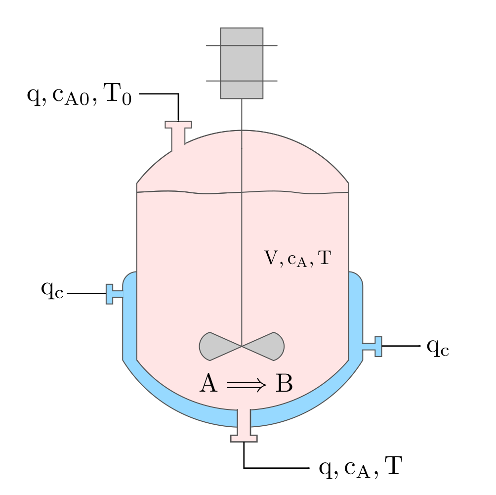

   Figure 1 - Representation of a CSTR with exothermic reaction

The CSTR model in steady-state is represented by the following non-linear system of equations, which was obtained from mass and energy balances of the reactant 
and cooling.

.. math::
   \mathrm{a_{1}\cdot\left(T_{0}-T\right)+a_{2}\cdot k_{1}\cdot c_{A}+a_{3}\cdot q_{c}\cdot\left(1-e^{\frac{a_{4}}{q_{c}}}\right)\cdot\left(T_{c0}-T\right)=0}

.. math::
   \mathrm{a_{1}\cdot\left(c_{A0}-c_{A}\right)-k_{1}\cdot c_{A}=0}

.. math::
   \mathrm{k_{1}=k_{0}\cdot e^{\frac{-E}{R\cdot T}}}

.. math::
   \mathrm{q_{0}=q}

.. math::
   \mathrm{q_{c0}=q_{c}}

where :math:`\mathrm{a_{1-4}}` are constants calculated as follows:  
   
.. math::
   \mathrm{a_{1}=\frac{q}{V};\quad a_{2}=\frac{-\Delta H}{\rho\cdot c_{p}};\quad a_{3}=\frac{\rho_{c}\cdot c_{pc}}{\rho\cdot c_{p}\cdot V};\quad a_{4}=\frac{-h_{a}}{\rho_{c}\cdot c_{pc}}}

The fixed parameters of the system are given below.

================================ ======================================================= =======
Parameter                        Symbol [Unit]                                           Value  
================================ ======================================================= =======
Reactor’s volume                 :math:`\mathrm{V\:[l]}`                                 100
Reaction rate constant           :math:`\mathrm{k_{0}\:[min^{-1}]}`                      7.2e10
Activation energy divided by R   :math:`\mathrm{E/R\:[K]}`                               1e4
Reactant’s feed temperature      :math:`\mathrm{T_{0}\:[K]}`                             350
Inlet coolant temperature        :math:`\mathrm{T_{c0}\:[K]}`                            350
Reaction heat                    :math:`\mathrm{\Delta H\:[cal\cdot mol^{-1}]}`          -2e5
Specific heat of the reactant    :math:`\mathrm{c_{p}\:[cal\cdot g^{-1}\cdot K^{-1}]}`   1
Specific heat of the cooling     :math:`\mathrm{c_{pc}\:[cal\cdot g^{-1}\cdot K^{-1}]}`  1
Density of the reactant          :math:`\mathrm{\rho\:[g\cdot l^{-1}]}`                  1e3
Density of the cooling           :math:`\mathrm{\rho_{c}\:[g\cdot l^{-1}]}`              1e3
Feed concentration               :math:`\mathrm{c_{A0}\:[mol\cdot l^{-1}]}`              1
Heat transfer coefficient        :math:`\mathrm{h_{a}\:[cal\cdot min^{-1}\cdot K^{-1}]}` 7e5
Volumetric flow rate of reactant :math:`\mathrm{q_{0}\:[l\cdot min^{-1}]}`               100
Volumetric flow rate of cooling  :math:`\mathrm{q_{c0}\:[l\cdot min^{-1}]}`              80
================================ ======================================================= =======

The variables in the system of equations are described below:

================================ ==========================================
Variable                         Symbol [Unit]
================================ ==========================================
Final reactant concentration     :math:`\mathrm{c_{A}\:[mol\cdot l^{-1}]}`
Volumetric flow rate of products :math:`\mathrm{q\:[l\cdot min^{-1}]}`
Volumetric flow rate of cooling  :math:`\mathrm{q_{c}\:[l\cdot min^{-1}]}`
Product temperature              :math:`\mathrm{T\:[K]}`
Reaction rate                    :math:`\mathrm{k_{1}\:[min^{-1}]}`
Conversion                       :math:`\mathrm{X_{A}\:[-]}`
================================ ==========================================

The conversion of reactant A is defined as:

.. math::
   \mathrm{X_{A}=\frac{c_{A0}-c_{A}}{c_{A0}}}

Tutorial 1: MATLAB - FOQUS direct
---------------------------------

**Step 1:** Flowsheet Setup - create a node simulation in the FOQUS flowsheet editor, and name it "CSTR_Steady_State".

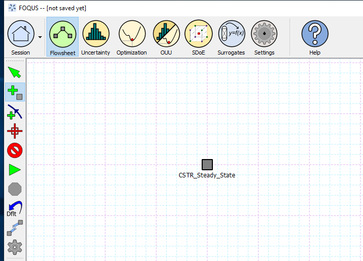

   Figure 2 - Flowsheet Setup

**Step 2:** Define all input and output variables of the model as described in Figures 3 and 4.

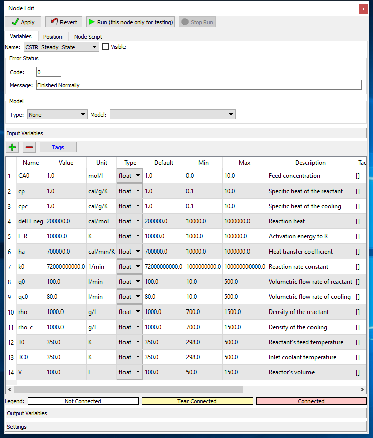

   Figure 3 - Input Variables

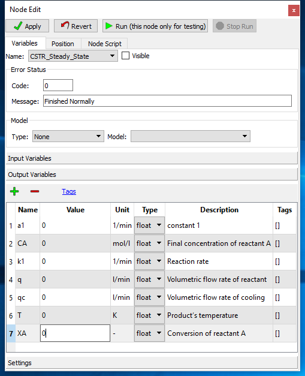

   Figure 4 - Output Variables

**Step 3:** Create a MATLAB function solving the non-linear system of equations presented above. The MATLAB 
function file (along with the FOQUS file for this example) can be found in the folder: ``examples/tutorial_files/MATLAB-FOQUS/Tutorial_1``

.. note:: |examples_reminder_text|

**Step 4:** Load FOQUS plugin named "matlab_fs" in the simulation node as shown Figure 5. In the node editor, under "Type" option, 
choose "plugin", and under "Model" option choose "matlab_fs".

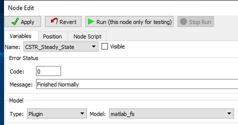

   Figure 5 - FOQUS plugin for MATLAB-FOQUS interface

**Step 5:** In the Node Script tab write the code as shown in Figure 6.

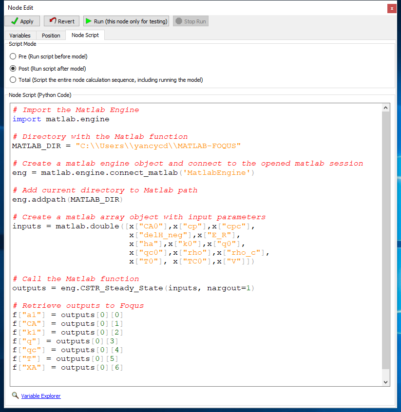

   Figure 6 - Node Script Code

.. note:: The code shown in Figure 6 is intended to: 1) connect to the current MATLAB session, 2) create a MATLAB array object containing the input
          parameters for the MATLAB model, 3) Call the MATLAB function/model, and 4) Retrieve the outputs from the MATLAB function to FOQUS 
          output variables.

- The code is below:
      
   .. code-block:: python
      :linenos:
	  
      # Import the Matlab Engine
      import matlab.engine
      
      # Directory with the Matlab function
      MATLAB_DIR = "C:\\Users\\yancycd\\MATLAB-FOQUS"

      # Create a matlab engine object and connect to the opened matlab session
      eng = matlab.engine.connect_matlab('MatlabEngine')

      # Add current directory to Matlab path
      eng.addpath(MATLAB_DIR)

      # Create a matlab array object with input parameters
      inputs = matlab.double([x["CA0"],x["cp"],x["cpc"],
               x["delH_neg"],x["E_R"],
               x["ha"],x["k0"],x["q0"],
               x["qc0"],x["rho"],x["rho_c"],
               x["T0"], x["TC0"],x["V"]])

      # Call the Matlab function
      outputs = eng.CSTR_Steady_State(inputs, nargout=1)

      # Retrieve outputs to Foqus
      f["a1"] = outputs[0][0]
      f["CA"] = outputs[0][1]
      f["k1"] = outputs[0][2]
      f["q"] = outputs[0][3]
      f["qc"] = outputs[0][4]
      f["T"] = outputs[0][5]
      f["XA"] = outputs[0][6]

**Step 6:** Run the node simulation to test if the simulation is working properly.

**Step 7:** Under the uncertainty tab in FOQUS, select ``Add New`` option to generate a new simulation ensemble. Select 
``Use Flowsheet`` option. Fix all variables except the volume, which will be a variable with bounds 50-150 l. Select 
``Latin Hypercube`` sampling method with 100 samples, and then generate the samples. Figure 7 represents the simulation 
ensemble generation.

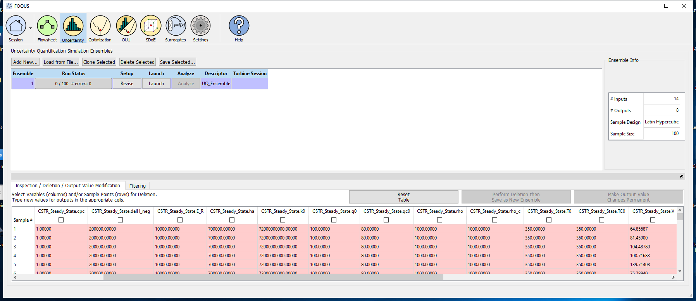

   Figure 7 - Ensemble Generation

**Step 8:** Launch the simulations. Figure 8 represents the simulation results.

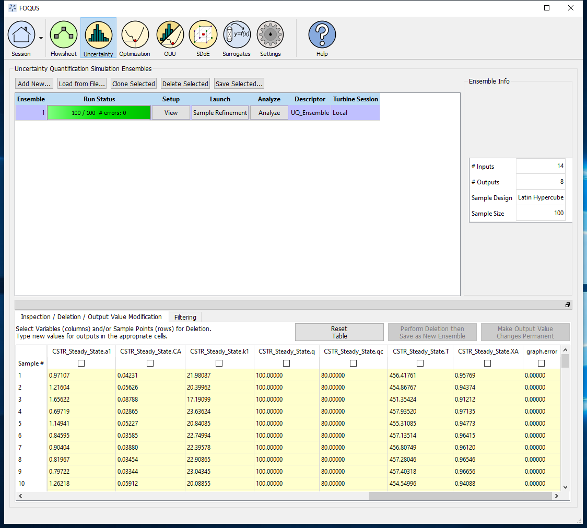

   Figure 8 - Ensemble Results

Now, plotting the conversion vs the reactor's volume, a similar figure to Figure 9 must be obtained.

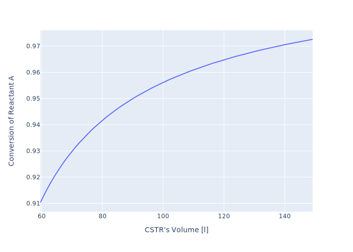

   Figure 9 - Conversion of Reactant A vs Reactor's Volume

Tutorial 2: MATLAB script implementation
----------------------------------------

**Step 1:** Follow steps 1-3 from the ``Tutorial 1: MATLAB - FOQUS direct`` section. Users need to take care when defining the MATLAB function 
for the model in step 3 as it is necessary to define the MATLAB function inputs in the same order as were defined in the FOQUS flowsheet.

**Step 2:** Follow step 6 from the ``Tutorial 1: MATLAB - FOQUS direct`` section to generate a new simulation ensemble.

**Step 3:** Select the new generated UQ_Ensemble and click on ``Save Selected`` to save the ensemble as a PSUADE file. Choose a folder to save the file 
and name it as ``data.dat``.

**Step 4:** Create a new MATLAB script to call the ``matlab_foqus_script.m`` file (which is distributed with FOQUS and can be found in ``examples/tutorial_files/MATLAB-FOQUS/Tutorial_2``), 
and pass to it the MATLAB function containing the model. Below is an example of the code that needs to be executed. In ``examples/tutorial_files/MATLAB-FOQUS/Tutorial_2`` 
you can find a MATLAB file name ``example_2_matlab_foqus.m`` with the code, and you can simply execute it:

   .. code-block:: matlab
      :linenos:
      
      % This is the path where the MATLAB model, the "matlab_foqus_script.m" file and the PSUADE file "data.dat" are located
      path = "C:\Users\yancycd\MATLAB-FOQUS\";
      % This is the PSUADE file name
      PsuadFileName = 'data.dat';
      % This is the MATLAB function name that contains the model
      MatlabFunctionName = @(x) CSTR_Steady_State(x);
      % Call the "matlab_foqus_script.m" file
      matlab_foqus_script(MatlabFunctionName, PsuadFileName, path)

.. note:: After executing the code above, a new ``outputs.csv`` is created with the sample results from MATLAB. This is a file fully compatible with FOQUS.

**Step 5:** Under the uncertainty module, click on ``Load from File``. Then choose ``.csv`` format file option and select the ``outputs.csv`` file created in 
the previous step. A new window will ask you the number of inputs that contain the ``outputs.csv`` file (see Figure 10), for this example is 14. 

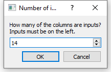

   Figure 10 - Number of Inputs in the Outputs File
   
**Step 6:** Now, you have a new ensemble named “output.csv” with all input and outputs variables (see Figure 11), which can be used for other advanced analysis 
in the uncertainty module or any other FOQUS module.

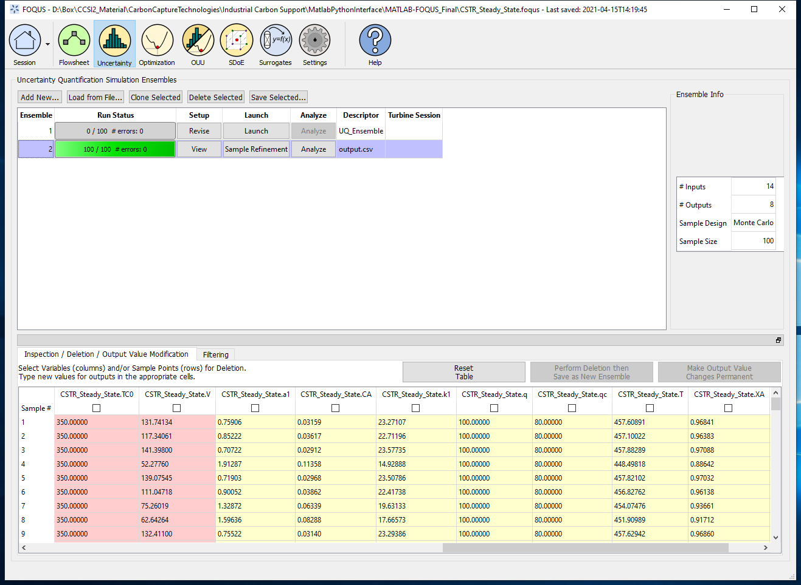

   Figure 11 - New Ensemble with MATLAB Results
   
If you plot the conversion vs the reactor's volume, you should get the Figure 9.

