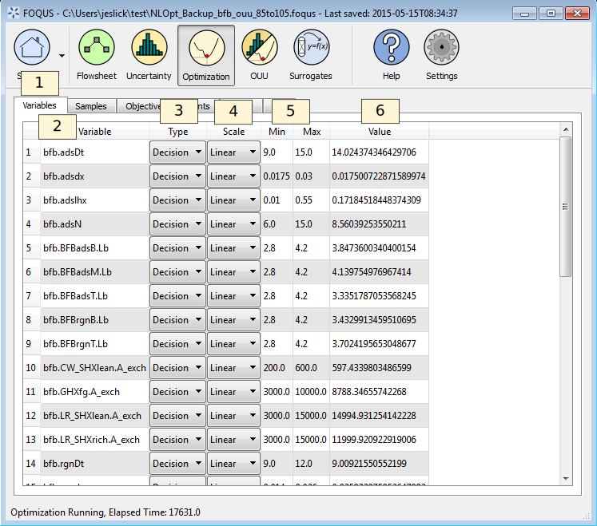
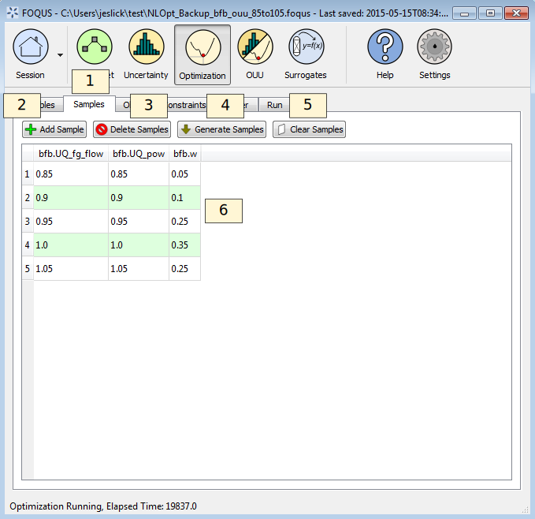
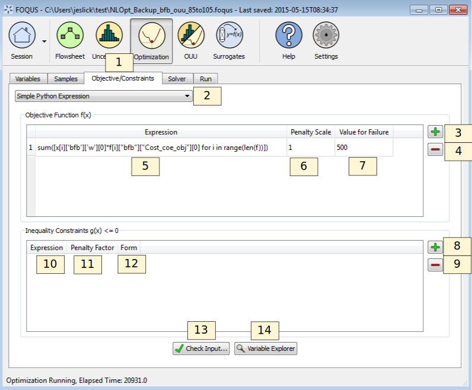
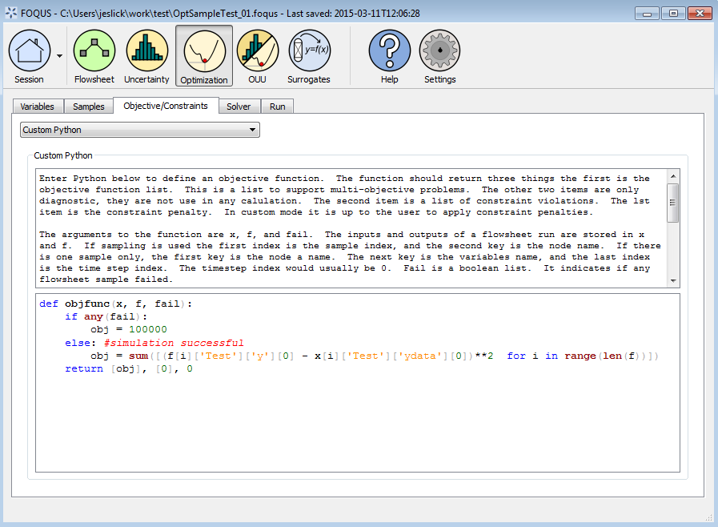
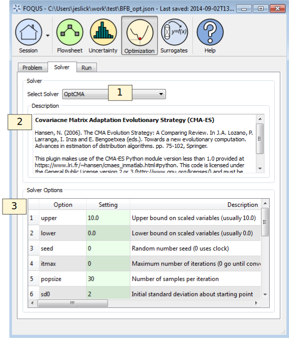
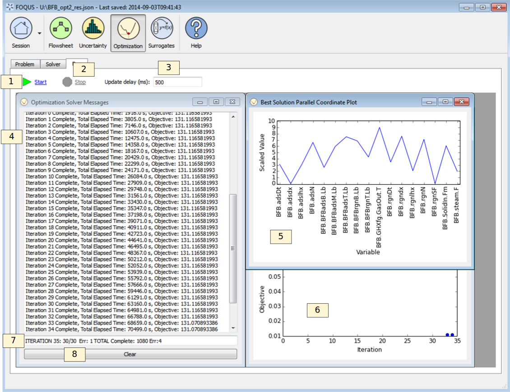

Reference
=========

The simulation based optimization tool provides a plug-in system where
different derivative free optimization (DFO) solvers can be used with
FOQUS. Several solvers are provided with FOQUS. The CMA-ES solver
:ref:`(Hansen 2006)<Hansen_2006>` is a good global derivative free
optimization (DFO) solver. The NLopt library provides access to several
DFO solvers :ref:`(Johnson 2015)<Johnson_2015>`. SLSQP and BFGS from the
Scipy module are also provided :ref:`(Jones et al. 2015)<Jones_2015>`. Since
FOQUS does not generally have access to derivative information the Scipy
solvers rely on finite difference approximations, and should only be
used with well-behaved functions. Due to convergence tolerances in
process simulators, finite difference approximations may not be good for
many of FOQUS’s intended applications.

CMA-ES offers a restart feature, which can be used to resume an
optimization if it is interrupted for any reason. Other solvers may use
an auto-save feature, which does not provide the ability to restart, but
will allow optimization to start from the best solution found up to the
point the optimization was interrupted. Samples making up the population
in CMA-ES can be run in parallel. The NLopt and Scipy plugins do not
offer parallel computing for standard optimization. For any solver,
parallel computation can be used for parameter estimation and
optimization under uncertainty, where multiple flowsheet evaluations go
into an objective function calculation.

Problem Set Up
--------------

See Chapter :ref:`flowsheet_main` for information about setting up a flowsheet
in FOQUS. Once the flowsheet has been set up and tested, an optimization problem
can be added. FOQUS allows multiple flowsheet evaluations to be used to
calculate a single objective function value. This allows FOQUS to do parameter
estimation and scenario based optimization under uncertainty. There are three
types of variables used in the optimization problem: (1) fixed variables do not
change during the optimization, (2) decision variables are modified by the
optimization algorithm to find the best value of the objective function, and (3)
sample variables, which are used to construct the multiple flowsheet evaluations
that can go into an objective calculation. If no sample variables are defined,
each objective function value will be based on a single flowsheet
evaluation. Figure :ref:`fig.opt.problem.variables` shows the **Variables** tab
selection form.

   Optimization Variable Selection

#. The **Variables** tab contains the form for variables selection.

#. The **Variable** column shows the name of input variables in the
   flowsheet. If a variable is set by a connection to another variable
   through an edge, it is not shown in the table. The format for a
   variable name is {Node Name}.{Variable Name}.

#. The **Type** column allows the variables to be assigned as one of
   three types (1) fixed, (2) decision, or (3) sample.

#. The **Scale** column allows the scaling method to be set for each
   variable. Decision variables must be scaled. Scaling is ignored for
   other variables. In the FOQUS example files, there is a scaling
   spreadsheet that provides a demonstration of the different scaling
   methods. The upper and lower bound are used in the scaling
   calculations. Regardless of the scaling method, the optimizer sees
   the decision variables as running from 0 at their minimum to 10 at
   their maximum.

#. The **Min** and **Max** columns are used to define the upper and
   lower bounds for the variables. FOQUS requires that all optimization
   problems be bounded.

#. The **Value** column provides the starting point for the
   optimization. How the starting point is used depends on the
   optimization method. The starting point for sample variables is
   irrelevant. Fixed variables will remain at their starting point
   during the optimization.

The sample variables define a set of samples that will be used to
calculate an objective function. For each objective function, the
decision variables are fixed at values set by the optimization solver,
and the flowsheet is evaluated for each row on the sample table. The
results of the samples can be used to calculate the objective function.
Using the **Samples** tab is optional. If no sample variables are set,
each objective function value will be based on a single simulation.
Figure :ref:`fig.opt.problem.samples` shows
the Samples table form.

   Optimization Sample Table

#. The **Samples** tab contains the table used to define samples for
   objective function calculations. If there are no sample variables,
   the table should be empty.

#. **Add Sample** adds a row to the Samples table.

#. **Delete Samples** deletes the selected rows from the Samples table.

#. **Generate Samples** opens a dialog box that provides a selection of
   methods to generate samples or read samples from a file.

#. **Clear Samples** clears the Samples table.

Once the variables and (optionally) samples have been selected, the
objective function and constraints can be defined. FOQUS is set up to
handle multi-objective optimization, but no multi-objective optimization
plug-ins are currently provided in the FOQUS installer, so some of the
options may seem to be extraneous. There are two methods for entering
the objective function and constraints into FOQUS: (1) Simple Python
expressions and (2) a more extensive Python function. Python expressions
are easier and sufficient for most cases. If the objective function is
complicated it may be necessary to write a Python function, which can be
as complex as needed.

The variables used in the Python code for the objective function or
constraints are stored in two Python dictionaries, “f” for outputs and
“x” for inputs. There are two ways to index the dictionaries depending
on whether or not sample variables are used. For an input variable with
sampling, the indexing is
``x[Sample Index][’Node Name’][’Variable Name’][Time Step Index]``. If
no sample variables are defined, the sample index is not needed, so the
indexing would be, ``x[’Node Name’][’Variable Name’][Time Step]``. Node
Name and Variable Name are strings so they should be in quotes. The
sample and time step indexes are integers. For steady state simulations,
the time step should be 0.

Figure :ref:`fig.opt.problem.objective1`
shows the form for entering the objective function and constraints as
Python expressions.

   Optimization Simple Objective Function

#. The **Objective/Constraints** tab contains the form used to enter the
   objective function and constraints.

#. The drop-down list enables the selection of either the “Simple Python
   Expression” or “Custom Python” form of the objective function.

#. **+** adds an objective function to the table. The solvers currently
   available are single objective and will only use the first objective
   function.

#. **-** removes the selected objective from the table.

#. The Python expression for the objective function can be entered in
   the **Expression** column.

#. The **Penalty Scale** column is intended for use with multi-objective
   solvers and allows the constraint violation penalty to be applied
   differently to objective functions with different magnitudes.

#. The **Value for Failure** column contains the value to be assigned to
   the objective function if the objective cannot be evaluated for any
   reason. The value should be higher than the expected highest value
   for a successful objective.

#. **+** adds an inequality constraint.

#. **-** removes selected inequality constraints.

#. The inequality constraints are in the form
   :math:`g(\mathbf{x}) \leq 0`. The **Expression** column contains the
   Python expression for :math:`g(\mathbf{x})`.

#. The **Penalty Factor** contains the coefficient :math:`a` used in calculating
   the penalty for a constraint violation, see Equations
   :eq:`eq.linear.constriant` to :eq:`eq.step.constriant`.

#. The **Form** column contains a selection of different methods to
   calculate a constraint penalty.

#. **Check Input** checks the problem for any mistakes that can be
   detected before running the optimization.

#. **Variable Explorer** enables the user to browse the variables in the
   simulation. They can be copied and pasted into the Python expression.
   The variables are provided without the sample index.

The calculations for each type of constraint penalty are given in
Equations :eq:`eq.linear.constriant` to :eq:`eq.step.constriant`.

.. math::
   :label: eq.linear.constriant

   \text{Linear penalty form:  }p_i =
   \begin{cases}
       0 & \text{if } g_i(\mathbf{x}) \leq 0\\
       a \times g_i(\mathbf{x}) & \text{if } g_i(\mathbf{x}) > 0
   \end{cases}

.. math::
   :label: eq.quadratic.constriant

   \text{Quadratic penalty form:  }p_i =
   \begin{cases}
   0 & \text{if } g_i(\mathbf{x}) \leq 0\\
   a \times g_i(\mathbf{x})^2 & \text{if } g_i(\mathbf{x}) > 0
   \end{cases}

.. math::
   :label: eq.step.constriant

   \text{Step penalty form:  }p_i =
   \begin{cases}
   0 & \text{if } g_i(\mathbf{x}) \leq 0\\
   a & \text{if } g_i(\mathbf{x}) > 0
   \end{cases}

If the Simple Python Expression method of entering the objective
function does not offer enough flexibility, the Custom Python method can
be used. The Custom Python method enables the user to enter the
objective calculation as a Python function, which also should include
any required constraint penalties.

Figure :ref:`fig.opt.problem.objective2`
shows the Custom Python objective form. The top text box provides
instructions for writing a custom objective function. The bottom text
box provides a place to enter Python code. The numpy and math modules
have been imported and are available as numpy and math. To use the
Custom Python objective, the user must define a function called
"onjfunc(x, f, fail)."" The three arguments are: (1) "x" is the
dictionary of input variables, (2) "f" is the dictionary of output
variables, and (3) "fail" is a boolean vector that indicates whether a
particular sample calculation has failed. The "objfunc" function should
return three values: (1) a list of objective function values for
multi-objective optimization (in most cases with single objective
optimization this will be a list with one value), (2) a list of
constraint violations, and (3) the total constraint penalty. The
constraint violation and penalty information are only used for
debugging, so they are not required. It is safe to return [0] and 0 for
the constraint information regardless of whether a constraint penalty
has been added to the objective.

   Custom Objective Function

The code in Figure :ref:`fig.opt.problem.objective2_code`
provides an example of a custom objective function for parameter
estimation. The objective function minimizes the sum of the differences
between simulation and empirical data. In this case the decision
variables would be model parameters. The first line defines a function
with three arguments. The “x” and “f” arguments are the input and output
variables. The variable indexing is explained in the simple objective
function section. The “fail” argument is a boolean vector where element
“i” is true if sample “i” failed. If there are no sample variables,
“fail” will only have one element.

The “if” in the function determines if any flowsheet evaluation failed,
and assigns a bad objective function value if so. If all the flowsheet
evaluations where successful, the results are used to calculate the
objective function. In the objective function calculation, Python list
comprehension is used to calculate the sum of squared errors. In this
case, no constraint penalty is needed. The objective function is
returned as a list with only one element. The last two return values are
debugging information for constraints. In this case, the “zeros” are
just place holders and have no real utility.

.. code-block:: python
  :name: fig.opt.problem.objective2_code
  :caption: Objective Function Code

   def objfunc(x, f, fail):
       if any(fail): # any simulation failed
           obj = 100000
       else: #simulations successful
           obj=sum([(f[i]['Test']['y'][0] - x[i]['Test']['ydata'][0])**2\
             for i in range(len(f))])
       return [obj], [0], 0

.. _sec.opt.solver.options:

Solver Options
--------------

The **Solver** tab in the **Optimization** button tool enables the
selection of the DFO method and setting of solver parameters. Figure
:ref:`fig.opt.solver.form` illustrates the solver
form.

   Optimization Solver Form

Elements of the solver form are:

#. **Select Solver** drop-down list, which enables the user to select
   from available DFO solvers.

#. **Description** text box provides a description of the selected DFO
   solver.

#. **Solver Options** table contains the solver settings and a
   description of each option. The settings depend on the selected
   plug-in.

Running Optimization
--------------------

The optimization monitor is displayed under the **Run** tab in the
**Optimization** button tool. The optimization monitor, illustrated in
Figure :ref:`fig.opt.run.form`, is used to monitor
the progress of the optimization as it runs.

   Optimization Monitor Form

Elements of the optimization monitor are:

#. **Start** starts the optimization.

#. **Stop** stops the optimization. The best solution found when
   optimization is stopped is stored in the flowsheet.

#. **Update delay** is how often the user interface communicates with
   the optimization thread to update the display.

#. **Optimization Solver Messages** displays output from the
   optimization solver.

#. **Best Solution Parallel Coordinate Plot** displays the values of the
   decision variables scaled. This plot is helpful in identifying when
   variables are at, or near, their bounds.

#. **Objective Function Plot** displays the objective function value at
   each iteration.

#. **Status Box** displays the current iteration, how many samples have
   been run, how many sample were successful, and how many failed.

#. **Clear** deletes solver messages from the solve message box.

As the optimization runs, the FOQUS flowsheet is updated to include the
best solution found. If sampling is used, the first sample in the best
objective function is stored in the flowsheet. If for any reason the
optimization terminates, the best solution found is available in the
flowsheet. The results for all flowsheet evaluations done for the
optimization are available in the Results table in the Flowsheet Editor.
