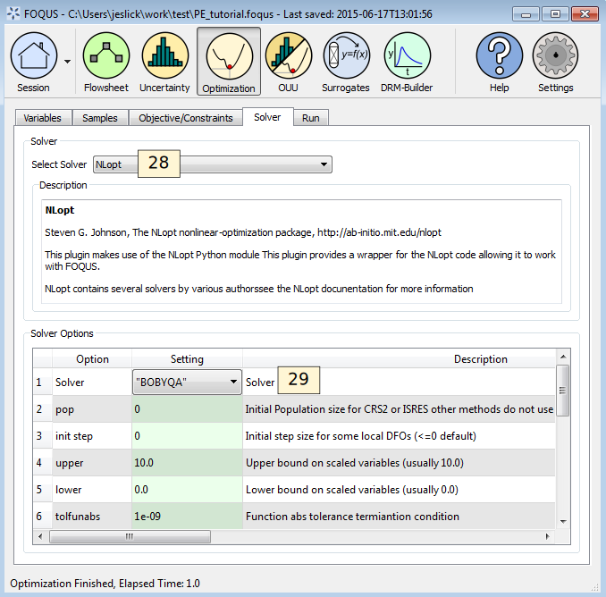

Tutorial 2: Parameter Estimation
================================

**Note:** The NLopt solvers are used for the tutorial, but are an
optional to the installation. See the install instructions for more
information about installing NLopt.

This tutorial provides a very simple example of using the sampling with
optimization. Sampling can be used to do optimization under uncertainty
where there are several scenarios with differing values of uncertain
parameters. Sampling can also be used to do parameter estimation, where
estimated values must be compared against several data points. This
tutorial will focus on parameter estimation.

At any point in this tutorial, the FOQUS session can be saved and the
tutorial can be started again from that point.

The model is given by Equation :eq:`eq.pe.tut`. The unknown parameters are
:math:`a`, :math:`b`, and :math:`c`. The x and y data are given in Table
:ref:`table.pe.data`.

.. math:: y = ax^2 + bx + c
   :label: eq.pe.tut

.. _table.pe.data:
.. table:: x-y Data

   +--------+---+---+---+----+----+
   | Sample | 1 | 2 | 3 | 4  | 5  |
   +========+===+===+===+====+====+
   | x      | 0 | 1 | 2 | 3  | 4  |
   +--------+---+---+---+----+----+
   | y      | 1 | 0 | 3 | 10 | 21 |
   +--------+---+---+---+----+----+

The first step is to create a flowsheet with one node. The node will
have the input variables: a, b, c, x, and ydata; and output variable y.

#. Open FOQUS.

#. In the **Session Name** field, enter “PE_tutorial” (see Figure
   :ref:`fig.pe.tut1`).

#. Click the **Flowsheet** button in the top toolbar.

   Session Setup

4. Add a node to the flowsheet named “model.”

   #. Click **Add Node** in the left toolbar (see Figure
      :ref:`fig.pe.tut2`).

   #. Click anywhere on the gridded flowsheet area.

   #. Select “model” in the **Name** drop-down list and then click
      **OK**.

5. Click the **Selection Mode** icon in the left toolbar (see Figure
   :ref:`fig.pe.tut2`).

6. Click the **Node Editor** icon in the left toolbar (see Figure
   :ref:`fig.pe.tut2`).

7. In the Node Edit input table, add the variables a, b, c, x, and
   ydata. The ydata variable will be used as an input for the known y
   sample point data, later in the tutorial.

   #. Click the **Add Input** icon (see Figure
      :ref:`fig.pe.tut2`).

   #. Enter “a” for the variable name in the **Name** column.

   #. Enter -10 and 10 for the min and max in the **Min** and **Max**
      columns for a, b, c, and x.

   #. Repeat for all of the inputs.

   #. Enter 1 for the value of a, b, and c in the **Value** column.

   #. Enter 2 for the value of x in the **Value** column.

   #. The **Value**, **Min**, and **Max** for ydata do not matter.

   Adding Node and Inputs

8. Click **Output Variables** (see Figure
   :ref:`fig.pe.tut3`).

9. Add the output variable y.

   #. Click the **Add Output** icon (see Figure
      :ref:`fig.pe.tut3`).

   #. Enter “y” for the variable name in the **Name** column.

.. figure:: ../figs/par_est_tut3.svg
   :alt: Adding Outputs
   :name: fig.pe.tut3

   Adding Outputs

10. Add the model equation to the node.

    #. Click the **Node Script** tab.

    #. Enter the following code in the calculations box:

       ::

          f['y'] = x['a']*x['x']**2\
           + x['b']*x['x'] + x['c']

   Adding Node Calculation

11. Return to the Output Variables table in the Node Editor, by clicking
    on the **Variables** tab, and selecting **Output Variables**.

12. Click **Run** in the left toolbar in the FOQUS Home window, to test
    a single flowsheet evaluation and ensure there are no errors.

13. When the run is complete, there should be no error and the value of
    y should be 7 in the Output Variables table.

The next step is to setup the optimization. The objective function is to
minimize the sum of the squared errors between the estimated value of y
and the observed value of y. There are five data points in Table
:ref:`table.pe.data`, so there are five flowsheet
evaluations that need to go into the calculation of the objective.

14. Click the **Optimization** button in the top toolbar of the Home
    window (see Figure :ref:`fig.pe.tut5`).

15. | Select “Decision” in the **Type** column drop-down lists for
      “model.a,” “model.b,” and
    | “model.c.” The **Scale** column will automatically be set to
      linear.

16. Select “Sample” in the **Type** column drop-down lists for “model.x”
    and “model.ydata.”

.. figure:: ../figs/par_est_tut5.svg
   :alt: Optimization Variables
   :name: fig.pe.tut5

   Optimization Variables

The decision variables in the optimization problem will be changed by
the optimization solver to try to minimize the objective, and the sample
variables are used to construct the samples that will go into the
objective function calculation.

17. Select the **Samples** tab (see Figure :ref:`fig.pe.tut6`).

18. Click **Add Sample** five times to add five samples.

19. Enter the data from Table :ref:`table.pe.data` in
    the Samples table.

20. For larger sample sets, **Generate Samples** has an option to load
    from a CSV file. The CSV file must be saved as "CSV (MS-DOS)" as the file type, as follows:

   Sample Variable data (csv file)

   Optimization Samples

The objective function is the sum of the square difference between y and
ydata for each sample in Table :ref:`table.pe.data`. The
optimization solver changes the a, b, and c to minimize the objective.

21. Click the **Objective/Constraints** tab.

22. Click the **Add Objective** icon on the right side of the Objective
    Function table (see Figure :ref:`fig.pe.tut7`).

23. In the **Expression** column, enter the following (without any line
    break):

    ::

       sum([(ff.model.y - xx.model.ydata)**2 for (ff,xx) in zip(f,x)])

    The above expression uses Python list comprehension to calculate the
    sum of squared errors.

    The keys for x (the inputs) and f (the outputs) are:
       -  Dummy variable name for index (i.e., ff for outputs and xx for inputs)
       -  Node name (i.e., model)
       -  Variable name (i.e., y and ydata)

    Then, the user will need to specify which of the dummy index corresponds to
    outputs, and which of the dummy index corresponds to inputs. In this case,
    ff is for the outputs, and xx is for the inputs. Hence, we have
    "for (ff,xx) in zip(f,x)" (without the quotes).

24. Enter 1 for the **Penalty Scale**.

25. Enter 100 for the **Value for Failure**.

26. No constraints are required.

   Objective Function

Once the objective is set up, a solver needs to be selected and
configured. Almost any solver in FOQUS should work well for this problem
with the default values.

27. Click the **Solver** tab (see Figure :ref:`fig.pe.tut8`).

28. Select “NLopt” from the **Select Solver** drop-down list. NLopt is a
    collection of solvers that share a standard interface
    :ref:`(Johnson 2015)<Johnson_2015>`.

29. Select “BOBYQA” under the Solver Options table in the **Settings**
    column drop-down list.

   Optimization Samples

30. Click the **Run** tab (see Figure :ref:`fig.pe.tut9`).

31. Click the **Start** button.

32. The Optimization Solver Messages window displays the solver
    progress. As the solver runs, the best results found is placed into
    the flowsheet.

33. The **Best Solution Parallel Coordinate Plot** shows the scaled
    decision variable values for the best solution found so far.

34. The **Objective Function Plot** shows the value of the objective
    function as the optimization progresses.

.. figure:: ../figs/par_est_tut9.svg
   :alt: Running Optimization
   :name: fig.pe.tut9

   Running Optimization

The best result at the end of the optimization is stored in the
flowsheet. All flowsheet evaluations run during the optimization are
stored in the flowsheet results table.

35. Once the optimization has completed, click **Flowsheet** in the top
    toolbar.

36. Open the **Node Editor** and look at the **Input Variables** table.
    The approximate result should be :math:`a = 2`, :math:`b = -3`, and :math:`c = 1` (see
    Figure :ref:`fig.pe.tut10`).

.. figure:: ../figs/par_est_tut10.svg
   :alt: Flowsheet, Input Variables Results
   :name: fig.pe.tut10

   Flowsheet, Input Variables Results
