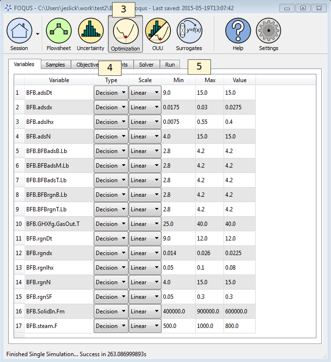
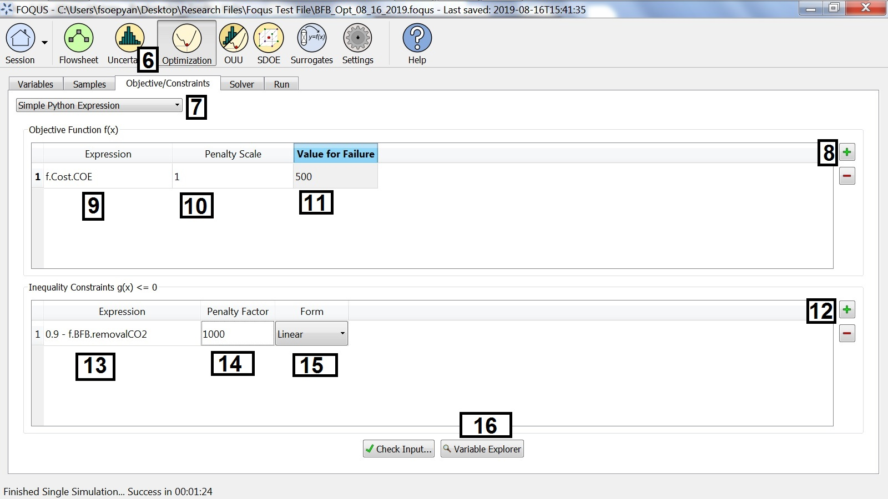
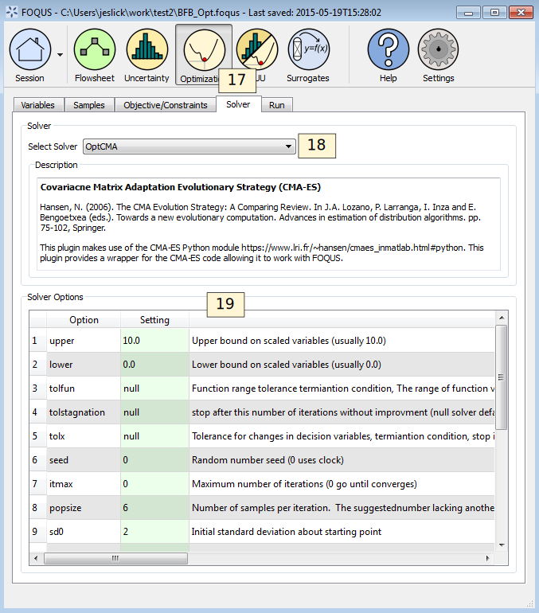
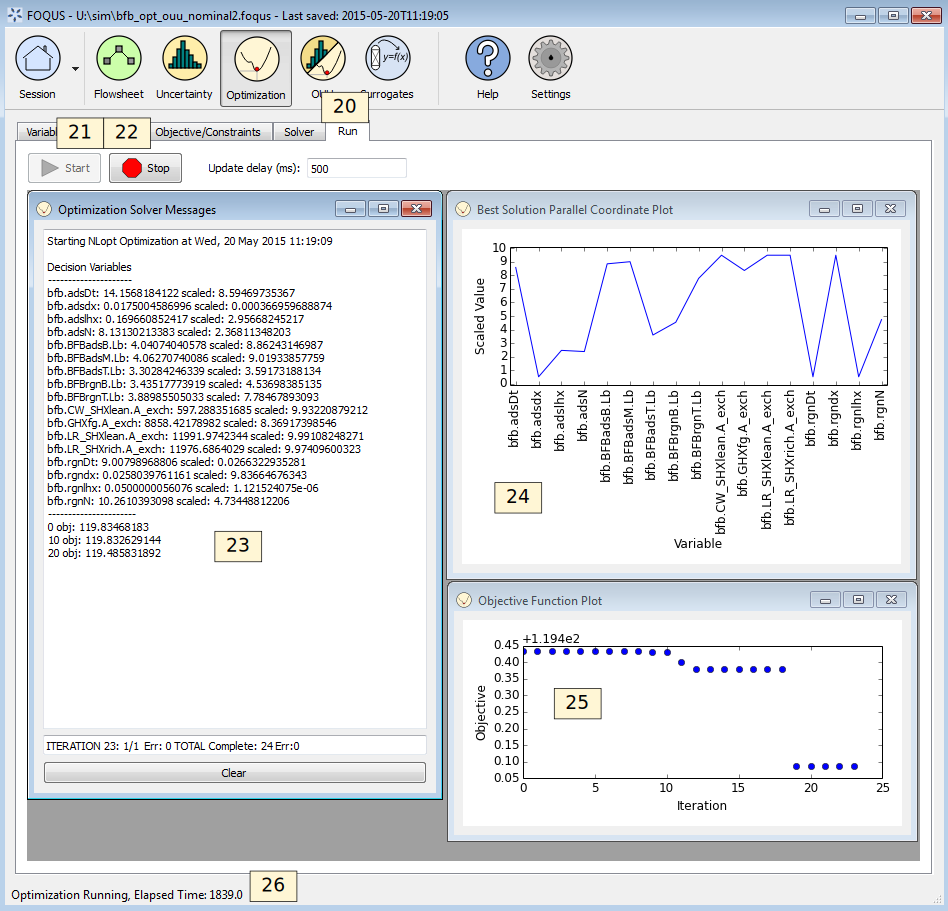

.. _sec.opt.tutorial:

Tutorial 1: Optimization
========================

This tutorial is a step-by-step walk through of simulation-based
optimization. This tutorial builds on the tutorial in Section
:ref:`tutorial.sim.flowsheet`.

The files for this tutorial are located in:
**examples/test_files/Optimization/Model_Files/**

.. note:: |examples_reminder_text|

#. Open FOQUS.

#. Load the FOQUS session from the tutorial “Creating a Flowsheet with
   Linked Simulations” in Section
   :ref:`tutorial.sim.flowsheet` or if that
   tutorial has not yet been completed, complete it first.

Problem Set Up
--------------

If the simulation runs successfully and the results are reasonable,
proceed to define the optimization problem. There are four steps to
setting up the optimization problem: (1) select the variables, (2)
define samples (optional), (3) define the objective function, and
constraints and (4) select and configure the solver.

3. Select the **Optimization** button from the toolbar at the top of the
   Home window (Figure :ref:`tut.opt.problem.vars`). Select the
   **Variables** tab.

4. Select “Decision” from the drop-down list in the **Type** column as
   the variable type for all 17 variables shown. If more than 17
   variables are shown, the edge connecting the “BFB” node to the “Cost”
   node was most likely not configured properly. The scale will
   automatically change to linear, which is acceptable for most
   problems.

5. The **Min**, **Max**, and **Value** columns can be changed. The
   **Min** and **Max** columns define the lower and upper bounds. The
   **Value** column specifies the initial point. For this example the
   defaults are acceptable.

   Optimization Problem Variables

If more than one flowsheet evaluation is used in the objective function
calculation (e.g., parameter estimation or optimization under
uncertainty), the next step is to setup the samples under the
**Samples** tab. In this case only one evaluation is used to calculate
an objective function value, so the sample setup is not needed. The next
step is to define the objective function and constraints using the form
under the **Objective/Constraints** tab as shown in Figure
:ref:`tut.opt.problem.obj`.

   Optimization Problem Objective

6.  Select the **Objective/Constraints** tab (see Figure
    :ref:`tut.opt.problem.obj`).

7.  In the drop-down list, verify “Simple Python Expression” is
    selected.

8.  Add an objective function by clicking **+** to the right of the
    Objective Function table.

9.  | The objective function is the cost of electricity from the cost
      spreadsheet. Enter:
    | ``f.Cost.COE``
    | in the **Expression** column.

10. Enter 1 in the **Penalty Scale** column. This setting is used mostly
    for multi-objective optimization to apply the constraint penalty to
    different objectives.

11. Enter 500 in the **Value for Failure** column. This should be worse
    than the objective for any non-failed simulations.

12. Add a constraint by clicking **+** next to the Inequality
    Constraints table.

13. | The constraint is that the fraction of CO\ :math:`_2` captured
      must be greater than or equal to 0.9. The constraint is in the
      form :math:`g(\mathbf{x}) \leq 0`; therefore, in the
      **Expression** column enter:
    | ``0.9 - f.BFB.removalCO2``.

14. Enter 1000 for the **Penalty Factor**.

15. The constraint penalty **Form** should be linear.

16. The **Variable Explorer** button can be used to help select
    flowsheet variables.

Solver Settings
---------------

The last step before running the optimization is to select and configure
the solver. The solver configuration form is shown in Figure
:ref:`tut.opt.solver`.

   Optimization Solver Setup

17. Select the **Solver** tab (see Figure :ref:`tut.opt.solver`).

18. Select “OptCMA” from the **Select Solver** drop-down list.

19. The default options are acceptable. Solver options are described in
    the Solver Options table.

Running Optimization
--------------------

The optimization run form is shown in Figure
:ref:`tut.opt.run`.

   Optimization Monitor

20. Click the **Run** tab to display the optimization run form (see
    Figure :ref:`tut.opt.run`).

21. Click **Start**.

22. Once the optimization has run for while click **Stop**.

As the optimization run, the best result found is stored in the
Flowsheet. If an optimization is run with sample variables the first
sample in the set with the best objective function will be stored in the
flowsheet. All simulation results can be viewed in the Flowsheet Results
table.

The run form displays some diagnostic information as the optimization
runs. The parts of the display labeled in Figure
:ref:`tut.opt.run` are described below.

23. The Optimization Solver Messages window displays information from
    the solver.

24. The **Best Solution Parallel Coordinate Plot** shows the value of
    the scaled decision variables, which is useful to see where the best
    solution is relative to the variable bounds.

25. The **Objective Function Plot** shows the best value of the
    objective function found as a function of the optimization iteration
    or sample number.

26. While the optimization is running, the status bar shows the amount
    of time that has elapsed since starting the optimization.
