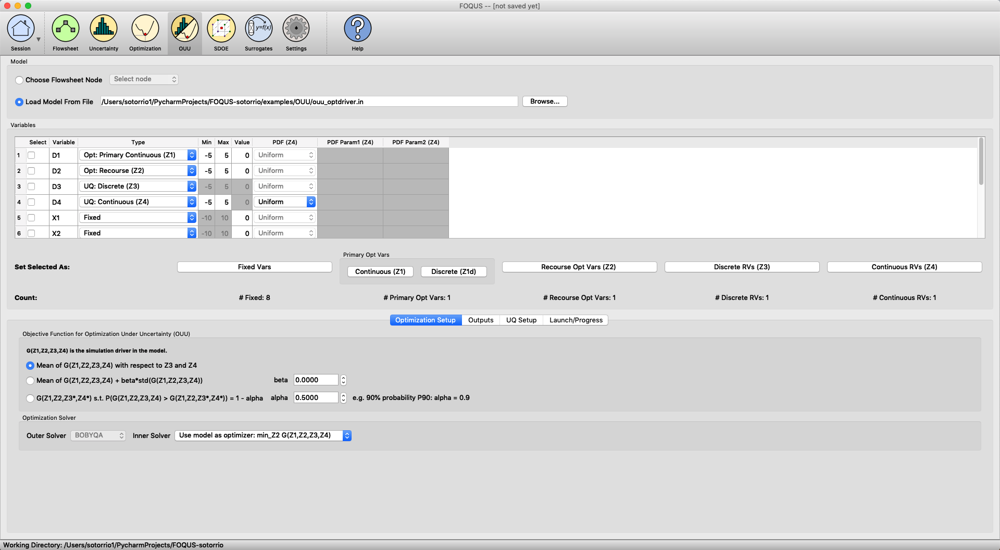

Reference
=========

The FOQUS OUU module supports several variants of optimization under
uncertainty. This chapter first presents the mathematical formulations
of these variants. Subsequently, details of the OUU graphical user
interface will be discussed.

OUU Variables
-------------

Suppose a simulation model is available for an OUU study. Let this
simulation model be represented by the following function:

.. math:: Y = F(Z_1,Z_2,Z_3,Z_4),

which is characterized by four types of variables:

#. **Design/Decision/Optimization variables**

   -  Notation: :math:`Z_1` with dimension :math:`n_1`

   -  Definition: Design variables are continuous variables that may be
      bounded or unbounded. They are generally the set of optimization
      variables in a single-stage optimization or the set of outer
      optimization variables in the two-stage optimization.

#. **Recourse/Operating variables**

   -  Notation: :math:`Z_2` with dimension :math:`n_2`

   -  Definition: Operating variables are optimization variables in the
      inner optimization for a given scenario (or realization) of the
      uncertain variables in a two-stage optimization.

#. **Discrete uncertain variables**

   -  Notation: :math:`Z_3` with dimension :math:`n_3`

   -  Definition: Discrete uncertain variables are random variables that have
      an enumerable set of states (called scenarios) such that each
      state is associated with a finite probability and the sum of
      probabilities for all the scenarios is equal to :math:`1`.

#. **Continuous uncertain variables**

   -  Notation: :math:`Z_4` with dimension :math:`n_4`

   -  Definition: Continuous uncertain variables are associated with a
      joint probability distribution function from which a sample can be
      drawn to compute the basic statistics.

OUU Objective Functions
-----------------------

In the presence of uncertainties, OUU seeks to find the optimal solution
in some statistical sense. In other words, an optimization goal may to be
find the design settings that minimizes some metric.
Currently, OUU supports the following three metrics:

#. statistical mean of some selected output;

#. a linear combination of statistical mean and standard deviation of
   some selected output; and

#. the probability of exceeding the best value is smaller than some
   percentage at any point in the design space (this is analogous to
   conditional value at risk).

Note that these metrics are defined in the design variable space - that
is, at each iteration of an OUU algorithm, the selected metric will be
computed for the decision point under consideration. Since the
calculation of these statistical metrics requires a (possibly large) sample,
OUU can benefit from parallel computing capabilities of the AWS FOQUS Cloud.

Mathematical Formulations
-------------------------

FOQUS supports two types of OUU methods: single-stage OUU and two-stage
OUU. The main difference between single-stage and two-stage OUU is the
presence of the recourse (or operating) variables. Strictly speaking,
since recourse variables are generally hidden (they are only needed in
the inner stage and their values are not used in the outer stage of
two-stage OUU), the distinction between single-stage and two-stage OUU
is not readily obvious. Nevertheless, for the sake of clarify, we will describe
details of each formulation separately. The current OUU does not support
linearly or nonlinearly-constrained optimization.

Single-Stage Formulation
~~~~~~~~~~~~~~~~~~~~~~~~

In this formulation, there is no recourse variable:

.. math:: Y = F(Z_1, Z_3, Z_4)

and the optimization problem becomes:

.. math::

   \min_{Z_1} \mathbf{\Phi}_{Z_3,Z_4}
   \left[ F(Z_1,Z_3,Z_4)
   \right]

where :math:`\Phi_{Z_3,Z_4} [F(Z_1,Z_3,Z_4)]` is the statistical metric
(one of the three options given above).

For example, if the objective function is the statistical mean, then the
formulation becomes:

.. math::

   \min_{Z_1} \mathbf{E}_{Z_3,Z_4} [F(Z_1,Z_3,Z_4)]
   \approx
   \min_{Z_1} {
   \sum^{n_3}_{j=1} \pi_j \left(
   \int {F(Z_1,Z_3,Z_4)
   P(Z_4) d Z_4} \right)}

where, again, :math:`n_3` is the number of scenarios for the discrete
uncertain variables, :math:`\pi_j` is the probability of the
:math:`j`-th scenario, and :math:`P(Z_4)` is the joint probability of
the continuous uncertain variables.

Two-Stage Formulation
~~~~~~~~~~~~~~~~~~~~~

In this formulation, all four types of variables are present. The
objective function is given by:

.. math::

   \begin{array}{lcl}
   & & \displaystyle \min_{Z_3,Z_4}
   \mathbf{\Phi}_{Z_3,Z_4} \left[
   \min_{Z_2}
   F(Z_1,Z_2,Z_3,Z_4) \right].
   \end{array}

If the objective function is the statistical mean, the formulation
becomes:

.. math::

   \begin{array}{lcl}
   & & \displaystyle \min_{Z_1}
   \mathbf{E}_{Z_3,Z_4} \left[
   \min_{Z_2} F(Z_1,Z_2,Z_3,Z_4) \right]\\
   &\approx& \displaystyle \min_{Z_1} \sum^{n_3}_{j=1} \pi_j
   \left(
   \int \left[
   \min_{Z_2} F(Z_1,Z_2,Z_3,Z_4) \right] P(Z_4) d Z_4
   \right)
   \end{array}

Let

.. math:: G(\mathbf{Z_1,Z_3,Z_4}) = \min_{Z_2} F(Z_1,Z_2,Z_3,Z_4).

Then the two-stage equation can be rewritten as:

.. math::

   \begin{array}{lcl}
   & & \displaystyle \min_{Z_1}
   \mathbf{E}_{Z_3,Z_4} \left[
   G(Z_1,Z_3,Z_4) \right]\\
   &\approx& \displaystyle \min_{Z_1} \sum^{n_3}_{j=1} \pi_j
   \left( \int
   G(Z_1,Z_3,Z_4) P(Z_4) d Z_4
   \right)
   \end{array}

which is a single-stage OUU with respect to the :math:`G` function.
Therefore, :math:`G` can be optimized separately before it is used to minimize :math:`Z_1`,
thus lending to the two-stage formulation.

OUU User Interface
------------------

The OUU module enables the user to perform optimization under
uncertainty studies on a flowsheet. From the OUU tab, the user can set
up the different types of optimization parameters, select from the
different OUU options, and run the optimization. This screen is shown in
Figure [fig:ouu\_screen].

   Optimization Under Uncertainty Screen

#. **Model** provides two options for setting up the model: (1) select a
   node from the flowsheet that has already been instantiated; or (2)
   load the model from a file in the PSUADE full file format (with the
   opt\_driver variable set to the simulation executable.)

#. **Variables** displays all variables defined in the model that can be
   used in this context. Each available variable can be set to either
   one of the 6 types:

   -  "Fixed": The parameter’s value is fixed throughout the optimization
      process.

   -  "Opt: Primary Continuous (Z1)": Continuous parameter for the outer optimization.

   -  "Opt: Primary Discrete (Z1d)": Discrete parameter for the outer optimization.

   -  "Opt: Recourse (Z2)": Recourse parameter for the inner optimization.

   -  "UQ: Discrete (Z3)": Discrete or categorical uncertain parameter that contributes to
      scenarios.

   -  "UQ: Continuous (Z4)": Continuous uncertain parameter with a given
      probability distribution.

#. **Optimization Setup** allows users to select the objective function
   for OUU. It also allows users to select the inner optimization
   solver. There are two options for the inner solver: (1) the
   simulation model provided by users is an optimizer itself, and (2)
   the simulation provided by users needs to be wrapped around by
   another optimizer in FOQUS.

#. **UQ Setup** allows users to set up the continuous uncertain
   parameters. There are two options: (1) FOQUS can generate a sample
   internally, or (2) a user-generated sample can be loaded into FOQUS.
   The sample size should be larger than the number of continuous
   uncertain parameters. Optionally, response surface can be turned on
   to enable the statistical moments to be computed more accurately even
   with small samples. Users can also select a smaller subset of the
   sample for building response surfaces and evaluate the response
   surfaces with the larger samples.

#. **Launch/Progress** has the ‘Run OUU’ button to launch OUU runs.
