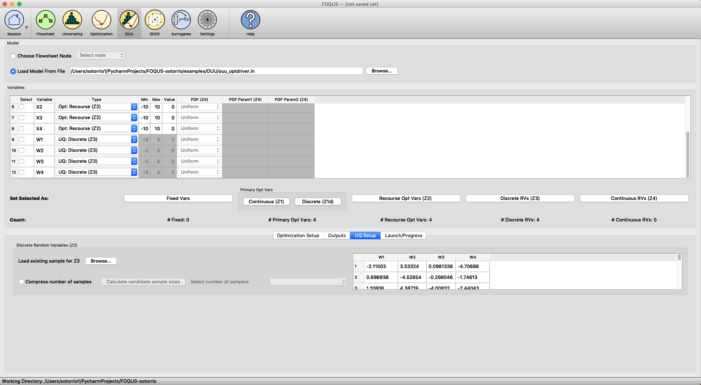
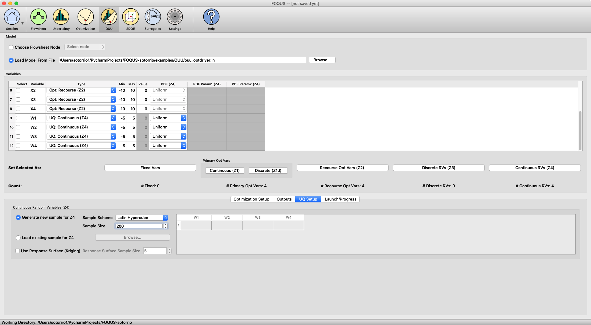

Tutorials
=========

This section walks through a few examples of running OUU.

The files for these tutorials are located in: **examples/tutorial_files/OUU**

.. note:: |examples_reminder_text|

Example 1: OUU with Discrete Uncertain Parameters Only
------------------------------------------------------

This example has only discrete uncertain parameters and the objective
function is computed from the mean estimation with the scenarios from a
sample file.

   OUU Example with Discrete Uncertain Parameters

#. Start FOQUS and click the ‘OUU’ icon.

#. Under ‘Model’, browse and load
   examples/OUU/ouu\_optdriver.in.

#. Under ‘Variables’, set variable :math:`1-4` as :math:`Z_1`, variable
   :math:`5-8` as :math:`Z_2`, and variable :math:`9-12` as :math:`Z_3`.

#. Under ‘Optimization Setup’, select the first objection function
   (default) and select ‘use model as optimizer’ as the ‘Inner Solver’.

#. Under ‘UQ Setup’ and ‘Discrete Random Variables’, browse the
   examples/OUU/ directory and load the ex1_x3sample.smp sample
   file (see Figure [fig:ouu\_ex1]).

#. Go to ‘Launch/Progress’ page, click ‘Run OUU’ and see OUU in action.

Example 2: OUU with Continuous Uncertain Parameters Only
--------------------------------------------------------

This example has only continuous uncertain parameters and the objective
function is computed from the mean estimation with a Latin hypercube
sample of size :math:`200` for :math:`Z_4`.

   OUU Example with Continuous Uncertain Parameters

#. Start FOQUS and click the ‘OUU’ icon.

#. Under ‘Model’, browse and load
   examples/OUU/ouu\_optdriver.in.

#. Under ‘Variables’, set variable :math:`1-4` as :math:`Z_1`, variable
   :math:`5-8` as :math:`Z_2`, and variable :math:`9-12` as :math:`Z_4`.

#. Under ‘Optimization Setup’, select the first objection function
   (default) and select ‘use model as optimizer’ as the ‘Inner Solver’.

#. Under ‘UQ Setup’ and ‘Continuous Random Variables’, select ‘Generate
   new sample for :math:`Z_4`’, set ‘Sample Scheme’ to ‘Latin Hypercube’
   and set sample size to :math:`200` (see Figure [fig:ouu\_ex2]).

#. Go to ‘Launch/Progress’ page, click ‘Run OUU’ and see OUU in action.

Example 3: OUU with Continuous Uncertain Parameters and Response Surface
------------------------------------------------------------------------

This example is similar to Example 2 except that response surfaces will
be used on the :math:`Z_4` sample (that is, the :math:`Z_4` sample will
be used to construct response surfaces and the means will be estimated
from a large sample evaluated on the response surfaces).

#. Start FOQUS and click the ‘OUU’ icon.

#. Under ‘Model’, browse and load
   examples/OUU/ouu\_optdriver.in.

#. Under ‘Variables’, set variable :math:`1-4` as :math:`Z_1`, variable
   :math:`5-8` as :math:`Z_2`, and variable :math:`9-12` as :math:`Z_4`.

#. Under ‘Optimization Setup’, select the first objection function
   (default) and select ‘use model as optimizer’ as the ‘Inner Solver’.

#. Under ‘UQ Setup’ and ‘Continuous Random Variables’, select ‘Generate
   new sample for :math:`Z_4`’, set ‘Sample Scheme’ to ‘Latin Hypercube’
   and set sample size to :math:`200`.

#. Under ‘UQ Setup’ and ‘Continuous Random Variables’, check the ‘Use
   Response Surface’ box (see Figure [fig:ouu\_ex2]).

#. Go to ‘Launch/Progress’ page, click ‘Run OUU’ and see OUU in action.

Example 4: OUU with Discrete and Continuous Uncertain Parameters
----------------------------------------------------------------

This example has both discrete and continuous parameters. The discrete
scenarios will be loaded from a sample file. A Latin hypercube sample
will be generated for the continuous variables.

#. Start FOQUS and click the ‘OUU’ icon.

#. Under ‘Model’, browse and load
   examples/OUU/ouu\_optdriver.in.

#. Under ‘Variables’, set variable :math:`1-4` as :math:`Z_1`, variable
   :math:`5-8` as :math:`Z_2`, variable :math:`9` as :math:`Z_3`, and
   variable :math:`10-12` as :math:`Z_4`.

#. Under ‘Optimization Setup’, select the first objection function
   (default) and select ‘use model as optimizer’ as the ‘Inner Solver’.

#. Under ‘UQ Setup’ and ‘Discrete Random Variables’, browse the
   examples/OUU/ directory and load the ex456_x3sample.smp sample
   file.

#. Under ‘UQ Setup’ and ‘Continuous Random Variables’, select ‘Generate
   new sample for :math:`Z_4`’, set ‘Sample Scheme’ to Latin hypercube
   and set ‘Sample Size’ to :math:`100`.

#. Go to ‘Launch/Progress’ page, click ‘Run OUU’ and see OUU in action.

Example 5: OUU with Mixed Uncertain Parameters and Response Surface
-------------------------------------------------------------------

This example is similar to Example 4 except that response surfaces will
be used to estimate the means for the continuous uncertain variables.

#. Start FOQUS and click the ‘OUU’ icon.

#. Under ‘Model’, browse and load
   examples/OUU/ouu\_optdriver.in.

#. Under ‘Variables’, set variable :math:`1-4` as :math:`Z_1`, variable
   :math:`5-8` as :math:`Z_2`, variable :math:`9` as :math:`Z_3`, and
   variable :math:`10-12` as :math:`Z_4`.

#. Under ‘Optimization Setup’, select the first objection function
   (default) and select ‘use model as optimizer’ as the ‘Inner Solver’.

#. Under ‘UQ Setup’ and ‘Discrete Random Variables’, browse the
   examples/OUU/ directory and load the ex456_x3sample.smp sample
   file.

#. Under ‘UQ Setup’ and ‘Continuous Random Variables’, select ‘Generate
   new sample for :math:`Z_4`’, set ‘Sample Scheme’ to Latin hypercube
   and set ‘Sample Size’ to :math:`100`.

#. Under ‘UQ Setup’ and ‘Continuous Random Variables’, check the ‘Use
   Response Surface’ box.

#. Go to ‘Launch/Progress’ page, click ‘Run OUU’ and see OUU in action.

Example 6: OUU with User-provided Samples and Response Surface
--------------------------------------------------------------

This example is similar to Example 4 except that a sample for
:math:`Z_4` will be used (instead of the Latin hypercube sample
generated internally).

#. Start FOQUS and click the ‘OUU’ icon.

#. Under ‘Model’, browse and load
   examples/OUU/ouu\_optdriver.in.

#. Under ‘Variables’, set variable :math:`1-4` as :math:`Z_1`, variable
   :math:`5-8` as :math:`Z_2`, variable :math:`9` as :math:`Z_3`, and
   variable :math:`10-12` as :math:`Z_4`.

#. Under ‘Optimization Setup’, select the first objection function
   (default) and select ‘use model as optimizer’ as the ‘Inner Solver’.

#. Under ‘UQ Setup’ and ‘Discrete Random Variables’, browse the
   examples/OUU/ directory and load the ex456_x3sample.smp sample
   file.

#. Under ‘UQ Setup’ and ‘Continuous Random Variables’, check ‘Load
   existing sample for :math:`Z_4`’ and load the :math:`Z_4` sample
   examples/OUU/ex6_x4sample.smp.

#. Go to ‘Launch/Progress’ page, click ‘Run OUU’ and see OUU in action.

Example 7: OUU with Large User-provided Samples and Response Surface
--------------------------------------------------------------------

This example is similar to Example 5 except that a sample for
:math:`Z_4` is provided (instead of generated internally).

#. Start FOQUS and click the ‘OUU’ icon.

#. Under ‘Model’, browse and load
   examples/OUU/ouu\_optdriver.in.

#. Under ‘Variables’, set variable :math:`1-4` as :math:`Z_1`, variable
   :math:`5-8` as :math:`Z_2`, and variable :math:`9-12` as :math:`Z_4`.

#. Under ‘Optimization Setup’, select the first objection function
   (default) and select ‘use model as optimizer’ as the ‘Inner Solver’.

#. Under ‘UQ Setup’ and ‘Continuous Random Variables’, check ‘Load
   existing sample for :math:`Z_4`’ and load the :math:`Z_4` sample
   examples/OUU/ex7_x4sample.smp (:math:`10000` sample
   points).

#. Under ‘UQ Setup’ and ‘Continuous Random Variables’, check ‘Use
   Response Surface’ and set ‘Sample Size’ to :math:`100`.

#. Go to ‘Launch/Progress’ page, click ‘Run OUU’ and see OUU in action.
