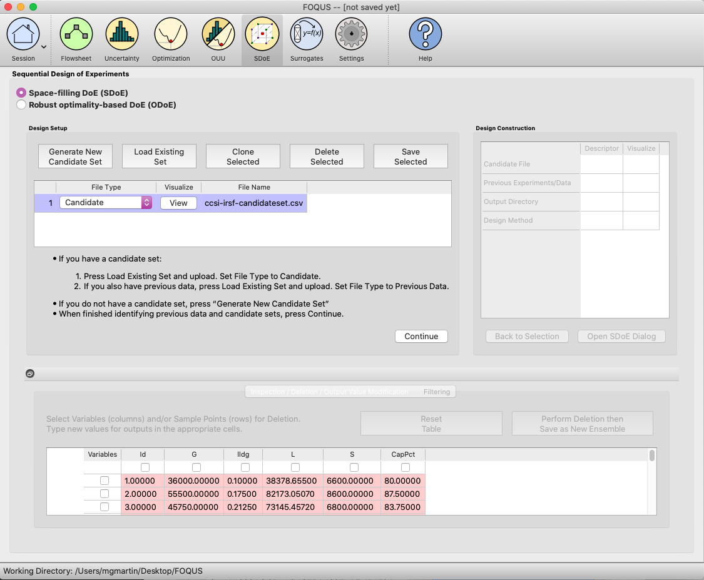

Basic Steps for an Input-Response Space-Filling Design
=======================================================

We now consider some details for each of these steps for the third type of design, where we want to have a design that seeks to balance even spacing in the input space with even spacing in the response space.

The algorithm works by finding the set of non-dominated designs that reside on a pareto front, including the single best design in the input space on one extreme, and the best design in the response space on the other. In the middle are a number of compromise designs that trade off different levels of space-filling properties in the input and response spaces. The experimenter is encouraged to examine all created designs on the pareto front (even creating multiple pareto fronts of designs if desired) and choose the design with the preferred balance of input and response space-filling. 

A step-by-step guide for using the SDOE module to create an Input-Response Space-Filling design is given below. For a set of worked examples, see the Examples section. 

1.
In the **Design Setup** box, click on the **Load Existing Set** button to select the file(s) to be used for the construction of the design. Several files can be selected and added to the box listing the chosen files.

   
   SDOE Module Home Screen

2.
For each of the files selected, using the pull-down menu, identify them as either a **Candidate file** or a **Previous Data** file. **Candidate** .csv files are comprised of possible input (and response) combinations from which the design can be constructed. The columns of the file should contain the different input factors that define the dimensions of the input space, with one or more columns of response values included for each input combination. Typically, these response values are determined from a previously-validated model of the underlying process. In fact, the determination of even spacing in the response space is only as trustworthy as the model used. 

It is important to make sure the process model is reliable and provides consistent results before attempting an input-response space-filling design.  If not, a better design fit would be using a uniform space-filling design. 
Note that there is a requirement for at least one column to contain the response values. If this is not provided, then an input-response space-filling design cannot be created.

