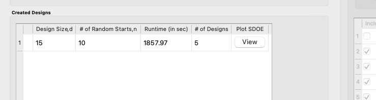

Basic Steps for an Input-Response Space-Filling Design
=======================================================

We now consider some details for each of these steps for the third type of design, where we want a design that seeks to balance even spacing in the input space with even spacing in the response space. These designs can be used when information is known about the likely output values for input combinations of interest. When information about the likely output values is not available, a uniform space-filling design should be used.

We wish to simultaneously optimize space-filling in the input and the response spaces. However, it is often not possible to achieve maximum space-filling in both spaces simultaneously. Instead, we may seek a design that offers a compromise, performing relatively well in both the input and output spaces.  Rather than offering a single “best” design, the Input Response Space-Filling Design algorithm constructs a Pareto front of designs, a collection of objectively best compromise designs that move across a spectrum of levels of input and response space-filling. At one end of the spectrum is the design that maximizes space-filling in the response space, while at the other end is the design that maximizes space-filling in the input space. Connecting these two extremes, there is a collection of compromise designs that balance space-filling in both spaces. Each design located on the Pareto front is the best compromise design for that spot along the spectrum. Experimenters should examine each design located on the Pareto front to find which of these compromise designs best suits their needs. 

A step-by-step guide for using the SDOE module to create an Input-Response Space-Filling design is given below. For a set of worked examples, see the Examples section. 

1.
In the **Design Setup** box, click on the **Load Existing Set** button to select the file(s) to be used for the construction of the design. Several files can be selected and added to the box listing the chosen files.

   
   SDOE Module Home Screen

2.
For each of the files selected, using the pull-down menu, identify them as either a **Candidate file** or a **Previous Data** file. For Input-Response Space-Filling designs, **Candidate** .csv files are comprised of possible input and likely response combinations from which the design can be constructed. In this file, there should be one column corresponding to each of the different input factors that define the dimensions of the input space. Additionally, there should be at least one column of likely response values included for each input combination. Typically, these likely response values are determined from a previously-validated model of the underlying process. The provided likely response values will be used to identify designs with good space-filling properties in the input space. Therefore, the determination of even spacing in the response space is only as trustworthy as the model used to generate the likely response values.

.. note::
   It is important to make sure the process model is reliable and provides consistent results before attempting an input-response space-filling design. If not, it is recommended that the experimenter instead use a uniform space-filling design. 

As previously stated, there is a requirement for at least one column to contain the response values. If this is not provided, then an input-response space-filling design cannot be created.

**Previous Data** .csv files should have the same number of columns for the input space as the candidate file (with matching column names), and represent data that have already been collected. Note that at least one response column is also required for the previous data file, as the determination of even spacing in the response space when taking into account previous data requires this. The algorithm for creating the design aims to fill the input and response spaces, while also not repeating input or response combinations that have already been run, as listed in the previous data. 

Both the **Candidate** and **Previous Data** files should be .csv files that have the first row as the Column headings. The Input and Response columns should be numeric. Additional columns are allowed and can, if desired, be identified as not necessary to the design creation algorithm at a later stage.

   
   Columns in this Candidate Set

3. 
Click on the **View** button to open the **Preview Inputs** pop-up window, to see the list of columns contained in each file. The left-hand side displays the first few rows of input combinations and responses from the file. Select the columns that you wish to see graphically in the right-hand box, and then click **Plot SDOE** to see a scatterplot matrix of the data.

   
   Viewing Candidate Set

Displayed on the diagonals of the scatterplot matrix are histograms of each of the columns. These plots provide a view of the distribution of values as well as the range of each input. The off-diagonals show pairwise scatterplots of each pair of columns selected. This should provide the experimenter with the ability to assess if the ranges specified and any constraints for the inputs have been appropriately captured for the specified candidate set. In addition, repeating this process for any previous data will provide verification that the already observed data have been suitably characterized.

4. 
Once the data have been verified for both the **Candidate** and **Previous Data** files, click on the **Continue** button to make the **Design Construction** window active.

5. 
If more than one **Candidate** file was specified, then the **aggregate_candidates.csv** file that was created will have combined these files into a single file. Similarly, if more than one **Previous Data** file was specified, then the **aggregate_previousData.csv** file has been created with all runs from these files. If only a single file was selected for either of the **Candidate** or **Previous Data** files, then its corresponding aggregated file will be the same as the original.

To view the aggregated files for both the candidate and previous data files (if provided), click View, which lies in the right-most column of the Output Directory row. Once selected, this has a similar interface as that shown in step 3. If both types of files have been provided, a single plot of the combined candidate and previous data files will be displayed. In this plot, the points representing the candidate locations and points of already collected data from the previous data file are shown in different colors. 

   
   SDOE Design Construction Window

.. note::
   Make sure to include previous data if it exists. If it exists and is included, the design creation algorithm will spread new design points out so as not to rerun an input combination that has already been run. 

6. 
Once the data have been verified as the desired set to be used for the design construction, click on **Input-Response Space Filling** from the **Design Method** drop-down menu in the **Design Construction** window. This opens the second SDOE window, which allows for specific design choices to be made.

   
   SDOE Second Page

7. 
Similar to Non-Uniform Space Filling designs, the choice of the optimality criterion to be used is fixed at **maximin**. Recall that a **maximin** design looks to choose design points that are as far away from each other as possible. In this case, the design criterion is looking to maximize how close any two points in the input space are away from their nearest neighbor and the same in the response space.

8. 
Select the **Size** of the design desired. A larger design will give more information than a smaller design. This choice often comes down to the size of the budget for the experiment. 

9. 
Next select the **Type** for each column. In general, most of the columns should be designated as **Inputs**, which means they will be used to define the input space and to find the best design for the input space. For Input-Response Space-Filling designs in particular, there is a required column for the **Response**, which the experimenter will determine from the model. Multiple response columns can be given if desired. The algorithm will use the response(s) to find the best design for the response space. All of the Input and Response columns will be used in the determination of the Pareto front of best designs in both spaces. 

In addition, there is a system-created **Index** column displayed amongst the other columns of the candidate set; it should be listed first. Using an index column makes tracking which runs are included in the constructed designs easier. It will have the name **“_id”** with a Min value of 1 and Max value that is the number of rows in the set. The **Type** will be pre-set to “Index”. If the candidate set already included an index column, simply uncheck the **Include?** checkbox next to the column name that should be left out of design creation. Only one Index column can be included in design creation. If using a different index column than the one provided, remember to change the **Type** to **Index**. 

Finally, the **Min** and **Max** columns in the box allow the range of values for each input column, except for **“_id”**, to be specified. The default is to extract the smallest and largest values from the candidate and previous data files, and use these. This approach generally works well, as it scales the inputs to be in a uniform hypercube for comparing distances between the design points.

.. note::
   The default values for **Min** and **Max** can generally be left at their defaults unless: (1) The range of some inputs represent very different amounts of change in the process. For example, if temperature is held nearly constant, while a flow rate changes substantially, then it may be desirable to extend the range of the temperature beyond its nominal values to make the amount of change in temperature more commensurate with the amount of change in the flow rate. This is a helpful strategy to make the calculated distance between any points a more accurate reflection of how much of an adjustment each input requires. (2) If changes are made in the candidate or previous data files. For example, if one set of designs are created from one candidate set, and then another set of designs are created from a different candidate set. These designs and the achieved criterion value will not be comparable unless the range of each input has been fixed at matching values.

10. 
Once the design choices have been made, click on the **Estimate Runtime** button. This generates a small number of iterations of the search algorithm to calibrate the timing for constructing and evaluating the designs. The time taken to generate a design is a function of the size of the candidate set, the size of the design, as well as the dimensions of the input space and response space.

   
   Number of Random Starts

.. note::
   The number of random starts looks very different from what was done with the Uniform Space Filling Design. In that case, the number of random starts was offered in powers of 10. In this case, similar to Non-Uniform Space-Filling, since a more sophisticated search algorithm is being used, each random start takes longer to run, but generally many fewer starts are needed. There is a set of choices for the number of random starts, which ranges from 5 to 500. Producing a sample design for demonstration purposes with a small number of random starts (say 5 to 30) should work adequately, but recall that the choice of **Number of Random Starts** involves a trade-off between the quality of the design generated and the time to generate the design. The larger the chosen number of random starts, the better the design is likely to be. However, there are diminishing gains for increasingly large numbers of random starts. If running the actual experiment is expensive, it is generally recommended to choose as large a number of random starts as possible for the available time frame, to maximize the quality of the design generated.

   
   Choosing the Number of Random Starts

11. 
Once the slider has been set to the desired **Number of Random Starts**, click on the **Run SDOE** button, and initiate the construction of the designs. 

12. 
When the SDOE module has completed the design creation process, the left window **Created Designs** will be populated with a single file containing all results. The column entries summarize the key features of the collection of designs, including **Design Size** (d, the number of runs in each of the created designs), **# of Random Starts** (n), **Runtime** (number of seconds needed to create the designs), **# of Designs** (the number of designs found on the Pareto front). Clicking the **View** button in the **Plot SDOE** column gives a view of the Pareto front, with options to examine each of the created designs individually.  

   
   Created Designs Window

13. 
To view each of the designs on the Pareto front, click **View**. The plot given is of the Pareto front, with circles indicating the varying trade-offs of input and response space-filling criteria of each design on the Pareto front. By definition, these are all "best" designs along some spectrum of space-filling in the input and response spaces. There are a large number of other designs that would have been created, but when evaluated, would have been dominated (have worse space-filling) in at least one dimension by a design along the Pareto front.

Click on any circle in the plot to see a pairwise scatterplot of that individual design. These created-design pairwise scatterplots are similar in characteristics to their counterparts for the candidate set. It is helpful to examine the plots to compare their properties to those sought by the experimenter. A final choice should be made based on what is needed for the goals of the study. 

   
   Viewing a Pareto Front

   
   Viewing the Pairwise Scatterplot of a Created Design

14. 
To access the files with the generated designs, go to the **SDOE_files** folder, and a single folder will have been created for each Pareto front of designs created. This folder will have a name containing the date and time the designs were created. When opened, csv files of all created designs will be listed in the order they appear on the Pareto front, with the best-response design displayed first, and the best-input design second-to-last. The last file in the folder will be a csv file of the Pareto front, containing the values of the input and response space-filling criteria for each design. 

The created design files will have names similar to those given to files of Uniform and Non-Uniform Space-Filling designs mentioned in previous sections. The labeling reflects choices made by the experimenter in creating the designs. For example, the file **irsf_design2_d15_n30__id+G+lldg+L+S+CapPct.csv** contains the Input-Response Space-Filling design (irsf) of size 15 (d15) generated from 30 random starts (n30). This design is the second design on the Pareto front (design2), which means it has the second-highest value of the response space-filling criterion, and the second-lowest value of the input space-filling criterion. The columns from the file that were used include “_id” (system-generated ID column), “G”, “lldg”, “L”, “S”, and “CapPct”. 

When one of these design files is opened it contains the details of each of the runs in the design, with the input factor levels that should be set for that run.

To evaluate and compare the designs that have been created, it is helpful to look at a number of summaries, including the criteria values of input and response space filling, and visualizing the spread of the design points throughout the region by studying the pairwise scatterplots. Recall that at the beginning of the design creation process we recommended constructing multiple sets of designs. By examining many designs, it is easier to determine which design is best suited to the requirements of the experiment.
