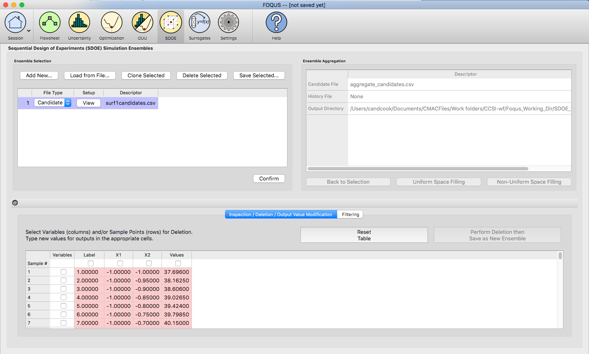
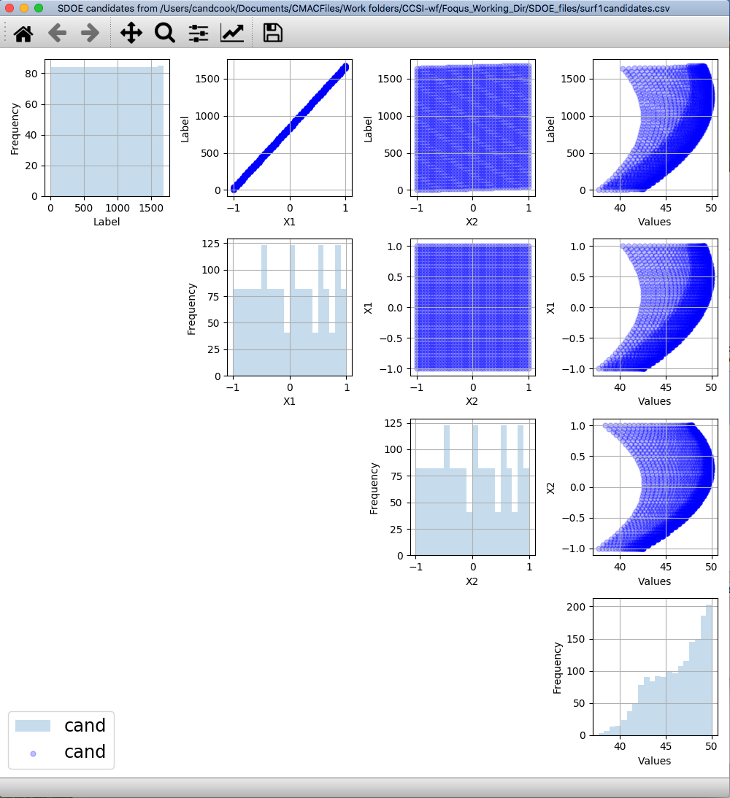
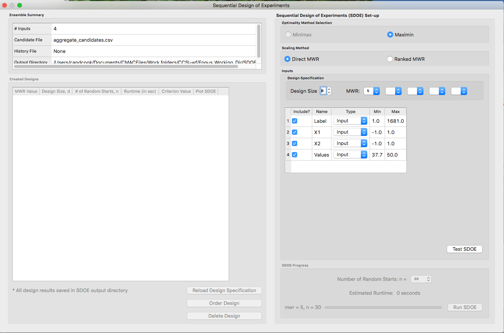
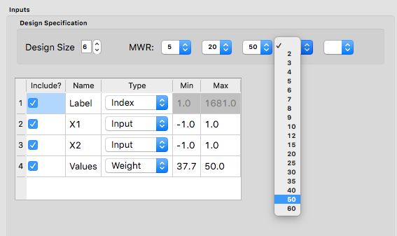
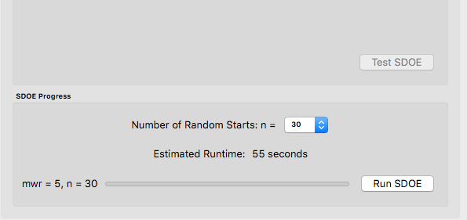
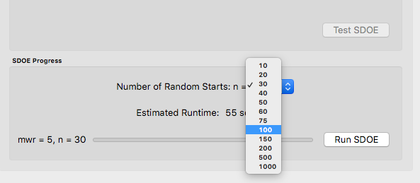
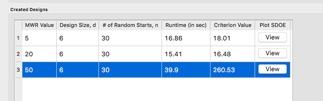

Basic Steps for a Non-Uniform Space Design
==========================================

We now consider some details for each of these steps for the second type of design, where we want to have different densities of design points throughout the input region:

1.
In the **Ensemble Selection** box, click on the **Load from File..** button to select the file(s) for the construction of the design. Several files can be selected and added to the box listing the chosen files.

   
   SDOE Home Screen
   
2.
For each of the files selected using the pull-down menu, identify them as either a **Candidate** file or a **History** file. **Candidate** .csv files are comprised of possible input combinations from which the design can be constructed. The columns of the file should contain the different input factors that define the dimensions of the input space, as well as a column that will be used to specify the weights associated with each of the design points. 

**History** .csv files should have the same number of columns for the input space as the candidate file (with matching column names), and represent data that have already been collected. Note that a weight column is also needed for the history file, as the calculation of how close each of the points are to each other requires this. The algorithm for creating the design aims to place points in different locations from where data have already been obtained, while filling the input space around those locations.

Both the **Candidate** and **History** files should be .csv files that has the first row as the Column heading. The Input and Weight columns should be numeric. Additional columns are allowed and can be identified as not necessary to the design creation at a later stage.

3.
Click on the **View** button to open the **Preview Inputs** pop-up widow, to see the list of columns contained in each file. The left hand side displays the first few rows of input combinations from the file. Select the columns that you wish to see graphically in the right hand box , and then click on **Plot SDOE** to see a scatterplot matrix of the data. 

   SDOE plot of candidate set inputs
   
The plot shows histograms of each of the inputs on the diagonals to provide a view of the distribution of values as well as the range of each input. The off-diagonals show pairwise scatterplots of each pair of inputs. This should provide the experimenter with the ability to assess if the ranges specified and any constraints for the inputs have been appropriately captured for the specified candidate set. In addition, repeating this process for any historical data will provide verification that the already observed data have been suitably characterized. 

.. note::
   In this file, the “Values” column which contains the numbers that will be used to define the weights. The numerical values contained in this column do not have any restrictions, except (a) there is a value provided for each row in the candidate set, and (b) that larger values correspond to points that the user wishes to emphasize with regions with a higher density of design points.

4.
Once the data have been verified for both the **Candidate** and **History** files, click on the **Confirm** button to make the **Ensemble Aggregation** window active.

5.
If more than one **Candidate** file was specified, then the **aggregate_candidates.csv** file that was created will have combined these files into a single file. Similarly if more than one **Histoy** file was specified, then the **aggregate_history.csv** file has been created with all runs from these files. If only a single file was selected for either the **Candidate** and **History** files, then their aggregated matching files will be the same as the original.

There are options to view the aggregated files for both the candidate and history files, with a similar interface as was shown in step 3. In addition, a single plot of the combined candidate and history files can be viewed. In this plot the  points represent the candidate locations and points of already collected data from the history file are shown in different colors.

6.
Once the data have been verified as the desired set to be used for the design construction, then click on the **Non-Uniform Space Filling** button at the bottom right corner of the **Ensemble Aggregation** window. This opens the second SDOE window, which allows for specific design choices to be made.

   SDOE second window

7.
Unlike the Uniform Space Filling designs, the choice of the optimality criterion to be used is fixed at **maximin**. Recall that a **maximin** design looks to choose design points that are as far away from each other as possible. In this case, the design criterion is looking to maximize a weighted value of how close any two points are away from their nearest neighbor. 

8.
The next choice to be made falls under **Scaling Method**, where the experimenter can select how the column specified in the **Weight** column will be scaled. The scaling translates the values in the column specified with the **Weight** label directly to the new range of [1, MWR], where MWR = Maximum Weight Ratio. The smallest value (MinValue) gets mapped to the value 1, while the largest value (MaxValue) gets mapped to the value MWR (which will be specified in the next step. For the **Direct MWR** option, the shape of the histogram of the values is preserved, through the formula: 

   ``Scaled Weight = 1 + (MWR - 1)*(Value - MinValue)/(MaxValue - MinValue)``

For the **Ranked MWR** option, the values are sorted from smallest to largest (ties allowed) and then assigned a rank. Rank = 1 corresponds to the smallest value, while the largest Rank is the number of rows in the candidate set (NumCand). Then the scaled weights are assigned through the formula:

   ``Scaled Weight = 1 + (MWR - 1)*(Rank - 1)/(NumCand - 1)``

.. note::
   The designs created are dependent on the choice of weights selected. The **Ranked MWR** choice creates a uniform order that results in a symmetric flat histogram for the weights, while the **Direct MWR** scaling preserved the shape of the original values. If the user is not sure which of the choices is better suited to their problem, it might be sensible to generate designs for both choices and compare the results to see which are a better match for spacing in the input space that is desired.
 
9.
Next, there are options for the values of the Maximum Weight Ratio (**MWR**) to be used. This is an important step in the Non-Uniform Space Filling design process, as it gives the user control about how much difference there is in the density of points. Smaller values of MWR (close to 1), result in a nearly uniform design. Larger values result in a design that has a higher density of design points for the higher weighed regions, and more sparse for the lower weighted regions. Since how this value is also a function of the histogram of the values for the **Weight** column and the choice of the **Scaling Method**, we recommend constructing designs for several MWR values.

The user can specify up to 5 **MWR** values, where for each of the **MWR** boxes, there is a set of choices that range from 2 to 60. This range should provide considerably flexibility about how unequal the spacing is throughout the design space.

   Choice of MWR Value and Columns

Also in this step, the columns of the candidate set to be used for the construction of the design. Under **Include?** in the box on the right hand side, the experimenter has the option of whether particular columns should be included in the space-filling design search. Unclick a box, if a particular column should not be included in the search.

Next select the **Type** for each column. Typically most of the columns will be designated as **Inputs**, which means that they will be used to find the best design. For the Non-Uniform Space Design, there is a required column for the **Weights**, which designates which rows in the candidate to emphasize (bigger weights) and which to de-emphasize (smaller weights). In addition, we recommend including one **Index** column which contains a unique identifier for each run of the candidate set. This makes tracking which runs are included in the constructed designs easier. If no **Index** column is specified, a warning appears later in the process, but this column, while recommended, is not strictly required.

Finally, the **Min** and **Max** columns in the box allow the range of values for each input column to be specified. The default is to extract the smallest and largest values from the candidate and history data files, and use these. This approach generally works well, as it scales the inputs to be in a uniform hypercube for comparing distances between the design points. 

.. hint:
   The default values for **Min** and **Max** can generally be left at their defaults unless: (1) the range of some inputs represent very different amounts of change in the process. For example, if temperature is held nearly constant, while a flow rate changes substantially, then it may be desirable to extend the range of the temperature beyond its nominal values to make the amount of change in temperature more commensurate with the amount of change in the flow rate. (2) if changes are made in the candidate or history data files. For example, if one set of designs are created from one candidate set, and then another set of designs are created from a different candidate set. These designs and the achieved criterion value will not be comparable unless the range of each input has been fixed at matching values.

10.
Once the design choices have been made, click on the **TestSDOE** button. This generates a small number of iterations of the search algorithm to calibrate the timing for constructing and evaluating the designs. The time taken to generate a design is a function of the size of the candidate set, the size of the design, as well as the dimension of the input space. 

   Test SDOE timing

.. note::
   The number of random starts looks very different from what was done with the Uniform Space Filling Design. In that case, the number of random starts was offered in powers of 10. In this case, since a more sophisticated search algorithm is being used, each random start will take longer to run, but few starts are needed. There is set of choices for the number of random starts, which ranges from 10 to 1000. Producing a sample design for demonstration purposes with a small number of random starts (say 10 to 30) should work adequately, but recall that the choice of **Number of Random Starts** involves a trade-off between the quality of the design generated and the time to generate the design. The larger the chosen number of random starts, the better the design is likely to be. However, there are diminishing gains for increasingly large numbers of random starts. If running the actual experiment is expensive, it is generally recommended to choose as large a number of random starts as possible for the available time frame, to maximize the  chance of an ideal design being found.

   Number of Random Start choices

11.
Once the slider has been set to the desired **Number of Random Starts**, click on the **Run SDOE** button, and initiate the construction of the designs. The progress bar indicates how design construction is progressing through the chosen range of designs for each of the **MWR** values  specified.

12.
When the SDOE module has completed the design creation process, the left window **Created Designs** will be populated with files containing the results. The column entries summarize the key features of each of the designs, including **MWR**, **Design Size** (d, the number of runs in the created design),
**# of Random Starts, n**, **Runtime** (number of seconds needed to create the design), **Criterion Value** (the value obtained for the maximin criterion for the saved design). Note that the criterion values are specific to the MWR value chosen, and hence should not be compared across different values.

   SDOE Created Designs

13.
As with the Uniform Space Filling designs, to see details of the design, the **View** button at the right hand side of each design row can be selected to show a table of the design, as well as a pairwise scatterplot of the inputs for the chosen design. The table and plot of the design are similar in characteristics to their counterparts for the candidate set. If multiple designs were created with different **MWR** values (or using the different **Scaling Method** choices), it is helpful to examine the plots to compare their properties to those sought by the experimenter. A final choice should be made based on what is needed for the goals of the study.

14.
As with the Uniform Space Filling designs, to access the file with the generated design, go to the **SDOE_files** folder, and a separate folder will have been created for each of the designs. In the example shown, 5 folders were created for the designs of size 4, 5, 6, 7 and 8, respectively. In each folder, there is a file containing the design, with a name that summarizes some of the key information about the design. For example, **candidates_d6_n10000_w+G+lldg+L** contains the design created using the candidate set called candidates.csv, with d=6 runs, based on n=10000 random starts, and based on the 4 inputs W, G, lldg and L.

When one of the design files is opened it contains the details of each of the runs in the design, with the input factor levels that should be selected for that run.
