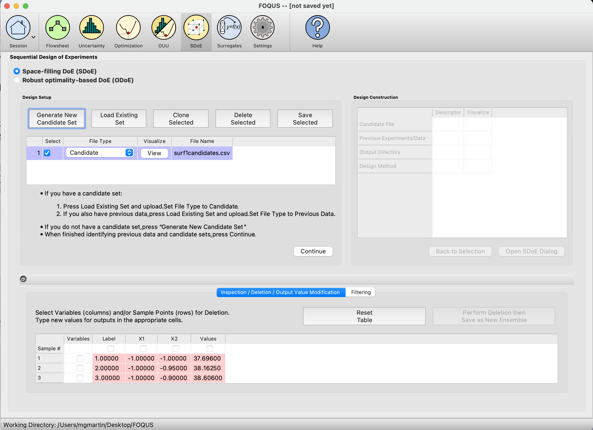
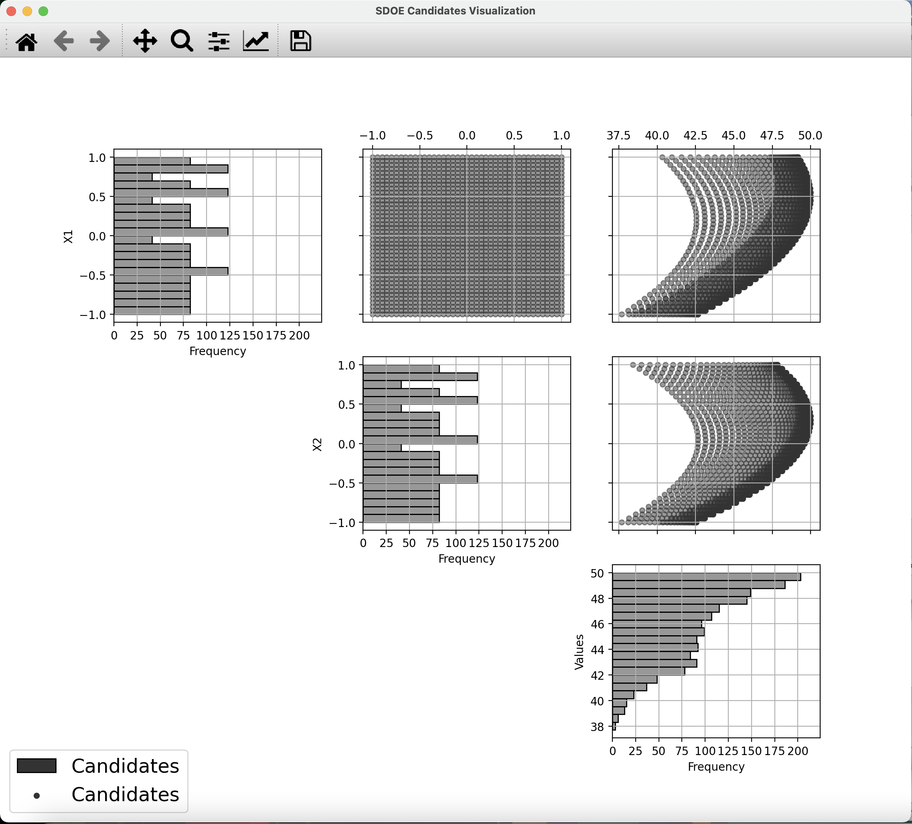
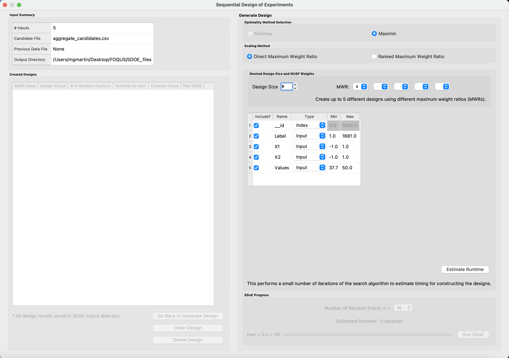
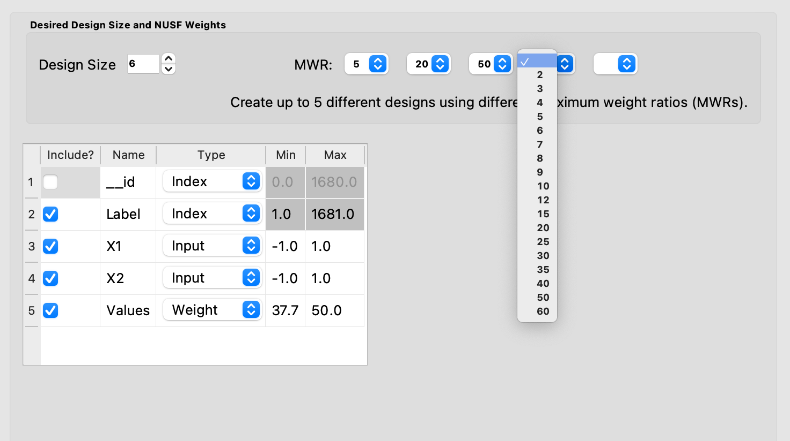
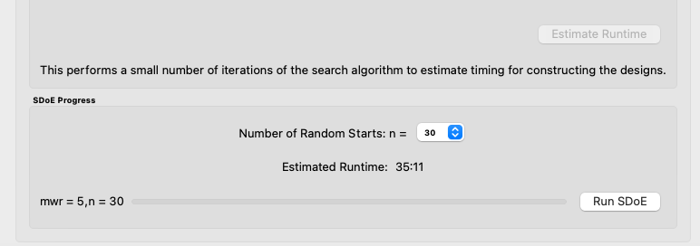
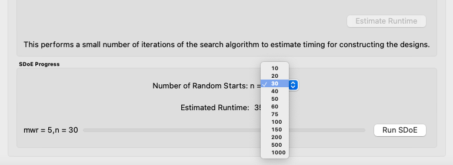
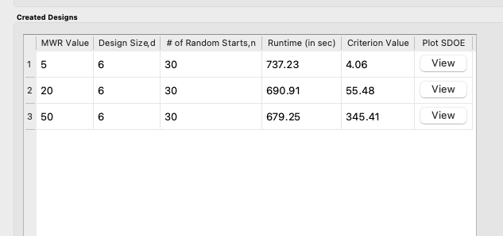
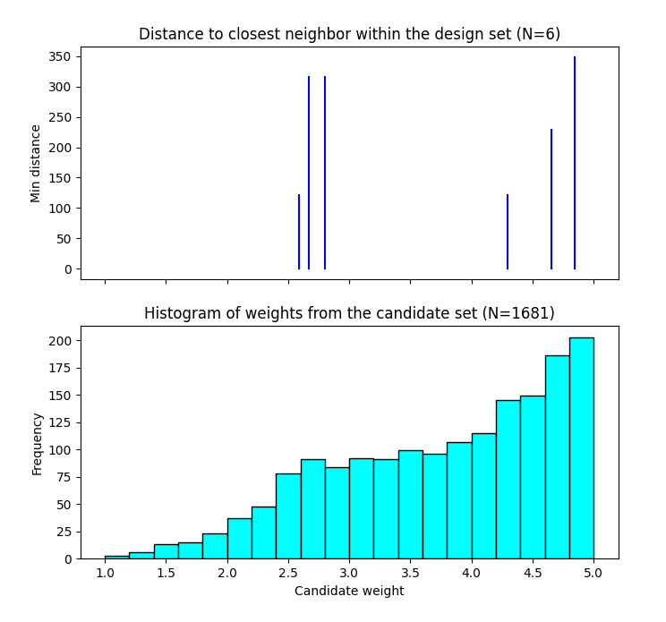
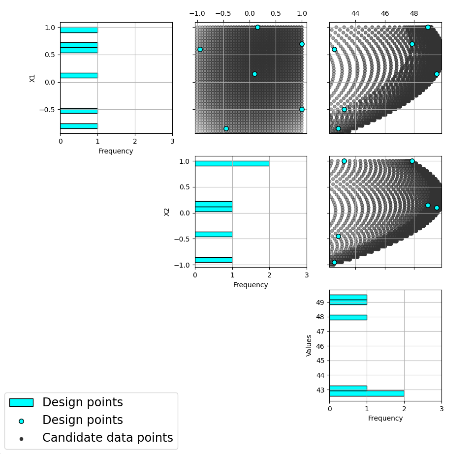

Basic Steps for a Non-Uniform Space Design
==========================================

We now consider some details for each of these steps for the second type of design, where we want to have different densities of design points throughout the chosen input region:

1.
In the **Design Setup** box, click on the **Load Existing Set** button to select the file(s) to be used for the construction of the design. Several files can be selected and added to the box listing the chosen files.

   
   SDOE Home Screen
   
2.
For each of the files selected using the pull-down menu, identify them as either a **Candidate** file or a **Previous Data** file. **Candidate** .csv files are comprised of possible input combinations from which the design can be constructed. The columns of the file should contain the different input factors that define the dimensions of the input space, as well as a column that will be used to specify the weights associated with each of the design points. Note that there is a requirement for a column to be used to identify the prioritized regions of the input space. If this is not provided, then a non-uniform space filling design cannot be created.

**Previous Data** .csv files should have the same number of columns for the input space as the candidate file (with matching column names), and represent data that have already been collected. Note that a weight column is also required for the history file, as the calculation of how close each of the points are to each other requires this. The algorithm for creating the design aims to place points farther away from locations where data have already been obtained, while also filling the input space around those locations.

Both the **Candidate** and **Previous Data** files should be .csv files that have the first row as the Column headings. The Input and Weight columns should be numeric. Additional columns are allowed and can be identified as not necessary to the design creation algorithm at a later stage.

3.
Click on the **View** button to open the **Preview Inputs** pop-up window, to see the list of columns contained in each file. The left hand side displays the first few rows of input combinations from the file. Select the columns that you wish to see graphically in the right hand box. We will select columns X1, X2, and Values (use the shift, control, or command key to select multiple columns), and then click on **Plot SDOE** to see a scatterplot matrix of the data. 

   SDOE plot of candidate set inputs
   
The plot shows histograms of each of the columns on the diagonals to provide a view of the distribution of values as well as the range of each input. The off-diagonals show pairwise scatterplots of each pair of columns selected. This should provide the experimenter with the ability to assess if the ranges specified and any constraints for the inputs have been appropriately captured for the specified candidate set. In addition, repeating this process for any historical data will provide verification that the already observed data have been suitably characterized. 

.. note::
   In this file, the “Values” column contains the numbers that will be used to define the weights. The numeric values contained in this column do not have any restrictions, except (a) there is a value provided for each row in the candidate set, and (b) that larger values correspond to points that the user wishes to emphasize with regions containing a higher density of points in the constructed design.

4.
Once the data have been verified for both the **Candidate** and **Previous Data** files, click on the **Continue** button to make the **Design Construction** window active.

5.
If more than one **Candidate** file was specified, then the **aggregate_candidates.csv** file that was created will have combined these files into a single file. Similarly if more than one **Previous Data** file was specified, then the **aggregate_previousData.csv** file has been created with all runs from these files. If only a single file was selected for either of the **Candidate** or **Previous Data** files, then their corresponding aggregated files will be the same as the original.

There are options to view the aggregated files for both the candidate and previous data files, simply scroll to the right of the Design Construction window, with a similar interface as was shown in step 3. In addition, a single plot of the combined candidate and previous data files can be viewed. In this plot the points representing the candidate locations and points of already collected data from the previous data file are shown in different colors.

6.
Once the data have been verified as the desired set to be used for the design construction, click on the **Non-Uniform Space Filling** button at the bottom right corner of the **Design Construction** window, then select **Open SDoE Dialog**. This opens the second SDOE window, which allows for specific design choices to be made.

   SDOE second window

7.
Unlike the Uniform Space Filling designs, the choice of the optimality criterion to be used is fixed at **maximin**. Recall that a **maximin** design looks to choose design points that are as far away from each other as possible. In this case, the design criterion is looking to maximize a weighted value of how close any two points are away from their nearest neighbor. Larger weights inflate the calculated distance function larger, thus making the apparent distance between the points seem closer than their standard non-weighted Euclidean distance. 

8.
The next choice to be made falls under **Scaling Method**, where the experimenter can select how the column specified in the **Weight** column will be scaled. The scaling translates the values in the column specified with the **Weight** label directly to the new range of [1, MWR], where MWR = Maximum Weight Ratio, which will be specified in the next step. The smallest value in the weight column (MinValue) gets mapped to the value 1, while the largest value in the column (MaxValue) gets mapped to the value MWR (which will be specified in the next step. For the **Direct MWR** option, the shape of the histogram of the values is preserved, through the formula: 

   ``Scaled Weight = 1 + ((MWR - 1)*(Value - MinValue)/(MaxValue - MinValue))``

For the **Ranked MWR** option, the values are sorted from smallest to largest (ties allowed) and then assigned a rank. Rank = 1 corresponds to the smallest value, while the largest Rank is the number of rows in the candidate set (NumCand). Then the scaled weights are assigned through the formula:

   ``Scaled Weight = 1 + ((MWR - 1)*(Rank - 1)/(NumCand - 1))``

.. note::
   The designs created are dependent on the choice of weights selected. The **Ranked MWR** choice creates a uniformly spaced order of points from "least important" to "most important" that results in a symmetric flat histogram for the weights, while the **Direct MWR** scaling preserves the shape of the original values. If the user is not sure which of the choices is better suited to their problem, we recommend generating designs for both choices and comparing the results to see which are a better match for desired spacing throughout the input space.
 
9.
Next, there are options for the values of the Maximum Weight Ratio (**MWR**) to be used. This is an important step in the Non-Uniform Space Filling design process, as it gives the user control about how much difference there is in the density of points. Smaller values of MWR (close to 1), result in a nearly uniform design. Larger values result in a design that has a higher density of design points for the higher weighed regions, and more sparse for the lower weighted regions. Since how this value impacts the density of the design is also a function of the histogram of the values for the **Weight** column and the choice of the **Scaling Method**, we recommend constructing designs for several MWR values and comparing their results.

The user can specify up to 5 **MWR** values, where for each of the **MWR** boxes, there is a set of choices that range from 2 to 60. This range should provide considerably flexibility in choosing how unequal the spacing will be throughout the design space.

   Choice of MWR Value and Columns

.. note::
    Here are some recommendations about the role of the MWR value and the choice of scaling:

a. Think about changes to the MWR as multiplicative or exponential (e.g. 1 - 2 - 4 - 8 - 16), not linear (e.g. 1 - 2 - 3 - 4 - 5).
b. If there are many candidate points that should be weighted approximately equally, the direct weight scaling might be more appropriate. The ranked weighting tends to spread out the final weights for similar values.
c. If the original candidate set weight distribution is close to uniformly distributed, then the **Ranked MWR** and **Direct MWR** scalings will produce very similar designs.
d. The ranked scaling for weights makes it easier to predict what the impact of a choice of MWR value will be (since the initial weight distribution is always approximately the same).
e. As the skew of the direct weight distribution increases, the effective MWR becomes consistently smaller than the chosen value (only a small fraction of the candidates are using the edges of [1,MWR] range). Hence, for skewed distributions, a larger MWR might be needed for the Direct scaling to get a design that is similar to a given **MWR** value for the Ranked weight scaling.

Also in this step, the columns of the candidate set to be used for the construction of the design are identified. Under **Include?** in the box on the right hand side, the experimenter has the option of choosing whether particular columns should be included in the space-filling design search. Uncheck a box, if a particular column should not be included in the search.

Next select the **Type** for each column. Typically most of the columns will be designated as **Inputs**, which means that they will be used to define the input space and to find the best design. For the Non-Uniform Space Design, there is a required column for the **Weights**, which designates which rows in the candidate to emphasize (bigger weights) and which to de-emphasize (smaller weights). In addition, we recommend including one **Index** column which contains a unique identifier for each run of the candidate set. This makes tracking which runs are included in the constructed designs easier. If no **Index** column is specified, a warning appears later in the process, but this column, while recommended, is not strictly required.

Notice there is a new variable included in the first row of this box called **__id**. This column is an automatically-generated index of all rows of the candidate set, meaning the column counts up from 1, uniquely identifying each row. For example, if the candidate set contains 50 rows excluding the row of column names, the **__id** column would be 1, 2, 3, …, 49, 50. The **Include** box next to **__id** can be unchecked if including this index column is not desired, but again, it is highly encouraged to have an index column to easily identify which candidate set rows are chosen in the design. The **__id** column **Type** is automatically set to **Index**. If using a different variable as the index column, make sure to uncheck the **Include** box next to **__id** and also change the **Type** of the desired index column to **Index**. 

Finally, the **Min** and **Max** columns in the box allow the range of values for each input column to be specified. The default is to extract the smallest and largest values from the candidate and previous data files, and use these. This approach generally works well, as it scales the inputs to be in a uniform hypercube for comparing distances between the design points. 

.. note::
   The default values for **Min** and **Max** can generally be left at their defaults unless: (1) the range of some inputs represent very different amounts of change in the process. For example, if temperature is held nearly constant, while a flow rate changes substantially, then it may be desirable to extend the range of the temperature beyond its nominal values to make the amount of change in temperature more commensurate with the amount of change in the flow rate. This is a helpful strategy to make the calculated distance between any points a more accurate reflection of how much of an adjustment each input requires. (2) if changes are made in the candidate or previous data files. For example, if one set of designs are created from one candidate set, and then another set of designs are created from a different candidate set. These designs and the achieved criterion value will not be comparable unless the range of each input has been fixed at matching values.

10.
Once the design choices have been made, click on the **Estimate Runtime** button. This generates a small number of iterations of the search algorithm to calibrate the timing for constructing and evaluating the designs. The time taken to generate a design is a function of the size of the candidate set, the size of the design, as well as the dimension of the input space. 

   Test SDOE timing

.. note::
   The number of random starts looks very different from what was done with the Uniform Space Filling Design. In that case, the number of random starts was offered in powers of 10. In this case, since a more sophisticated search algorithm is being used, each random start  takes longer to run, but generally many fewer starts are needed. There is set of choices for the number of random starts, which ranges from 10 to 1000. Producing a sample design for demonstration purposes with a small number of random starts (say 10 to 30) should work adequately, but recall that the choice of **Number of Random Starts** involves a trade-off between the quality of the design generated and the time to generate the design. The larger the chosen number of random starts, the better the design is likely to be. However, there are diminishing gains for increasingly large numbers of random starts. If running the actual experiment is expensive, it is generally recommended to choose as large a number of random starts as possible for the available time frame, to maximize the  quality of the design generated.

   Number of Random Start choices

11.
Once the slider has been set to the desired **Number of Random Starts**, click on the **Run SDOE** button, and initiate the construction of the designs. The progress bar indicates how design construction is advancing through the chosen range of designs for each of the **MWR** values  specified.

12.
When the SDOE module has completed the design creation process, the left window **Created Designs** will be populated with files containing the results. The column entries summarize the key features of each of the designs, including **MWR**, **Design Size** (d, the number of runs in the created design),
**# of Random Starts, n**, **Runtime** (number of seconds needed to create the design), **Criterion Value** (the value obtained for the maximin criterion for the saved design). Note that the criterion values are specific to the MWR value chosen, and hence should not be considered comparable across different values.

   SDOE Created Designs

13.
As with the Uniform Space Filling designs, to see details of the design, the **View** button at the right hand side of each design row can be selected to show a table of the design, as well as a pairwise scatterplot of the input and weight columns for the chosen design. The table and plot of the design are similar in characteristics to their counterparts for the candidate set. Candidate points and previous data are still shown in gray and pink, respectively, while the newly selected design points are shown in blue. If multiple designs were created with different **MWR** values (or using the different **Scaling Method** choices), it is helpful to examine the plots to compare their properties to those sought by the experimenter. A final choice should be made based on what is needed for the goals of the study.

14.
Similar to the Uniform Space Filling designs, to access the file with the generated design, go to the **SDOE_files** folder, and a separate folder will have been created for each of the designs. The structure of the folder and files corresponds to what was done in the Uniform Space filling design instructions. The labeling of the files is a bit different to reflect the choices that the user made in creating the design. For example, the file **nusf_d10_n1000_m30_Label+w+G+lldg+L+Values.csv** contains the design of size 10 (d10), generated from 1000 random starts (n1000), with the maximum weight ratio (MWR) set to 30 (m30). The columns from the file that were used include "Label", "w", "G", "lldg", "L" and "Values". 

When one of the design files is opened it contains the details of each of the runs in the design, with the input factor levels that should be set for that run.

To evaluate and compare the designs that have been created, it is helpful to look at a number of summaries, including the criteria values and visualizing the spread of the design points throughout the region. Recall that at the beginning of the design creation process we recommended constructing multiple designs, with different MWR values, choosing between the Direct and Ranked weighting strategies, and potentially with different design sizes. By examining multiple designs, it is easier to determine which design is best suited to the requirements of the experiment.

In the **Created Designs** table, it is possible to see the criterion values for each of the designs. When comparing two designs of the same size with the same MWR value, the **maximin** criterion should be made as large as possible. However, comparisons between designs with the same MWR value but of different sizes share the same issues that were present in the uniform space filling case. Adding more runs to the design will mean that nearest neighbors will need to get closer together, and hence we would expect that on average the criterion value would get smaller for larger experiments. Hence, we want to evaluate whether the closer packing of the design points from a larger experiment is worth the increase in cost for the additional runs.

Making comparisons for designs with different **MWR** values based on the design criterion is not recommended, because the distance metric that is embedded in the non-uniform space filling design approach adjusts based on the selected MWR value. Hence, it is not possible to make a direct comparison or easy interpretation of the values from the criterion for this approach. 
   
Hence for the NUSF designs, it is critical to use the **View** option to look at graphical summaries of the designs. Two plots are produced: The first is the **Closest Distance by Weight (CDBW) plot**, and the second is the more familiar **pairwise scatterplot** of the created design.

First, we describe the information that is contained in the CDBW plot. There are two portions to the plot. The lower section shows a histogram of the weights in the candidate set. Note that the range of values goes from 1 to the MWR value selected. For the figure below, we are looking at a design created with a MWR value of 5. The shape of the histogram shows what values were available to be selected from the candidate set. The top portion of the plot, has a vertical line for each of the design points selected (in this case 15 vertical lines for 15 design points). The location of each vertical line shows the weight for the selected design point.  

   
   A sample Closest Distance by Weight (CDBW) plot for a 6-run design with MWR value of 5
   
Second, a pairwise scatter plot of the design is provided to see how the design points fill the input space. Since the spread of the points throughout the design space is intentionally non-uniform, it is helpful to see how the distribution matches up with the specified weights provided in the candidate set. Recall that larger values of MWR lead to designs that are less evenly distributed, while MWR values that approach 1 will become closer to uniform.

   
   A sample pairwise scatterplot for the constructed design with 6 runs and a MWR value of 5
   
When **Previous Data** points have been incorporated into the design, the plots will show how the overall collection of points fill the input space. When examining the scatterplots, it is important to assess (a) whether the increase in concentration of points is located in the desired region?, (b) is the degree of non-uniformity what was desired?, (c) how close the design points have been placed to the edges of the region?, (d) are there holes in the design space that are unacceptably large?, and (e) does a larger design show a worthwhile improvement in the density of points to justify the additional expense? 

Recall that the effect of different MWR values depends on the size of the design, the spread of weights provided across the candidate points and the shape of the input region of interest. Hence, constructing several designs and comparing them can be an effective approach for obtaining the right design.

Based on the visualization of the spread of the points, the best design can be chosen that balances design performance with an appropriate use of the available budget. Recall that with sequential design of experiments, runs that are not used in the early stages might provide the opportunity for more runs at later stages. So the entire sequence of experimental runs should be considered when making choices about each stage.
