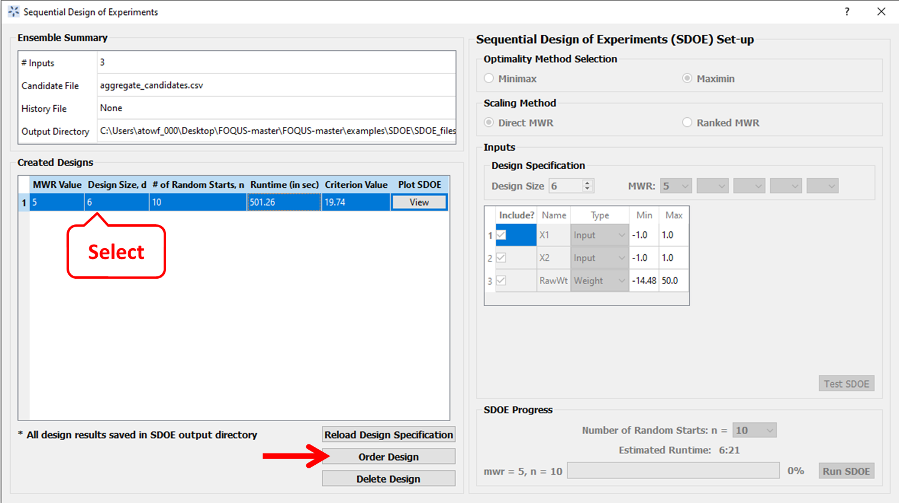
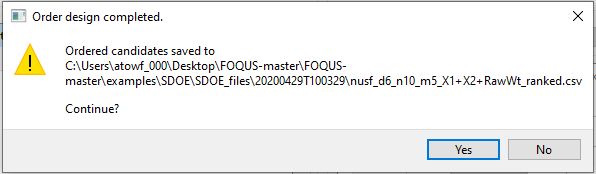

Efficient Implementation of Experimental Run Order
==================================================
  
Once designs have been created, it is often important to optimize the run order to efficiently reach equilibrium and 
allow for the maximum number of runs to be implemented within a constrainted budget or time period. While statisticians 
generally recommend using a randomized order for the experimental runs, it can sometimes mean the difference of a small 
randomized experiment versus a larger non-randomized experiment. 

.. figure:: figs/3ord-comparison.png
   :alt: Home Screen
   :name: fig.3ord-comparison
   
   Comparison of the number of runs possible with an optimized run order (left) versus an inefficient randomized run order (right)
   
In this section we describe how to generate an efficient run order for a design created using the Uniform Space Filling or 
Non-Uniform Space Filling design options.

Once we created a design (USF or NUSF), it appears on the left panel. We click on the design we want to order (it turns highlighted with blue color as shown below). Then we find the button below named "Order Design". Clicking this button will order the design points and a pop up window will confirm the location of the newly ordered file (see below).Clock 'Yes' to continue. 

   

Both design files (located in the designated folder) will be in csv format which can be opened with your preferred application (e.g. Microsoft Excel). You can scatter plot the ordered design file either using FOQUS or any other external application. 

The ordering scheme we created here is keeping the fact in mind that the user might want to design the experiment following the minimal path logic to traverse from one design point to another, i.e., minimal change of the experimental knobs. Often this would be a preferred operational logic to maintain the stability and efficiency of the experiment. However, simple sequential ordering (ascending or descending) of one parameter at a time, if preferred for some reason, can be trivially done by the user from our SDoE generated design points, hence not given here.

