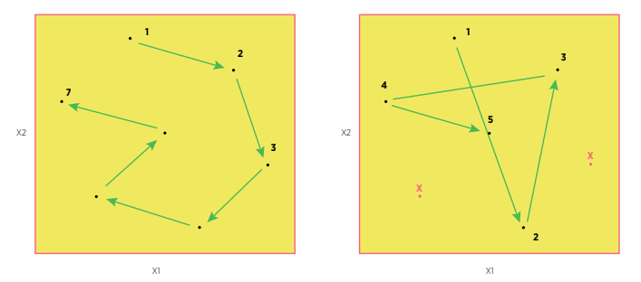

Efficient Implementation of Experimental Run Order
==================================================
  
Once designs have been created, it is often important to optimize the run order to efficiently reach equilibrium and 
allow for the maximum number of runs to be implemented within a constrainted budget or time period. While statisticians 
generally recommend using a randomized order for the experimental runs, it can sometimes mean the difference of a small 
randomized experiment versus a larger non-randomized experiment. 

   
   Comparison of the number of runs possible with an optimized run order (left) versus an inefficient randomized run order (right)
   
In this section we describe how to generate an efficient run order for a design created using the Uniform Space Filling or 
Non-Uniform Space Filling design options.
