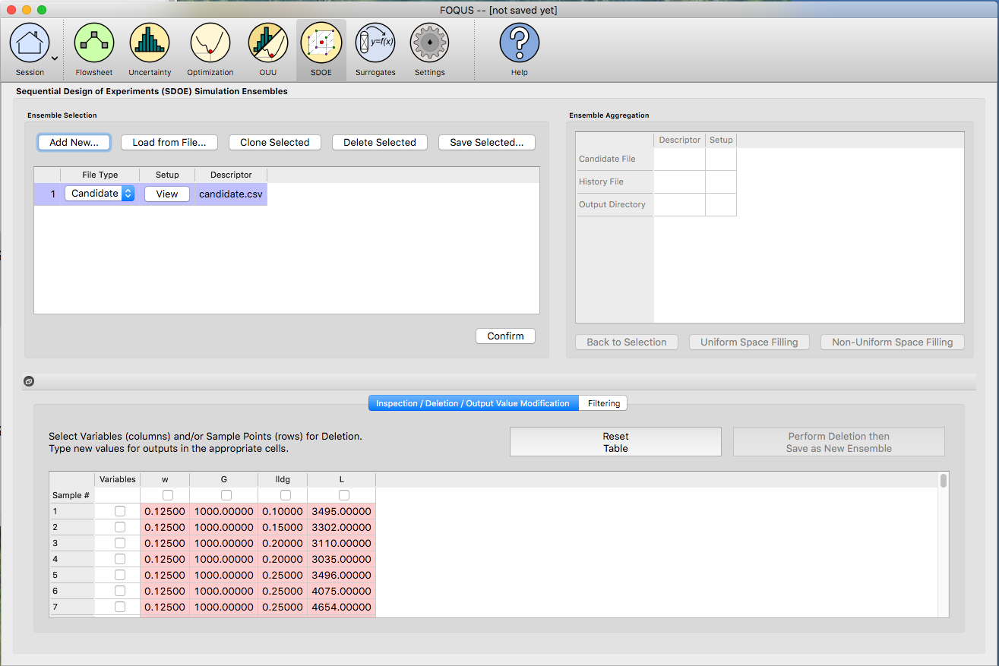
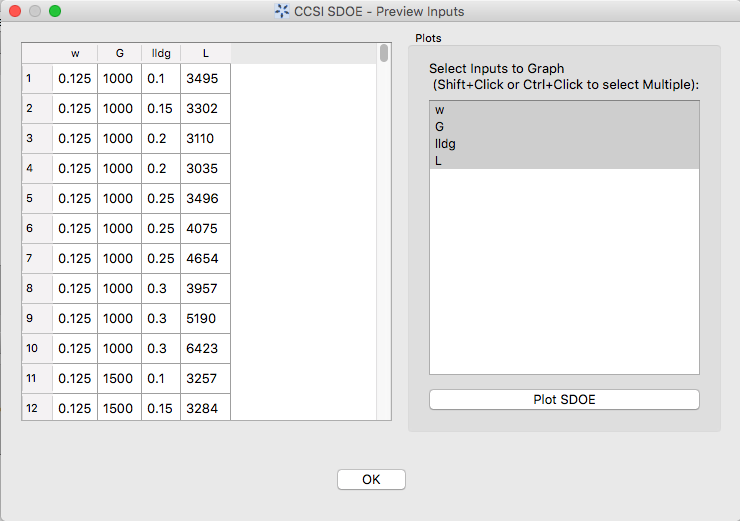
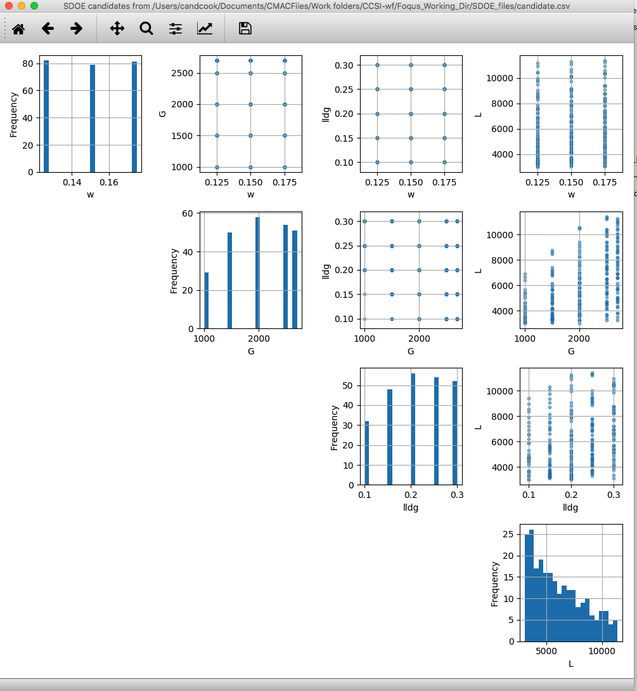
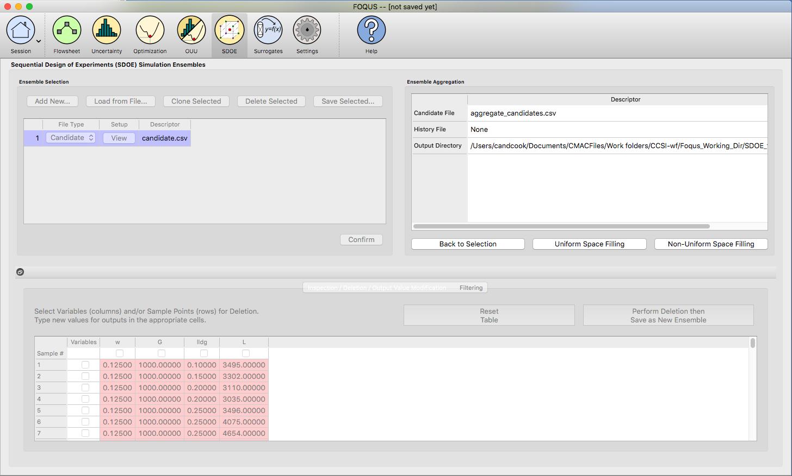
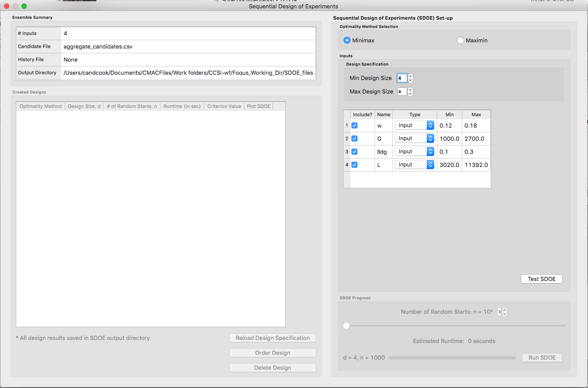
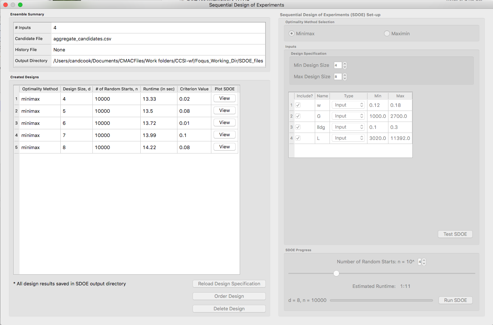
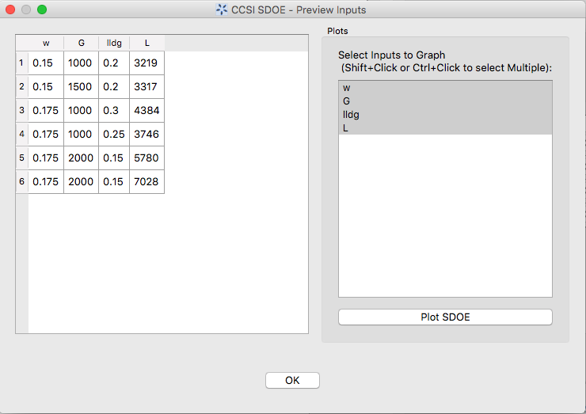
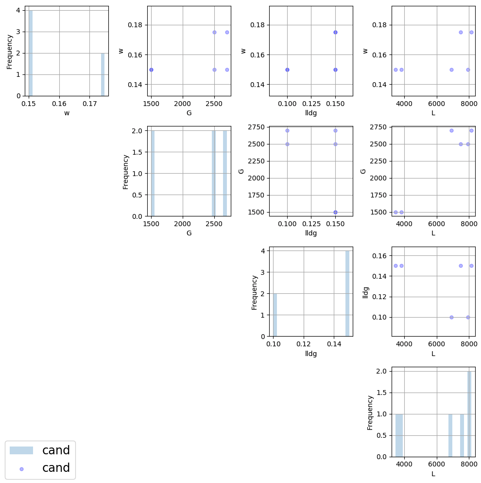
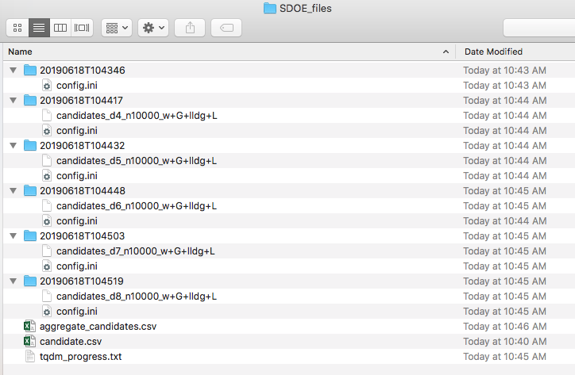
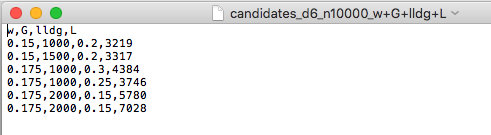

Basic Steps for a Uniform Space Design
======================================
  
We now consider some details for each of these steps:

1.
In the **Ensemble Selection** box, click on the **Load from File..** button to select the file(s) for the construction of the design. Several files can be selected and added to the box listing the chosen files.

   
   SDOE Home Screen
   

2.
For each of the files selected using the pull-down menu, identify them as either a **Candidate** file or a **History** file. **Candidate** .csv files are comprised of possible input combinations from which the design can be constructed. The columns of the file should contain the different input factors that define the dimensions of the input space. The rows of the file each identify one combination of input values that could be selected as a run in the final design. Typically, a good candidate file will have many different candidate runs listed, and they should fill the available ranges of the inputs to be considered. Leaving gaps or holes in the input space is possible, but generally should correspond to a region where it is not possible (or desirable) to collect data.

**History** .csv files should have the same number of columns for the input space as the candidate file (with matching column names), and represent data that have already been collected. The algorithm for creating the design aims to place points in different locations from where data have already been obtained, while filling the input space around those locations.

Both the **Candidate** and **History** files should be .csv files that has the first row as the Column heading. The Input columns should be numeric. Additional columns are allowed and can be identified as not necessary to the design creation at a later stage.

3.
Click on the **View** button to open the **Preview Inputs** pop-up widow, to see the list of columns contained in each file. The left hand side displays the first few rows of input combinations from the file. Select the columns that you wish to see graphically in the right hand box , and then click on **Plot SDOE** to see a scatterplot matrix of the data. 

   
   SDOE view candidate set inputs

   SDOE plot of candidate set inputs

The plot shows histograms of each of the inputs on the diagonals to provide a view of the distribution of values as well as the range of each input. The off-diagonals show pairwise scatterplots of each pair of inputs. This should provide the experimenter with the ability to assess if the ranges specified and any constraints for the inputs have been appropriately captured for the specified candidate set. In addition, repeating this process for any historical data will provide verification that the already observed data have been suitably characterized.

4.
Once the data have been verified for both the **Candidate** and **History** files, click on the **Confirm** button to make the **Ensemble Aggregation** window active.

   
   SDOE Ensemble Aggregation

5.
If more than one **Candidate** file was specified, then the **aggregate_candidates.csv** file that was created will have combined these files into a single file. Similarly if more than one **Histoy** file was specified, then the **aggregate_history.csv** file has been created with all runs from these files. If only a single file was selected for either the  **Candidate** and **History** files, then their aggregated matching files will be the same as the original.

.. note::
   There are options to view the aggregated files for both the candidate and history files, with a similar interface as was shown in step 3. In addition, a single plot of the combined candidate and history files can be viewed. In this plot the  points represent the candidate locations and points of already collected data from the history file are shown in different colors.

6.
Once the data have been verified as the desired set to be used for the design construction, then click on the **Uniform Space Filling** button at the bottom right corner of the **Ensemble Aggregation** window. This opens the second SDOE window, which allows for specific design choices to be made.

   SDOE second window

7.
The first choice to be made for the design is whether to optimize using **minimax** or **maximin**. The first choice, **minimax**, looks to choose design points that minimize the maximum distance that any point in the input space (as characterized by the candidate set and historical data, if it is available) is away from a design point. Hence, the idea here is that if we want to use data to help predict new outcomes throughout the input space, then we never want to be too far away from an observed location. The second choice, **maximin** looks to choose a design where the design points are as far away from each other as possible. In this case, the design criterion is looking to maximize how close any two points are away from their nearest neighbor. In practice the two design criterion often give similar designs, with the **maximin** criterion tending to push the chosen design points closer to the edges of the specified regions. 

.. hint::
   If there is uncertainty about some of the edge points in the candidate set being viable options, then **minimax** would be preferred. If the goal is to place points throughout the input space with them going right to the edges, than **maximin** would be preferred. Note, that creating the designs is relatively easy, so it may be helpful to try both approaches to examine them and then choose which is preferred.

8.
The next choice to be made falls under **Design Specification**, where the experimenter can select the sizes of designs to be created. The **Min Design Size** specifies the smallest design size to be created. Note that the default value is set at **2**, which would lead to choosing the best two design runs from the candidate set to fill the space (after taking into account any historical data that have already been gathered).

The **Max Design Size** specifies the largest design size to be created. The default value is set at **8**, which means that if this combination were used, designs would be created of size 2, 3, 4, 5, 6, 7 and 8. Hence, it may be prudent to select a relatively small range of values to expedite the creation of the designs, as each of these choices triggers a separate optimization search. In the figure above, the **Min Design Size** has been changed to 4, so that only the designs of size 4, 5, 6, 7 and 8 will be created.
 
9.
Next, there are options for the columns of the candidate set to be used for the construction of the design. Under **Include?** in the box on the right hand side, the experimenter has the option of whether particular columns should be included in the space-filling design search. Unclick a box, if a particular column should not be included in the search.

Next select the **Type** for each column. Typically most of the columns will be designated as **Inputs**, which means that they will be used to find the best design. In addition, we recommend including one **Index** column which contains a unique identifier for each run of the candidate set. This makes tracking which runs are included in the constructed designs easier. If no **Index** column is specified, a warning appears later in the process, but this column is not strictly required.

Finally, the **Min** and **Max** columns in the box allow the range of values for each input column to be specified. The default is to extract the smallest and largest values from the candidate and history data files, and use these. This approach generally works well, as it scales the inputs to be in a uniform hypercube for comparing distances between the design points. 

.. hint::
   The default values for **Min** and **Max** can generally be left at their defaults unless: (1) the range of some inputs represent very different amounts of change in the process. For example, if temperature is held nearly constant, while a flow rate changes substantially, then it may be desirable to extend the range of the temperature beyond its nominal values to make the amount of change in temperature more commensurate with the amount of change in the flow rate. (2) if changes are made in the candidate or history data files. For example, if one set of designs are created from one candidate set, and then another set of designs are created from a different candidate set. These designs and the achieved criterion value will not be comparable unless the range of each input has been fixed at matching values.

10.
Once the design choices have been made, click on the **TestSDOE** button. This generates a small number of iterations of the search algorithm to calibrate the timing for constructing and evaluating the designs. The time taken to generate a design is a function of the size of the candidate set, the size of the design, as well as the dimension of the input space. The slider below **TestSDOE** now indicates an estimate of the time to construct the designs across the range of the **Min Design Size** and **Max Design Size** specified. The smallest **Number of Random Starts** is 10^3 = 1000 is generally too small to produce a good design, but this will run very quickly. Powers of 10 can be chosen with an **Estimated Runtime** provided below the slider. 

   SDOE second window after clicking Test SDOE

.. hint::
   The choice of **Number of Random Starts** involves a trade-off between the quality of the design generated and the time to generate the design. The larger the chosen number of random starts, the better the design is likely to be. However, there are diminishing gains for increasingly large numbers of random starts. If running the actual experiment is expensive, it is generally recommended to choose as large a number of random starts as possible for the available time frame, to maximize the  chance of an ideal design being found.

11.
Once the slider has been set to the desired **Number of Random Starts**, click on the **Run SDOE** button, and initiate the construction of the designs. The progress bar indicates how design construction is progressing through the chosen range of designs between the **Min Design Size** and **Max Design Size** specified.

12.
When the SDOE module has completed the design creation process, the left window **Created Designs** will be populated with files containing the results. The column entries summarize the key features of each of the designs, including **Optimality Method** (whether minimax or maximin was used), **Design Size** (d, the number of runs in the created design), **# of Random Starts**, **Runtime** (number of seconds needed to create the design), **Criterion Value** (the value obtained for the minimax or maximin criterion for the saved design).

   SDOE Created Designs

13.
To see details of the design, the **View** button at the right hand side of each design row can be selected to show a table of the design, as well as a pairwise scatterplot of the inputs for the chosen design. The table and plot of the design are similar in characteristics to their counterparts for the candidate set.

   SDOE table of created design
   

   SDOE pairwise plot of created design
   
14.
To access the file with the generated design, go to the **SDOE_files** folder, and a separate folder will have been created for each of the designs. In the example shown, 5 folders were created for the designs of size 4, 5, 6, 7 and 8, respectively. In each folder, there is a file containing the design, with a name that summarizes some of the key information about the design. For example, **candidates_d6_n10000_w+G+lldg+L** contains the design created using the candidate set called candidates.csv, with d=6 runs, based on n=10000 random starts, and based on the 4 inputs W, G, lldg and L.

   SDOE directory

When one of the design files is opened it contains the details of each of the runs in the design, with the input factor levels that should be selected for that run.

   SDOE file containing a created design
   