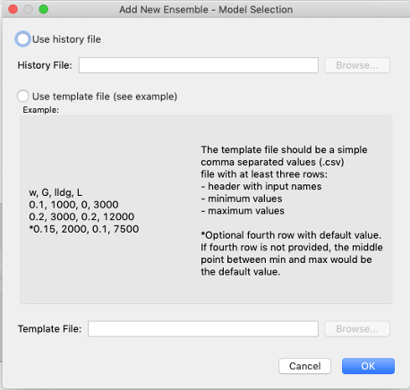
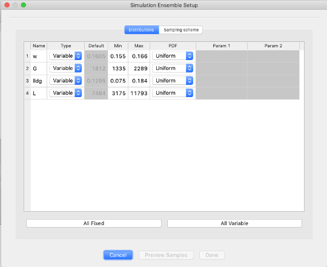
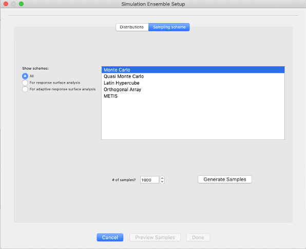
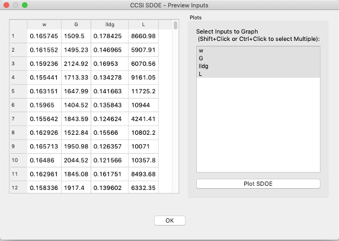
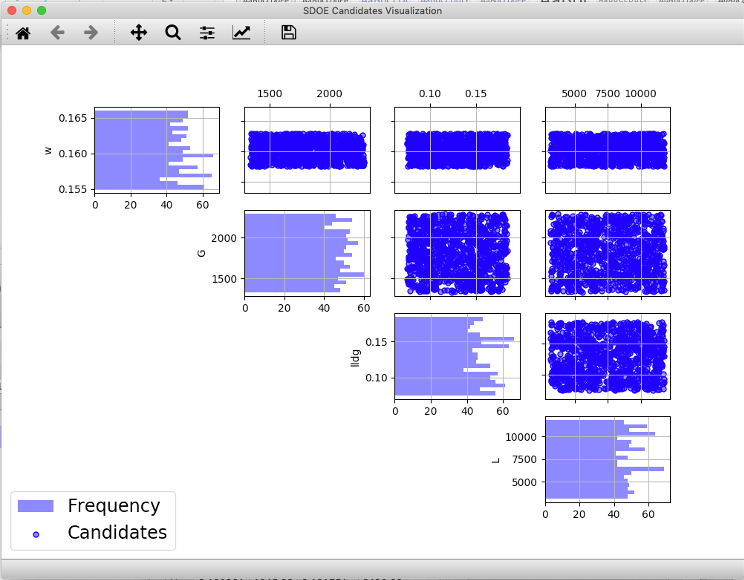

Creating a New Candidate Set
==========================================

To create a new candidate set the user can choose between two options: loading from an existing file or generating a new
candidate set providing some ranges for each input.

.. note::
    To use this feature you need to install the latest version of PSUADE. For more details go to section :ref:`install_optional`

Loading from File
-----------------

In the **Ensemble Selection** box, click on the **Load from File...** button to select the file(s) for the construction
of the design. Several files can be selected and added to the box listing the chosen files.

For each of the files selected using the pull-down menu, identify them as either a **Candidate** file or a **History**
file. **Candidate** .csv files are comprised of possible input combinations from which the design can be constructed.
The columns of the file should contain the different input factors that define the dimensions of the input space. The
rows of the file each identify one combination of input values that could be selected as a run in the final design.
Typically, a good candidate file will have many different candidate runs listed, and they should fill the available
ranges of the inputs to be considered. Leaving gaps or holes in the input space is possible, but generally should
correspond to a region where it is not possible (or desirable) to collect data.

**History** .csv files should have the same number of columns for the input space as the candidate file (with matching
column names) and represent data that have already been collected. The algorithm for creating the design aims to place
points in different locations from where data have already been obtained, while filling the input space around those
locations.

Both the **Candidate** and **History** files should be .csv files that have the first row as the Column heading. The
Input columns should be numeric. Additional columns are allowed and can be identified as not necessary to the design
creation at a later stage.

Generating a New Candidate Set
------------------------------

In the **Ensemble Selection** box, click on the **Add New...** button to select the file for the construction of the
candidate set. The following menu will appear:

The user can select between two options: using a history file or a template file.

#. **History File.** An existing .csv file with historical data is required. If this option is selected, then the inputs
   to be used in the candidate set are extracted from the columns of the file.

#. **Template File.** The template file should be a simple comma separated values (.csv) file with at least three rows:

   - Header with input names
   - Minimum values
   - Maximum values

An optional fourth row with default value can be added. If fourth row is not provided, the middle point between min and
max becomes the default value.

.. note::
    Choosing History or Template file won't change the next steps.

Once the user has decided on which file to use, click on the OK button and the following dialog will pop up:

Decide on the type of input (variable or fixed) and the probability distribution function desired. If the input is set
to variable, the user can modify minimum and maximum values to define the range over which sampling should be drawn. If
input is set to fixed, then user selects the default value that will be used for all samples. Then click on the
**Sampling Scheme** tab and you’ll see the following menu:

Choose sampling scheme to be used. The Monte Carlo and Quasi Monte Carlo options provide candidates that are scattered
arbitrarily throughout the input space, while Latin Hypercube, Orthogonal Array and METIS provide different approaches
for structured distribution throughout the input space. Next, choose the number of samples you want to generate and
click on **Generate Samples** button. The user can preview the samples by clicking on the **Preview Samples** button.

On the left-hand side table, you can explore the generated data for the different inputs and on the right-hand side list
you can select which inputs you want to plot.

Once you are happy with the samples generated then click on **Done** button, so the new candidate set gets saved and
populated in the **Ensemble Selection** box.