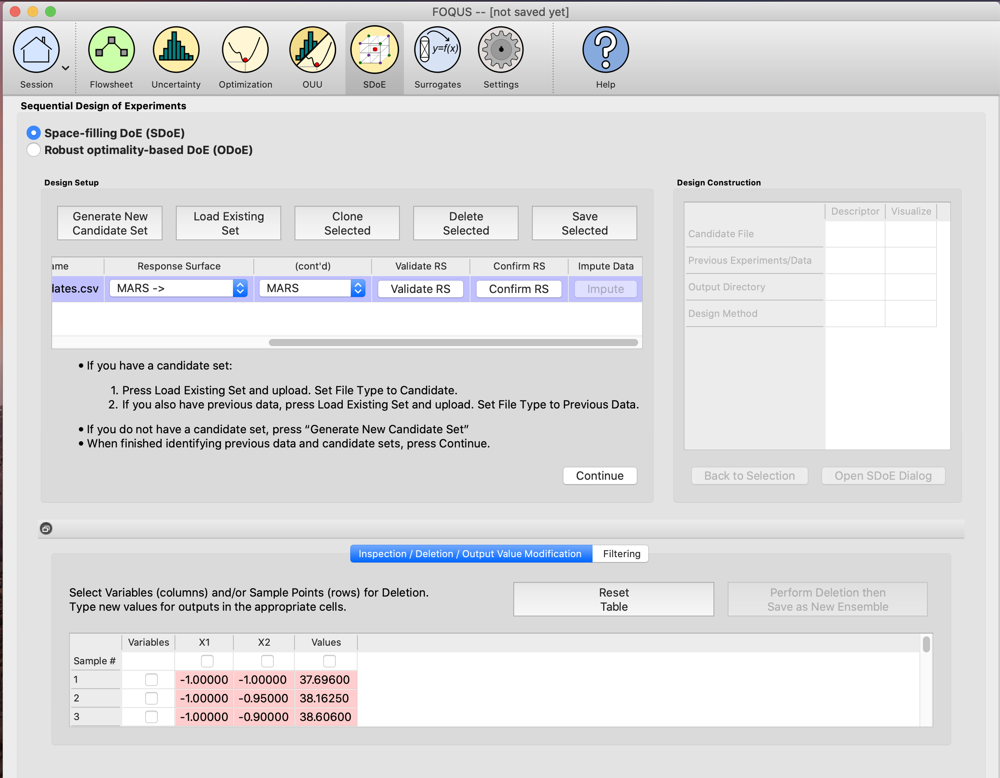
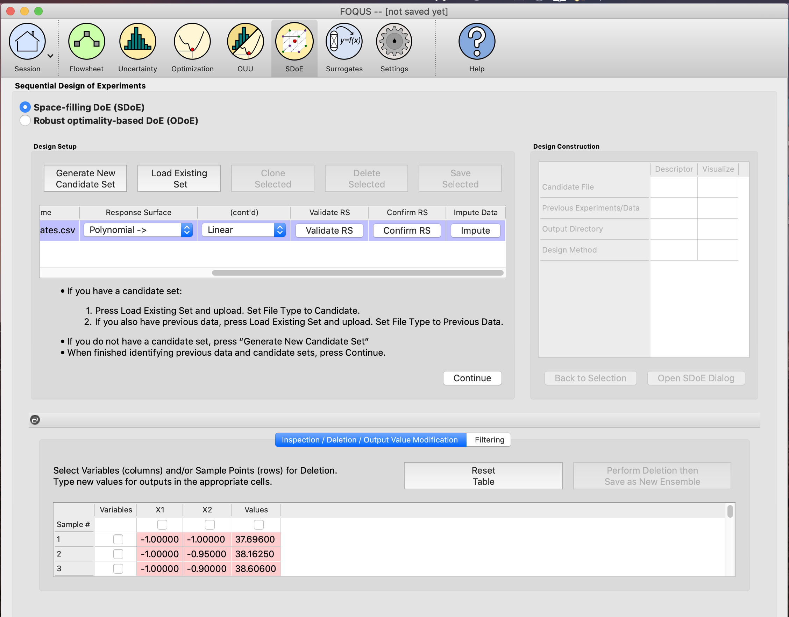
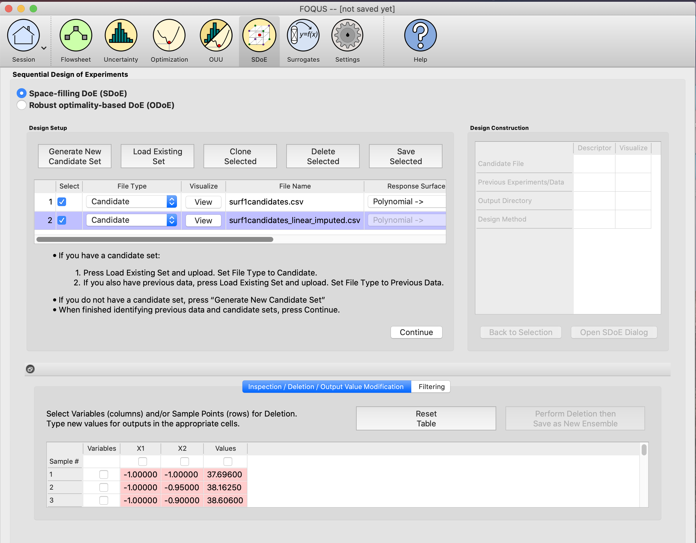

Using the Data Imputation Feature
==========================================

There is a chance the user wants to use a candidate set to generate a design (NUSF or IRSF only) that has missing values
either in the weights column (NUSF) or the response column (IRSF). The data imputation feature, uses the response surface
capability integrated from the Uncertainty Quantification (UQ) module to impute those missing values and return the user
a complete candidate set ready to use for the design creation.

The new complete candidate set is given as a separate file from the original set. It is very important that the
original incomplete candidate set be deleted or deselected (unchecked) before continuing. If not, the new and old
candidate sets will be combined, and will still contain missing values.

.. note::
    To use this feature you need to install the latest version of PSUADE. For more details go to section :ref:`install_optional`

When the user clicks on the **Load Existing Set** button in the **Design Setup** section and selects a candidate set,
the program will run a quick file scan and show the missing values (if any) for all the existing columns.

We can see in this specific candidate set, there are 50 missing values for the **Values** column (that could be either
our weight column in NUSF or our response column in IRSF). Click **OK** and the incomplete candidate set will get loaded
in the **Design Setup** table. Notice there are new elements that become available in the candidate row
(**Response Surface** and **Validate RS**).

The user needs to select a response surface from the ones available in the drop-down menu:
    #. Polynomial, Linear
    #. Polynomial, Quadratic
    #. Polynomial, Cubic
    #. MARS
    #. Gaussian Process

For this particular example we will be using MARS. Once the response surface is selected, click the **Validate RS**
button. A response surface validation plot will be generated and also an informative message window will pop up telling
the user to confirm if the response surface satisfy their needs or to select a different response surface and validate
again if it doesn't.

The validation plot is a plot of expected values based on the model versus the actual values. The better the
model fits, the closer the points will be around the diagonal line.

Since this particular validation plot looks good (note the points falling along the diagonal line), user can go ahead
and confirm the response surface by clicking the **Confirm RS** button.

After clicking the **Confirm RS** button, the **Impute** button under the **Impute Data** column will become available.
Click the **Impute** button to impute the missing values.

When the program is done imputing the missing values, it will populate the **Design Setup** table with a new candidate
set that will be an exact copy of the previous candidate set but with the missing values filled up.

If the user clicks on the **View** button under the **Visualize** column in the **Design Setup** table, the
**Preview Inputs** dialog will show up. Click on the **Plot SDoE** button and you will be able to see the original and
the imputed values (in red).

If the user is happy with the updated and complete candidate set, they can go ahead and perform business as usual.
Just remember to either delete the incomplete candidate set using the **Delete Selected** button or simply uncheck the
checkbox under the **Select** column in the **Design Setup** table.
