Example IRSF-1: Constructing Input-Response Space Filling maximin designs for a 2-D input space with 1-D response
=================================================================================================================

For this first Input-Response Space Filling design example, the goal is to construct a Pareto front of input-response space-filling designs, all with 20 runs in a 2-dimensional input space based on a regular unconstrained square region populated with a grid of candidate points, along with a single response variable. All designs on the Pareto front have a unique balance of space filling in the input space and response space, giving the experimenter latitude to choose which design is best for a particular situation. 

The choice of how to construct the candidate set should be based on: (a) what is the precision with which each of the inputs can be set in the experiment (the candidate set should not contain increments finer than what can be set in the experiment), and (b) timing for generating the designs. The finer the grid that is provided in the candidate set, the longer the search algorithm will take to run for a given number of random starts. In general, a finer grid will give better options for the best design, but with diminishing returns after a large number of candidates have already been provided.

As noted previously in the Basics section, in addition to specifying the candidate point input combinations, it is also required to supply an additional column of the likely response variable values (or multiple columns for multiple responses of interest). This column will be used to make sure that space filling is being accomplished in the response space as well as the input space. 

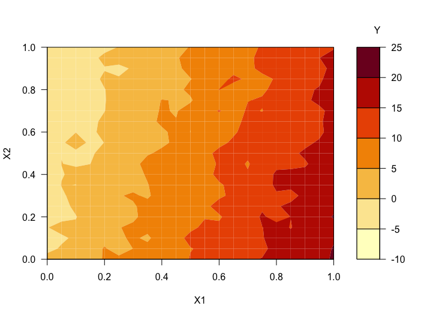
   
   Figure 1: Contour plot of the candidate set, with the two inputs X1 and X2 on the axes and the response Y in color

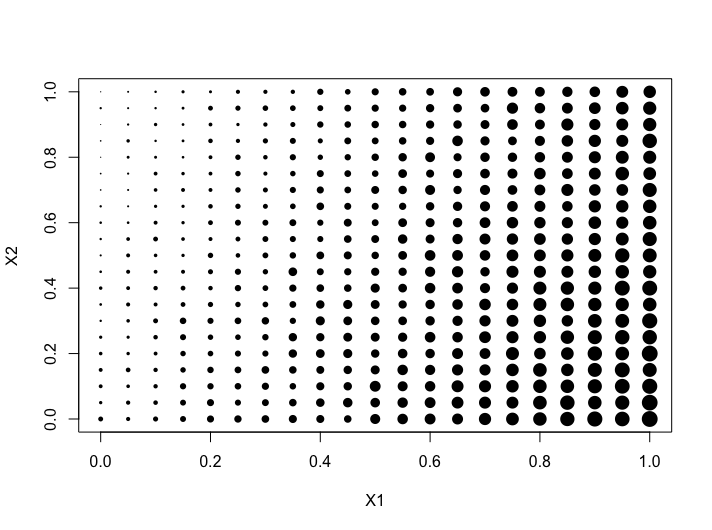
   
   Figure 2: Plot of the candidate set, here with Y represented in the point size

The candidates are laid out in a regular grid with equal spacing between levels of each of X1 and X2. There is a single response variable of interest, Y. The relationship between the inputs X1 and X2 and the response of interest Y can be characterized by a linear model.

A contour plot of the function that was used to generate the response values is shown in Figure 1 above. In Figure 2, we can see a plot where the relative size of the points is proportional to the size of the response associated with that candidate point. This second representation is helpful when the candidate points do not fall on a regular grid, or if the relationship of the response and the inputs is not smooth. 

Here is the process for generating IRSF designs for this problem:

1.
From the FOQUS main screen, click the **SDOE** button. On the top left side, select **Load Existing Set**, and select the “irsf-example1-candset.csv” file from the examples folder.

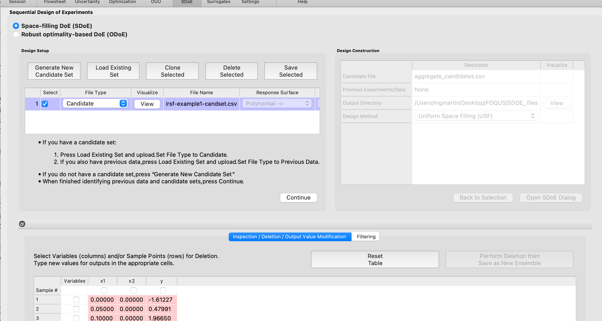
   
   Figure 3: SDOE Module First Page

2. 
Next, by selecting **View** and then **Plot**, it is possible to see the grid of points that will be used as the candidate points. In this case, the range for each of the inputs, X1 and X2, has been chosen to be between 0 and 1. The range of the response, Y, is from -5 to 21. 

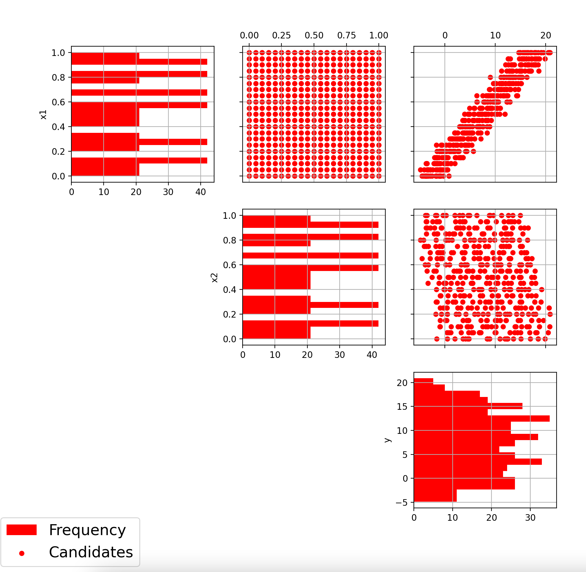
   
   Figure 4: Pairwise Scatterplots of the Candidate Set

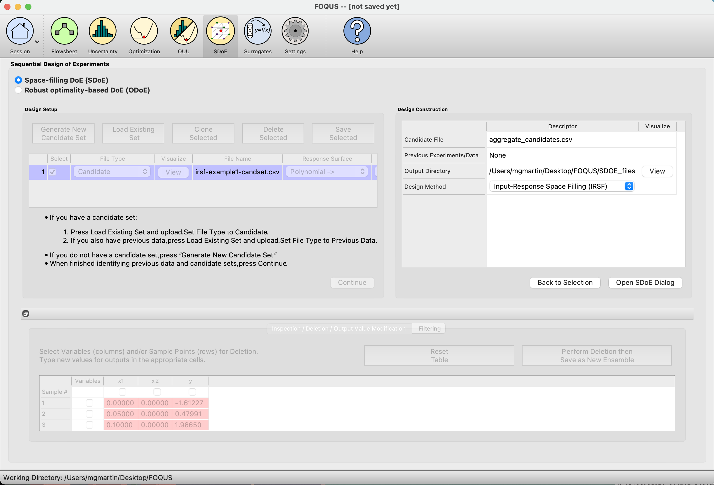
   
   Figure 5: Choose Design Method on the Right-Hand Side
   
3. 
Next, click on **Continue** to advance to the **Design Construction** Window, and then click on **Input-Response Space Filling (IRSF)** to advance to the second SDOE screen, where particular choices about the design can be made. On the second screen, the first choice for **Optimality Method Selection** is automatic, since the input-response space filling designs only use the **Maximin** criterion. We next select the **Design Size**, where here we have decided to construct a design with 10 runs. The choice of design size is typically based on the budget of the experiment.

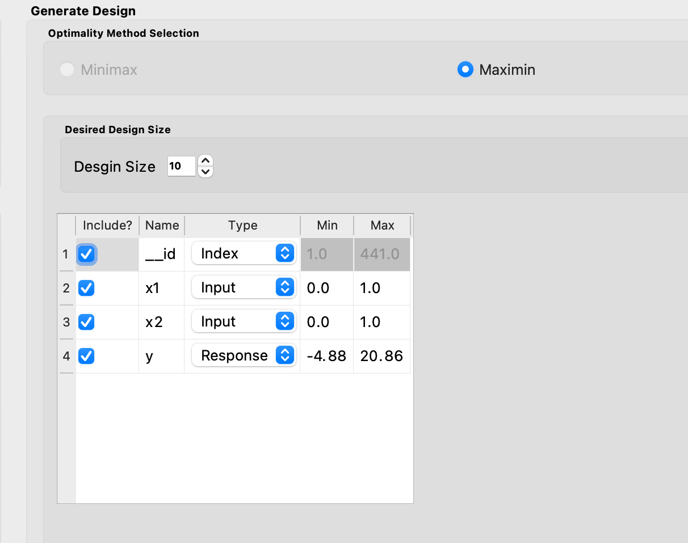
   
   Figure 6: Generate Design Box for Making Design Selections

There are also choices for which columns to include in the design construction. Here we use all 3 columns for creating the design, so the three **Include?** boxes for our **X1**, **X2**, and **Y** columns remain checked. In addition, it is possible to see the range of values for each of the columns in the spreadsheet. Here the two input columns range from 0 to 1, while the Y column ranges from -4.88 to 20.86. The user can change these values if they wish to rescale the ranges to widen or narrow them, but in general these values can be left as is. There is an automatic index column called **“_id”** in the first row of the design generation box. The **Type** is preselected as **Index**, though if not needed, the **Include?** could be unchecked to exclude this column from the candidate set. We will keep it as we have no other index column in the candidate set. 

Next, we must confirm that each row has the correct **Type** indicated. The index column has the type **Index**. The two input columns **X1** and **X2** have type **Input**. The response variable **Y** currently has the type **Input** which must be changed to **Response** before moving forward with creating an input-response space filling design. 

4. 
Once the choices for the design have been specified, click on the **Estimate Runtime** button to estimate the time required for creating the designs. For the computer on which this example was developed, if we ran 10 random starts, it is estimated that the algorithm would take 4 minutes and 49 seconds to generate the designs and identify those on the Pareto front. Note that the timing changes linearly, so using 20 random starts would take twice as long as using 10 random starts. Recall that the choice of the number of random starts involves a trade-off between getting the designs created quickly and the quality of the designs. For many applications, we would expect that using at least 20 random starts would produce designs that are of good quality. For this example, we select to run 20 random starts, which is projected to take 9 minutes and 38 seconds. 

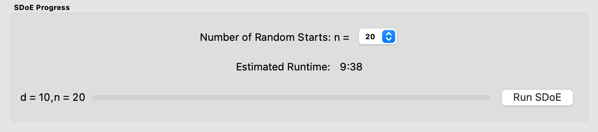
   
   Figure 7: Number of Random Starts

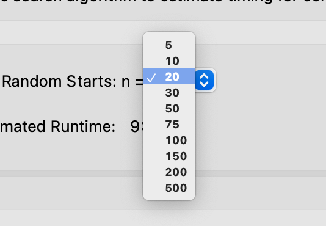
   
   Figure 8: Choices for Number of Random Starts

5. 
Once the algorithm has generated the designs, the left box called **Created Designs** populates with the Pareto front of designs that we have created. The Pareto front will populate a single row of the Created Designs box, and will display some useful information such as the **Number of Designs** found on the Pareto front, **Number of Random Starts** used, and the **Runtime**. If another design search is run afterwards, that Pareto front will populate the next row, and so on.  

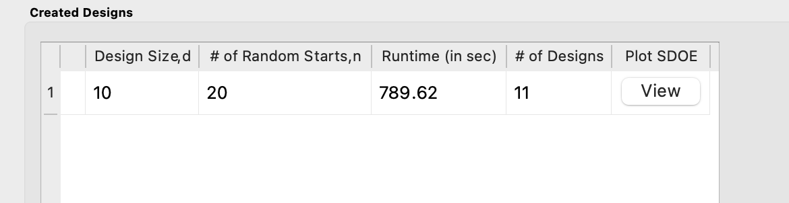
   
   Figure 9: Created Designs

6. 
To examine the Pareto front and each of the designs on the Pareto front, select **View**. A plot of the Pareto front will appear, with color-coded points representing the different designs on the Pareto front. Larger values on the x- and y-axis indicate designs that have better space-filling properties in the input and response space, respectively. An ideal design would be near the top-right corner of the plot, with very large values on both the x- and y-axis, however this is rarely seen in practice. In reality, gains in space-filling in one space often come at the cost of space-filling in the other space. So, the Pareto front gives a spectrum of designs for which each is the best design for its given weighting of input and response space-filling. Along the ends of the Pareto front, one of the spaces is weighted much more heavily than the other. Closer to the center of the Pareto front, the two spaces are weighted more equally. Experimenters will need to examine many designs, with different levels of input and response space filling properties, to find the right balance for their individual needs.

As we explained in the Basics section, a Pareto front is made up of a collection of objectively best designs for different weightings of space-filling in the response and space-filling in the input spaces. A design that is on the Pareto front cannot be improved along one criterion of interest (space-filling in the response or space-filling in the input space) without worsening along the other criterion; if a design is located on the Pareto front, there exists no other design that is the same or better in both dimensions. Thus, it may be confusing to some users that this Pareto front below shows some pairs of designs connected by a vertical line, indicating one should outperform the other in the vertical dimension (space-filling in the response). However, this is simply a result of rounding in the horizontal dimension. The true values are in fact different by a small amount in space-filling in the input space.   

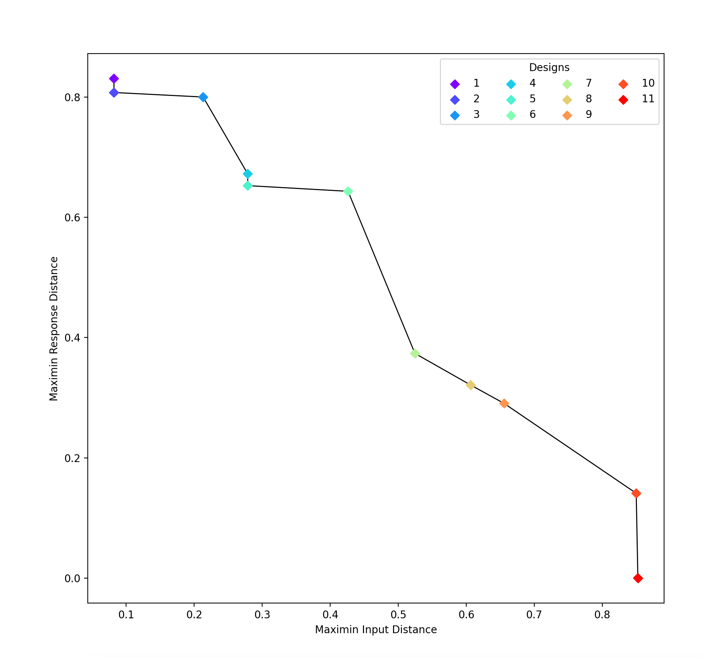
   
   Figure 10: Pareto Front of Created Designs

Once the Pareto front has been examined, experimenters should further explore by **clicking on one of the color-coded design points within the plot to view that design**. Once a point is selected, a pairwise scatterplot of the chosen design will open, with the scatterplots and histograms being of the same color as the design point on the Pareto front for ease of comparison between designs. Multiple designs can be open simultaneously. 

7. 
To get a better understanding of the different designs located on the Pareto front, we will examine three: one from the left end, one from the right end, and one from the middle. The three designs we will choose are Design 1 (purple), Design 11 (red), and Design 7 (green), as shown on the Pareto front plot above. 

From the values on the axes in Figure 10 for each of the three design points, we can determine, even before viewing the individual designs, several important facts. We know that Design 1 (purple) is the best design if we want the objectively-best space-filling in the response space, and don’t mind poor space-filling in the input space. Similarly, we know that Design 11 (red) is the best design if we want the objectively-best space-filling in the input space, and don’t mind poor space-filling in the response space. We also know Design 7 (green) will offer a compromise, with moderate space-filling in both spaces. Design 7, or another compromise design along the Pareto front, is a good choice if we hope to balance space-filling in the input and response spaces. 

.. note:: 
   The design with the best space-filling in the input space overall, here Design 11 (red), is the same as a regular uniform space-filling design. 

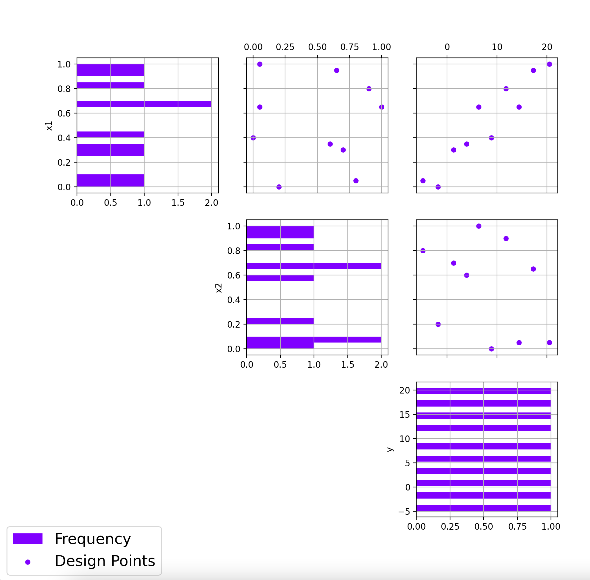
   
   Figure 11: Pairwise Scatterplot of Design 1

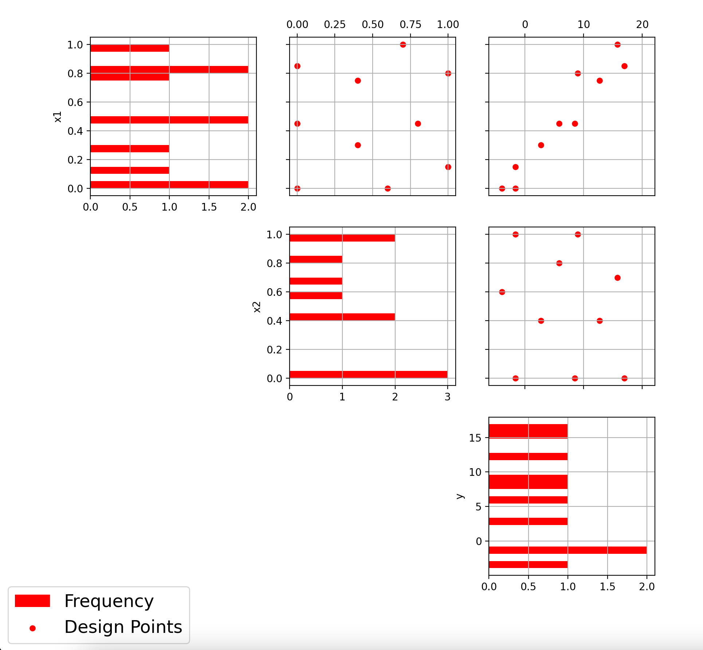
   
   Figure 12: Pairwise Scatterplot of Design 11
   
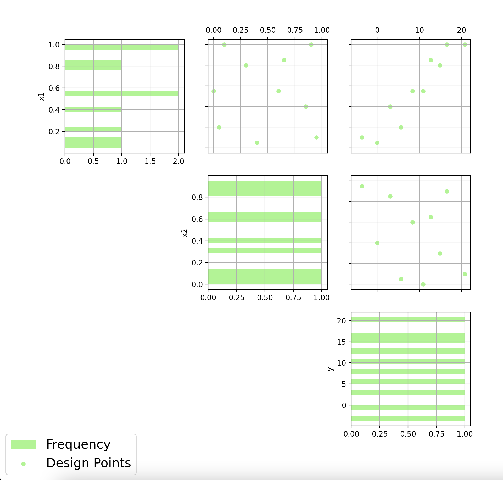
   
   Figure 13: Pairwise Scatterplot of Design 7

To determine how well a design fills the response space, we will look at the histogram for the response, Y, in the bottom-right for each of the designs and see how evenly spread the values appear. If we had a two- or higher-dimensional response space, we would examine the scatterplot(s) for the response variables for even spacing. We can confirm that Design 1 (purple) does have the best space-filling in the response space of the three. The values of the response are evenly spread throughout the space, with no large gaps. By contrast, Design 11 (red) has many holes and gaps in the response space.

Even though the criterion value for response space-filling in Design 7 (green) is less than half that of Design 1 (purple), the response space-filling in Design 7 seems to fill the space fairly well. The differences in criterion values provide a useful summary of the trade-offs but it is important to also examine the scatterplots directly for a more intuitive illustration of what these trade-offs will look like in practice. 

To examine input space-filling, we will now look at the scatterplot of the input variables, X1 and X2, located in the top-middle. If we had more than two input variables, we would look at a combination of pairwise scatterplots. It would be a bit harder to determine how well the space-filling of a given design appeared, so in that case, we rely more heavily on the position of the design on the Pareto front. 

Here, Design 11 (red) definitely has the best input space-filling. The design points are spread apart with no large holes or gaps, covering the entire space well. The input space-filling in Design 1 (purple) has many large holes, and even that in Design 7 (green) has a few holes. 

With this variety of space-filling designs, plus the 8 more located on the Pareto front, it’s easy to see there are many “best” designs for any given weighting of input and response space-filling. The Input-Response Space-Filling design tool gives the experimenter the flexibility to consider each design on the Pareto front to find the compromise between input and output space-filling to best fit the experimental objectives.

8. 
In the case of this example, we were hoping to find a design with good space-filling in both spaces. Design 7 (green) is an excellent candidate for this, though to be thorough we should also examine Designs 6 and 8, and even 4, 5, and 9, to see how these other “best” designs balance space-filling uniquely in the two spaces. 
