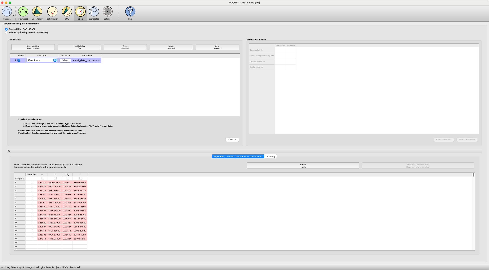
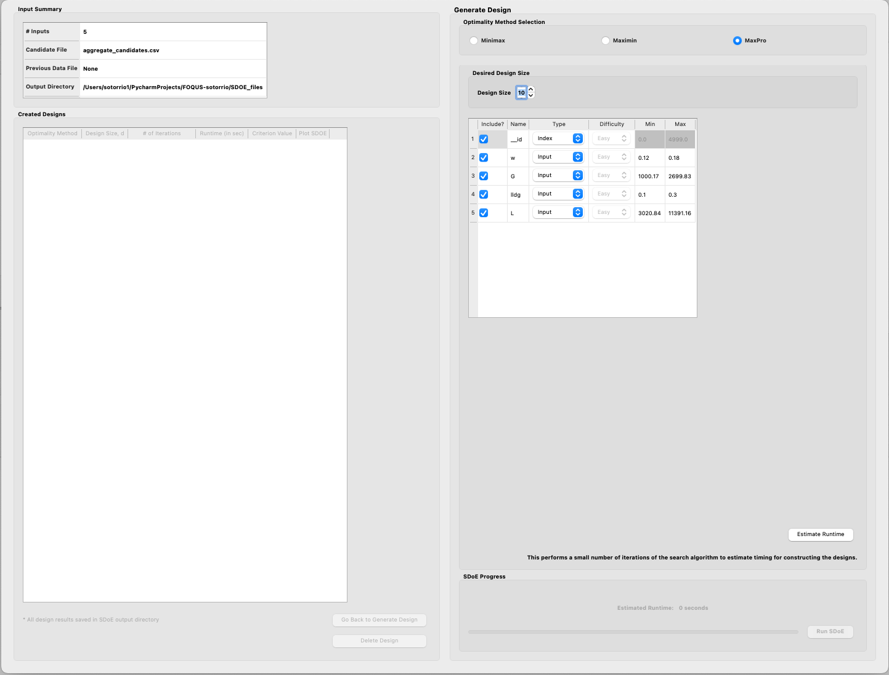
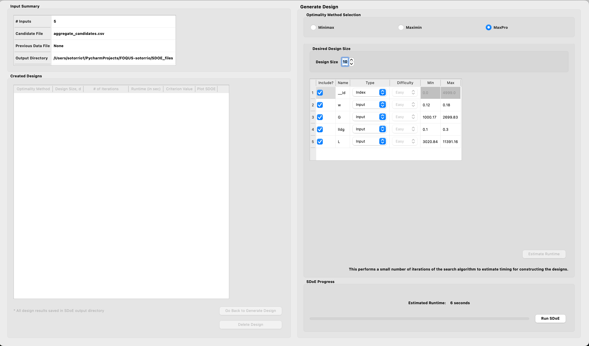
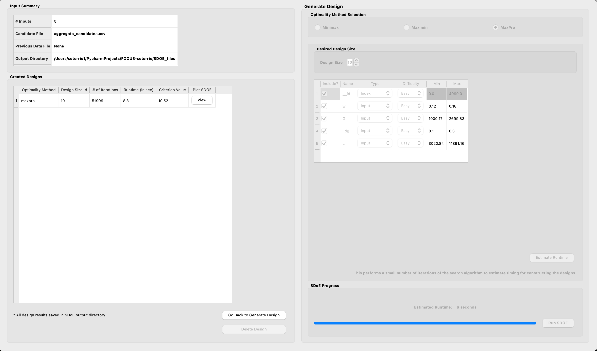
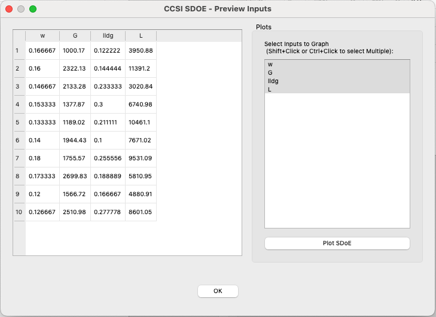
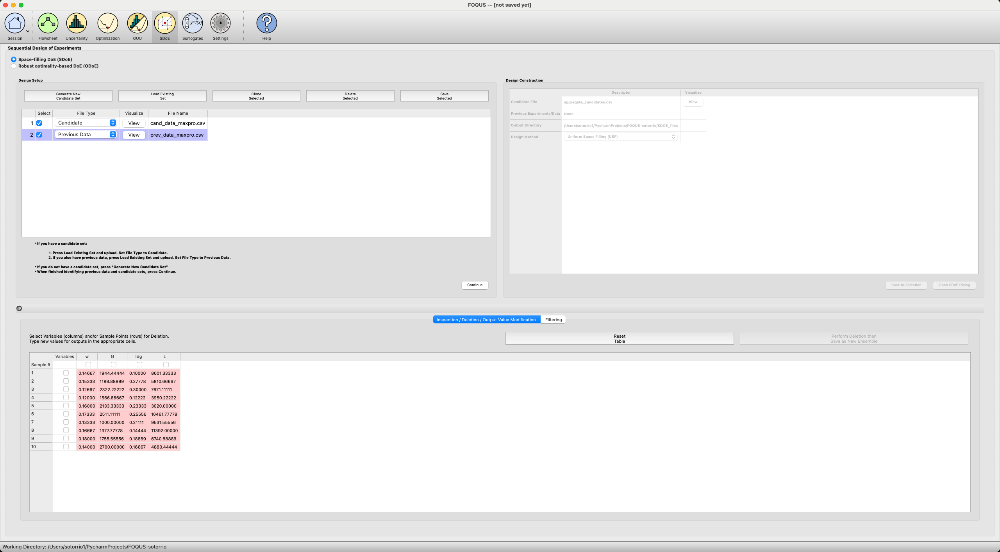
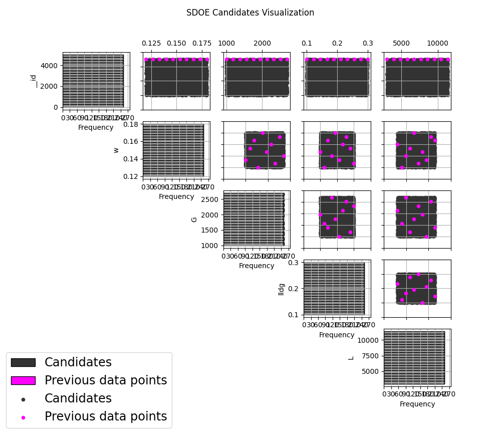
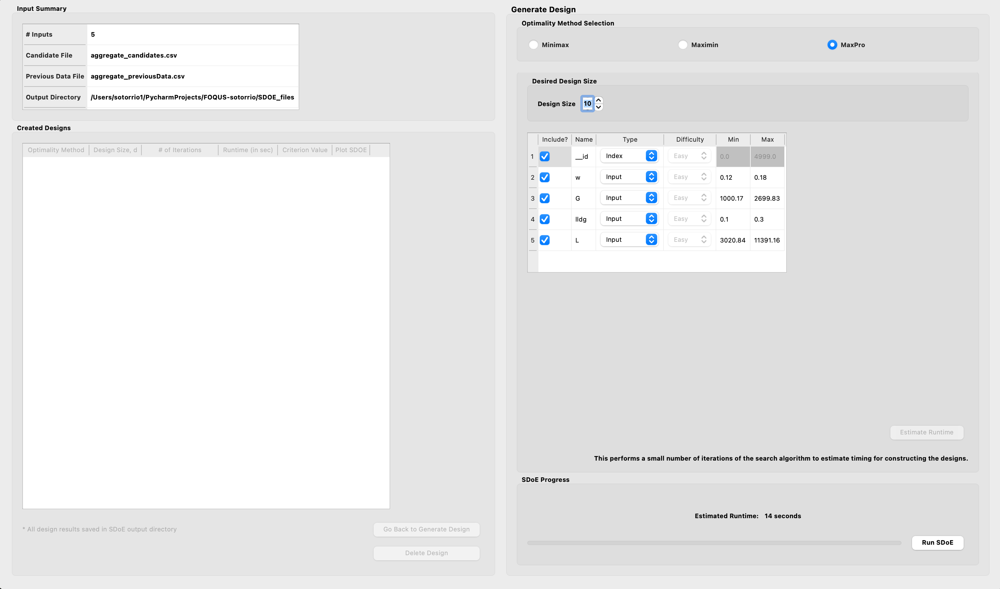
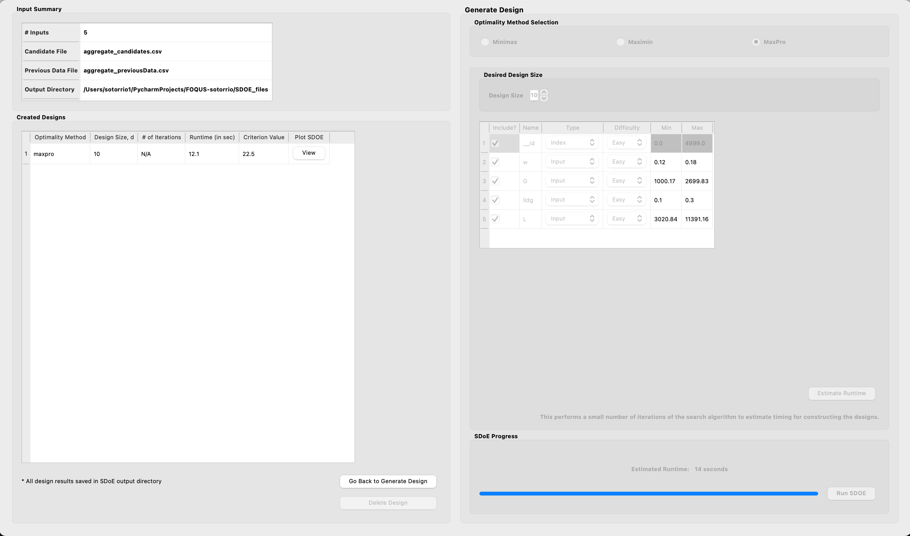
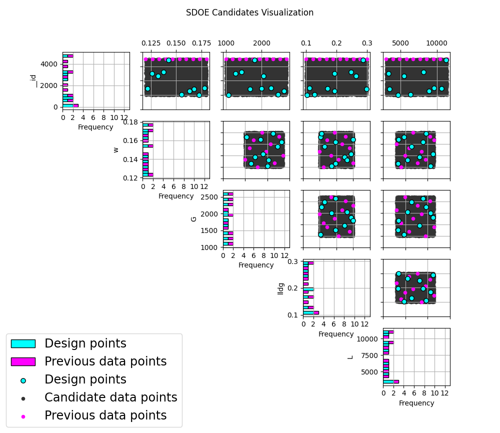

Example MaxPro-1: Constructing a MaxPro design for a 4-D input space
--------------------------------------------------------------------

For this first MaxPro example, the goal is to construct a simple MaxPro design of size 10.

1. From the FOQUS main screen, click the **SDoE** button. On the top left side, select **Load Existing Set**, and select
the cand_data_maxpro.csv file from examples folder. This identifies the possible input combinations from which the
design will be constructed. The more possible candidates that can be provided to the search algorithm used to construct
the design, the better the design might be for the specified criterion.

   MaxPro Example 1: Load Candidate Set

2. Next, click on **Continue** to advance to the **Design Construction** Window, and then select
**Uniform Space Filling** and click on **Open SDoE Dialog** to advance to the second SDOE screen, where particular
choices about the design can be made. On the second screen, select **MaxPro** for the **Optimality Method Selection**.
Change the **Design Size** to 10. There should be an **_id** column automatically created containing unique identifiers
to identify which runs from the candidate set were chosen for the final designs. Since the ranges of each of the inputs
are the bounds that we want to use for creating this design, we do not need to change the entries in **Min** and
**Max**.

   MaxPro Example 1: Design Setup

3. Once the choices for the design have been specified, click on the **Estimate Runtime** button to estimate the time
taken for creating the design. For the computer on which this example was developed, it is estimated that the code would
take 6 seconds to create the specified design. The higher the design size, the longer it will take to create the design.
Once the design size has been decided, click **Run SDOE**.

   MaxPro Example 1: Time Estimate

4. After waiting for the prescribed time, the **Created Designs** window will have 1 MaxPro created design.

   MaxPro Example 1: Created Design

5. By clicking on the **View** button under the **Plot SDOE** column in the **Created Designs** table, the user can
select what inputs to graph.

   MaxPro Example 1: Preview Design

6. Once the inputs have been selected, click on the **Plot SDoE** button to visualize your design.

.. figure:: figs/06_maxpro_plot_design.png
   :alt:
   :name: fig.06_maxpro_plot_design

   MaxPro Example 1: Plot Design

Example MaxPro-2: Constructing a MaxPro augmented design using the previously created design in example 1
---------------------------------------------------------------------------------------------------------

In this example, we consider the sequential aspect of design, by building on the first example results. This is an
adaptive design, which maximizes the MaxPro objective function.

1. In the **Design Setup** box, click on **Load Existing Set** to select the candidate set that you would like to use
for the construction of the design. This may be the same candidate set that was used in Example 1, or it might have
been updated based on what was learned from the first data collection. For example, if it was learned that one corner
of the design space might not be desirable, then the candidate set can be updated to remove candidate points that
are now considered undesirable. For the **File Type** leave the designation as **Candidate**.

To load in the experimental runs that were already collected, click on **Load Existing Set** again, and select the
prev_data_maxpro.csv file from examples folder. This time, change the **File Type** to **Previous Data**. If you wish
to view either of the candidate or previous data files, click on **View** to see either a table or plot.

   MaxPro Example 2: Load Data

2. Click on the **Continue** button at the bottom right of the **Design Setup** box. This will activate the
**Design Construction** box. By clicking on the **View** button under the **Visualize** column, the user can see both the
candidate set and the previous data set in the same plot.

   MaxPro Example 2: Plot Data

3. After examining that the desired files have been selected, click on the **Uniform Space Filling** button at the
bottom right corner of the **Design Construction** window. This will open the second SDoE window that shows the
**Sequential Design of Experiments Set-Up** window on the right hand side.

   MaxPro Example 2: Design Setup

4. Select **MaxPro** for the type of design to create.

5. Select the **Design Size** to match what is desired. Recall that this will be the number of additional points that
will be added to the existing design, not the total design size.

6. Next, select the options desired in the box:
a) Should any of the columns be excluded from the design creation? If yes, then unclick the **Include?** box.
b) For input factors to be used in the construction of the uniform space filling design, make sure that the **Type**
is designated as **Input**. The automatically generated index column **__id** will be already listed as **Index**.
c) Finally, you can optionally change the **Min** and **Max** ranges for the inputs to adjust the relative emphasis
that distances in each input range are designated.

7. Once the set-up choices have been made, click **Estimate Runtime** to find out what the anticipated time is for
generating the design.

8. After the SDoE module has created the design(s), the left window **Created Designs** is populated with the
new design.

   MaxPro Example 2: Created Design

9. You can visualize the design with the **View** option, where the plot now shows the **Previous Data** in pink,
and the newly added possible design in blue. This allows better assessment of the appropriateness of the new design
subject to the data that have already been collected.

   MaxPro Example 2: Plot Design
