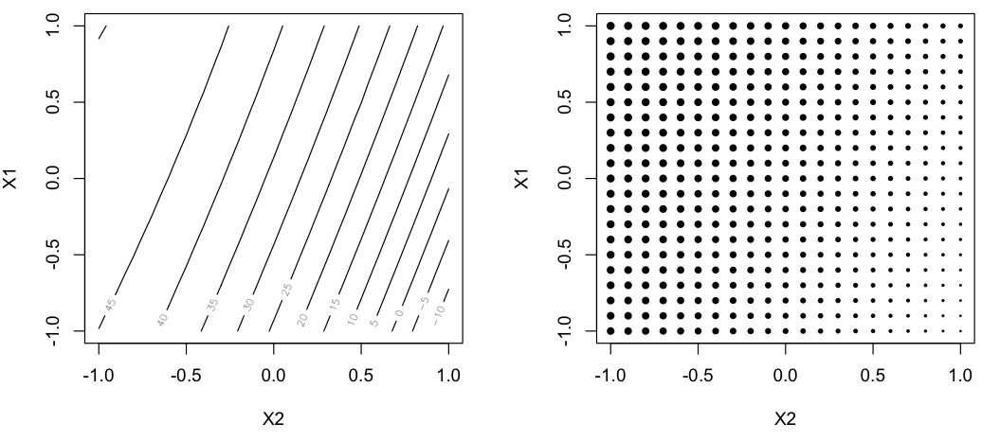
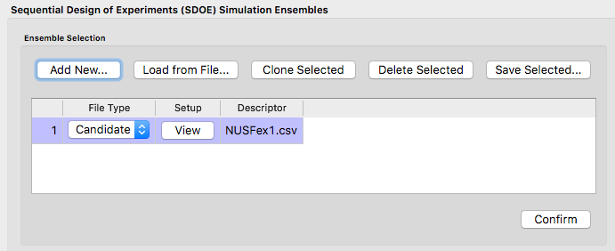
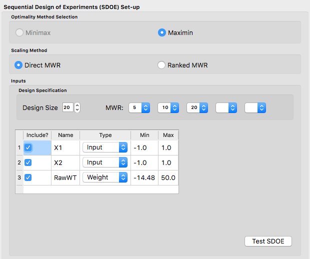
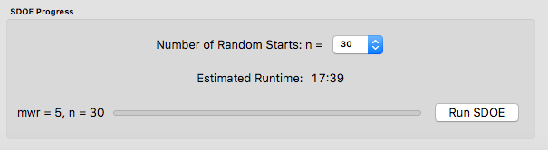
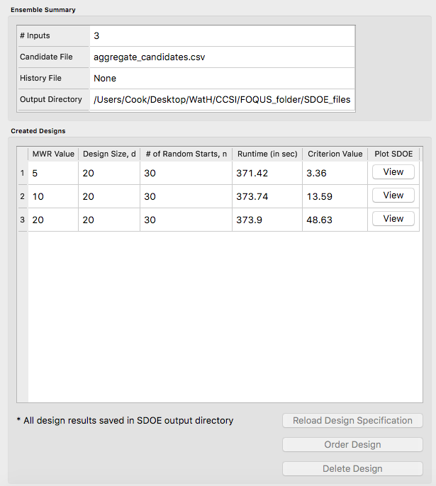
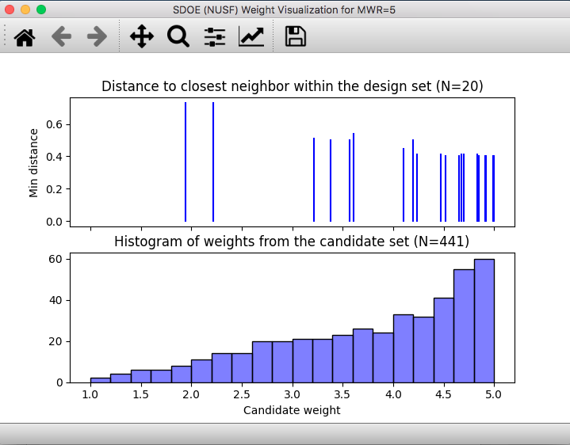
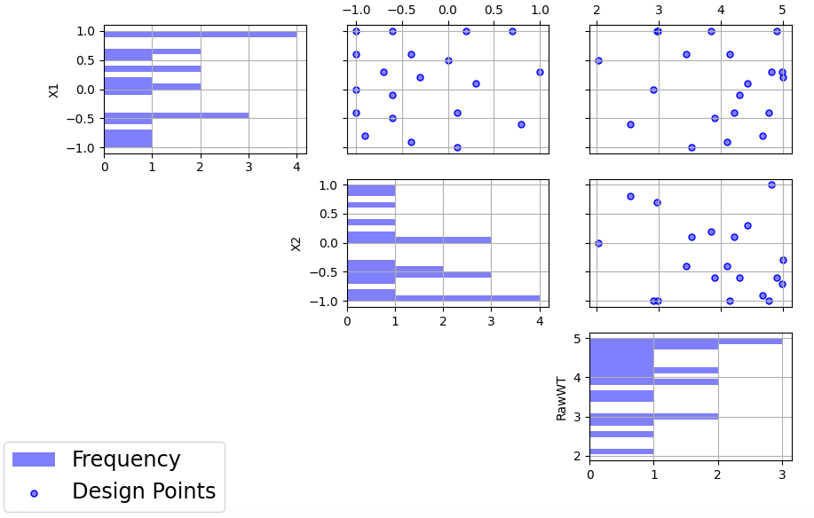
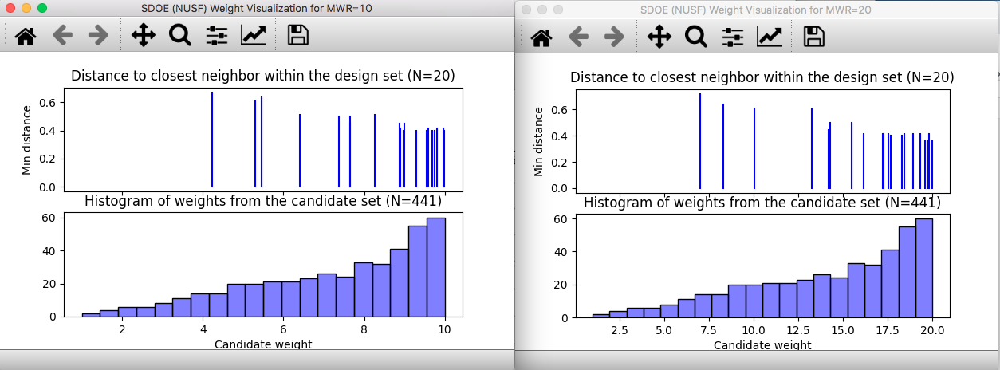
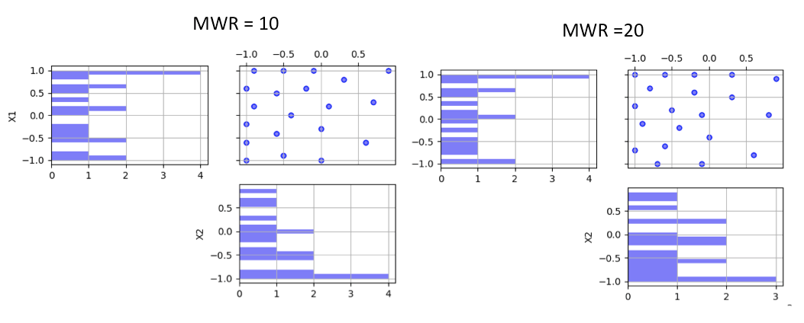

Example NUSF-1: Constructing Non-Uniform Space Filling maximin designs for a 2-D input space
-----------------------------------------------------------------------------------------------

For this first Non-Uniform Space Filling design example, the goal is to construct a non-uniform space-filling design with 20 runs in a 2-dimensional space based on a regular unconstrained square region populated with a grid of candidate points. The choice of how to construct the candidate set should be based on: a) what is the precision with which each of the inputs can be set in the experiment, and b) timing for generating the designs. Note that the finer the grid that is provided in the candidate set, the longer the search algorithm will take to run for a given number of random starts. In general a finer grid will give better options for the best design, but with diminishing returns after a large number of candidates have already been provided

As noted previously in the Basics section, in addition to specifying the candidate point input combinations, it is also required to supply an additional column of weights. This column will provide the necessary information about which regions of the input space should be emphasized more, and which should be emphasized less. The figure below shows some of the characteristics of the candidate set.

   
   Ex NUSF1 Candidate set of points with their associated weights. Left shows the underlying relationship used to generate the design, and right shows the candidates with the size of the point proportional to the assigned weight.
   
The candidates are laid out in a regular grid with equal spacing between levels of each of X1 and X2. A contour plot of the weight function that was used to generate the weights is shown on the left side of the plot. The weights range from -14.48 to 50, with the  largest values of the weights near the top left corner of the input space. The smallest values lie in the bottom right corner. On the right hand side, we can see a plot where the relative size of the points is proportionate to the size of the weight assigned to that candidate point. This second representation is helpful when the candidate points do not fall on a regular grid, or if the relationship for determining the weights is not smooth.

Here is the process for generating NUSF designs for this problem:

1. From the FOQUS main screen, click the **SDOE** button. On the top left side, select **Load from File**, and select the "NUSFex1.csv" file from examples folder.

   
   Ex NUSF1 choice of file for candidate set
   
2. Next, by selecting **View** and then **Plot** it is possible to see the grid of points that will be used as the candidate points. In this case, the range for each of the inputs, X1 and X2, has been chosen to be between -1 and 1.

3. Next, click on **Confirm** to advance to the **Ensemble Aggregation** Window, and the click on **Non-Uniform Space Filling** to advance to the second SDOE screen, where particular choices about the design can be made. On the second screen, the first choice for **Optimality Method Selection** is automatic, since the non-uniform space filling designs only use the **Maximin** criterion.
The next choice is to choose the **Scaling Method**, where the choices are **Direct** and **Ranked**. The default is to use the Direct scaling which translates the weights provided with a linear transformation so that they lie in the range 1 to whatever **MWR** value is selected below. For this example, we choose the option for Direct scaling.

   
   Ex NUSF1 Choice of settings for generating NUSF designs
   
Next select the **Design size**, where here we have decided to construct a design with 20 runs.
The choice of the **Maximum Weight Ratio** or **MWR** is one of the more difficult choices that the experimenter will need to make, since it is often one that they do not have much experience with. It is for this reason that we recommend constructing several designs with different MWR values and then comparing the results to see which value is best suited for the experiment to be run. Recall that a value of 1 corresponds to a uniform space filling design, while larger values will place increasing concentration of points near the regions with larger weight values. 
In this case, we select to generate 3 designs, with **MWR** values of 5, 10 and 20. This should give a good variety of designs to choose from after they have been constructed.

There are also choices for which columns to include in the analysis. Here we use all 3 columns for creating the design, so all **Include?** boxes remain checked. In addition, it is possible to see the range of values for each of the columns in the spreadsheet. Here the two input columns range from -1 to 1, while the "RawWt" column ranges from -14.48 to 50. The user can change these values if they wish to rescale the ranges to widen or narrow them, but in general these values can be left as is.

4. Once the choices for the design have been specified, click on the **Test SDOE** button to estimate the time taken for creating the designs. For the computer on which this example was developed, if we ran 30 random starts, it is estimated that the algorithm would take 17:38 minutes to generate the 3 designs with MWR values of 5, 10, 20. Note that the timing changes linearly, so using 40 random starts would take twice as long as using 20 random starts. Recall that the choice of the number of random starts involves a trade-off between getting the designs created quickly and the quality of the designs. For many applications, we would expect that using at lest 30 random starts would produce designs that are of good quality.

   
   Ex NUSF1 specification of timing to generate the requested designs.
   
5. Once the algorithm has generated the designs, the left box called **Created Designs** populates with the 3 designs that we have created. Some of the key choices of the designs are summarized in the columns. The size of the design, the MWR value and the number of random starts are all noted. In addition, the time to create the design is also included. The criterion value is provided. Recall from the discussion in the Basics section, that the criterion value can be compared for designs of the same size and with the same MWR value, but should not be compared across design sizes or across different MWR values.

   
   Ex NUSF1 created designs for three MWR values of 5, 10 and 20
   
6. To examine each of the created designs, select **View** and choose the columns to be included, and click **Plot**. For this example we included all of the columns. Note that two plots are created for each design. The first is the **Closest Distance by Weight (CDBW) plot**, and the second is the more familiar **pairwise scatterplot** of the created design.

First, we describe the information that is contained in the CDBW plot. There are two portions to the plot. The lower section shows a histogram of the weights in the candidate set. Note that the range of values goes from 1 to the MWR value selected. For the figure below, we are looking at a design created with a MWR value of 5. The shape of the histogram shows what values were available to be selected from. The top portion of the plot, has a vertical line for each of the design points selected (in this case 15 vertical lines for 15 design points). The location of each vertical line shows the weight for the selected design point. In this case, the smallest weight selected had weight a bit below a value of 2, while there are several design points chosen that have weight close to the maximum possible (the MWR value). This allows the user to see how much emphasis was placed on getting the larger weight values into the design.

   
   Ex NUSF1 Closest Distance by Weight (CDBW) plot for the constructed design with MWR values of 5
   
The second plot is the more familiar scatterplot of the design points. It is clear that the non-uniform space filling approach has lived up to its name and has generated a design that has a greater emphasis of points for the larger weights. The design still provides space filling throughout the region, but with very different densities of points for the various regions.

   
   Ex NUSF1 pairwise scatterplot for the constructed design with MWR values of 5
   
7. The next step is to repeat the process for the other two designs created. In this case we can see that the NUSF designs for MWR values of 10 and 20 create even more concentrated designs in the region with higher weights. The figure below shows the collection of the CDBW plot for MWR values of 10 and 20. 

   
   Ex NUSF1 Closest Distance by Weight (CDBW) plot for the constructed designs with MWR values of 10 and 20
   
When we compare the three CDBW plots for the designs with MWR of 5, 10 and 20, we see that more of the points are shifted to the right closer to the maximum weight value as we increase the MWR value. This gives control to the user to adjust the relative density of points for different weights.
   

   
   Ex NUSF1 pairwise scatterplot for the constructed designs with MWR values of 10 and 20   
    
When we compare the three designs, we can see that increasing the **MWR** produces a design that moves more of the points closer to the higher weight regions of the input space. This gives the user the control that is needed to create a customized design that matches the desired concentration of points in the regions where they are desired. After examinig the different summary plots for the three designs, the user can choose the plot that is the best match to their experimental needs

Example NUSF-2: Constructing Non-Uniform Space Filling for a Carbon Capture example
-----------------------------------------------------------------------------------------------

For this second Non-Uniform Space Filling design example,
