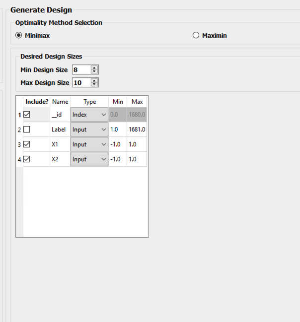

Example USF-1: Constructing Uniform Space Filling minimax and maximin designs for a 2-D input space
---------------------------------------------------------------------------------------------------

For this first example, the goal is to construct a simple space-filling design with between 8 and 10 runs in a 2-dimensional space based on a regular unconstrained square region populated with a grid of candidate points. 

1. From the FOQUS main screen, click the **SDOE** button. On the top left side, select **Load from File**, and select the SDOE_Ex1_Candidates.csv file from examples folder. This identifies the possible input combinations from which the design will be constructed. The more possible candidates that can be provided to the search algorithm used to construct the design, the better the design might be for the specified criterion. 

   
   Ex 1 Ensemble Selection
   
2. Next, by selecting **View** and then **Plot** it is possible to see the grid of points that will be used as the candidate points. In this case, the range for each of the inputs, X1 and X2, has been chosen to be between -1 and 1.

.. figure:: figs/Ex1_2_candidate_grid.png
   :alt: Home Screen
   :name: fig.Ex1_2_candidate_grid
   
   Ex 1 Candidate Grid
   
3. Next, click on **Continue** to advance to the **Ensemble Aggregation** Window, and then select **Uniform Space Filling** and click on **Open SDoE Dialog** to advance to the second SDOE screen, where particular choices about the design can be made. On the second screen, select **minimax** for the **Optimality Method Selection**. Change the **Min Design Size** and **Max Design Size** to 8 and 10, respectively. This will construct 3 minimax designs of size 8, 9 and 10. Next, uncheck the column called **Label**. This will mean that the design is not constructed using this as an input.  There should be an **_id** column automatically created containing unique identifiers to identify which runs from the candidate set were chosen for the final designs. Since the ranges of each of X1 and X2 are the bounds that we want to use for creating this design, we do not need to change the entries in **Min** and **Max**.

   
   Ex 1 Minimax design choices
   
4. Once the choices for the design have been specified, click on the **Run SDOE** button to estimate the time taken for creating the designs. For the computer on which this example was developed, if we ran the minimum number of random starts (10^3=1000), it is estimated that the code would take 4 seconds to create the three designs (of size 8, 9 and 10). If we chose 10^4=10000 runs, then the code is estimated to take 44 seconds. It is estimated that 10^5=100000 random starts would take 7 minutes and 11 seconds, while 10^6=1 million random starts would take approximately 1 hour, 12 minutes. In this case, we selected to create designs based on 100000 random starts, since this was a suitable balance between timeliness and giving the algorithm a chance to find the best possible designs. Hence, select 10^5 for the **Number of Random Starts**, and then click **Run SDOE**.  

5. Since we are also interested in examining maximin designs for the same scenario, we click on the **Reload Design Specifications** button in the **Created Design** window to repopulate the right window with the same choices that we made for all of the design options.

.. figure:: figs/Ex1_4_mM_created_designs.png
   :alt: Home Screen
   :name: fig.Ex1_4_mM_created_designs
   
   Ex 1 Minimax created designs
   
6. After changing the  **Optimality Method Selection** to **maximin**, click on **Test SDOE**, select 10^5 for the **Number of Random Starts**, and then click **Run SDOE**. After waiting for the prescribed time, the **Created Designs** window will have 6 created designs - three that are minimax designs and three that are maximin designs.

.. figure:: figs/Ex1_5_all_created_designs.png
   :alt: Home Screen
   :name: fig.Ex1_5_all_created_designs
   
   Ex 1 Created designs
   
7. We now consider the choices between the designs to determine which is the best match for our experimental goals. We can see a list of the selected design points by clicking **View** for any of the created designs, and **Plot** allows us to see the spread of the design points throughout the input region. 

Clearly, there is a trade-off between the cost of the experiment (larger number of runs involve more time, effort and expense) and how well the designs fill the space. When choosing which of the designs is most appropriate for the experiment, it is important to remember that resources spent early in the process cannot be used later, so it is helpful to balance early learning about the process, with the ability to identify and focus on the desired optimal location later.

There is also a small difference in priorities between the minimax and the maximin criteria. Minimax seeks to minimize how far any candidate point (which defines our region of interest) is from a design point. Maximin seeks to spread out the design points and maximize how close the nearest points are to each other. As noted previously, minimax designs tend to avoid putting too many points on the edge of the region, while maximin designs often place a number of points right on the edges of the input space. 

By looking at the placement of the points, how well they fill the desired space, and the points proximity to the edge of the region, the user can find a good match for their experimental goals. After considering all of the trade-offs between the alternatives, select the design that best matches the goals of the experiment.

8. The file for the selected design can be found in the **SDOE_files** folder. The design can then be used to guide the implementation of the experiment with the input factor levels for each run.

Example USF-2: Augmenting the Example USF-1 design in a 2-D input space with a Uniform Space Filling Design
-----------------------------------------------------------------------------------------------------------

In this example, we consider the sequential aspect of design, by building on the first example results. Consider the scenario where based on the results of Example 1, the experimenter selected to actually implement and run the 8 run minimax design.

1. In the **Ensemble Selection** box, click on **Load from File** to select the candidate set that you would like to use for the construction of the design. This may be the same candidate set that was used in Example 1, or it might have been updated based on what was learned from the first data collection. For example, if it was learned that one corner of the design space might not be desirable, then the candidate set can be updated to remove candidate points that are now considered undesirable. For the **File Type** leave the designation as **Candidate**.

To load in the experimental runs that were already collected, click on **Load from File** again, and select the design file that was created in the  **SDOE_files** folder. This time, change the **File Type** to **History**. If you wish to view either of the candidate or history files, click on **View** to see either a table or plot.

2. Click on the **Confirm** button at the bottom right of the **Ensemble Selection** box. This will activate the **Ensemble Aggregation** box.

3. After examining that the desired files have been selected, click on the **Uniform Space Filling** button at the bottom right corner of the **Ensemble Aggregation** window. This will open the second SDOE window that shows the **Sequential Design of Experiments Set-Up** window on the right hand side.

4. Select **Minimax** or **Maximin** for the type of design to create.

5. Select the **Min Design Size** and **Max Design Size** to match what is desired. If you wish to just generate a single design of the desired size, make **Min Design Size** = **Max Design Size**. Recall that this will be the number of additional points that will be added to the existing design, not the total design size.

6. Next, select the options desired in the box: a) Should any of the columns be excluded from the design creation? If yes, then unclick the **Include?** box.  b) For input factors to be used in the construction of the uniform space filling design, make sure that the **Type** is designated as **Input**. If there is a label column for the candidates, then designate this as **Index**.  c) Finally, you can optionally change the **Min** and **Max** ranges for the inputs to adjust the relative emphasis that distances in each input range are designated.

7. Once the set-up choices have been made, click **Test SDOE** to find out what the anticipated time is for generating designs based on different numbers of random starts.

8. Select the number of random starts to use, based on available time. Recall that using more random starts is likely to produce a design that is closer to the overall best optimum.

9. After the SDOE module has created the design(s), the left window **Created Designs** is populated with the new design(s). These can be viewed with the **View** option, where the plot now shows the **History Data** with one symbol, and the newly added possible design with another symbol. This allows better assessment of the appropriateness of the new design subject to the data that have already been collected.

10. To access the file that contains the created designs, go to the **SDOE_files** folder. As before, a separate folder will have been created for each design.

11. If there is a desire to do another set in the sequential design, then the procedure outlined above for Example 2 can be followed again. The only change will be that this time there will be 3 files that need to be imported: A **Candidate** file from which new runs can be selected, and two **History** files. The first of these files will be the selected design from Example USF-1, and the second the newly created design that was run as a result of Example USF-2. When the user clicks on **Confirm** in the **Ensemble Selection** window, the two **History** files will be aggregated into a single **Aggregated History** file.

Example USF-3: A Uniform Space Filling Design for a Carbon Capture example in a 5-D input space
-----------------------------------------------------------------------------------------------

In this example, we consider a more realistic scenario of a sequential design of experiment. Here we explore a 5-dimensional input space with G, lldg, CapturePerc, L and SteamFlow denoting the space that we wish to explore with a space-filling design. The candidate set, **Candidate Points 8perc**, contains 93 combinations of inputs that have been validated using an ASPEN model as possible combinations for this scenario. The goal is to collect 18 runs in two stages that fill the input space. There are some constraints on the inputs, that make the viable region irregular, and hence the candidate set is useful to avoid regions where it would be problematic to collect data.

1. After selecting the **SDOE** tab in FOQUS, click on **Load from File** and select the candidate file, **Candidate Points 8perc**. 

   
   Ex 3 Ensemble Selection window
   
2. To see the range of each input and how the viable region of interest is captured with the candidate set, select **View** and then plot. In this case we have chosen to just show the 5 input factors in the pairwise scatterplot.

   
   Ex 3 plot of viable input space as defined by candidate set
   
3. After clicking **Confirm** in the **Ensemble Selection** box, and then **Uniform Space Filling** from the **Ensemble Aggregation** box, the **SDOE Set-up** box will appear on the right side of the second window. Here, select the options desired for the experiment to be run. For the illustrated figure, we selected a **Minimax** design with 3 potential sizes: 10, 11, 12. We specified that the column **Test No.** will be used as the Index, **G, lldg, CapturePerc, L, SteamFlow** will define the 5 factors to be used as inputs. We unclicked the **Include?** box for **CO2 captured** since we do not want to use it in the design construction.

   
   Ex 3 set-up window for first stage
   
4. After running **Test SDOE** and selecting the number of random starts to be used, click **Run SDOE**. After the module has created the requested designs, they can be viewed and compared.

   
   Ex 3 10,11,12 run designs created for first stage
   
5. By clicking **View** and then **Plot**, the designs can be viewed. Suppose that the experimenter decides to use the 12 run design in the initial phase, then this would be the design that would be implemented and data collected for these 12 input combinations.

   
   Ex 3 chosen experiment for first stage
   
6. After these runs have been collected, the experimenter wants to collect additional runs. In this case, return to the first SDOE module window, and load in the candidate set (which can be changed to reflect any knowledge gained during the first phase, such as undesirable regions or new combinations to include). The completed experiment should also be included as a **History** file, by going to the **SDOE_files** folder and selecting the file containing the appropriate design.

   
   Ex 3 ensemble selection box for second stage
   
7. After clicking **Confirm** in the **Ensemble Selection** box, and then **Uniform Space Filling** from the **Ensemble Aggregation** box, the **SDOE Set-up** box will appear on the right side of the second window. Here, select the options desired for the experiment to be run. For the illustrated figure, we selected a **Minimax** design with a design size of 6 (to use the remaining available budget). We again specified that the column **Test No.** will be used as the Index, **G, lldg, CapturePerc, L, SteamFlow** will define the same 5 factors to be used as inputs. 

   
   Ex 3 setup box for second stage
   
8. After running **Test SDOE** and selecting the number of random starts to be used, click **Run SDOE**. After the module has created the requested design, they can be viewed. After selecting **View** and then **Plot**, the experimenter can see the new design with the historical runs included. This provides a good plot to allow the complete sequence of two experiments to be examined as a combined set of runs. Note that the first and second stages are shown in different colors and with different symbols.

   
   Ex 3 setup box for second stage  

