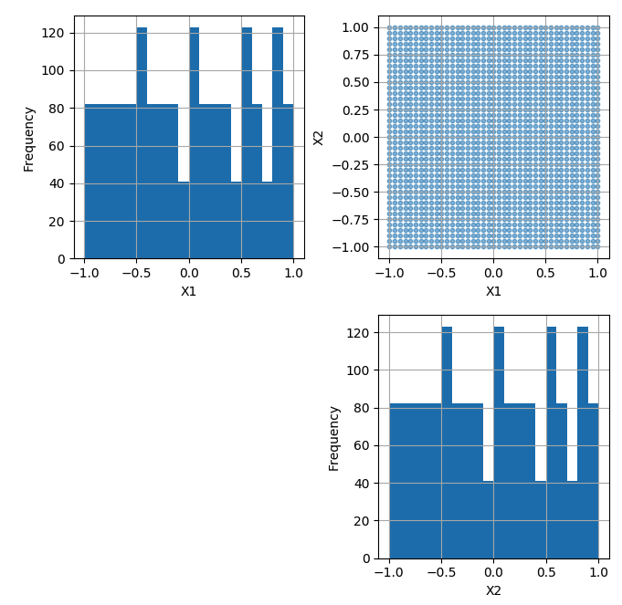
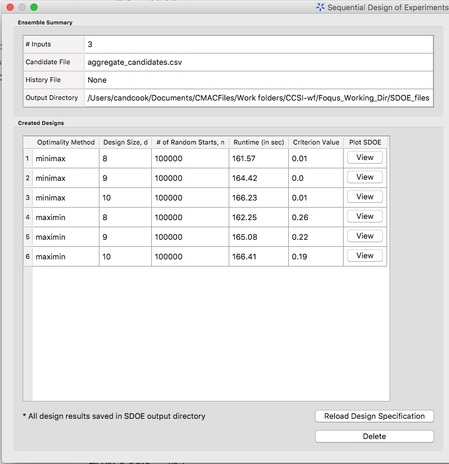

Sequential Design of Experiments (SDOE)
=======================================

A sequential design of experiments strategy allows for adaptive learning based on incoming results as the experiment is being run. The SDoE module in FOQUS allows the experimenter to flexibly incorporate this strategy into their designed experimental planning to allow for maximal relevant information to be collected. Statistical design of experiments is an important strategy to improve the amount of information that can be gleaned from the overall experiment. It leverages principles of putting experimental runs where they are of maximum value, the interdependence of the runs to estimate model parameters, and robustness to the variability of results that can be obtained when the same experimental conditions are repeated. There are two major categories of designed experiments: those for which a physical experiment is being run, and designs for a computer experiment where the output from a theoretical model is explored. While the methods available were initially focused on experiments for physical experiments, opportunities also exist for accelerated learning through strategic selection and updating of experimental runs for computer experiments. 

The overall process for Sequential Design of Experiments (SDoE) is detailed below:

#.	Identify one or more criteria over which to optimize. Common choices are (a) refining the region of interest, (b) improving the precision (or reducing the uncertainty) in the estimation of model parameters, (c) improving the precision of prediction for new observations in the design region, (d) quantifying the discrepancy between the model and data, or (e) optimizing the value of responses of interest. If more than one criterion is going to be used, then identify how they will be combined into a utility function.

#.	Develop a working model of the process that can be used to calculate the criteria values based on currently available knowledge and data.

#.	Define the inputs that will be manipulated during the experiment, and the ranges of interest for these factors. 

#.	Identify candidate input factor locations that are being considered for new experiments. This can be a grid of input combinations or continuous regions in the design space. If there are combinations of the factors that will not yield results or that are not of interest, these regions of the design space should be excluded from consideration.

#.	Develop a working model of the process that is able to receive new data and incorporate them to update the calculated criteria values.

#.	Develop a plan for the size of the sequential design batches, based on the time required to set-up and run the experiments as well as the computational time required to process new data and update the working model. 

#.	Identify the initial batch of experiments to be run at the beginning of the experiments based on the model developed in step 2 and conditional on any already available data. This involves examining the utility of new data at each candidate location, and comparing which locations have the highest anticipated utility.

#.	Run the first batch of experimental runs, update the model developed in step 5 with the new results. Based on the updated model, generate the next batch of experimental runs.

#.	For the duration of the experiment, repeat steps 7 and 8 for subsequent batches based on the updated model after incorporating the newly obtained data.

The first version of the SDoE module has functionality that can produce flexible space-filling designs to be created.
Later versions will allow for additional design criteria to be utilized, but the first version already had considerable flexibility to construct helpful design based on several different strategies. Key features of the approach that we use in this module are: a) designs will be constructed by selecting from a user-provided candidate set of input combinations, and b) historical data, which has already been collected can be integrated into the design construction to ensure that new data are collected with a view to disperse from where data are already available.

We begin with some basic terminology that will help provide structure to the process and instructions below.

*	Input factors – these are the controllable experimental settings that are manipulated during the experiment. It is important to carefully define the ranges of interest for the inputs (eg. Temperature in [200°C,400°C]) as well as any logistical or operational constraints on these input factors (eg. Flue Gas Rate < 1000 kg/hr when Temperature > 350°C)

*	Input combinations (or design runs) – these are the choices of settings for each of the input factors for a particular run of the experiment. It is assumed that the implementers of the experiment are able to set the input factors to the desired operating conditions to match the prescribed choice of settings.

* Input space (or design space) – the region of interest for the input factors in which the experiment will be run. This is typically constructed by combining the individual input factor ranges, and then adapting the region to take into account any constraints. Any suggested runs of the experiment will be located in this region.

*	Responses (or outputs) – these are the measured results obtained from each experimental run. These are most desirably quantitative summaries of a characteristic of interest from running the process at the prescribed set of operating conditions (eg. CO2 capture efficiency is a typical response of interest for CCSI).

*	Design criterion / Utility function – this is a mathematical expression of the goal (or goals) of the experiment that is used to guide the selection of new input combinations, based on the prior information before the start of the experiment and during the running of the experiment. The design criterion can be based on a single goal or multiple competing goals, and can be either static throughout the experiment or evolve as goals change in importance over the course of the experiment. Common choices of goals for the experiment are:

#.	exploring the region of interest, 

#. improving the precision (or reducing the uncertainty) in the estimation of model parameters, 

#.	improving the precision of prediction for new observations in the design region, 

#. quantifying the discrepancy between the model and data, or 

#.	optimizing the value of responses of interest. 

An optimal design of experiment strategy uses the design criterion to evaluate potential choices of input combinations to maximize the improvement in the criterion over the available candidates. If the optimal design strategy is sequential, then the goal is to use early results from the beginning of the experiment to guide the choice of new input combinations based on what has been learned about the responses.

Why Space-Filling Designs?
--------------------------

Space-filling designs are a design of experiments strategy that is well suited to both physical experiments with an accompanying model to describe the process and to computer experiments. The idea behind a space-filling design is that the design points are spread throughout the input space of interest. If the goal is to predict values of the response for a new set of input combinations within the ranges of the inputs, then having data spread throughout the space means that there should be an observed data point relatively close to where the new prediction is sought.

In addition, if there is a model for the process, then having data spread throughout the input space means that the consistency of the model to the observed data can be evaluated at multiple locations to look for possible discrepancies and to quantify the magnitude of those differences throughout the input space.

Hence, for a variety of criteria, a space-filling design can serve as good choice for exploration and for understanding the relationship between the inputs and the response without making a large number of assumptions about the nature of that relationship. As we will see in subsequent examples, the sequential approach allows for great flexibility to leverage what has been learned in early stages to influence the later choices of designs. In addition, the candidate-based approach that is supported in this module has the advantage that it can make the space-filling approach easier to adapt to design space constraints and specialized design objectives that may evolve through the stages of the sequential design.

Using the SDoE Module - The Basics
----------------------------------

In this section, we descibe the basic steps in for creating a design with this module. When you first click on the  **SDOE** button from the main FOQUS homepage, a first window appears. To create a design, the progression of steps takes you through the **Ensemble Selection** box (top left), then a transition triggered by the **Confirm** button to the **Ensemble Aggregation** box, and finally there are optional changes that can be made in the box at the bottom of the window. The final step in this window is to click on **Analyze**. 

  
We now consider some details for each of these steps:

1. In the **Ensemble Selection** box, click on the **Load from File..** button to select the file(s) for the construction of the design. Several files can be selected and added to the box listing the chosen files.

.. figure:: figs/1_starting_screen.png
   :alt: Home Screen
   :name: fig.sdoe_home
   
   SDOE Home Screen
   
2. For each of the files selected using the pull-down menu, identify them as either a **Candidate** file or a **History** file. **Candidate** .csv files are comprised of possible input combinations from which the design can be constructed. The columns of the file should contain the different input factors that define the dimensions of the input space. The rows of the file each identify one combination of input values that could be selected as a run in the final design. Typically, a good candidate file will have many different candidate runs listed, and they should fill the available ranges of the inputs to be considered. Leaving gaps or holes in the input space is possible, but generally should correspond to a region where it is not possible (or desirable) to collect data.
**History** .csv files should have the same number of columns for the input space as the candidate file, and represent data that have already been collected. The algorithm for creating the design aims to place points in different locations from where data have already been obtained, while filling the input space around those locations.

3. Click on the **View** button to open the **Preview Inputs** pop-up widow, to see the list of columns contained in each file. The left hand side displays the first few rows of input combinations from the file. Select the columns that you wish to see graphically in the right hand box , and then click on **Plot SDOE** to see a scatterplot matrix of the data. 

.. figure:: figs/2_view_candidates.png
   :alt: SDOE preview of inputs
   :name: fig.2_preview_inputs
   
   SDOE view candidate set inputs

.. figure:: figs/3_plot_candidates.png
   :alt: SDOE plot of inputs
   :name: fig.3_scatterplot_inputs

   SDOE plot of candidate set inputs
   
The plot shows histograms of each of the inputs on the diagonals to provide a view of the distribution of values as well as the range of each input. The off-diagonals show pairwise scatterplots of each pair of inputs. This should provide the experimenter with the ability to assess if the ranges specified and any constraints for the inputs have been appropriately captured for the specified candidate set. In addition, repeating this process for any historical data will provide verification that the already observed data have been suitably characterized.

4. Once the data have been verified for both the **Candidate** and **History** files, click on the **Confirm** button to make the **Ensemble Aggregation** window active.

.. figure:: figs/4_ensemble_aggregate.png
   :alt: Home Screen
   :name: fig.4_ensemble_aggregate
   
   SDOE Ensemble Aggregation
   
5. If more than one **Candidate** file was specified, then the **aggregate_candidates.csv** file that was created will have combined these files into a single file. Similarly if more than one **Histoy** file was specified, then the **aggregate_history.csv** file has been created with all runs from these files. If only a single file was selected for either the  **Candidate** and **History** files, then their aggregated matching files will be the same as the original.

..
   There are options to view the aggregated files for both the candidate and history files, with a similar interface as was shown in step 3. In addition, a single plot of the combined candidate and history files can be viewed. In this plot the  points represent the candidate locations and points of already collected data from the history file are shown in different colors.

6. Once the data have been verified as the desired set to be used for the design construction, then click on the **Analyze** button at the bottom right corner of the **Ensemble Aggregation** window. This opens the second SDOE window, which allows for specific design choices to be made.

   SDOE second window

7. The first choice to be made for the design is whether to optimize using **minimax** or **maximin**. The first choice, **minimax**, looks to choose design points that minimize the maximum distance that any point in the input space (as characterized by the candidate set and historical data, if it is available) is away from a design point. Hence, the idea here is that if we want to use data to help predict new outcomes throughout the input space, then we never want to be too far away from an observed location. The second choice, **maximin** looks to choose a design where the design points are as far away from each other as possible. In this case, the design criterion is looking to maximize how close any two points are away from their nearest neighbor. In practice the two design criterion often give similar designs, with the **maximin** criterion tending to push the chosen design points closer to the edges of the specified regions. 

Hint: If there is uncertainty about some of the edge points in the candidate set being viable options, then **minimax** would be preferred. If the goal is to place points throughout the input space with them going right to the edges, than **maximin** would be preferred. Note, that creating the designs is relatively easy, so it may be helpful to try both approaches to examine them and then choose which is preferred.

8. The next choice to be made falls under **Design Specification**, when the experimenter can select the sizes of designs to be created. The **Min Design Size** specifies the smallest design size to be created. Note that the default value is set at **2**, which would lead to choosing the best two design runs from the candidate set to fill the space (after taking into account any historical data that have already been gathered).
The **Max Design Size** specifies the largest design size to be created. The default value is set at **8**, which means that if this combination were used, designs would be created of size 2, 3, 4, 5, 6, 7 and 8. Hence, it may be prudent to select a relatively small range of values to expedite the creation of the designs, as each of these choices triggers a separate optimization search. In the figure above, the **Min Design Size** has been changed to 4, so that only the designs of size 4, 5, 6, 7 and 8 will be created.
 
9. Next, there are options for the columns of the candidate set to be used for the construction of the design. Under **Include?** in the box on the right hand side, the experimenter has the option of whether particular columns should be included in the space-filling design search. Unclick a box, if a particular column should not be included in the search.

Next select the **Type** for each column. Typically most of the columns will be designated as **Inputs**, which means that they will be used to find the best design. In addition, we recommend including one **Index** column which contains a unique identifier for each run of the candidate set. This makes tracking which runs are included in the constructed designs easier. If no **Index** column is specified, a warning appears later in the process, but this column is not strictly required.

Finally, the **Min** and **Max** columns in the box allow the range of values for each input column to be specified. The default is to extract the smallest and largest values from the candidate and history data files, and use these. This approach generally works well, as it scales the inputs to be in a uniform hypercube for comparing distances between the design points. 

Hint: the default values for **Min** and **Max** can generally be left at their defaults unless: (1) the range of some inputs represent very different amounts of change in the process. For example, if temperature is held nearly constant, while a flow rate changes substantially, then it may be desirable to extend the range of the temperature beyond its nominal values to make the amount of change in temperature more commensurate with the amount of change in the flow rate. (2) if changes are made in the candidate or history data files. For example, if one set of designs are created from one candidate set, and then another set of designs are created from a different candidate set. These designs and the achieved criterion value will not be comparable unless the range of each input has been fixed at matching values.

10. Once the design choices have been made, click on the **TestSDOE** button. This generates a small number of iterations of the search algorithm to calibrate the timing for constructing and evaluating the designs. The time taken to generate a design is a function of the size of the candidate set, the size of the design, as well as the dimension of the input space. The slider below **TestSDOE** now indicates an estimate of the time to construct the designs across the range of the **Min Design Size** and **Max Design Size** specified. The smallest **Number of Random Starts** is 10^3 = 1000 is generally too small to produce a good design, but this will run very quickly. Powers of 10 can be chosen with an **Estimated Runtime** provided below the slider. 

.. figure:: figs/6_after_test_SDOE.png
   :alt: SDOE second window
   :name: fig.6_after_test_SDOE

   SDOE second window after clicking Test SDOE

Hint: The choice of **Number of Random Starts** involves a trade-off between the quality of the design generated and the time to generate the design. The larger the chosen number of random starts, the better the design is likely to be. However, there are diminishing gains for increasingly large numbers of random starts. If running the actual experiment is expensive, it is generally recommended to choose as large a number of random starts as possible for the available time frame, to maximize the  chance of an ideal design being found.

11. Once the slider has been set to the desired **Number of Random Starts**, click on the **Run SDOE** button, and initate the construction of the designs. The progress bar indicates how design construction is progressing through the chosen range of designs between the **Min Design Size** and **Max Design Size** specified.

12. When the SDOE module has completed the design creation process, the left window **Created Designs** will be populated with files containing the results. The column entries summarize the key features of each of the designs, including **Optimality Method** (whether minimax or maximin was used), **Design Size** (d, the number of runs in the created design),
**# of Random Starts**, **Runtime** (number of seconds needed to create the design), **Criterion Value** (the value obtained for the minimax or maximin criterion for the saved design).

   SDOE Created Designs

13. To see details of the design, the **View** button at the right hand side of each design row can be selected to show a table of the design, as well as a pairwise scatterplot of the inputs for the chosen design. The table and plot of the design are similar in characteristics to their counterparts for the candidate set.

.. figure:: figs/8_view_design.png
   :alt: SDOE second window
   :name: fig.8_view_design

   SDOE table of created design
   
.. figure:: figs/9_plot_design.png
   :alt: SDOE second window
   :name: fig.9_plot_design

   SDOE pairwise plot of created design
   
14. To access the file with the generated design, go to the **SDOE_files** folder, and a separate folder will have been created for each of the designs. In the example shown, 5 folders were created for the designs of size 4, 5, 6, 7 and 8, respectively. In each folder, there is a file containing the design, with a name that summarizes some of the key information about the design. For example, **candidates_d6_n10000_w+G+lldg+L** contains the design created using the candidate set called candidates.csv, with d=6 runs, based on n=10000 random starts, and based on the 4 inputs W, G, lldg and L.

 .. figure:: figs/10_SDOE_directory.png
   :alt: SDOE second window
   :name: fig.10_SDOE_directory

   SDOE directory

When one of the design files is opened it contains the details of each of the runs in the design, with the input factor levels that should be selected for that run.

.. figure:: figs/11_design_file.png
   :alt: SDOE second window
   :name: fig.11_design_file

   SDOE file containing a created design
   
   
Examples: 
---------

Next, we illustrate the use of the SDOE capability for several different scenarios. Example 1 constructs several designs of size 8 to 10 runs for a 2-dimensional input space based on a regular square region with a candidate set that is a regularly spaced grid. Both minimax and maximin designs are constructed to illustrate the difference in the criteria.
Example 2 takes one of the designs created in Example 1, and considers how it might be used for sequential updating with additional experimentation. In this case the Example 1 design is considered as historical data, and the goal is to augment the design with several additional runs.

Example 1: Constructing minimax and maximin designs for a 2-D input space
-------------------------------------------------------------------------

For this first example, the goal is to construct a simple space-filling design with between 8 and 10 runs in a 2-dimensional space based on a regular unconstrained square region populated with a grid of candidate points. 

1. From the FOQUS main screen, click the **SDOE** button. On the top left side, select **Load from File**, and select the SDOE_Ex1_Candidates.csv file from examples folder. This identifies the possible input combinations from which the design will be constructed. The more possible candidates that can be provided to the search algorithm used to construct the design, the better the design might be for the specified criterion. 

.. figure:: figs/Ex1_1_load_candidate.png
   :alt: Home Screen
   :name: fig.Ex1_1_load_candidate
   
   Ex 1 Ensemble Selection
   
2. Next, by selecting **View** and then **Plot** it is possible to see the grid of points that will be used as the candidate points. In this case, the range for each of the inputs, X1 and X2, has been chosen to be between -1 and 1.

   
   Ex 1 Candidate Grid
   
3. Next, click on **Confirm** to advance to the **Ensemble Aggregation** Window, and the click on **Uniform Space Filling** to advance to the second SDOE screen, where particular choices about the design can be made. On the second screen, select **minimax** for the **Optiimality Method Selection**. Change the **Min Design Size** and **Max Design Size** to 8 and 10, respectively. This will construct 3 minimax designs of size 8, 9 and 10. Next, change the column called **Label** to be **Index**. This will mean that the design is not constructed using this as an input, but rather that the identifiers in this column will help identify which runs from the candidate set were chosen for the final designs. Since the ranges of each of X1 and X2 are the bounds that we want to use for creating this design, we do not need to change the entries in **Min** and **Max**.

   
   Ex 1 Minimax design choices
   
4. Once the choices for the design have been specified, click on the **Test SDOE** button to estimate the time taken for creating the designs. For the computer on which this example was developed, if we ran the minimum number of random starts (10^3=1000), it is estimated that the code would take 4 seconds to create the three designs (of size 8, 9 and 10). If we chose 10^4=10000 runs, then the code is estimated to take 49 seconds. It is estimated that 10^5=100000 random starts would take 8 minutes and 13 seconds, while 10^6=1 million random starts would take approximately 1 hour, 22 minutes. In this case, we selected to create designs based on 100000 random starts, since this was a suitable balance between timeliness and giving the algorithm a chance to find the best possible designs. Hence, select 10^5 for the **Number of Random Starts**, and then click **Run SDOE**.  

5. Since we are also interested in examining maximin designs for the same scenario, we click on the **Reload Design Specifications** button in the **Created Design** window to repopulate the right window with the same choices that we made for all of the design options.

.. figure:: figs/Ex1_4_mM_created_designs.png
   :alt: Home Screen
   :name: fig.Ex1_4_mM_created_designs
   
   Ex 1 Minimax created designs
   
6. After changing the  **Optimality Method Selection** to **maximin**, click on **Test SDOE**, select 10^5 for the **Number of Random Starts**, and then click **Run SDOE**. After waiting for the prescribed time, the **Created Designs** window will have 6 created designs - three that are minimax designs and three that are maximin designs.

   
   Ex 1 Created designs
   
   
