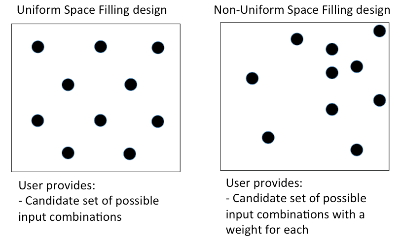
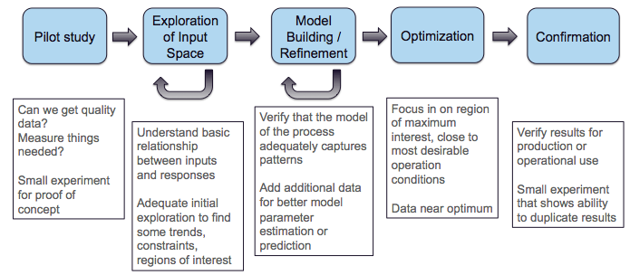
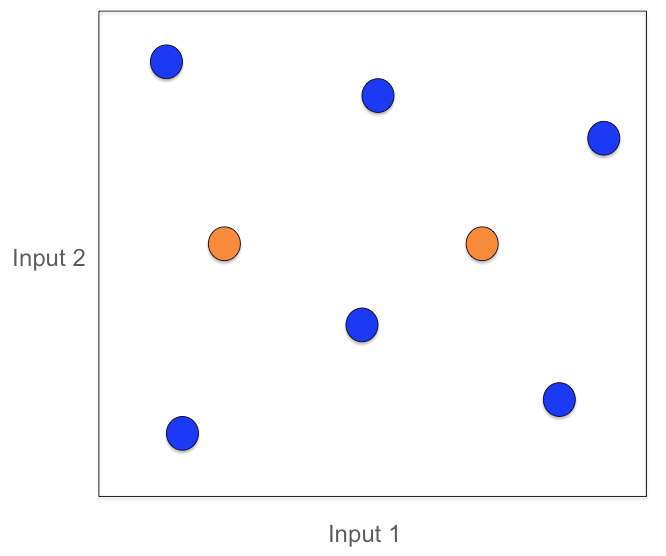
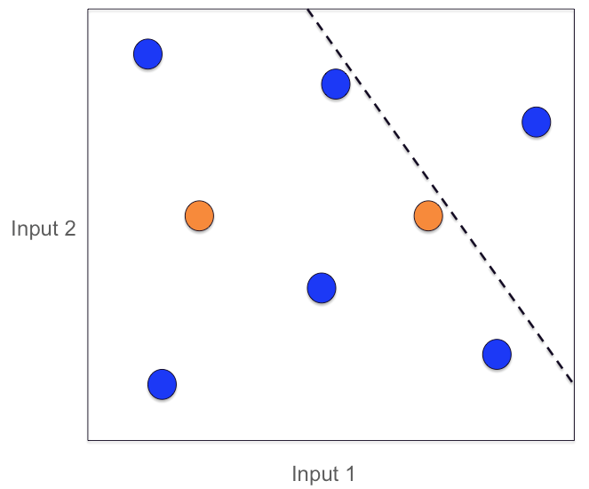
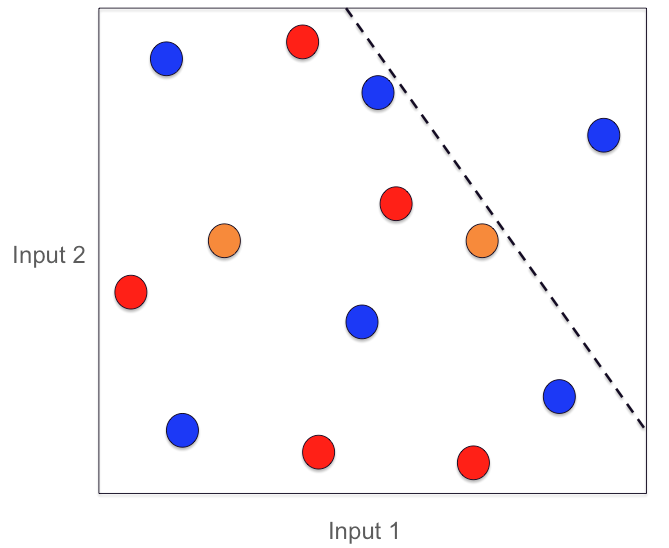
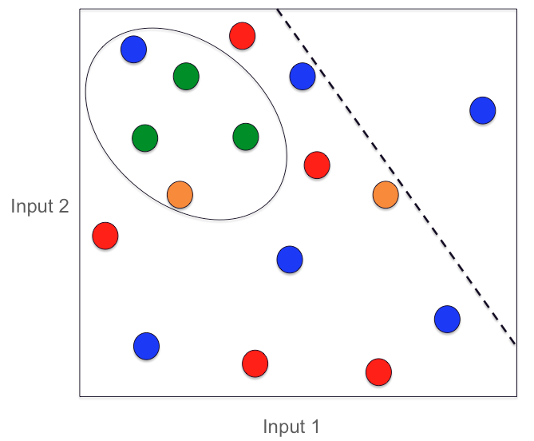
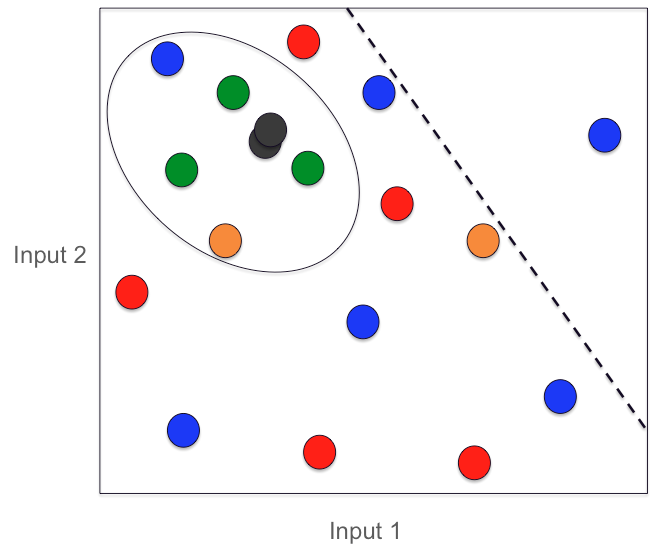
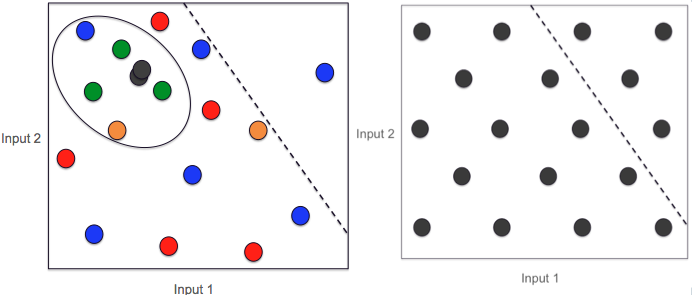

Sequential Design of Experiments (SDOE)
=======================================

Experimenters often begin an experiment with imperfect knowledge of the underlying relationship they seek to model, and may have a variety of goals that they would like to accomplish with the experiment. In this chapter, we describe how sequential design of experiments can help make the best use of resources and improve the quality of learning. We describe the different types of space filling designs that can help accomplish this, define basic terminology, and show a common sequence of steps that are applicable to many experiments. We show the basics for the types of designs supported in the SDoE module, and provide some examples to illustrate the methods.

A sequential design of experiments strategy allows for adaptive learning based on incoming results as the experiment is being run. The SDoE module in FOQUS allows the experimenter to flexibly incorporate this strategy into their designed experimental planning to allow for maximally relevant information to be collected. Statistical design of experiments is an important strategy to improve the amount of information that can be gleaned from the overall experiment. It leverages principles of putting experimental runs where they are of maximum value, the interdependence of the runs to estimate model parameters, and robustness to the variability of results that can be obtained when the same experimental conditions are repeated. There are two major categories of designed experiments: those for which a physical experiment is being run, and designs for a computer experiment where the output from a computer model (based on underlying science or engineering theory) is explored. There are also experimental situations when the goal is to collect both from a physical experiment as well as the computer model to compare them and to calibrate some of the computer model parameters to best match what is observed. The methods available in the SDoE module can be beneficial for all three of these cases. They present opportunities for accelerated learning through strategic selection and updating of experimental runs that can adapt to multiple goals. 

The current version of the SDoE module has functionality that can produce flexible space-filling designs. Currently, three types of space-filling designs are supported:
 
Uniform Space Filling  (USF) designs space design points evenly, or uniformly, throughout the user-specified input space. These designs are common in physical and computer experiments where the goal is to have data collected throughout the region. They are well suited to exploration, and being able to predict results at a new input combination, as there will be some data available close by. To use the Uniform Space Filling design capability in the SDoE module, the only requirement for the user is that the candidate set contains a column for each of the inputs and a row for each possible run. It is also recommended (but not required) to have an index column to be able to track which rows of the candidate set are selected in the constructed design.

Non-Uniform Space Filling (NUSF) designs maintain the goal of having design points spread throughout the desired input space, but add a feature of being able to emphasize some regions more than others. This adds flexibility to the experimentation, when the user is able to tune the design to have as close to uniform as desired or as strongly concentrated in one or more regions as desired. This is newly  developed capability, which has just been introduced into the statistical and design of experiments literature, and has been added to the SDoE module. It provides the experimenter with the ability to tailor the design to what is needed. To use the Non-Uniform Space Filling design capability in the SDoE module, the requirements are that the candidate set contains (a) one column for each of the inputs to be used to construct the design, and (b) one column for the weights to be assigned to each candidate point, where larger values are weighted more heavily and will result in a higher density of points close to those locations. The Index column is again recommended, but not required.

Input-Response Space Filling (IRSF) designs seek to spread points evenly throughout the input space, but simultaneously also spread points evenly throughout the response space. This is another newly developed capability, recently introduced into the statistical and design of experiments literature, and has been added to the SDoE module. It provides the experimenter with the ability to choose a design from a spectrum of "best" designs with different weights for space-filling in the input and response spaces. Thus, if space-filling is more important to the experimenter in one dimension than another, or if an equal balance is desired, the experimenter can choose the design with those desired qualities from the Pareto front of designs given. This capability could be especially useful, for example, in a multi-step system where a current response variable would become another input in the future, for which space-filling would be desired in a future design. To use the Input-Response Space Filling design capability in the SDoE module, the requirements are that the candidate set contains (a) one column for each of the inputs to be used to construct the design, and (b) one column for each of the responses (at least one is required). Therefore, there must exist some model such that a likely response can be calculated for each input combination. This type of design is only recommended in situations when the model for the likely response values has been previously validated. 

   
   Comparison of USF and NUSF designs

Key features of all approaches available in this module are: a) designs will be constructed by selecting from a user-provided candidate set of input combinations, and b) historical data, which has already been collected can be integrated into the design construction to ensure that new data are collected with a view to account for where data are already available.

Why Space-Filling Designs?
--------------------------

Space-filling designs are a design of experiments strategy that is well suited to both physical experiments with an accompanying model to describe the process and to computer experiments. The idea behind a space-filling design is that the design points are spread throughout the input space of interest. If the goal is to predict values of the response for a new set of input combinations within the ranges of the inputs, then having data spread throughout the space means that there should be an observed data point relatively close to where the new prediction is sought, regardless of the new location.

In addition, if there is a model for the process, then having data spread throughout the input space means that the consistency of the model to the observed data can be evaluated at multiple locations to look for possible discrepancies and to quantify the magnitude of those differences throughout the input space.

Hence, for a variety of criteria, a space-filling design might serve as good choice for exploration and for understanding the relationship between the inputs and the response without making a large number of assumptions about the nature of the underlying relationship. As we will see in subsequent sections and examples, the sequential approach allows for great flexibility to leverage what has been learned in early stages to influence the later choices of designs. In addition, the candidate-based approach that is supported in this module has the advantage that it can make the space-filling approach easier to adapt to design space constraints and specialized design objectives that may evolve through the stages of the sequential design.

We begin with some basic terminology that will help provide structure to the process and instructions below.

*	Input factors – these are the controllable experimental settings that are manipulated during the experiment. It is important to carefully define the ranges of interest for the inputs (eg. Temperature in [200°C,400°C]) as well as any logistical or operational constraints on these input factors (eg. Flue Gas Rate < 1000 kg/hr when Temperature > 350°C)

*	Input combinations (or design runs) – these are the choices of settings for each of the input factors for a particular run of the experiment. It is assumed that the implementers of the experiment are able to set the input factors to the desired operating conditions to match the prescribed choice of settings. It is not uncommon for the experimenter to not have perfect control of the input settings, but in a designed experiment, it is important to have a target value for each input and also to record the observed value if in fact it is different than what was intended. This allows for more precise estimation of the model and improved prediction.

* Input space (or design space) – the region of interest for the input factors in which the experiment will be run. This is typically constructed by combining the individual input factor ranges, and then adapting the region to take into account any constraints. Any suggested runs of the experiment will be located in this region. The candidate set of runs used by the SDoE module should provide coverage of all regions of this desired input space.

*	Responses (or outputs) – these are the measured results obtained from each experimental run. Ideally, these are quantitative summaries (measured by a numeric value or possibly a vector of numeric values) of a characteristic of interest resulting from running the process at the prescribed set of operating conditions (eg. CO2 capture efficiency is a typical response of interest for CCSI).

*	Design criterion / Utility function – this is a mathematical expression of the goal (or goals) of the experiment that is used to guide the selection of new input combinations, based on the prior information before the start of the experiment and during the running of the experiment. The design criterion can be based on a single goal or multiple competing goals, and can be either static throughout the experiment or evolve as goals change in importance over the course of the experiment. Common choices of goals for the experiment are:

#.	exploring the region of interest, 

#. improving the precision (or reducing the uncertainty) in the estimation of model parameters, 

#.	improving the precision of prediction for new observations in the design region, 

#. assessing and quantifying the discrepancy between the model and data, or 

#.	optimizing the value of responses of interest. 

An ideal design of experiment strategy uses the design criterion to evaluate potential choices of input combinations to maximize the improvement in the criterion over the available candidates. If the optimal design strategy is sequential, then the goal is to use early results from the beginning of the experiment to guide the choice of new input combinations based on what has already been learned about the responses.

Matching the Design Type to Experiment Goals
--------------------------------------------

At different stages of the sequential design of experiments, different objectives are common. We outline a common progression of objectives for experiments that we have worked with in the CCSI project. Typically, an initial **pilot** study is conducted to show that the right data can be collected and that measurements can be made with the required precision. Often no designed experiment is used for this small study as it is just to establish viability to proceed.

   
   SDOE sequence of steps
   
Once the viability of the experimental set-up and measurement system has been established, it is common to proceed to the next step of **exploration**. This is appropriate if little is known about the response and its characteristics. Hence, a first experiment may have the goal of gaining some preliminary understanding of the characteristics of the response across the input region of interest. Depending on how easy it is to collect and process data, this exploration might be done in a single first experiment, or there may be opportunities to do several smaller stages (this is shown in the figure above with the recursive arrow). It is particularly beneficial to do the exploration step in smaller stages if there is uncertainty about what areas of the input space are feasible. This can help save resources by exploring slowly and eliminating regions where there are problems.

After initial exploration, a common next step in the sequence of experiments is **model building** or **model refinement**. For many CCSI experiments, the physical experiments are being collected in conjunction with an underlying science-based model. If a model does not already exist, then one might be developed based on the initial data collected in the previous stage. If a model already exists, then it can be refined by collecting new data where (a) there is maximum uncertainty in prediction, or (b) where there are discrepancies between the data and the model. In this way, the data collection from a physical experiment is used to calibrate the model and provide feedback about where model performance needs improvement (both resolving inaccurate characterization of features and high uncertainty). Often after the first set of data, some regions of the input space perform well, while others have issues. It is ideal to target new data in regions where it can be most beneficially used to improve the model.

After the experimenter has confidence in the model, it can then be used for **optimization**. This involves using the model to predict regions with desirable values of the response(s) of interest. Often the experiments associated with this stage focus on a smaller region of the input space close to where the optimum lies. The final stage, **confirmation** is often a very small experiment located right at the location where the model says the response is optimal. The goal of this stage is to verify that the results predicted by the model are matched with what is observed from experimental data. As with the pilot study, often this final stage involves only a small number of runs and no formal designed experiment is run.

We now illustrate these stages with a simple example involving 2 inputs where the candidate set fills a rectangular region defined by the range of each input. In the first stage, the **pilot** study (the two orange dots) are used to establish viability of the test method and measurement system. The second stage, an initial **exploratory experiment** (six blue dots) spreads the points throughout the defined region of interest. Here we start to see the benefit of using a sequential approach as the blue dots take into account the locations where the orange pilot data were collected.

   
   SDoE Pilot study (orange) and Exploration (blue) stage
   
Based on this exploration, it may be discovered that one portion of the region (top right) is not viable for data collection, or is not desirable for the observed response values. Hence, in future experiments no data should be collected here. At this point, an initial model is constructed to combine what is known from the experimental data with the underlying science.

   
   New Constraint added (dashed black line)
   
In the next stage of experimentation, some additional runs are added (red dots) that are used for **model refinement**. These are placed in regions where there is larger uncertainty in the model predictions and also seek to fill in empty space.

   
   Model Refining stage of experimentation (red dots)
   
With the updated model based on the additional data, a region where good response values are possible is identified. This becomes the focus of another experiment for **optimizing** the response. The oval indicates the region of desirable responses, and the three green dots indicate the new input combinations collected to provide additional information.

   
   The optimal region for the responses (oval) with additional runs (green dots)
   
The final data collection involves two **confirmation** runs (black dots) at the identified optimal location to verify that results are observed to match what the model predicts.

   
   SDOE confirmation runs (black dots)
   
To conclude this example, we illustrate the power of the sequential approach to collecting data. In the figure below, we show the 18 runs collected with the sequential approach (on left) and a typical 18-run space filling design (on right). Both these experiments have the same total budget, but the sequential approach avoids placing much data in the undesirable top right corner as well as has much more data concentrated close to where the overall optimal combination of inputs is located.

   
   A comparison of 2 18-run experiments: On left, the sequential approach. On right, the single experiment approach.
   
