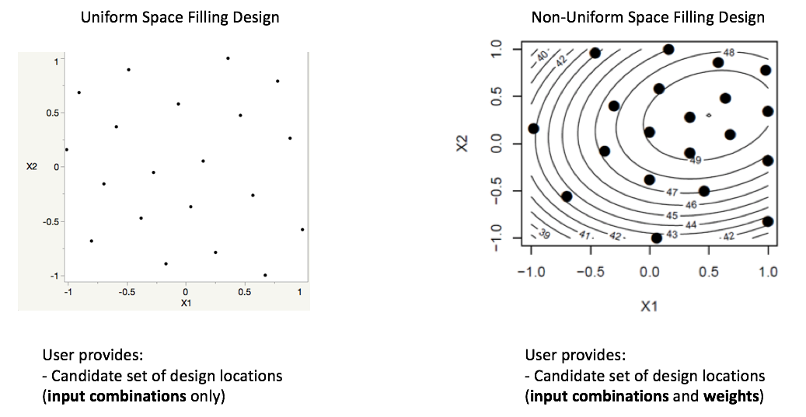
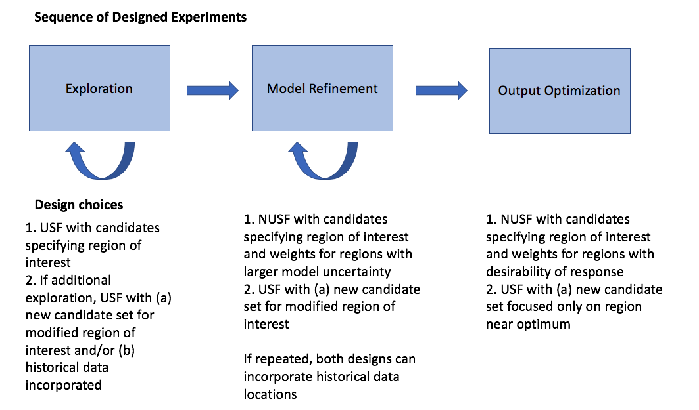

Sequential Design of Experiments (SDOE)
=======================================

A sequential design of experiments strategy allows for adaptive learning based on incoming results as the experiment is being run. The SDoE module in FOQUS allows the experimenter to flexibly incorporate this strategy into their designed experimental planning to allow for maximal relevant information to be collected. Statistical design of experiments is an important strategy to improve the amount of information that can be gleaned from the overall experiment. It leverages principles of putting experimental runs where they are of maximum value, the interdependence of the runs to estimate model parameters, and robustness to the variability of results that can be obtained when the same experimental conditions are repeated. There are two major categories of designed experiments: those for which a physical experiment is being run, and designs for a computer experiment where the output from a theoretical model is explored. While the methods available primarily focus on experiments for physical experiments, opportunities also exist for accelerated learning through strategic selection and updating of experimental runs for computer experiments using the same tools. 

The current version of the SDoE module has functionality that can produce flexible space-filling designs. Currently, two types of space-filling designs are supported:
 
Uniform Space Filling  (USF) Designs space design points evenly, or uniformly, throughout the user-specified input space. These designs are common in physical and computer experiments where the goal is to have data collected throughout the region, and when predicting new results at a new location, some data will be available close by. To use the Uniform Space Filling design capability in the SDoE module, the only requirement for the user is that the candidate set of possible input combinations contains a column for all of the inputs for each row in the file. It is also recommended (but not required) to have an index column to be able to track which rows of the candidate set were selected.

Non-Uniform Space Filling (NUSF) Designs maintain the goal of having design points spread throughout the desired input space, but add a feature of being able to emphasize some regions more than others. This adds flexibility to the experimentation, when the user is able to tune the design to have as close to uniform as desired or as strongly concentrated in one or more regions as desired. This is new capability that has been added to the SDoE module, and should provide the experimenter with ability to tailor the design to what is required. To use the Non-Uniform Space Filling design capability in the SDoE module, the requirements are that the candidate set contains (a) one column for each of the inputs to be used to construct the design, and (b) one column for the weights to be assigned to each candidate point, where larger values are weighted more heavily and will result in a higher density of points close to those locations. The Index column is again recommended, but not required.

   
   Comparison of USF and NUSF designs

Key features of the two approaches that we use in this module are: a) designs will be constructed by selecting from a user-provided candidate set of input combinations, and b) historical data, which has already been collected can be integrated into the design construction to ensure that new data are collected with a view to disperse from where data are already available.

Why Space-Filling Designs?
--------------------------

Space-filling designs are a design of experiments strategy that is well suited to both physical experiments with an accompanying model to describe the process and to computer experiments. The idea behind a space-filling design is that the design points are spread throughout the input space of interest. If the goal is to predict values of the response for a new set of input combinations within the ranges of the inputs, then having data spread throughout the space means that there should be an observed data point relatively close to where the new prediction is sought.

In addition, if there is a model for the process, then having data spread throughout the input space means that the consistency of the model to the observed data can be evaluated at multiple locations to look for possible discrepancies and to quantify the magnitude of those differences throughout the input space.

Hence, for a variety of criteria, a space-filling design can serve as good choice for exploration and for understanding the relationship between the inputs and the response without making a large number of assumptions about the nature of that relationship. As we will see in subsequent examples, the sequential approach allows for great flexibility to leverage what has been learned in early stages to influence the later choices of designs. In addition, the candidate-based approach that is supported in this module has the advantage that it can make the space-filling approach easier to adapt to design space constraints and specialized design objectives that may evolve through the stages of the sequential design.

We begin with some basic terminology that will help provide structure to the process and instructions below.

*	Input factors – these are the controllable experimental settings that are manipulated during the experiment. It is important to carefully define the ranges of interest for the inputs (eg. Temperature in [200°C,400°C]) as well as any logistical or operational constraints on these input factors (eg. Flue Gas Rate < 1000 kg/hr when Temperature > 350°C)

*	Input combinations (or design runs) – these are the choices of settings for each of the input factors for a particular run of the experiment. It is assumed that the implementers of the experiment are able to set the input factors to the desired operating conditions to match the prescribed choice of settings.

* Input space (or design space) – the region of interest for the input factors in which the experiment will be run. This is typically constructed by combining the individual input factor ranges, and then adapting the region to take into account any constraints. Any suggested runs of the experiment will be located in this region.

*	Responses (or outputs) – these are the measured results obtained from each experimental run. These are most desirably quantitative summaries of a characteristic of interest from running the process at the prescribed set of operating conditions (eg. CO2 capture efficiency is a typical response of interest for CCSI).

*	Design criterion / Utility function – this is a mathematical expression of the goal (or goals) of the experiment that is used to guide the selection of new input combinations, based on the prior information before the start of the experiment and during the running of the experiment. The design criterion can be based on a single goal or multiple competing goals, and can be either static throughout the experiment or evolve as goals change in importance over the course of the experiment. Common choices of goals for the experiment are:

#.	exploring the region of interest, 

#.        improving the precision (or reducing the uncertainty) in the estimation of model parameters, 

#.	improving the precision of prediction for new observations in the design region, 

#.        quantifying the discrepancy between the model and data, or 

#.	optimizing the value of responses of interest. 

An ideal design of experiment strategy uses the design criterion to evaluate potential choices of input combinations to maximize the improvement in the criterion over the available candidates. If the optimal design strategy is sequential, then the goal is to use early results from the beginning of the experiment to guide the choice of new input combinations based on what has been learned about the responses.

Matching the Design Type to Experiment Goals
--------------------------------------------

At different stages of the sequential design of experiments, different objectives are common. We outline some common progressions of objectives for experiments that we have worked with in the CCSI project. Often in the early stages of experimentation, little is known about the response and its characteristics. Hence, a first experiment often involves **exploration**, where the goal is to gain some preliminary understanding of the characteristics of the response across the input region of interest. Depending on how easy it is to collect and process data, this exploration might be done in a single first experiment, or there may be opportunities to do several smaller stages. It is particularly beneficial to do the exploration step in smaller stages if there is uncertainty about what areas of the input space are feasible. This can help save resources by exploring slowly and eliminating regions where there are problems.

After initial exploration, a common next step in the sequence of experiments is **model refinement**. For many CCSI experiments, the physical experiments are being collected in conjunction with an underlying science-based model. The data collection from a physical experiment is used to calibrate the model, and provide feedback about where model performance needs improvement (both resolving inaccurate characterization of features and high uncertainty). Often after the first set of data, regions of the input space perform well, while others have issues, such as large uncertainty, as measured by the width of a prediction or confidence interval.

   
   SDOE sequence of steps
