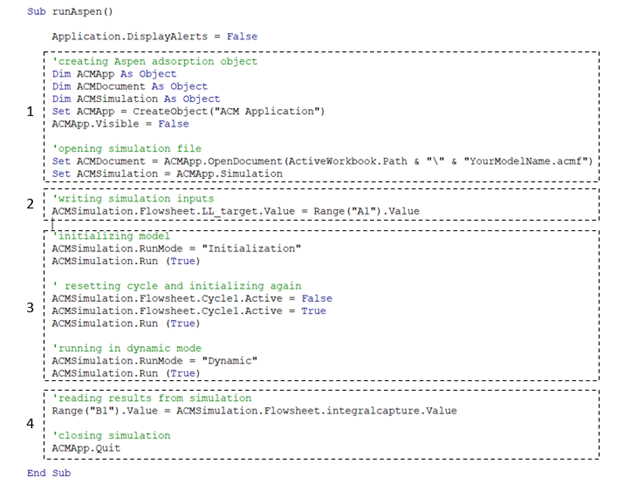
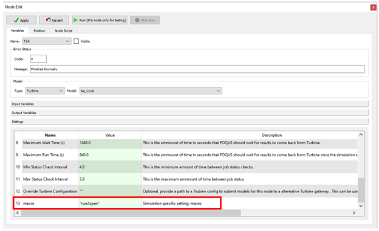

Additional ACM Functionality with Excel/VBA
===========================================

When additional functionality is needed when working with Aspen Custom Modeler (ACM), such as custom initialization routines or executing complicated cyclic models, using excel/VBA execution of the ACM simulation is a viable option. The excel file can then be connected to FOQUS through the documented SimSinter connection. 

Below is an example of a VBA macro titled ‘runAspen’ for executing a temperature swing adsorption (TSA) cycle simulated in ACM.

   VBA Example Code
 
Code block 1 creates the ACM object using objects installed with Aspen simulation workbook. The full path of the ACM file is needed in the ‘ACMApp.OpenDocument’ function. The ‘ACMSimulation’ object is used to read/write variables in the simulation and even run the simulation. Additionally, you can view the aspen simulation by setting ‘ACMApp.Visible’ to True.

Code block 2 changes the value of a fixed variable in the simulation through the ‘ACMSimulation’ object. This can be a hardcoded value in the macro script, or it can read from a worksheet cell which is shown here. 

Code block 3 runs the custom initialization and simulation routine for this TSA example. The model is first run in initialization mode and then to ensure that the cycle task will correctly run, it is deactivated and then reactivated. The model is again initialized and then run in dynamic mode.

Code block 4 reads results from the model and then closes the simulation.

This is a simple example, but additional examples and more information for scripting and automation can be found in the documentation for ACM.
To run the model using FOQUS, connect the excel file which contains the execution macro using SimSinter, and create a flowsheet node for the resulting turbine model. Tutorials for Excel/SimSinter and creating a flowsheet are linked below.

| https://foqus.readthedocs.io/en/stable/chapt_sinter/tutorial/excel.html
| https://foqus.readthedocs.io/en/stable/chapt_flowsheet/tutorial/sim_flowsheet.html

Specifying that the macro should be run can be done during the SimSinter setup step or in the settings tab after the flowsheet node has been created. The node settings for our example setup are shown below in which the ‘runAspen’ macro is specified.

   Node Settings for Running Excel Macro