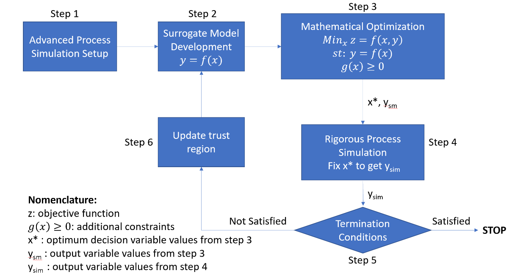

Surrogate model-based optimizer - overview
==========================================

Introduction
------------

As part of the improvements and new capabilities of FOQUS, the Surrogate Model-based Optimizer is an automated framework for hybrid simulation-based and mathematical optimization.
The SM-based Optimizer in FOQUS leverages the direct link with commercial simulators, generation of surrogate models, access to algebraic modeling systems for optimization, and implements
a modified trust region approach for the optimization of advanced process systems.

The motivation behind developing this framework was to combine the advantages of both, simulation based, and pure mathematical optimization. Pure mathematical optimization directly leverages
the equations describing the physical system to be optimized. Such models are the most accurate and complete representation of the system, and thus provide the most accurate optimization results.
This approach encounters challenges, however, when large sets of PDE’s and highly complex, nonlinear representations are required to sufficiently characterize the process of interest.
The mathematical model can then become intractable. Simulation-based optimization, on the other hand, considers the system model to be a black box and is based on a heuristic algorithm that uses
the results from process simulations to obtain the relationship between the relevant system input and output variables. Although this approach can be used to obtain satisfactory results for
large scale, complex systems, it can often be computationally expensive and hence, time consuming, due to multiple simulation runs.

The SM-based optimization algorithm involves generating a simplified representation of the rigorous process model (i.e. built using advanced commercial simulators like ASPEN, gPROMs, Python, etc.)
via surrogate models that are more amenable to gradient-based optimization methods and nonlinear programming (NLP) solvers. This approach can overcome the difficulties associated with complex process
models in terms of intractability and multiple evaluation requirement, without significantly compromising solution quality and speed, provided that the surrogate modeling method is accurate.

Additional python packages required
-----------------------------------

1.	Surrogate modeling toolbox - smt: pip install smt
2.	Experimental design package for python - pyDOE: pip install pyDOE
3.  Pyomo package for optimization: pip install pyomo
4.  Mathematical optimization solver ipopt: conda install -c conda-forge ipopt (preferred installation method for Windows users)

Note: smt package is required to access its Latin hypercube sampling method, which is required to generate samples and re-build surrogate models in each iteration of the algorithm.
pyDOE package is a requirement within the smt package, which makes its installation necessary.

Framework
----------

   Figure 1 - Framework for surrogate model-based optimization algorithm

   Algorithm Steps

As shown in figure 1, the framework consists of 6 main steps, in which the first 2 steps require the user interaction, while the rest of the algorithm will be performed automatically.
The detailed description of each Step is provided here:

**Step 1 –** Flowsheet set up: First, the user must provide a rigorous process simulation to the FOQUS flowsheet, then select the input and output variables of interest.
Once, the simulation node has been tested and the user provided input variables with their default values, upper and lower bounds, the user needs to generate simulation samples using the
UQ module in FOQUS for a given input space. At this point, the upper and lower variable bounds will be considered as the initial trust region, and the samples will be used to develop the initial surrogate model.

**Step 2 –** Surrogate Model Development: This step is simple, but critical to minimize the number of iterations required in the algorithm. The user must select the number of samples, and alamo settings to generate
the best surrogate possible. Finally, The user generates a surrogate model based on the simulation samples using FOQUS-ALAMO module.

**Step 3 –** Mathematical Optimization: In the Optimization module, setup the problem by selecting the decision variables, providing the objective function, and additional constraints. Since, FOQUS Optimization module
allows multiple derivative free optimizers (DFO), user must select the surrogate model-based optimizer as the solver, with appropriate settings for the algorithm (detailed description of the settings is provided in the tutorial).
The SM-based optimizer formulates and solves the optimization problem by creating a Pyomo model (Concrete Model), adding the input and output variables (as Pyomo variables with bounds – trust region), adding the surrogate models as
Pyomo constraints, and adding additional constraints provided by the user (g(x)>0 or h(x)=0). In this step, to avoid eliminating feasible solutions due to local optimums, a multi-start approach has been implemented, in which the
optimization problem is solved for different initialization points. A combination of initial values is used based on the variable bounds, mid-point, and user provided values for the decision variables. The optimal solution chosen
corresponds to that case which gives best value of objective function (minimum or maximum). Note, if a solution returns infeasible it will be eliminated. The solution is called x* and ysm, for optimum decision variables and output variables, respectively.

**Step 4 –** Rigorous Process Simulation: In this step, the process simulation is run at the optimal point obtained in step 3 (x*), then evaluating the optimal solution using the rigorous model, we obtain the corresponding output variable values ysim.

**Step 5 –** Termination Condition Check: The algorithm includes three termination conditions to determine if the optimal solution has been obtained:

.. math:: \frac{|z_{sim} - z_{sm}|}{|z_{sim}|}\leq \epsilon.... (1)

.. math:: \frac{|y_{sim} - y_{sm}|}{|y_{sim}|}\leq \epsilon.... (2)

.. math:: g(x^*) \geq 0.... (3)

First, Equation 1 checks if the objective function from the surrogate model (zsm) minus the one obtained evaluating the rigorous model (zsim) meet the tolerance. Secondly, the relative error between the output variables from the optimization problem (ysm)
and the rigorous simulation (ysim) in Equation 2. Finally, Equation 3 checks that the additional constraint is satisfied at the optimum point.
If the conditions in step 5 are satisfied, the algorithm is terminated, otherwise, step 6 is implemented.

**Step 6 –** Update Trust Region: In this step, the input variable upper and lower bounds (xub and xlb) are adjusted to shrink the trust region. The extent to which the trust region shrinks (difk) depends on the fractional multiplier α.
The updated upper and lower bounds (xub,k+1 and xlb,k+1) are calculated around x*, based on difk:

.. math:: 0 \leq  \alpha  \leq 1

.. math:: dif_k=(x_{ub,k} - x_{lb,k})* \alpha

.. math:: x_{lb,k+1} = x^* -  \frac{dif_k}{2}.... (x_{lb,k+1} = x_{lb,k=0}...if , x_{lb,k+1} < x_{lb,k=0})

.. math:: x_{ub,k+1} = x^* +  \frac{dif_k}{2}.... (x_{ub,k+1} = x_{ub,k=0}...if , x_{ub,k+1} > x_{ub,k=0})

Note that if the ratio of upper and lower bounds is less than or equal to a set value of bound ratio, the trust region is not updated further, and the algorithm terminates.

If

.. math:: \frac{x_{ub,k+1}}{x_{lb,k+1}}\leq bound ratio

Stop

Further, Latin hypercube samples are generated in the updated trust region. This sampling method ensures that the sample points are uniformly spaced out and cover the entire trust region without any skewness. Once the samples are generated,
step 2 is repeated using this new data set and the original ALAMO settings.
