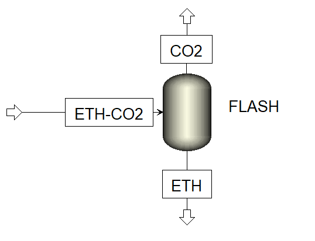
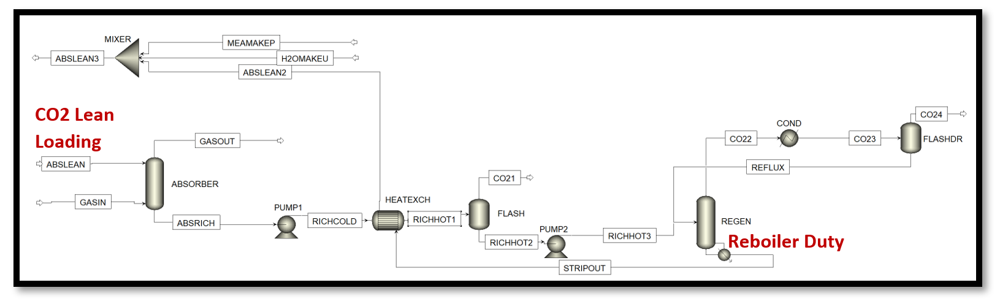

Surrogate model-based optimizer - tutorial
==========================================

Flash Optimization
------------------

**Problem Statement**: An Ethanol-CO2 mixture at 50 mol %, enters a flash column at 100 kg/hr, 25 0C and 100 bars.
The optimum flash column pressure needs to be determined such that maximum revenue can be obtained based on the CO2
obtained in the vapor stream, and Ethanol obtained in the liquid stream. The optimization is subject to a purity constraint,
specifying that the CO2 mass % in the vapor phase should be at least 98.5 %. The system is shown in Figure 2.

   Figure 2: Ethanol-CO2 Flash System

**Instructions**

**Step 1 - Flowsheet Setup**

    Step 1.1 - Setup the Aspen model for flash column as FOQUS simulation node : To setup the Aspen model in the FOQUS flowsheet,
    first, create and add the SimSinter json file to turbine. Then, create a node named ‘FLASH’, and load the simulation in the node.
    The Aspen and json files (along with the FOQUS file) can be found in the folder: **examples/tutorial_files/SM_Optimizer/Flash_Optimization**.

    .. note:: |examples_reminder_text|

    Figure 3 and 4 represent the FOQUS node with loaded simulation. Finally, run the flowsheet simulation.

    .. figure:: ../figs/flash_input_variables.png
       :alt: Figure 3: Input variables of the Ethanol-CO2 Flash Simulation Node in FOQUS
       :name: fig.flash.input.variables

       Figure 3: Input variables of the Ethanol-CO2 Flash Simulation Node in FOQUS

    .. figure:: ../figs/flash_output_variables.png
       :alt: Figure 4: Output variables of the Ethanol-CO2 Flash Simulation Node in FOQUS
       :name: fig.flash.output.variables

       Figure 4: Output variables of the Ethanol-CO2 Flash Simulation Node in FOQUS

    Step 1.2 - 	Generate a simulation ensemble by selecting ‘FLASH.PRES’ as a variable with bounds 1-10 bar
    (in this case, keep the other variables fixed). Select Latin Hypercube Sampling with 20 points, and after the samples are generated,
    launch the simulations. Figure 5 represents the simulation ensemble generation.

    .. figure:: ../figs/sim_ensemble_generation.png
       :alt: Figure 5: Simulation ensemble generation
       :name: fig.sim.ensemble.generation

       Figure 5: Simulation ensemble generation

    For more details on this, refer to the documentation: https://foqus.readthedocs.io/en/latest/chapt_uq/tutorial/sim.html

**Step 2 - 	Surrogate Model Development**

    Step 2.1 - 	Select Data Set: In the surrogate modeling module, select ALAMO as the tool and under ‘Data’ tab, ensure that the dataset
    corresponds to the correct UQ Simulation Ensemble. If there are multiple data sets, add filters to select the appropriate set.
    Figure 6 represents the data selection in the surrogates tab.

    .. figure:: ../figs/sm_generation_data.png
       :alt: Figure 6: Select data for surrogate model generation
       :name: fig.sm.generation.data

       Figure 6: Select data for surrogate model generation

    Note: If a particular simulation ensemble needs to be used from the UQ module for generating the surrogate model, add a data filter,
    referring to the instructions in the documentation:
    https://foqus.readthedocs.io/en/latest/chapt_uq/tutorial/data.html

    Step 2.2 - 	ALAMO input/output variables: Under ‘Variables’ tab, select ‘FLASH.PRES’ as the surrogate model input variable, and
    ‘FLASH.CARBOLIQ’, ‘FLASH.CARBOVAP’, ‘FLASH.ETHANLIQ’, ‘FLASH.ETHANVAP’ as the surrogate model output variables. Figure 7 represents
    surrogate model variables selection.

    .. figure:: ../figs/sm_var_select.png
       :alt: Figure 7: Select variables for surrogate model generation
       :name: fig.sm.var.select

       Figure 7: Select variables for surrogate model generation

    Step 2.3 - 	ALAMO Settings: Under ‘Method Settings’, to select the data set to be used to develop the surrogate models,
    an Initial Data Filter can be applied to the full data set, if there are no filters, simply select “all”. In this case, we select “uq2” filter.
    In Figure 8 and 9, the settings 3 to 9 values are default in FOQUS. The settings 10 to 22 have been selected to explore several basis functions
    and obtain the best model possible, while minimizing the size of the model (selecting Bayesian Inference Criteria as the modeler). The rest of the
    settings are kept as their default values. For more information about the best settings to be used in ALAMO, please see the following documentation:
    https://foqus.readthedocs.io/en/latest/chapt_surrogates/tutorial/alamo.html

    .. figure:: ../figs/alamo_settings.png
       :alt: Figure 8: Select appropriate method settings for surrogate model generation
       :name: fig.alamo.settings

       Figure 8: Select appropriate method settings for surrogate model generation

    .. figure:: ../figs/alamo_settings_cont.png
        :alt: Figure 9: Select appropriate method settings for surrogate model generation continued
        :name: fig.alamo.settings.cont

        Figure 9: Select appropriate method settings for surrogate model generation continued

    Note that setting number 42 is the name of the python file that gets created after ALAMO runs. It contains the Pyomo model for optimization,
    based on the ALAMO generated surrogate model. This python file is accessed by the SM based optimizer.

    Step 2.4 - Under ‘Execution’, run ALAMO, as shown in figure 10:

    .. figure:: ../figs/run_alamo.png
       :alt: Figure 10: Run ALAMO to generate surrogate model
       :name: fig.run.alamo

       Figure 10: Run ALAMO to generate surrogate model

**Step 3 - 	Mathematical Optimization:**

    Step 3.1 - 	Problem Setup - select optimization variables: In the Optimization module, select ‘FLASH.PRES’ as the decision variable.
    Keep the other input variables fixed, as shown in figure 11.

    .. figure:: ../figs/select_optim_vars.png
       :alt: Figure 11: Select optimization variables
       :name: fig.select.optim.vars

       Figure 11: Select optimization variables

    Step 3.2 - 	Problem Setup - objective function and additional flowsheet constraints declaration: The objective is to maximize the separation
    process, therefore, we assume that the selling price of the vapor and liquid are $5/kg and $30/kg, respectively. Additionally, the CO2 vapor
    stream must be at least 98.5% pure.  In the Objective/Constraints tab, under the objective function f(x) expression section or box, enter
    ``-5*f.FLASH.CARBOVAP -30*f.FLASH.ETHANLIQ``
    Under the inequality constraints section/box expression, enter ``-f.FLASH.CARBOVAP/(f.FLASH.CARBOVAP + f.FLASH.ETHANVAP) + 0.985``

    .. figure:: ../figs/obj_func_constraint.png
       :alt: Figure 12: Add objective function and constraints to the solver
       :name: fig.obj.func.constraint

       Figure 12: Add objective function and constraints to the solver

    Step 3.3 - 	Optimization solver settings: Under the solver tab, select “SM_Optimizer”

    .. figure:: ../figs/sm_optimizer_options.png
       :alt: Figure 13: Select appropriate solver options
       :name: fig.sm.optimizer.options

       Figure 13: Select appropriate solver options

    Figure 13 shows the solver options. solver options 1 to 11 are algorithm specific.

    Solver option 1 selects the source of mathematical optimization solver. It can either be “gams” or “pyomo”. It is preferred to keep it at the default setting, “pyomo”.

    Solver option 2 selects the mathematical optimization solver which will be used to solve the optimization at each iteration.
    It is preferred to keep it at the default setting, “ipopt”.

    Solver option 3 selects the type of mathematical model that is formulated. This is used when “gams” is selected as the solver source.
    Depending on the type of problem, it can be non-linear programming “nlp”, linear programming “lp”, or mixed integer non-linear programming “minlp”. The setting would be “nlp” for this case.

    Solver option 4 describes the maximum number of iterations that are allowed before the algorithm terminates. It can be set to 10 in this case.

    Solver option 5 describes the value of ‘alpha’ which is a fractional multiplier that affects the extent to which the trust region shrinks at each iteration. The smaller this value is, faster
    is the rate of convergence of the algorithm. However, a very small value might discard the optimal solution. A value of 0.8 is chosen for this case.

    Solver option 6 describes the number of Latin hypercube samples for generating the surrogate model in each iteration. Note that more the number of samples, a more accurate surrogate model could be obtained,
    however, the algorithm would take a longer time to converge. A value of 10 is chosen in this case.

    Solver option 7 describes the lower limit of the ratio of upper and lower bounds of the decision variables. This condition is imposed while shrinking the trust region, to ensure that the solver converges.
    A value of 1 is chosen in this case.

    Solver option 8 allows the user to display the mathematical optimization solution at each iteration

    Solver options 9, 10, 11 describe the tolerance for the objective value, inequality constraint, and output variable value termination conditions, respectively. A value of 0.001 is chosen in this case.

    Solver option 12: if true, the optimization results will be stored in the FOQUS flowsheet. i.e. input and output variable values.

    Since, each Algorithm iteration includes the generation of surrogate models, a call to Pyomo solver, and a call to the rigorous process simulation, the results are stored in the flowsheet results data tab,
    under the set name provided by the user in option 13.
    Solver option 14 corresponds to the python file containing the Pyomo model for the initial surrogate model developed in the previous steps. The name should match setting number 42 in the ALAMO settings.
    User can select the names of text and python files from option 15 to 17. The names should end with the required extension ‘.txt’ for text file and ‘.py’ for python file.

    Step 3.4	Under the Run tab, click on ‘start’.
    The main details for each iteration get displayed on the message window as the solver runs, the details are divided by section (i.e. step 3, step 4, step 5, etc.).
    After the final iteration, once the optimization is successful, the results get displayed as shown in the figure 14 below:

    .. figure:: ../figs/sm_optim_run.png
       :alt: Figure 14: Start the optimization and check results in the message window
       :name: fig.sm.optim.run

       Figure 14: Start the optimization and check results in the message window

   **Result Analysis:**

   The optimal solution was obtained in 3 iterations, and reported a revenue of $ 1677.06 /hr and the problem was solved in 4 min 30 seconds. The overall implementation of the algorithm required a total of 23 rigorous simulations (ASPEN),
   9 calls to the Ipopt solver, and two calls to ALAMO. Compared with a DFO solver the SM-based obtained the same solution in 6 min 30 seconds.
   The final optimization result is loaded in the node input and output variables, and gets stored in the flowsheet results data tab.

   Solver option 15 corresponds to the file saving the surrogate models generated in each algorithm iteration;
   Solver option 16 corresponds to the python file containing plots that show termination condition values at each algorithm
   iteration. These files are useful to track the extent of convergence, as the algorithm proceeds.
   Finally, Solver option 17 corresponds to the python file that contains data to show the parity plot for the final surrogate model.

   Note that these extra text and python files can be found in the "user_plugins" folder of FOQUS working directory.

MEA Carbon Capture System Optimization
--------------------------------------

   Figure 15: MEA Carbon Capture System

   **Problem Statement:**
   An MEA solvent based carbon capture system is set up in Aspen Plus v10, as shown in figure 15, with a design specification of carbon capture rate 90 %.
   The flue gas flowrate to the absorber is 2266.1 kg/hr with 17.314 % by mass CO2. It is sought to minimize the specific reboiler duty associated with the regenerator,
   by varying the CO2 loading in the lean solvent entering the absorber.

   Note: The Aspen, json, and FOQUS files for this example can be found in the folder: **examples/tutorial_files/SM_Optimizer/MEA_Optimization**

   **Result:**
   After implementing the SM based optimization solver, the solution is:
   Optimum CO2 lean loading = 0.1695 mol CO2/mol MEA
   Rigorous model output variable values at optimum:
   Solvent Flowrate = 5438.703 kg/hr
   Total CO2 Capture Rate = 353.1799 kg/hr
   SRD = 3.6382 MJ/kg CO2

**Summary:**
This tutorial demonstrated the implementation of the surrogate model-based optimization. This includes setting up the Aspen model in FOQUS, generating the initial dataset (required for surrogate model development) in the UQ module, generating the surrogate model using ALAMO,
and further, using it to solve the required optimization problem. In each iteration, after the optimization is solved, the rigorous model is evaluated at the optimum decision variable values returned by the optimization solver. Note that the final optimal solution reported
by the algorithm corresponds to the solution of the rigorous model when evaluated at the optimal decision variable values.
In comparison with other optimization tools provided by FOQUS, the SM-based optimizer has an advantage over DFO solvers in terms of total solution time and accuracy. For the flash optimization example, SM based optimizer took total 4 min 30 seconds,
while the NLopt DFO solver took 6 min 30 seconds for obtaining the same solution. For the MEA system example, SM based optimizer took total 48 mins, while the NLopt DFO solver took 1 hr 5 mins.
Overall, the SM based optimizer has expanded the possibility of solving optimization problems involving complex flowsheets within a shorter time frame as compared to DFO solvers, without compromising solution accuracy.
