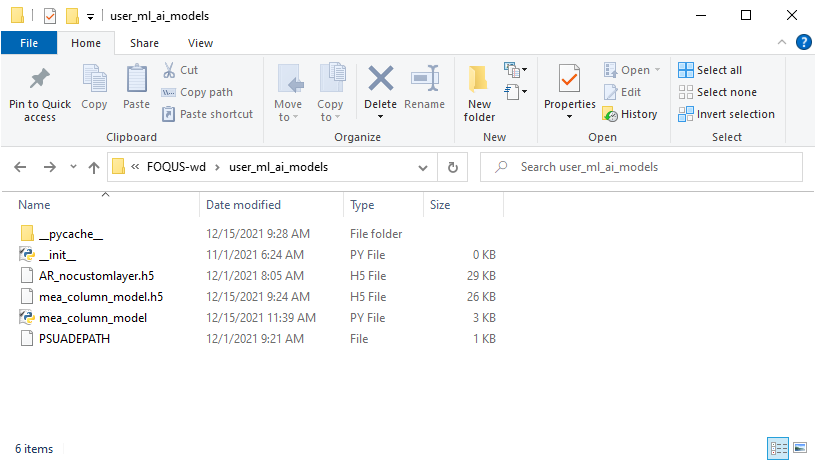
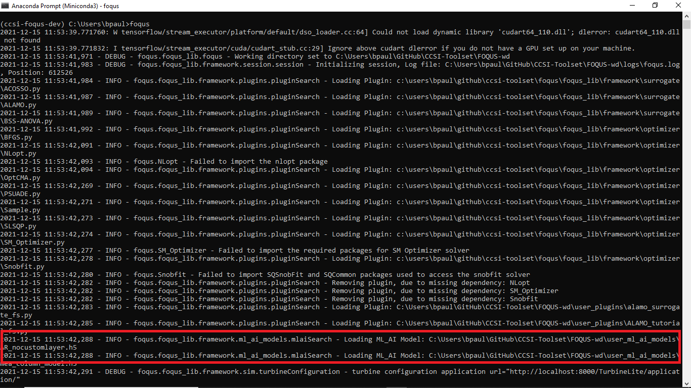
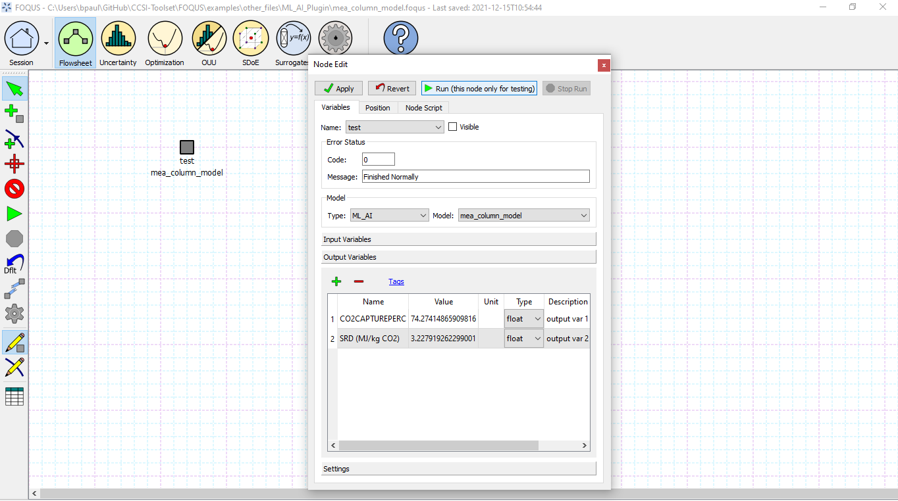

Machine Learning & Artificial Intelligence Flowsheet Model Plugins
==================================================================

In addition to data-driven model generation, surrogates may be specified
by importing external Python classes. FOQUS supports conversion of custom
Pymodel scripts as well as neural network model files into flowsheet node
surrogates. The FOQUS session script will automatically load model files
from the corresponding working directory folders when the application is
launched.

- Plugin – Selecting this model type in the Node Editor displays available
  Python model classes, which typically contain initialization and run
  methods to define the model expressions. To use this tool, users must
  develop a Pymodel script (see the examples in *FOQUS.foqus_lib.framework.pymodel*)
  as a guide) and place the file in the appropriate folder *user_plugins* in the
  working directory, as shown below. This model type is demonstrated in
  Section :ref:`tutorial.surrogate.fs`.

- ML_AI – Selecting this model type in the Node Editor displays available
  neural network models; this tool currently supports TensorFlow Keras
  model files saved in Hierarchical Data Format 5 (.h5), the standard
  Keras SavedModel format (folder containing .pb data files), or serialized
  to an architecture dictionary (.json) with separately saved model weights
  (.h5). Additionally, this tool supports PyTorch models saved in the standard
  format (.pt) and Scikit-learn models serialized in the standard Python pickle
  format (.pkl). The examples folder contains demonstrative training and class
  scripts for models containing no custom layer (see below for more information
  on adding custom layers), a custom layer with a preset normalization option
  and a custom layer with a custom normalization function, as well as models
  saved in all supported file formats. To use this tool, users must train and
  export a machine leanring model and place the file in the appropriate folder
  *user_ml_ai_plugins* in the working directory, as shown below. Optionally,
  users may save Keras models with custom attributes to display on the node,
  such as variable labels and bounds. While training a Keras model with custom
  attributes is not required to use the plugin tool, users must provide the
  necessary class script if the Keras model does contain a custom object (see
  below for further information on creating custom objects). PyTorch and
  Scikit-learn models do not have this requirement and the class script does not
  need to exist in the plugins folder. This model type is used in the same manner
  as Pymodel Plugins, per the workflow in Section :ref:`tutorial.surrogate.fs`.

Custom Model Attributes
-----------------------

The high-level neural network library of Keras integrates with TensorFlow's
machine learning library to train complex models within Python's user-friendly
framework. Keras models may be largely split into two types: **Sequential**
which build linearly connected model layers, and **Functional** which build
multiple interconnected layers in a complex system. More information on
TensorFlow Keras model building is described by :ref:`(Wu et al. 2020)<Wu_2020>`.
Users may follow the recommended workflow to install and use TensorFlow in a
Python environment, as described in the TensorFlow documentation:
https://www.tensorflow.org/install.

When importing TensorFlow Keras models, users should ensure their Python environment
contains the same Keras package version used to train the model files. TensorFlow
offers limited compatibility between versions. The example files include models
trained with TensorFlow 2.3 and 2.7; users with TensorFlow 2.7 should use the 2.7
models.

The ML AI Plugin supports adding neural networks of either type to FOQUS
nodes; if a custom object is needed, only the Functional API supports
serializing custom attributes. If a model is saved with a custom input layer
as shown below, FOQUS will automatically read and import the custom attributes
into the Node Editor.

PyTorch offers an optimized tensor library for deep learning. While Keras connects
dependent layers sequentially or simultaneously, PyTorch more explicitly uses prior
layers as functional inputs for later layers in the neural network. Similar to the
built-in "custom object" registration feature in Keras, PyTorch allows the creation
of custom layers while defining the "forward" advancement method that builds the
network prior to training. Users may obtain a great deal of usage standards and best
practices information as described in the PyTorch documentation:
https://pytorch.org/docs/stable/index.html.

Scikit-learn offers a machine learning library for predictive data analysis for a
wide range of classification and regression problems, including neural networks. To
train deep learning neural networks, the package utilizes a multi-layer regressor
that optimizes squared-loss using LBFGS or stochastic gradient descent algorithms.
These models offer less flexibility than TensorFlow Keras or Torch models, while
providing a much simpler syntax for generating and leveraging neural networks. Users
may find further information on the Scikit-learn package in the documentation:
https://scikit-learn.org/stable/index.html and further information on deep learning
capabilities as well:
https://scikit-learn.org/stable/modules/generated/sklearn.neural_network.MLPRegressor.html#sklearn.neural_network.MLPRegressor.

The examples files located in *FOQUS.examples.other_files.ML_AI_Plugin* show how users
may train new models or re-save loaded models with a custom layer.

Currently, FOQUS supports the following custom attributes:

- *input_labels* – list of string objects containing labels for each input
  variable (default: x1, x2, x3, ...)
- *input_bounds* – list of tuple (pair) objects containing upper and lower
  bounds for each input variable (default: (0, 1E5))
- *output_labels* – list of string objects containing labels for each output
  variable (default: z1, z2, z3, ...)
- *output_bounds* – list of tuple (pair) objects containing upper and lower
  bounds for each output variable (default: (0, 1E5))
- *normalized* – Boolean flag for whether the user is passing a normalized
  neural network model; to use this flag, users must train their models with
  data normalized according to a specifc scaling form and add all input and
  output bounds custom attributes. The section below details scaling options.
- *normalization_form* - string flag required when *normalization* is *True*
  indicating a scaling option for FOQUS to automatically scale flowsheet-level
  inputs to model inputs, and unscale model outputs to flowsheet-level outputs.
  The section below details scaling options.
- *normalization_function* - optional string argument that is required when a
  'Custom' *normalization_form* is used. The section below details scaling options.

Data Normalization For Neural Network Models
--------------------------------------------

In practice, large neural networks often tend towards overfitting and blurring of
features; this is a particular issue with data varying between many orders of magnitude.
Normalizing the input data using the input bounds simplifies internal calculations,
reduces prediction error and minimizes the risk of feature loss. The simplest and most 
common approach is to linearly scale the data such that the lower bound becomes 0 and
the upper bound becomes 1:

.. math:: x_{norm} = \frac{x_{data} - x_{min}}{x_{max} - x_{min}}

.. math:: z_{norm} = \frac{z_{data} - z_{min}}{z_{max} - z_{min}}

This scaling approach generalizes to a common formula:

.. math:: x_{norm} = \frac{f(x_{data}) - f(x_{min})}{f(x_{max}) - f(x_{min})}

.. math:: z_{norm} = \frac{f(z_{data}) - f(z_{min})}{f(z_{max}) - f(z_{min})}

FOQUS supports three scaling methods in this form: linear, base 10 logarithmic
and base 10 exponential. Additionally, FOQUS supports two modified base 10
scaling options. Users may also write their own normalization functions and pass a string
for FOQUS to parse internally via SymPy, a Python library for symbolic mathematics.
It is the responsibility of the user to ensure string objects are valid SymPy
expressions, and FOQUS will automatically scale and unscale using input and output
variable bounds. For example, a custom version of 'Log' scaling following SymPy syntax
(*not* Python or Latex syntax) would take the form below:

.. code:: python

  >>> ...
  >>> self.normalized = True
  >>> self.normalization_form = "Custom"
  >>> self.normalization_function = "(log(datavalue, 10) - log(dataminimum, 10))/(log(datamaximum, 10) - log(dataminimum, 10))"
  >>> ...

The line below follows Python syntax and not SymPy syntax, and would yield the following error message:

.. code:: python

  >>> self.normalization_function = "(log10(datavalue) - log10(dataminimum))/(log10(datamaximum) - log10(dataminimum))"
  "ValueError: Model attribute normalization_function has value (log10(datavalue) - log10(dataminimum))/(log10(datamaximum) - log10(dataminimum)) which is not a valid SymPy expression. Please refer to the latest documentation for syntax guidelines and standards: https://docs.sympy.org/latest/index.html"

Note that 'value', 'minimum' and 'maximum' are common reserved method names within Python and
other modules, and such the labels 'datavalue', 'dataminimum' and 'datamaximum' are used instead.
Detailed messages will appear in the console log for similar errors with specific causes.
Custom expressions must use 'value', 'minimum' and 'maximum' to be recognized by FOQUS.
More information on SymPy syntax, structure and standards may be found in their latest release
documentation: https://docs.sympy.org/latest/index.html.

Note that users must implement desired data normalization during model training, and both of these steps
occur externally to FOQUS. Users should ensure that data normalization results in an accurate neural network
model without overfitting before loading into FOQUS. Available scaling options and required flags are
summarized in the table below:

.. list-table:: Data Normalization Options
  :widths: 10 15 10 10 20 15
  :header-rows: 1

  * -
    - Variable Bounds
    - *normalized*
    - *normalization_form*
    - Scaling Formula
    - *normalization_function*
  * - None
    - Optional (not required)
    - Must be *False* or absent
    - Recommend excluding (not required)
    - :math:`datascaled = datavalue`
    - Recommend excluding (not required)
  * - Linear
    - Required
    - Must be *True*
    - 'Linear'
    - :math:`datascaled = \frac{datavalue - dataminimum}{datamaximum - dataminimum}`
    - Recommend excluding (not required)
  * - Log Base 10
    - Required
    - Must be *True*
    - 'Log'
    - :math:`datascaled = \frac{\log_{10} {(datavalue)} - \log_{10} {(dataminimum)}}{\log_{10} {(datamaximum)} - \log_{10} {(dataminimum)}}`
    - Recommend excluding (not required)
  * - Power
    - Required
    - Must be *True*
    - 'Power'
    - :math:`datascaled = \frac{10^{datavalue} - 10^{dataminimum}}{10^{datamaximum} - 10^{dataminimum}}`
    - Recommend excluding (not required)
  * - Log Base 10 Modified
    - Required
    - Must be *True*
    - 'Log 2'
    - :math:`datascaled = \log_{10} {(9 * {\frac{datavalue - dataminimum}{datamaximum - dataminimum}} + 1)}`
    - Recommend excluding (not required)
  * - Power Modified
    - Required
    - Must be *True*
    - 'Power 2'
    - :math:`datascaled = \frac{1}{9} * {(10^{\frac{datavalue - dataminimum}{datamaximum - dataminimum}} - 1)}`
    - Recommend excluding (not required)
  * - Custom
    - Required
    - Must be *True*
    - 'Custom'
    - :math:`datascaled = f(datavalue, dataminimum, datamaximum)`
    - Must be a String with proper SymPy syntax

Usage Example
-------------

The following code snippet demonstrates the Python syntax to train and save
a Keras model with custom attributes; users should refer to the examples folder
for usage of non-Keras neural network trainers. The use of Dropout features in
training is not required, but decreases the risk of overfitting by minimizing
the number of parameters in large models. Similarly, normalizing data often
results in more accurate models since features are less likely to be blurred
during fitting. Users may then enter unscaled input values and return unscaled
output values in the Node Editor. Note that the custom object class script
containing the class and the NN model file itself must all share the same name
to import the custom attributes into a FOQUS node. If certain custom attributes
are not used, it is best if users do not include them in the custom class definition;
for example, the attribute *normalization_function* is not required in this example
and therefore is excluded in the code below. See
*FOQUS.examples.other_files.ML_AI_Plugin.mea_column_model__training_customnormform.py*
for an example implementing a custom normalization function.

Users must ensure the proper script name is used in the following places,
replacing *example_model* with the desired model name:

- Custom class signature, *class example_model(tf.keras.layers.Layer):*
- Creating a callable object, *super(example_model, self).__init__()*
- Defining the class CONFIG, *config = super(example_model, self).get_config()*
- Creating the model, *layers = example_model(*
- Saving the model, *model.save('example_model.h5')*
- The file names of the .h5 model file and custom class script.

See the example files in *FOQUS.examples.other_files.ML_AI_Plugin* for complete syntax
and usage. The folder contains a second model with no custom layer to demonstrate the
plugin defaults. The default output values are not calculated, so the node should be run
to obtain the correct output values for the entered inputs.

To run the models, copy the appropriate model files or folders ('h5_model.h5',
'saved_model/', 'json_model.json', 'json_model_weights.h5') and any custom layer
scripts ('model_name.py') into the working directory folder 'user_ml_ai_models'.
As mentioned earlier, PyTorch and Scikit-learn models only require the model file
('pt_model.pt' or 'skl_model.pkl').
For example, the model name below is 'mea_column_model' and is saved in H5 format,
and the files *FOQUS.examples.other_files.ML_AI_Plugin.TensorFlow_2-10_Models.mea_column_model.h5*
and *FOQUS.examples.other_files.ML_AI_Plugin.mea_column_model.py* should be copied to
*FOQUS-wd.user_ml_ai_models*. For users with older versions of TensorFlow who wish to
test the exampleodels, some model files are provided in versions 2.3 and 2.7 as well as
2.10. Generally, TensorFlows backwards compatible for models two versions back (e.g.
loading models trained in version.3 using version 2.5, or loading models trained in
version 2.8 using version 2.10 is supported).

To distinguish between H5 models and json models with H5 weight files, FOQUS requires the
convention ('model1.h5', 'model1.py') and ('model2.json', 'model2_weights.h5', 'model2.py')
when naming model files. Users should note that defining network layers and training the
network is independent of saved file format, and only the code after `model.summary()`
in the script below will change. See the 'training_customnormform' example scripts
for specific syntax to save models as each Keras file format and non-Keras file type.

.. code:: python

   # Required imports
   >>> import numpy as np
   >>> import pandas as pd
   >>> import tensorflow as tf
   
   # Example follows the sequence below:
       # 1) Main Code at end of file to import data and create model
       # 2) Call create_model() to define inputs and outputs
       # 3) Call custom layer object to define network structure, which uses
       #    call() to define layer connections and get_config to attach
       #    attributes to the custom layer
       # 4) Back to create_model() to compile and train model
       # 5) Back to code at end of file to save the model

   # custom class to define Keras NN layers and serialize (register) objects
   >>> @tf.keras.utils.register_keras_serializable()  # first non-imports line to include in working directory example_model.py
   >>> class mea_column_model(tf.keras.layers.Layer):
           # give training parameters default values, and set attribute defaults to None
   >>>     def __init__(self, n_hidden=1, n_neurons=12,
   >>>                  layer_act='relu', out_act='sigmoid',
   >>>                  input_labels=None, output_labels=None,
   >>>                  input_bounds=None, output_bounds=None,
   >>>                  normalized=False, normalization_form='Linear',
   >>>                  **kwargs):

   >>>         super(mea_column_model, self).__init__()  # create callable object

           # add attributes from training settings
   >>>         self.n_hidden = n_hidden
   >>>         self.n_neurons = n_neurons
   >>>         self.layer_act = layer_act
   >>>         self.out_act = out_act

           # add attributes from model data
   >>>         self.input_labels = input_labels
   >>>         self.output_labels = output_labels
   >>>         self.input_bounds = input_bounds
   >>>         self.output_bounds = output_bounds
   >>>         self.normalized = True  # FOQUS will read this and adjust accordingly
   >>>         self.normalization_form = 'Linear'  # tells FOQUS which scaling form to use

           # create lists to contain new layer objects
   >>>         self.dense_layers = []  # hidden or output layers
   >>>         self.dropout = []  # for large number of neurons, certain neurons
                                 # can be randomly dropped out to reduce overfitting

   >>>         for layer in range(self.n_hidden):
   >>>             self.dense_layers.append(
   >>>                 tf.keras.layers.Dense(
   >>>                     self.n_neurons, activation=self.layer_act))

   >>>         self.dense_layers_out = tf.keras.layers.Dense(
   >>>             2, activation=self.out_act)

           # define network layer connections
   >>>     def call(self, inputs):

   >>>         x = inputs  # single input layer, input defined in create_model()
   >>>         for layer in self.dense_layers:  # hidden layers
   >>>             x = layer(x)  # h1 = f(input), h2 = f(h1), ... using act func
   >>>         for layer in self.dropout:  # no dropout layers used in this example
   >>>             x = layer(x)
   >>>         x = self.dense_layers_out(x)  # single output layer, output = f(h_last)

   >>>         return x

           # attach attributes to class CONFIG
   >>>     def get_config(self):
   >>>         config = super(mea_column_model, self).get_config()
   >>>         config.update({  # add any custom attributes here
   >>>             'n_hidden': self.n_hidden,
   >>>             'n_neurons': self.n_neurons,
   >>>             'layer_act': self.layer_act,
   >>>             'out_act': self.out_act,
   >>>             'input_labels': self.input_labels,
   >>>             'output_labels': self.output_labels,
   >>>             'input_bounds': self.input_bounds,
   >>>             'output_bounds': self.output_bounds,
   >>>             'normalized': self.normalized,
   >>>             'normalization_form': self.normalization_form,   
   >>>         })
   >>>         return config

   # method to create model
   >>> def create_model(data):

   >>>     inputs = tf.keras.Input(shape=(np.shape(data)[1],))  # create input layer

   >>>     layers = mea_column_model(  # define the rest of network using our custom class
   >>>         input_labels=xlabels,
   >>>         output_labels=zlabels,
   >>>         input_bounds=xdata_bounds,
   >>>         output_bounds=zdata_bounds,
   >>>         normalized=True,
   >>>         normalization_form='Linear',
   >>>     )

   >>>     outputs = layers(inputs)  # use network as function outputs = f(inputs)

   >>>     model = tf.keras.Model(inputs=inputs, outputs=outputs)  # create model

   >>>     model.compile(loss='mse', optimizer='RMSprop', metrics=['mae', 'mse'])

   >>>     model.fit(xdata, zdata, epochs=500, verbose=0)  # train model

   >>>     return model

   # Main code

   # import data
   >>> data = pd.read_csv(r'MEA_carbon_capture_dataset_mimo.csv')

   >>> xdata = data.iloc[:, :6]  # here there are 6 input variables/columns
   >>> zdata = data.iloc[:, 6:]  # the rest are output variables/columns
   >>> xlabels = xdata.columns.tolist()  # set labels as a list (default) from pandas
   >>> zlabels = zdata.columns.tolist()  #    is a set of IndexedDataSeries objects
   >>> xdata_bounds = {i: (xdata[i].min(), xdata[i].max()) for i in xdata}  # x bounds
   >>> zdata_bounds = {j: (zdata[j].min(), zdata[j].max()) for j in zdata}  # z bounds
   
   # normalize data - linear scaling is performed manually before training
   >>> xmax, xmin = xdata.max(axis=0), xdata.min(axis=0)
   >>> zmax, zmin = zdata.max(axis=0), zdata.min(axis=0)
   >>> xdata, zdata = np.array(xdata), np.array(zdata)
   >>> for i in range(len(xdata)):
   >>>     for j in range(len(xlabels)):
   >>>         xdata[i, j] = (xdata[i, j] - xmin[j])/(xmax[j] - xmin[j])
   >>>     for j in range(len(zlabels)):
   >>>         zdata[i, j] = (zdata[i, j] - zmin[j])/(zmax[j] - zmin[j])

   >>> model_data = np.concatenate((xdata,zdata), axis=1)  # Keras requires a Numpy array as input

   # define x and z data, not used but will add to variable dictionary
   >>> xdata = model_data[:, :-2]
   >>> zdata = model_data[:, -2:]

   # create model
   >>> model = create_model(xdata)
   >>> model.summary()

   # save model
   >>> model.save('mea_column_model.h5')

After training and saving the model, the files should be placed in the
working directory folder as shown below; if FOQUS cannot find the custom class
due to a missing or misnamed script, the node will not load the attributes. As
noted above, only the custom class lines should be included in the script:

Upon launching FOQUS, the console should include the lines boxed in
red below to show the model files have been successfully loaded:

The model will then appear in the Node Editor menu:

