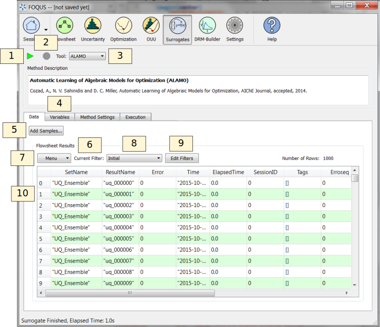

Surrogate Models Overview
=========================

Large-scale computational models are crucial tools to analyze complex
systems. When coupled with uncertainty quantification and optimization
methods, the resulting computational expense becomes intractable. In
order to face the computational burden, surface approximation methods,
black box models, or surrogate models are commonly used. FOQUS provides
a selection of surrogate modeling tools all using a similar work-flow.
This section provides an overview of the surrogate modeling features and
capabilities. The details of each tool are provided in the tutorial
sections.

The following surrogate modeling tools are currently available:

-  ACOSSO – Adaptive COmponent Selection and Shrinkage Operator is a
   regularization method for simultaneous model fitting and variable
   selection based in nonparametric regression methods. ACCOSSO is
   suitable for approximating models with many inputs and no sharp
   changes.

-  ALAMO – Automated Learning of Algebraic Models for Optimization
   generates algebraic models from data sets. These surrogate models are
   ideal for equation oriented optimization problems (which are easily
   differentiable), such as super structure optimization.

-  BSS-ANOVA – Bayesian Smoothing Spline Analysis of Variance is a
   method similar to ACOSSO.

-  iREVEAL – Surrogate models for CFD simulations using Kriging or
   Neural Networks. It contains special features specifically designed
   for working with CFDs.

Data Selection
--------------

The **Data** tab allows the selection of training data to be used to
generate a surrogate model (:ref:`fig.surrogate.data`). If the session is
associated with a flowsheet data (results from a single flowsheet run,
optimization runs, or UQ samples), then the flowsheet data is available
to be the training data and the table will be populated accordingly.

   Surrogate Data Form

#. **Run** the surrogate modeling method.

#. **Stop** the surrogate modeling method.

#. **Surrogate modeling tool** enables the user to select the desired
   surrogate modeling tool from the **Tool** drop-down list.

#. **Description** of the selected surrogate method.

#. **Add Samples** enables the user to generate new training data using
   a model specified in the flowsheet or an emulator (i.e., a basic
   response surface provided as part of the UQ module).

#. **Flowsheet Results** are summarized below.

#. The data table has a **Menu** drop-down list that contains display,
   import/export, and edit commands.

#. Select a data filter from the **Current Filter** drop-down for
   current data display.

#. Add or edit new data filters from **Edit Filters**. This dialog is
   shown in Figure :ref:`fig.filter.1.result`.

#. The **Display** table displays the results of flowsheet evaluations
   stored in the FOQUS session file. The columns are:

   -  **SetName** is a name assigned to samples. This is typically
      equivalent to one UQ sample run or one optimization run.

   -  **ResultName** is a string representing a result name.

   -  **Error** is the simulation result status; 0 indicates success,
      other numbers represent an error. A column for each node displays
      the error status of each node.

   -  **Time** displays the time when the result was stored.

   -  **Elapsed Time** describes how long a result took to calculate.

   -  **Tags** enables a list of string labels to be applied to results.
      This could be used to mark results to be used for a particular
      purpose such as model validation.

   -  The remaining columns display the input and output variables.

Filters can be used to select data. See Section
:ref:`tutorials.fs.data` for more information on
creating filters to the results. The “All” and “None” filters are
available by default. These can be used, for example, to assign all the
data as a training set, or to split the data into a separate training
set and a test set.

Variables
---------

The **Variables** section is illustrated in Figure
:ref:`fig.surrogate.vars`. This section allows
selection of input and output variables used in a surrogate model. Some
surrogate methods such as ALAMO may generate and run additional samples
while building surrogates. The **Min/Max** columns provide bounds on the
variables. Selecting the checkbox next to the variable **Name**
indicates that it should be included in the surrogate generation.
Failure to select a checkbox for any variables will result in error
during surrogate generation.

.. figure:: figs/vars.svg
   :alt: Surrogate Variable Selection
   :name: fig.surrogate.vars

   Surrogate Variable Selection

**Note** : The input and output variables that are displayed in this section
are the ones present in the FOQUS flowsheet nodes. If the user would like to
include additional output variables (calculated based on the original
node variables) in the surrogate model, it is recommended to create them in the
output section of the flowsheet node itself, from the very beginning.
With this approach, the calculated variables will be a part of the surrogate
variable selection, and their relation with the other node variables can be
defined in the nodescript. 

Method Settings
---------------

The **Method Settings** table is illustrated in Figure
:ref:`fig.surrogate.settings`. The settings
available in this table depend on the surrogate tool. A description of
each setting is provided in the third column of the table.

.. figure:: figs/settings.svg
   :alt: Surrogate Settings
   :name: fig.surrogate.settings

   Surrogate Settings

Execution
---------

Clicking **Run** starts the surrogate model building process. The
execution monitor displays after **Run** is clicked (see Figure
:ref:`fig.surrogate.monitor`). The execution
monitor displays the status of the surrogate build. The messages
displayed depends on the surrogate tool.

.. figure:: figs/monitor.svg
   :alt: Surrogate Status Monitor
   :name: fig.surrogate.monitor

   Surrogate Status Monitor

After a successful execution and model building, the results are
displayed. Note that in this case, the surrogate modeling tool ends with
an error, the errors are displayed in this window. After surrogate
generation completes, one or two Python files will be generated
depending on the tool. Each tool generates a file that encodes the
surrogate model as a general Python script that can be used to evaluate
output values for UQ analyses within the UQ module. The other file, if
available, is a FOQUS flowsheet plugin model that allows the surrogate
to be run in a FOQUS flowsheet. The next version of FOQUS will generate
a FOQUS flowsheet plugin model (i.e., the second file) for all surrogate
tools.
