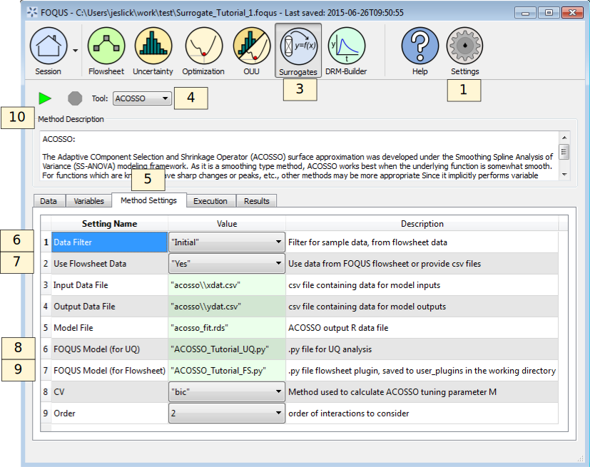

.. _(sec.surrogate.acosso):

Tutorial 2: ACOSSO
==================

This tutorial covers the ACOSSO surrogate modeling method. The Adaptive
COmponent Selection and Shrinkage Operator (ACOSSO) surface
approximation was developed under the Smoothing Spline Analysis of
Variance (SS-ANOVA) modeling framework
:ref:`(Storlie et al. 2011)<Storlie_2011>`. As it is a smoothing type method,
ACOSSO works best when the underlying function is somewhat smooth. For
functions which are known to have sharp changes or peaks, etc., other
methods may be more appropriate. Since it implicitly performs variable
selection, ACOSSO can also work well when there are a large number of
input variables. The ACOSSO procedure also allows for categorical inputs
:ref:`(Storlie et al. 2013)<Storlie_2013>`.

This tutorial uses the same flowsheet and sample setup as the ALAMO
tutorial in Section :ref:`sec.surrogate.alamo`.

The FOQUS file for this tutorial is **Surrogate_Tutorial_1.foqus**, and 
this file is located in: **examples/tutorial_files/Surrogates**

.. note:: |examples_reminder_text|

The statistics software “R” is also required to use ACOSSO and
BSS-ANOVA. Before starting this tutorial, you will need to install R
version 3.1 or later (see
`https://cran.r-project.org/ <http://cran.r-project.org/>`__).

Once R is installed, you will need to install the “quadprog” package.
ACOSSO requires this package for solving quadratic programming problems.
You will only need to perform this step once.

#. Start R. In Windows, this must be done with administrative
   privileges. Either run this from an administrator account, or
   right-click “R x64 3.1.2” and click “Run with administrator” and type
   in administrator credentials.

#. Inside the R console, type:

   -  install.packages(’quadprog’)

   -  library(quadprog)

   -  q()

   The first line installs the package. If prompted for a CRAN mirror,
   select the one closest to you geographically. The second line loads
   the package. The last line quits R. If prompted to save workspace
   image, choose ‘y’.

Once you have done these steps, ACOSSO is ready to be invoked inside
FOQUS.

#. Set the path to the RScript executable.

   #. Click the **Settings** button in the Home window.

   #. Change the RScript path if necessary. The **Browse** button opens
      a file browser that can be used to set the path.

#. Complete the ALAMO tutorial in Section
   :ref:`sec.surrogate.alamo` through Step 32,
   load the FOQUS session saved after completing the ALAMO tutorial, or
   load the "Surrogate_Tutorial_1.foqus" file from the
   examples/tutorial_files/Surrogates folder.

#. Click the **Surrogates** button in the Home window (Figure
   :ref:`fig.acosso.settings`).

#. Select “ACOSSO” in the **Tool** drop-down list.

#. Select the **Method Settings** tab.

#. Set “Data Filter” to “Initial.”

#. Set “Use Flowsheet Data” to “Yes.”

#. Set “FOQUS Model (for UQ)” to “ACOSSO_Tutorial_UQ.py.”

#. Set “FOQUS Model (for Flowsheet)” to “ACOSSO_Tutorial_FS.py.”

#. Click the **Run** icon (Figure :ref:`fig.acosso.settings`).

   ACOSSO Session Set Up

11. The execution window will automatically display. While ACOSSO is
    running, the execution window may show warnings, but this is normal.

12. When the run completes, a UQ driver file is created, allowing the
    ACOSSO surrogate to be used as a user-defined response surface in UQ
    analyses. (See Section :ref:`tutorial.surrogate.uq`.)

13. ACOSSO also produces a flowsheet plugin; however.
