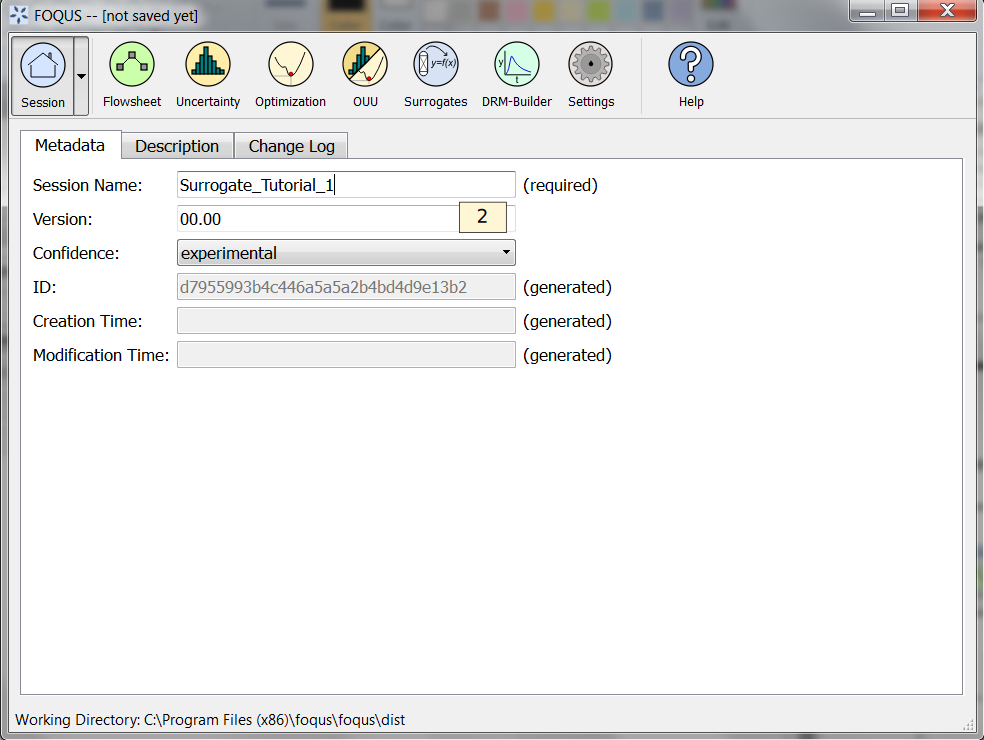
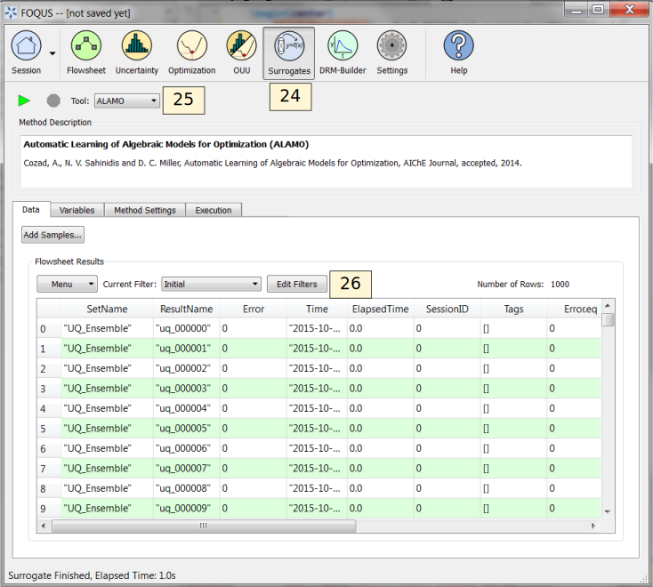

.. _sec.surrogate.alamo:

Tutorial 1: ALAMO
=================

This tutorial focuses on the use of the ALAMO tool for building
algebraic surrogate models. ALAMO builds simplified algebraic models,
which are particularly well suited for rigorous equation oriented
optimization. To keep the execution of this tutorial fast, a toy problem
is used. In this case study the flowsheet calculations and sample
generation are done within FOQUS, alternatively, the user can provide a
simulation model such as: Excel, Aspen plus, Aspen custom modeler, etc.

Note: Before starting this tutorial the ALAMO product must be downloaded
from the products page on the CCSI website. The path for the ALAMO
executable file must be set in FOQUS settings (see Section
:ref:`section.settings`).

The FOQUS file (**Surrogate_Tutorial_1.foqus**),
where Steps 1 to 42 of this tutorial have been completed
is located in: **examples/tutorial_files/Surrogates**

.. note:: |examples_reminder_text|

Flowsheet Setup
---------------

#. Open FOQUS.

#. Name the session “Surrogate_Tutorial_1” (Figure
   :ref:`fig.tut.sur.session`).

   Session Set Up

3. Navigate to the Flowsheet Editor (Figure
   :ref:`fig.tut.sur.flowsheet`).

4. Add a Flowsheet Node named “eq.”

5. Display the Node Editor by clicking the **Node Editor** toggle
   button.

.. figure:: ../figs/flowsheet.svg
   :alt: Flowsheet Setup
   :name: fig.tut.sur.flowsheet

   Flowsheet Setup

The **Node Editor** displays (Figure :ref:`fig.tut.sur.nodeEdit.Input`).
Thefirst step to setting up the node for this problem is to add input
and output variables to the node.

6. If the input variables table is not displayed as shown in Figure
   :ref:`fig.tut.sur.nodeEdit.Input`, click
   the **Variables** tab and then click the **Input Variables** toolbox
   section.

7. Add the variables “x1” and “x2” by clicking the **Add** icon (+)
   above the input table.

8. Edit the **Min/Max** value for both variables to be “-10.0” and
   “10.0.”

9. Add two output variables “z1” and “z2.”

.. figure:: ../figs/nodeInput.svg
   :alt: Node Variables
   :name: fig.tut.sur.nodeEdit.Input

   Node Variables

To keep the execution time short, the node will not be assigned to a
simulation model and calculations are performed directly in FOQUS.

10. Click on the **Node Script** tab in the Node Editor to enter the
    test equation (this step replaces the use of a simulator).

11. Enter the following equations (Figure
    :ref:`fig.tut.sur.nodeEdit.eq`):

    ::

               f["z1"] = x["x1"] + x["x2"]
               f["z2"] = x["x1"]**2 + x["x2"]**2

    The node script calculations are written in Python. The dictionary
    “f” stores output values while the dictionary “x” stores input
    values.

    .. figure:: ../figs/nodeEq.svg
       :alt: Node Script
       :name: fig.tut.sur.nodeEdit.eq

       Node Script

12. Test the model by running the flowsheet with the value “2” for “x1”
    and “x2.” After running, the output variables should have the values
    “4.0” for “z1” and “8.0” for “z2.”

Creating Initial Samples
------------------------

There are two ways to start an ALAMO run: (1) generate a set of initial
data, (2) use ALAMO’s adaptive sampling with no initial data and let
ALAMO generates its own samples. Adaptive sampling can be used with
initial data to generate more points if needed. In this case, initial
data is provided and adaptive sampling is used.

13. Select the UQ tool by clicking on the **Uncertainty** button on the
    Home window (Figure :ref:`fig.tut.sur.new.uq.ens`).

14. Click the **Add New** button.

15. The **Add New Ensemble - Model Selection** dialog will appear. Click
    **OK** to set up the sampling scheme.

   Add a New Sample Ensemble

16. The sample ensemble setup dialog displays (Figure
    :ref:`fig.tut.sur.new.uq.sample1`).
    Select **Choose sampling scheme**.

17. Click the **All Variable** button.

18. Select the **Sampling scheme** tab.

.. figure:: ../figs/uqSample1.svg
   :alt: Sample Distributions
   :name: fig.tut.sur.new.uq.sample1

   Sample Distributions

19. The **Sampling schem\ e** dialog should display (Figure
    :ref:`fig.tut.sur.new.uq.sample2`).
    Select “Latin Hypercube” from the list.

20. Set the **# of samples** to “1000.”

21. Click **Generate Samples**.

22. Click **Done**.

   Sample Methods

23. Once the samples have been generated a new sample ensemble displays
    in the UQ tool window (Figure :ref:`fig.tut.sur.new.uq.sample3`).
    Click **Launch** to run and generate the samples.

.. figure:: ../figs/uqSample3.svg
   :alt: Run Samples
   :name: fig.tut.sur.new.uq.sample3

   Run Samples

Data Selection
--------------

Initial and validation data can be specified by creating filters that
specify subsets of flowsheet data. In this tutorial only initial data
will be used. A filter must be created to separate the results of the
single test run from the UQ samples.

24. Click on the **Surrogates** button from the Home window. The
    surrogate tool displays :ref:`fig.tut.sur.data`.

25. Select “ALAMO” from the **Tool** drop-down list.

26. Click **Edit Filters** in the **Flowsheet Results** section to
    create a filter.

   Surrogate Data

27. Figure :ref:`fig.tut.sur.dataFilter_surrogate_upd`
    displays the Data Filter Editor.

28. Add the filter for initial data.

    #. Click **New Filter**, and enter “f1” as the filter name.

    #. Type the **Filter expression**: c(“set”) = = “UQ_Ensemble”.

29. Click **Done**.

   Data Filter Dialog

Variable Selection
------------------

In this section, input and output variables need to be selected.
Generally, any input variables that vary in the data set should be
selected. However, in some cases, variables may be found to have no, or
very little, effect on the outputs. Only the output variables of
interest need to be selected. Note: Each output is independent from each
other and for the model building, selecting one output is the same as
selecting more.

30. Select the **Variable\ s** tab (Figure
    :ref:`fig.tut.sur.vaiables`).

31. Select the checkbox for both input variables.

32. Select the checkbox for both output variables.

.. figure:: ../figs/variables.svg
   :alt: Variable Selection
   :name: fig.tut.sur.vaiables

   Variable Selection

.. _tutorial.alamo.methodsettings:

Method Settings
---------------

The most important feature to generate "good" algebraic models is to
configure the settings accordingly to the problem to be solved. Each
setting has a good description in FOQUS. The JSON parser is used to read
method settings values. Strings must be contained in quotes. Lists have
the following format: [element 1, element 2].

33. Click on the **Method Settings** tab (see Figure
    :ref:`fig.alamo.method.settings.1` and :ref:`fig.alamo.method.settings.2`).

34. Set the **FOQUS Model (for UQ)** to “alamo_surrogate_uq.py.”

35. Set the **FOQUS Model (for Flowsheet)** to “alamo_surrogate_fs.py”

36. Set **Initial Data Filter** to “f1”

37. Set **SAMPLER** to select the adaptive sampling method: “None”
    “Random” or “SNOBFIT.” Use “None” in this tutorial.

38. Set **MONOMIALPOWER** to select the single variable term powers to
    [1,2,3].

39. Set **MULTI2POWER** to select the two variable term powers to [1].

40. Select functions to be considered as basis functions (**EXPFCNS**,
    **LOGFCNS**, **SINFCNS**, **COSFCNS**, **LINFCNS**, **CONSTANT**).

41. Leave the rest of settings as default (see Table
    :ref:`tutorial.alamo.table`).

42. Save this FOQUS session for use in the ACOSSO and BSS-ANOVA
    tutorials.

.. figure:: ../figs/Alamo_Method_Settings_1.png
   :alt: ALAMO Method Settings
   :name: fig.alamo.method.settings.1

   ALAMO Method Settings

   ALAMO Method Settings Continued

Execution
---------

43. Click the **Run** icon at the top of the window.

44. The ALAMO **Execution** tab starts displaying execution file path,
    sub-directories, input files, and output files.

    #. ALAMO version.

    #. License Information.

    #. Step 0 displays the data set to be used by ALAMO.

    #. Step 1 displays the modeler used by ALAMO to generate the
       algebraic model.

    #. Once the surrogate model has finished, the equations are
       displayed in the execution window. It may be necessary to scroll
       up a little. The result is shown in Figure :ref:`fig.alamo.res`.

    #. Finally, the statistics display the quality metrics of the models
       generated.

.. figure:: ../figs/alamo_exec.svg
   :alt: ALAMO Execution
   :name: fig.alamo.res

   ALAMO Execution

Results
-------

The results are exported as a PSUADE driver file that can be used
perform UQ analysis of the models, and a FOQUS Python plugin model that
allows it to be used in a FOQUS flowsheet. The equations can also be
viewed in the results section.

See tutorial Section :ref:`tutorial.surrogate.uq` and
:ref:`tutorial.surrogate.fs` for information
about analyzing the model with the UQ tools or running the model on the
flowsheet.

As mentioned in section `1.5 <#tutorial.alamo.methodsettings>`__ the
method settings are very important. A brief description and hints are
included in Table :ref:`tutorial.alamo.table`.

.. _tutorial.alamo.table:
.. table:: ALAMO Method Settings

   +-----------------------------------+-----------------------------------+
   | **Method Settings**               | **Description**                   |
   +-----------------------------------+-----------------------------------+
   | Initial Data Filter               | Filter to be applied to the       |
   |                                   | initial data set. Data filters    |
   |                                   | help the user to generate models  |
   |                                   | based on specific data for each   |
   |                                   | variable.                         |
   +-----------------------------------+-----------------------------------+
   | Validation Data filter            | Data set used to compute model    |
   |                                   | errors at the validation phase.   |
   |                                   | The number of data points in a    |
   |                                   | preexisting validation data set   |
   |                                   | can be specified by the user.     |
   +-----------------------------------+-----------------------------------+
   | SAMPLER                           | Adaptative sampling method to be  |
   |                                   | used. Options: "None", "Random"   |
   |                                   | and "SNOBFIT". Adaptive sampling  |
   |                                   | method to be used by ALAMO when   |
   |                                   | more sampling points are needed   |
   |                                   | by the model. If **Random** is    |
   |                                   | used a simulator must be provided |
   |                                   | by the user. If **SNOBFIT** is    |
   |                                   | used a simulator must be provided |
   |                                   | by the user and MATLAB must be    |
   |                                   | installed.                        |
   +-----------------------------------+-----------------------------------+
   | MAXTIME                           | Maximum execution time in         |
   |                                   | seconds. This time includes all   |
   |                                   | the steps on the algorithm, if    |
   |                                   | simulations are needed they run   |
   |                                   | in this time.                     |
   +-----------------------------------+-----------------------------------+
   | MINPOINTS                         | Convergence is assessed only if   |
   |                                   | the simulator is able to compute  |
   |                                   | the output variables for at least |
   |                                   | MINPOINTS of the data set. A      |
   |                                   | reduced number of MINPOINTS may   |
   |                                   | reduce the computational time to  |
   |                                   | get a model, but also reduces the |
   |                                   | accuracy of the model. MINPOINTS  |
   |                                   | must be a positive integer.       |
   +-----------------------------------+-----------------------------------+
   | PRESET                            | Value to be used if the simulator |
   |                                   | fails. This value must be         |
   |                                   | carefully chosen to be an         |
   |                                   | otherwise not realizable value    |
   |                                   | for the output variables.         |
   +-----------------------------------+-----------------------------------+
   | MONOMIALPOWERS                    | Vector of monomial powers to be   |
   |                                   | considered as basis functions,    |
   |                                   | use empty vector for none [].     |
   |                                   | Exponential terms allowed in the  |
   |                                   | algebraic model. i.e., if         |
   |                                   | selecting [1,2] the model         |
   |                                   | considers x1 and x1**2 as basis   |
   |                                   | functions.                        |
   +-----------------------------------+-----------------------------------+
   | MULTI2POWER                       | Vector of pairwise combination of |
   |                                   | powers to be considered as basis  |
   |                                   | functions. Pairwise combination   |
   |                                   | of powers allowed in the          |
   |                                   | algebraic model. i.e., [1,2]      |
   |                                   | allows terms like x1*x2 in the    |
   |                                   | algebraic model.                  |
   +-----------------------------------+-----------------------------------+
   | MULTI3POWER                       | Vector of three variables         |
   |                                   | combinations of powers to be      |
   |                                   | considered as basis functions.    |
   +-----------------------------------+-----------------------------------+
   |                                   | Use or not of exp, log, sin, and  |
   |                                   | cos functions as basis functions  |
   |                                   | in the model.                     |
   +-----------------------------------+-----------------------------------+
   | RATIOPOWER                        | Vector of ratio combinations of   |
   |                                   | powers to be considered in the    |
   |                                   | basis functions. Ratio            |
   |                                   | combinations of powers are [empty |
   |                                   | as default].                      |
   +-----------------------------------+-----------------------------------+
   | Radial Basis Functions            | Radial basis functions centered   |
   |                                   | around the data set provided by   |
   |                                   | the user. These functions are     |
   |                                   | Gaussian and are deactivated if   |
   |                                   | their textual representation      |
   |                                   | requires more than 128 characters |
   |                                   | (in the case of too many input    |
   |                                   | variables and/or datapoints).     |
   +-----------------------------------+-----------------------------------+
   | RBF parameter                     | Constant penalty used in the      |
   |                                   | Gaussian radial basis functions.  |
   +-----------------------------------+-----------------------------------+
   | Modeler                           | Fitness metric to be used for     |
   |                                   | model building. Options: BIC      |
   |                                   | (Bayesian Information Criterion), |
   |                                   | Mallow’s Cp, AICc (Corrected      |
   |                                   | Akaike’s Information Criterio),   |
   |                                   | HQC (Hannan-Quinn Information     |
   |                                   | Criterion), MSE (Mean Square      |
   |                                   | Error), and Convex Penalty.       |
   +-----------------------------------+-----------------------------------+
   | ConvPen                           | Convex penalty term. Used if      |
   |                                   | Convex Penalty is selected.       |
   +-----------------------------------+-----------------------------------+
   | Regularizer                       | Regularization method is used to  |
   |                                   | reduce the number of potential    |
   |                                   | basis functions before the        |
   |                                   | optimization.                     |
   +-----------------------------------+-----------------------------------+
   | Tolrelmetric                      | Convergence tolerance for the     |
   |                                   | chosen fitness metric is needed   |
   |                                   | to terminate the algorithm.       |
   +-----------------------------------+-----------------------------------+
   | ScaleZ                            | If used, the variables are scaled |
   |                                   | prior to the optimization problem |
   |                                   | is solved. The problem is solved  |
   |                                   | using a mathematical programming  |
   |                                   | solver. Usually, scaling the      |
   |                                   | variables may help the            |
   |                                   | optimization procedure.           |
   +-----------------------------------+-----------------------------------+
   | GAMS                              | GAMS is the software used to      |
   |                                   | solve the optimization problems.  |
   |                                   | The executable path is expected   |
   |                                   | or the user must declare GAMS.exe |
   |                                   | in the environment path.          |
   +-----------------------------------+-----------------------------------+
   | GAMS Solver                       | Solver to be used by GAMS to      |
   |                                   | solve the optimization problems.  |
   |                                   | Mixed integer quadratic           |
   |                                   | programming solver is expected    |
   |                                   | like BARON (other solvers can be  |
   |                                   | used).                            |
   +-----------------------------------+-----------------------------------+
   | MIPOPTCR                          | Relative convergence tolerance    |
   |                                   | for the optimization problems     |
   |                                   | solved in GAMS. The optimization  |
   |                                   | problem is solved when the optcr  |
   |                                   | is reached. 5 to 1 % is expected  |
   |                                   | (0.005 to 0.001).                 |
   +-----------------------------------+-----------------------------------+
   | MIPOPTCA                          | Absolute convergence tolerance    |
   |                                   | for mixed-integer optimization    |
   |                                   | problems. This must be a          |
   |                                   | nonnegative scalar.               |
   +-----------------------------------+-----------------------------------+
   | Linear error                      | If true, a linear objective       |
   |                                   | function is used when solving the |
   |                                   | mixed integer optimization        |
   |                                   | problems; otherwise, a quadratic  |
   |                                   | objective function is used.       |
   +-----------------------------------+-----------------------------------+
   |                                   | Specify whether constraint        |
   |                                   | regression is used or not, if     |
   |                                   | true bounds on output variables   |
   |                                   | are enforced.                     |
   +-----------------------------------+-----------------------------------+
   | CRNCUSTOM                         | If true, Custom constraints are   |
   |                                   | entered in the Variable tab.      |
   +-----------------------------------+-----------------------------------+
   | CRNINITIAL                        | Number of random bounding points  |
   |                                   | at which constraints are sampled  |
   |                                   | initially (must be a nonnegative  |
   |                                   | integer).                         |
   +-----------------------------------+-----------------------------------+
   | CRNMAXITER                        | Maximum allowed constrained       |
   |                                   | regressions iterations.           |
   |                                   | Constraints are enforced on       |
   |                                   | additional points during each     |
   |                                   | iteration (must be positive       |
   |                                   | integer).                         |
   +-----------------------------------+-----------------------------------+
   | CRNVIOL                           | Number of bounding points added   |
   |                                   | per round per bound in each       |
   |                                   | iteration (must be positive       |
   |                                   | integer).                         |
   +-----------------------------------+-----------------------------------+
   | CRNTRIALS                         | Number of random trial bounding   |
   |                                   | points per round of constrained   |
   |                                   | regression (must be a positive    |
   |                                   | integer).                         |
   +-----------------------------------+-----------------------------------+
   | CUSTOMBAS                         | A list of user-supplied custom    |
   |                                   | basis functions can be provided   |
   |                                   | by the user. The parser is not    |
   |                                   | case sensitive and allows for any |
   |                                   | Fortran functional expression in  |
   |                                   | terms of the XLABELS (symbol ^    |
   |                                   | may be used to denote power).     |
   +-----------------------------------+-----------------------------------+
