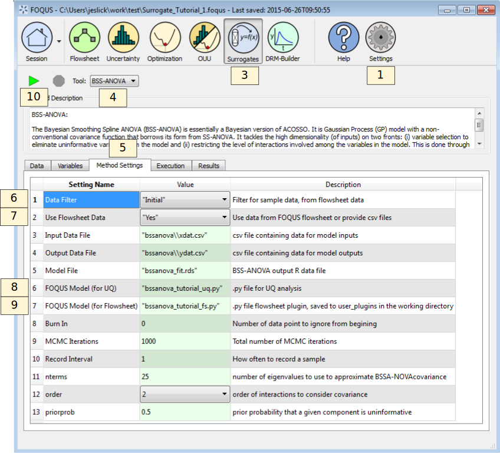

.. _(sec.surrogate.bssanova):

Tutorial 3: BSS-ANOVA
=====================

This tutorial covers the BSS-ANOVA surrogate modeling method. The
Bayesian Smoothing Spline ANOVA (BSS-ANOVA) is essentially a Bayesian
version of ACOSSO :ref:`(Reich et al. 2009)<Reich_2009>`. It is Gaussian
Process (GP) model with a non-conventional covariance function that
borrows its form from SS-ANOVA. It tackles the high dimensionality (of
inputs) on two fronts: (1) variable selection to eliminate uninformative
variables from the model and (2) restricting the level of interactions
involved among the variables in the model. This is done through a fully
Bayesian approach which can also allow for categorical input variables
with relative ease. Since it is closely related to ACOSSO, it generally
works well in similar settings as ACOSSO. The BSS-ANOVA procedure also
allows for categorical inputs :ref:`(Storlie et al. 2013)<Storlie_2013>`. In this
current implementation, BSS-ANOVA is more computationally intensive than
ACOSSO, so ACOSSO is preferred for faster surrogate generation.

This tutorial uses the same flowsheet and sample setup as the ALAMO
tutorial in Section :ref:`sec.surrogate.alamo`.

The FOQUS file for this tutorial is **Surrogate_Tutorial_1.foqus**, and 
this file is located in: **examples/tutorial_files/Surrogates**

.. note:: |examples_reminder_text|

The statistics software “R” is also required to use ACOSSO and
BSS-ANOVA. Before starting this tutorial, you will need to install R
version 3.1 or later (see
`http://cran.r-project.org/ <https://cran.r-project.org/>`__).

#. Set the path to the RScript executable.

   #. Click the **Settings** button from the Home window.

   #. Change the RScript path if necessary. The **Browse** button opens
      a file browser that can be used to set the path.

#. Complete the ALAMO tutorial in Section
   :ref:`sec.surrogate.alamo` through Step 32,
   load the FOQUS session saved after completing the ALAMO tutorial,
   or load the "Surrogate_Tutorial_1.foqus" file from the
   examples/tutorial_files/Surrogates folder.

#. Click the **Surrogates** button from the Home window (Figure
   :ref:`fig.bssanova.settings`).

#. Select “BSS-ANOVA” in the **Tool** drop-down list.

#. Select the **Method Settings** tab.

#. Set “Data Filter” to “Initial.”

#. Set “Use Flowsheet Data” to “Yes.”

#. Set “FOQUS Model (for UQ)” to “bssanova_tutorial_uq.py.”

#. Set “FOQUS Model (for Flowsheet)” to “bssanova_tutorial_fs.py.”

#. Click the **Run** icon (Figure
   :ref:`fig.bssanova.settings`).

   BSS-ANOVA Session Set Up

11. The execution window will automatically display. While BSS-ANOVA is
    running, the execution window may show warnings, but this is normal.

12. When the run completes, a UQ driver file is created, allowing the
    BSS-ANOVA surrogate to be used as a user-defined response surface in
    UQ analyses. (See Section :ref:`tutorial.surrogate.uq`.)

13. BSS-ANOVA also produces a flowsheet plugin.
