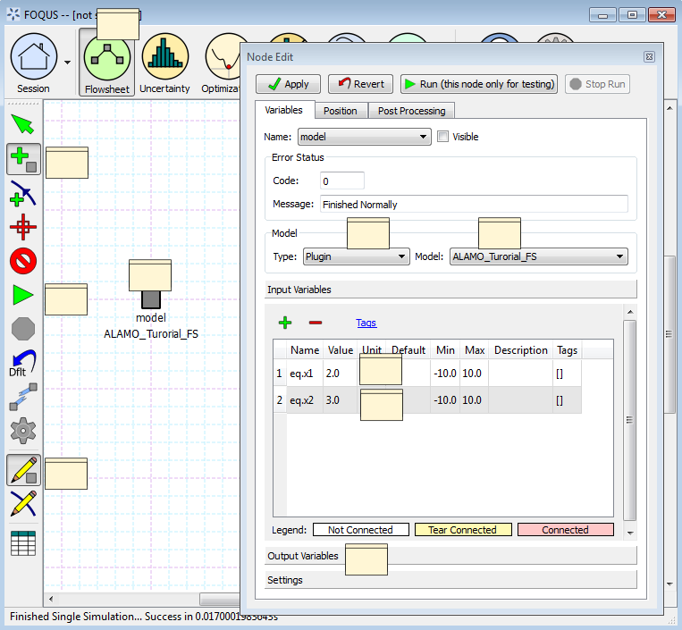

.. _tutorial.surrogate.fs:

Tutorial 5: Surrogates with the Flowsheet
=========================================

This section provides a brief tutorial for using the flowsheet plugin
models generated by surrogate modeling methods. In a future FOQUS
release all surrogate modeling methods will produce a model that can be
run in a FOQUS flowsheet. **Currently iREVEAL (part of the CCSI Toolset)
does not produce a flowsheet model.**

**Before doing this tutorial complete the ALAMO tutorial in
Section :ref:`sec.surrogate.alamo`.**

#. Open FOQUS. If FOQUS has not been closed since completing the ALAMO
   tutorial, close it and reopen it. There is a known issue where
   existing flowsheet model plugins may not update until FOQUS is
   restarted.

#. Enter “FS_Plugin_Tutorial” as the Session Name.

#. Click the **Flowsheet** button from the Home window.

#. Click the **Add Node** icon in the left toolbar (see Figure
   :ref:`fig.pg.tut1`).

#. Click a location for the node in the Flowsheet area.

#. Enter “model” for the node name (without quotes).

#. Click the **Node Editor** icon in the left toolbar (see Figure
   :ref:`fig.pg.tut1`).

#. In the **Node Editor**, select “Plugin” from the Model **Type**
   drop-down list.

#. Select “ALAMO_Tutorial_FS” from the **Model** drop-down list.

#. Set the **Value** of the **Input Variables** “eq.x1” to 2.

#. Set the **Value** of the **Input Variables** “eq.x2” to 3.

#. Click the **Run** icon in the left toolbar (see Figure
   :ref:`fig.pg.tut1`).

#. Wait for the Flowsheet evaluation to complete. It should finish
   successfully.

#. Check the value of the **Output Variables**; the approximate values
   should be z1 = 5 and z2 = 13.

   Plugin Flowsheet
