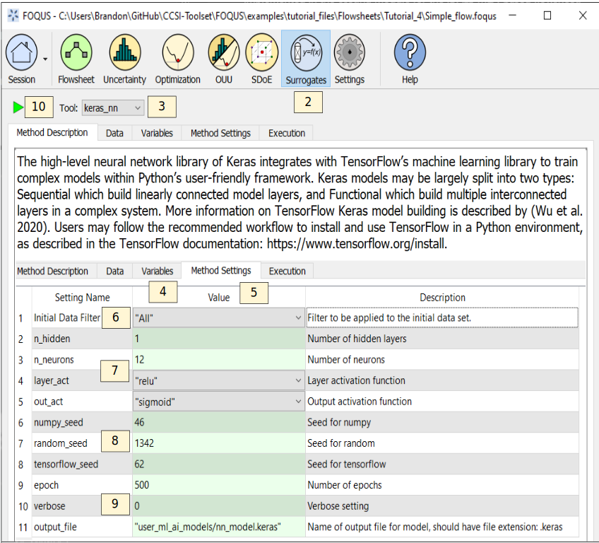

.. _(sec.surrogate.keras_nn):

Tutorial 6: TensorFlow Keras Neural Networks
============================================

This tutorial covers the TensorFlow Keras Neural Network surrogate modeling method.
The high-level neural network library of Keras integrates with TensorFlow's
machine learning library to train complex models within Python's user-friendly
framework. Keras models may be largely split into two types: **Sequential**
which build linearly connected model layers, and **Functional** which build
multiple interconnected layers in a complex system. More information on
TensorFlow Keras model building is described by :ref:`(Wu et al. 2020)<Wu_2020>`.
Users may follow the recommended workflow to install and use TensorFlow in a
Python environment, as described in the TensorFlow documentation:
https://www.tensorflow.org/install.

This tutorial uses the same flowsheet and sample setup as the ALAMO
tutorial in Section :ref:`sec.surrogate.alamo`.

The FOQUS file for this tutorial is **Surrogate_Tutorial_1.foqus**, and 
this file is located in: **examples/tutorial_files/Surrogates**

.. note:: |examples_reminder_text|

The Python package `tensorflow` must be installed to use this surrogate plugin.
Before starting this tutorial, you will need to install the package by referring to
the installation instructions in the TensorFlow documentation.

#. Complete the ALAMO tutorial in Section
   :ref:`sec.surrogate.alamo` through Step 32,
   load the FOQUS session saved after completing the ALAMO tutorial,
   or load the "Simple_flow.foqus" file from the
   examples/tutorial_files/Flowsheets/Tutorial_4 folder.

#. Click the **Surrogates** button from the Home window (Figure
   :ref:`fig.kerasnn.settings`).

#. Select “keras_nn” in the **Tool** drop-down list.

#. Select the **Variables** tab and select the desired input and output variables. Note that "graph.error" should not be selected.

#. Select the **Method Settings** tab.

#. Set “Initial Data Filter” to “All”.

#. Set "n_hidden" to "1", "n_neurons" to "12", "layer_act" to "relu", and "out_act" to "sigmoid".

#. Ensure there are values present for "numpy_seed", "random_seed", and "tensorflow_seed" so results are reproducible.

#. Set "epoch" to "500", "verbose" to "0" (i.e. epoch results will not print during training) and ensure "output_file" has a file name of the form "user_ml_ai_models/[NAME].keras". NAME may be changed, if desired. The model will be saved to the working directory folder user_ml_ai_models.

#. Click the **Run** icon (Figure
   :ref:`fig.kerasnn.settings`).

   Keras Neural Network Session Set Up

10. The execution window will automatically display. While the regression training is finished running, TensorFlow Keras will display some information on the model size and shape.

11. When the run completes, the script produces a saved model file which is compatible with the Machine Learning & Artificial Intelligence Plugin. (See Section :ref:`mlaiplugin`.)
