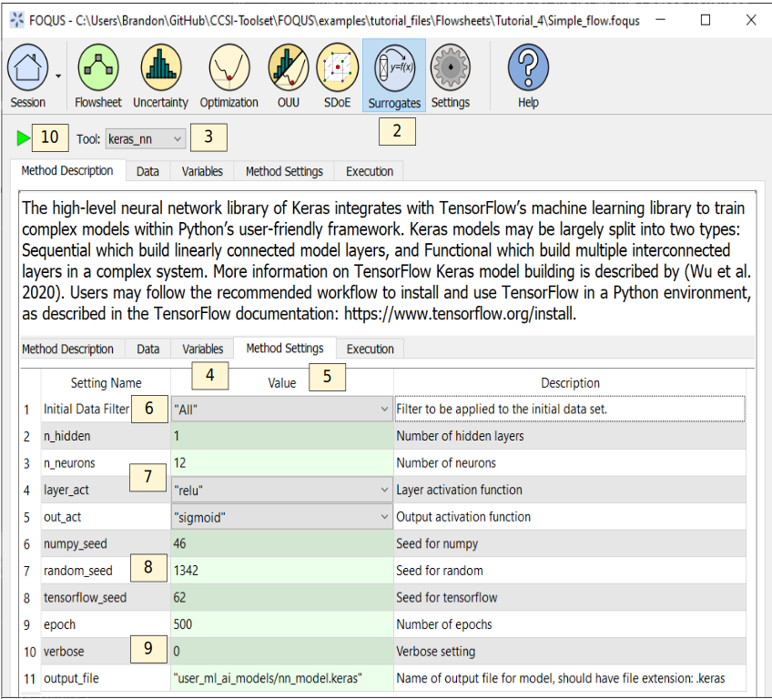

.. _(sec.surrogate.nn):

Tutorial 6: Neural Networks
===========================

This tutorial covers the TensorFlow Keras Neural Network surrogate modeling method via the plugin "keras_nn". The Surrogates module also supports
PyTorch and Scikit-learn Neural Network surrogate modeling methods, which follow the workflow below using the "pytorch_nn" and "scikit_nn" plugins, respectively.

More information on TensorFlow Keras model building is described by :ref:`(Wu et al. 2020)<Wu_2020>`.
Users may follow the recommended workflow to install and use TensorFlow in a Python environment, as described in the TensorFlow documentation:
https://www.tensorflow.org/install.

Users may obtain a great deal of usage standards and best practices information as described in the PyTorch documentation:
https://pytorch.org/docs/stable/index.html.

Users may find further information on the Scikit-learn package in the documentation:
https://scikit-learn.org/stable/index.html and further information on deep learning capabilities as well:
https://scikit-learn.org/stable/modules/generated/sklearn.neural_network.MLPRegressor.html#sklearn.neural_network.MLPRegressor.

The FOQUS file for this tutorial is **Simple_flow.foqus**, and 
this file is located in: :path:`examples/tutorial_files/Flowsheets/Tutorial_4`

.. note:: |examples_reminder_text|

The Python package `tensorflow` must be installed to use this surrogate plugin.
Before starting this tutorial, you will need to install the package by referring to
the installation instructions in the TensorFlow documentation.

#. Load the "Simple_flow.foqus" file from the examples/tutorial_files/Flowsheets/Tutorial_4 folder.

#. Click the **Surrogates** button from the Home window (Figure
   :ref:`fig.kerasnn.settings`).

#. Select “keras_nn” in the **Tool** drop-down list. For PyTorch, select "pytorch_nn". For Scikit-learn, select "scikit_nn".

#. Select the **Variables** tab and select the desired input and output variables. Note that "graph.error" should not be selected.

#. Select the **Method Settings** tab.

#. Set “Initial Data Filter” to “All”.

#. Set "n_hidden" to "1", "n_neurons" to "12", "layer_act" to "relu", and "out_act" to "sigmoid".

#. Ensure there are values present for "numpy_seed", "random_seed", and "tensorflow_seed" so results are reproducible.

#. Set "epoch" to "500", "verbose" to "0" (i.e. epoch results will not print during training) and ensure "output_file" has a file name of the form "user_ml_ai_models/[NAME].keras". NAME may be changed, if desired. The model will be saved to the working directory folder user_ml_ai_models. For PyTorch, the file extension should be ".pt". For Scikit-learn, the file extension should be ".pkl".

#. Click the **Run** icon (Figure
   :ref:`fig.kerasnn.settings`).

   Keras Neural Network Session Set Up

10. The execution window will automatically display. While the regression training is finished running, TensorFlow Keras will display some information on the model size and shape.

11. When the run completes, the script produces a saved model file which is compatible with the Machine Learning & Artificial Intelligence Plugin. (See Section :ref:`mlaiplugin`.)

In the future, these plugins will support additional items yielding enhanced surrogate modeling capabilities.

- Expanded data normalization options
- Offline data loading from a file, e.g. CSV, Excel, PSUADE
- Support for regression of multi-output neural networks
- Automatic regression parameter selection during model training from user-supplied parameter options
